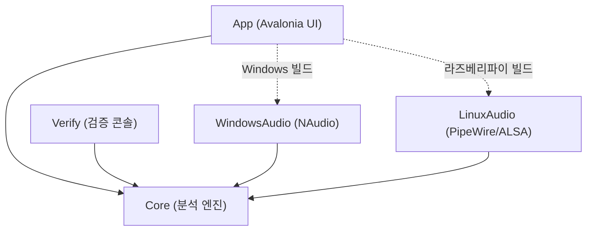
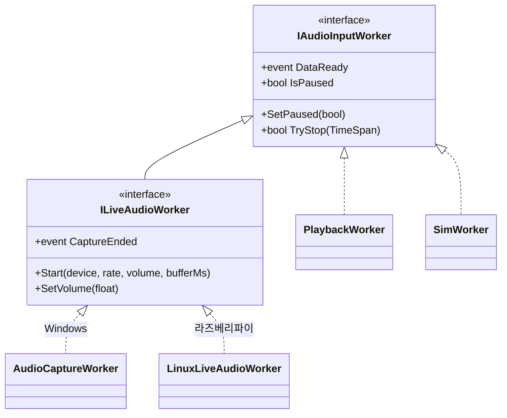
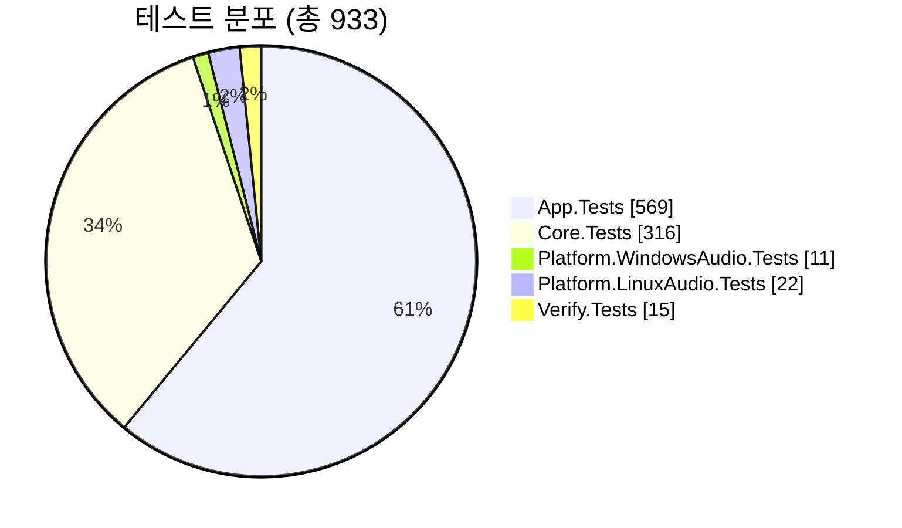

# TimeGrapherNet

[English](README.md) · **한국어**

기계식 시계의 똑딱 소리를 마이크로 듣고, 얼마나 정확한지 실시간으로 분석해 그래프로
보여 주는 데스크톱 앱입니다. 기존 Qt/C++ 버전을 **Avalonia + C# (.NET 8)** 로 다시 만들어,
하나의 코드로 **Windows**와 **라즈베리파이 5**에서 모두 동작합니다.

[](https://github.com/lgcmu2026-team5/TimeGrapher-Net/releases/latest)


## Quick Start

시작하는 방법은 두 가지입니다 — **(A) 미리 빌드된 릴리즈를 내려받기**(개발 도구 설치 없이 바로 실행), 또는 **(B) 소스에서 빌드**.

### (A) 릴리즈 내려받기 (권장 — 빌드 불필요)

[Releases 페이지](https://github.com/lgcmu2026-team5/TimeGrapher-Net/releases)에서 OS에 맞는 단일 파일 자기 완결형(self-contained) 묶음을 내려받습니다. .NET SDK는 설치하지 않아도 됩니다.

- **Windows** — `TimeGrapher-<태그>-win-x64.zip`을 풀고 `TimeGrapher.App.exe`를 실행합니다.
- **라즈베리파이 5** — `TimeGrapher-<태그>-linux-arm64.tar.gz`를 풀고 `./install.sh`를 실행합니다(아래 라즈베리파이 절 참고).

각 묶음에는 `.sha256` 파일이 함께 들어 있어 무결성을 검증할 수 있습니다(Windows는 `Get-FileHash`, Pi는 `sha256sum -c <파일>.sha256` 사용).

### (B) 소스에서 빌드

아무것도 설치되지 않은 환경을 기준으로 합니다. 사용하는 OS에 맞는 절차를 따르세요.

#### Windows

1. **의존성 설치** — .NET SDK 8과 Git을 설치합니다.

   ```powershell
   winget install Microsoft.DotNet.SDK.8
   winget install Git.Git
   ```

   설치 후 새 터미널을 열고 `dotnet --version`이 `8.0.x`를 출력하는지 확인합니다.
   (오디오 드라이버는 따로 설치할 필요가 없습니다 — 필요한 NAudio가 빌드에 포함됩니다.)

2. **내려받기 + 빌드**

   ```powershell
   git clone https://github.com/lgcmu2026-team5/TimeGrapher-Net.git
   cd TimeGrapher-Net
   dotnet build TimeGrapherNet.sln -c Release   # 첫 빌드는 패키지 복원으로 몇 분 걸릴 수 있음
   ```

3. **실행**

   ```powershell
   dotnet run --project src/TimeGrapher.App                                   # GUI 실행
   dotnet run --project src/TimeGrapher.Verify -c Release -- --generated --byte-fixtures   # 화면 없이 생성/byte-built fixture 검출 확인
   ```

#### 라즈베리파이 5 (ARM64)

단일 파일 자기 완결형(self-contained) 패키지로 배포하므로 **Pi에는 .NET을 설치하지 않아도 됩니다.**
빌드는 개발 PC(위 Windows 절차로 준비된 PC)에서 하고, 결과물만 Pi로 복사합니다.

> 💡 CPU가 달라도 되는 이유: 빌드 결과물은 x64 기계어가 아니라 **CPU 중립 IL 코드 + ARM64용 .NET
> 런타임** 묶음입니다. 실제 ARM64 기계어 변환은 실행할 때 Pi에서 일어납니다.

1. **Pi 의존성 설치** — Pi 터미널에서 GUI 실행에 필요한 라이브러리를 설치합니다.

   ```bash
   sudo apt update
   sudo apt install -y libx11-6 libice6 libsm6 libfontconfig1 xwayland \
     pipewire pipewire-bin wireplumber alsa-utils
   ```

   마이크 입력에는 PipeWire/ALSA CLI 도구 `wpctl`·`pw-record`·`arecord`(위 패키지)가
   필요합니다. Pi OS에는 보통 포함되어 있지만, 최소 이미지에서는 명시적으로 설치하지
   않으면 라이브 캡처를 사용할 수 없습니다.

   > ICU(`libicu`)는 위 목록에 **일부러 넣지 않았습니다.** 앱이 invariant globalization 모드
   > (`InvariantGlobalization=true`, 문화권 중립 설계)로 빌드되어 .NET이 시스템 ICU를 요구하지
   > 않기 때문입니다.

2. **개발 PC에서 빌드(배포 패키지 생성)**

   ```powershell
   dotnet publish src/TimeGrapher.App/TimeGrapher.App.csproj -c Release -r linux-arm64 --self-contained true -o publish
   ```

   `TimeGrapher.App.csproj`의 Release RID publish 기본값 때문에 이 명령은 단일 파일
   출력(`publish/TimeGrapher.App`)을 만듭니다. 그 안에 관리 코드 앱, 플랫폼 백엔드,
   .NET 런타임 묶음이 포함됩니다.

3. **Pi로 복사 후 실행**

   **(A) 릴리즈 tarball을 받았다면 — `install.sh` 한 번이면 끝(권장):** 압축을 풀고 실행하면
   apt 의존성 설치 + 실행 권한 + 아이콘/`.desktop` 등록까지 처리합니다(경로는 푼 위치로 자동 설정).

   ```bash
   mkdir -p ~/timegrapher
   tar -xzf TimeGrapher-*-linux-arm64.tar.gz -C ~/timegrapher
   cd ~/timegrapher
   ./install.sh                 # apt 의존성 + chmod + 아이콘/.desktop 등록 (의존성 생략: --no-deps)
   ./TimeGrapher.App            # 또는 메뉴/작업표시줄의 'TimeGrapher'
   ./TimeGrapher.App --smoke    # 화면 없이 동작 점검 (장치 목록은 --audio-smoke)
   ```

   **(B) 소스에서 빌드한 publish 폴더라면 — 수동 실행:**

   ```bash
   # (개발 PC) publish 폴더를 Pi로 복사 — 예:
   #   scp -r publish <사용자>@<Pi주소>:~/timegrapher
   # (Pi) 복사한 폴더에서:
   cd ~/timegrapher
   chmod +x ./TimeGrapher.App
   ./TimeGrapher.App            # 모니터 연결 시 GUI 실행
   ./TimeGrapher.App --smoke    # 화면 없이 동작 점검 (장치 목록은 --audio-smoke)
   ```

   작업표시줄 아이콘 수동 등록 등 데스크톱 통합 세부 사항은 `deploy/linux/README.ko.md`를 참고하세요.

## 주요 기능

- 똑/딱 소리를 검출해 박자(BPH)를 자동·수동으로 잡고, 위상 추적으로 동기를 유지.
- 현재 앱 카탈로그 기준 분석 표시 탭: **Rate/Scope**, **Sound Print**, **Trace**, **Sweep**, **Vario**, **Beat Error**, **Filter Scope**, **Long-Term**, **Positions**, **Health**, **Beat Noise**, **Escapement**, **Comparison**, **Spectrogram**.
- **Positions** 탭은 왼쪽에 작은 포지션 선택 버튼, 오른쪽에 포지션별 시퀀스 측정값을 함께 보여줍니다.
- 입력 3종: **Live**(마이크), **Playback**(WAV 파일 재생), **Simulation**(합성 신호).
- 분석과 동시에 입력을 WAV로 녹음할 수 있습니다(Live·Simulation 실행에서 선택 제공; Playback은 기존 파일을 재생만 함).
- **설정** 창에서 실행 옵션(C-onset 타이밍, PLL 임펄스 veto, 포지션 변경 시 일시정지), **샘플링 파라미터**(분석 블록 크기·캡처 버퍼 길이), CSV 측정 로깅, Error Rate/진폭/Beat Error의 허용(정상 범위) 밴드를 조정합니다.
- 화면 없이 검출 정확도(`--generated` / `--byte-fixtures`, `--adverse`)·오디오 장치를 점검하는 콘솔 모드.

## 왜 Avalonia / .NET 인가

[ADR 1: UI 프레임워크를 Qt + C++ 에서 Avalonia UI + .NET + C# 로 전환](docs/ADR/ko/ADR-001.md)을 참고하세요.

## 구조

분석 엔진(`Core`)은 UI·OS에 전혀 의존하지 않습니다. OS별 오디오 기능만 갈아 끼우면 되고, 이
경계는 CI가 자동으로 검사합니다.



*그림 1. 모든 프로젝트가 Core를 참조하고, 오디오 백엔드는 빌드 대상 OS에 맞는 것만 포함됩니다.*

소리가 화면에 그려지기까지의 흐름:


*그림 2. 입력 → 검출 → 측정 → 시각화. 분석 한 번이 화면 갱신 한 번으로 이어집니다.*

### 입력 워커 계약

세 가지 입력(Live·Playback·Simulation)은 공통 `IAudioInputWorker`(일시정지·정지·데이터 준비)를
구현합니다. 마이크 입력만 `ILiveAudioWorker`로 장치 선택·볼륨·캡처 버퍼 길이·캡처 종료를 더합니다. Core는 이
작은 계약만 알면 되므로, OS별 백엔드를 자유롭게 끼울 수 있습니다.



*그림 3. 입력 워커 계층. 마이크 백엔드는 OS별 어셈블리에 구현됩니다.*

## 프로젝트 구성

| 프로젝트 | 역할 |
|---|---|
| `TimeGrapher.Core` | 분석 엔진 — 검출·측정·이미지 생성·WAV 읽기/쓰기·시뮬레이터 (UI·OS 비의존) |
| `TimeGrapher.App` | Avalonia UI — 창·탭·그래프 표시, OS별 오디오 연결 |
| `TimeGrapher.Platform.WindowsAudio` | Windows 마이크 입력 (NAudio) |
| `TimeGrapher.Platform.LinuxAudio` | 라즈베리파이 마이크 입력 (PipeWire → ALSA) |
| `TimeGrapher.Verify` | 화면 없이 WAV의 BPH 검출 정확도를 확인하는 콘솔 |
| `*.Tests` | xUnit 테스트 (Core / App / WindowsAudio / LinuxAudio / Verify) |

자세한 설계 배경과 Qt→.NET 포팅 과정은 `docs/` 폴더를 참고하세요.

## 기술 스택

| 패키지 | 버전 | 용도 |
|---|---|---|
| Avalonia(.Desktop/.Themes.Fluent) | 11.3.17 | UI 프레임워크 |
| ScottPlot.Avalonia | 5.0.55 | 스코프/레이트 그래프 |
| NAudio.Wasapi / NAudio.WinMM | 2.2.1 | Windows 마이크 캡처·볼륨 |
| xunit / xunit.runner.visualstudio | 2.9.2 / 2.8.2 | 테스트 |
| Microsoft.NET.Test.Sdk | 17.12.0 | 테스트 호스트 |

패키지 버전은 `Directory.Packages.props`에서 중앙 관리하고, `packages.lock.json`으로 고정해
항상 같은 버전으로 복원합니다.

## 테스트 / CI

아키텍처 결정: [ADR 4: AI 활용, TDD 지원, 팀 협업을 위한 App, Test, Verify 모듈 구조 분리](docs/ADR/ko/ADR-004.md).

`dotnet test` 기준 **933개 테스트 전부 통과**(App 569 / Core 316 / WindowsAudio 11 / LinuxAudio 22 / Verify 15).



*그림 4. 테스트 분포.*

GitHub Actions(`.github/workflows/ci.yml`)는 `main` 대상 push/PR마다 Ubuntu·Windows 두 환경에서
다음을 자동 실행합니다 — 빌드·테스트, WAV 검출 검증, 라즈베리파이·Windows용 배포 산출물 생성.

릴리즈는 CI와 별개의 워크플로(`.github/workflows/release.yml`)가 담당합니다. `v*` 태그를
푸시하면(또는 수동 dispatch) win-x64·win-arm64·linux-x64·linux-arm64 단일 파일 자기 완결형 묶음(`.zip`/`.tar.gz` + `.sha256`)을
만들어 GitHub Release로 게시합니다(릴리즈 노트 자동 생성, `-`가 든 태그(예: `v0.1.0-rc.1`)는 프리릴리즈로 표시). 릴리즈를 만들려면:

```bash
git tag v0.1.0 && git push origin v0.1.0
```

## 체크리스트

| 항목 | 명령 | 상태 |
|---|---|---|
| 빌드 | `dotnet build TimeGrapherNet.sln -c Release` | ✅ |
| 테스트 | `dotnet test TimeGrapherNet.sln -c Release` (933/933) | ✅ |
| 검출 검증 | `... TimeGrapher.Verify -- --generated --byte-fixtures` (exit 0, 생성 및 byte-built fixtures) | ✅ |
| GUI 실행 | `dotnet run --project src/TimeGrapher.App` | ✅ |
| 배포 — 라즈베리파이 (linux-arm64) | `dotnet publish ... -r linux-arm64 --self-contained true` | ✅ |
| 배포 — Linux x64 | `dotnet publish ... -r linux-x64 --self-contained true` | ✅ |
| 배포 — Windows ARM (win-arm64) | `dotnet publish ... -r win-arm64 --self-contained true` | ✅ |
| 라즈베리파이 마이크 입력 | 캡처 장치 연결 후 검증 | ⏳ 장치 대기 |
