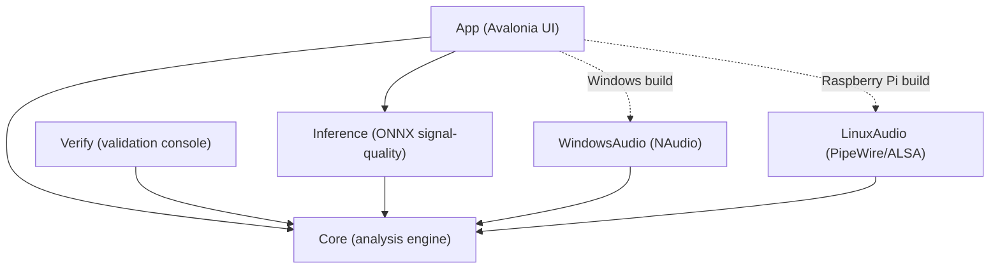
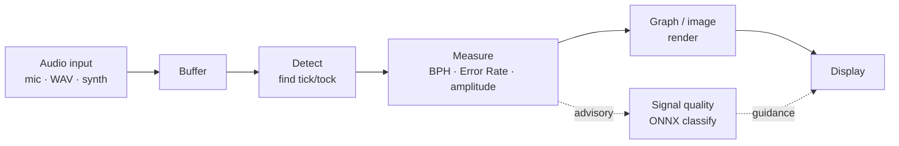
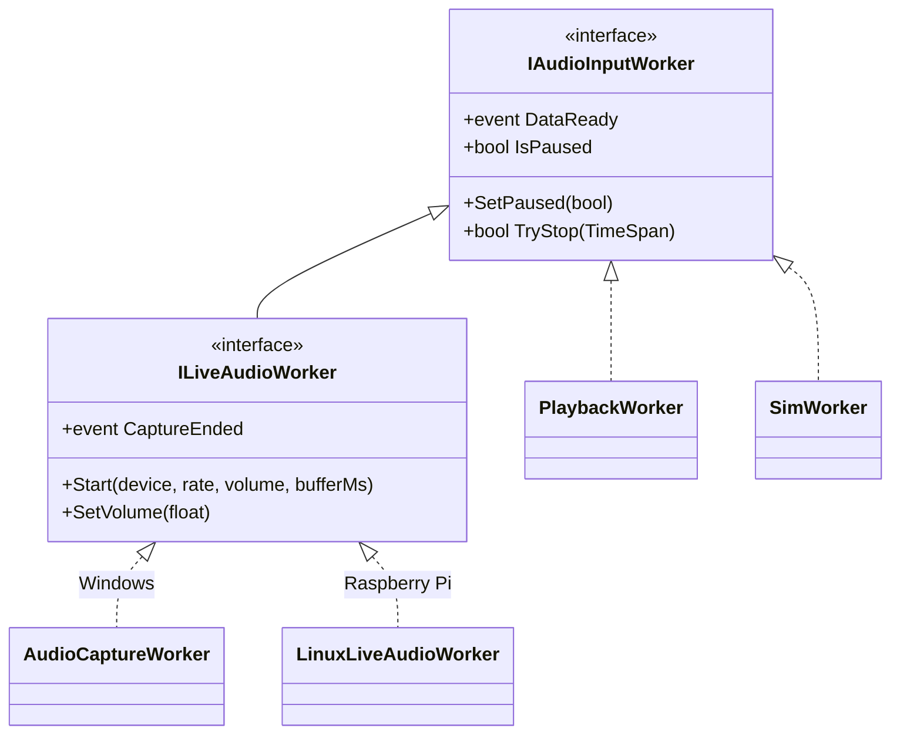
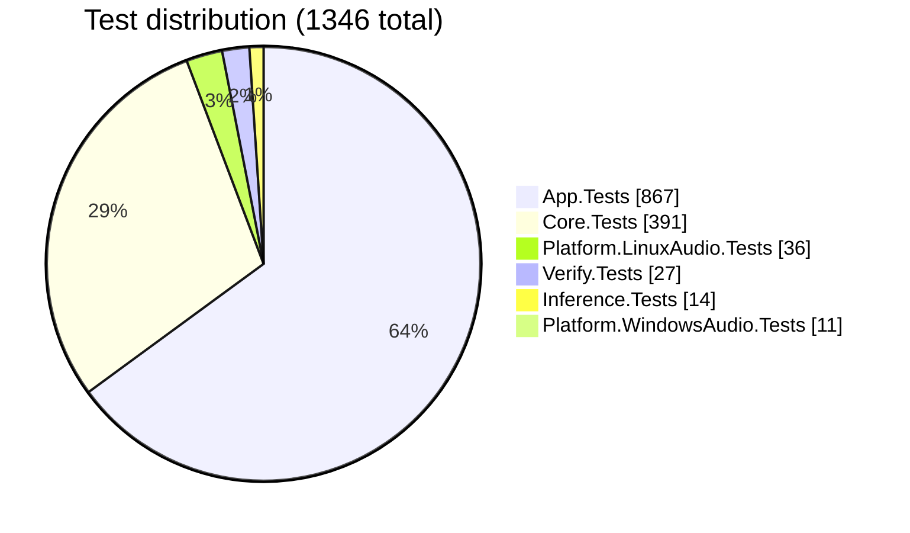

# TimeGrapherNet

**English** · [한국어](README.ko.md)

A desktop app that listens to a mechanical watch's tick through a microphone and
analyzes, in real time, how accurate the watch is — plotting the result as graphs.
Rebuilt from the original Qt/C++ version in **Avalonia + C# (.NET 8)**, a single
codebase runs on both **Windows** and the **Raspberry Pi 5**.

[](https://github.com/lgcmu2026-team5/TimeGrapher-Net/releases/latest)


## Quick Start

There are two ways to get started — **(A) download a prebuilt release** (run immediately, no dev tools), or **(B) build from source**.

### (A) Download a release (recommended — no build)

Download the single-file, self-contained bundle for your OS from the [Releases page](https://github.com/lgcmu2026-team5/TimeGrapher-Net/releases). No .NET SDK install required.

- **Windows** — extract `TimeGrapher-<tag>-win-x64.zip` and run `TimeGrapher.App.exe`.
- **Raspberry Pi 5** — extract `TimeGrapher-<tag>-linux-arm64.tar.gz` and run `./install.sh` (see the Raspberry Pi section below).

Each bundle ships a `.sha256` file so you can verify integrity (Windows: `Get-FileHash`; Pi: `sha256sum -c <file>.sha256`).

### (B) Build from source

Assumes a clean machine with nothing installed. Follow the steps for your OS.

#### Windows

1. **Install dependencies** — install the .NET SDK 8 and Git.

   ```powershell
   winget install Microsoft.DotNet.SDK.8
   winget install Git.Git
   ```

   Open a new terminal and confirm `dotnet --version` prints `8.0.x`.
   (No audio driver to install — the required NAudio is bundled in the build.)

2. **Clone + build**

   ```powershell
   git clone https://github.com/lgcmu2026-team5/TimeGrapher-Net.git
   cd TimeGrapher-Net
   dotnet build TimeGrapherNet.sln -c Release   # first build may take a few minutes for package restore
   ```

3. **Run**

   ```powershell
   dotnet run --project src/TimeGrapher.App                                   # launch the GUI
   dotnet run --project src/TimeGrapher.Verify -c Release -- --generated --byte-fixtures   # headless: generated and byte-built detection checks
   ```

#### Raspberry Pi 5 (ARM64)

Distributed as a single-file, self-contained package, so **the Pi needs no .NET install.**
Build on a dev PC (one prepared via the Windows steps above) and copy only the output to the Pi.

> 💡 Why a different CPU is fine: the build output isn't x64 machine code but a bundle of
> **CPU-neutral IL + the ARM64 .NET runtime**. The actual translation to ARM64 machine code
> happens on the Pi at run time.

1. **Install Pi dependencies** — on the Pi, install the libraries the GUI needs.

   ```bash
   sudo apt update
   sudo apt install -y libx11-6 libice6 libsm6 libfontconfig1 xwayland \
     pipewire pipewire-bin wireplumber alsa-utils gnome-keyring libsecret-tools
   ```

   Mic input needs the PipeWire/ALSA CLI tools `wpctl`, `pw-record`, and `arecord`
   (from the packages above). Pi OS usually includes them, but install them
   explicitly on a minimal image or live capture will be unavailable.

   > ICU (`libicu`) is **intentionally omitted** above. The app is built in invariant
   > globalization mode (`InvariantGlobalization=true`, culture-neutral by design), so .NET
   > does not require system ICU.

2. **Build on the dev PC (produce the deployment package)**

   ```powershell
   dotnet publish src/TimeGrapher.App/TimeGrapher.App.csproj -c Release -r linux-arm64 --self-contained true -o publish
   ```

   The Release RID publish defaults in `TimeGrapher.App.csproj` make this a single-file
   output: `publish/TimeGrapher.App` contains the managed app, platform backend, and
   .NET runtime bundle.

3. **Copy to the Pi and run**

   **(A) If you downloaded the release tarball — one `install.sh` does it (recommended):** extract
   and run it; it handles apt dependencies + the executable bit + icon/`.desktop` registration
   (paths are set automatically to the extract location).

   ```bash
   mkdir -p ~/timegrapher
   tar -xzf TimeGrapher-*-linux-arm64.tar.gz -C ~/timegrapher
   cd ~/timegrapher
   ./install.sh                 # apt deps + chmod + icon/.desktop registration (skip deps: --no-deps)
   ./TimeGrapher.App            # or 'TimeGrapher' from the menu/taskbar
   ./TimeGrapher.App --smoke    # headless self-check (device list: --audio-smoke)
   ```

   **(B) If it's a publish folder you built from source — run it manually:**

   ```bash
   # (dev PC) copy the publish folder to the Pi — e.g.:
   #   scp -r publish <user>@<pi-host>:~/timegrapher
   # (Pi) from the copied folder:
   cd ~/timegrapher
   chmod +x ./TimeGrapher.App
   ./TimeGrapher.App            # GUI when a monitor is attached
   ./TimeGrapher.App --smoke    # headless self-check (device list: --audio-smoke)
   ```

   For desktop-integration details such as manual taskbar-icon registration, see `deploy/linux/README.md`.

## Features

- Detects tick/tock to lock the beat (BPH) automatically or manually, and stays in sync via phase tracking.
- Analysis display tabs, in the order the app catalog defines them: **Rate/Scope**, **Beat Error**, **Trace**, **Vario**, **Long-Term**, **Sweep**, **Escapement**, **Positions**, **Health**, **Beat Noise**, **Comparison**, **Filter Scope**, **Sound Print**, and **Spectrogram**.
- The **Positions** tab combines compact position-selection buttons on the left with per-position sequence measurements on the right.
- Three inputs: **Live** (mic), **Playback** (WAV file), **Simulation** (synthetic signal).
- Optionally records the input to WAV while analyzing (offered for Live and Simulation runs; Playback only replays an existing file).
- Advisory **signal-quality classification**: an on-device ONNX model (with a heuristic fallback if the model can't load) labels the live signal as Good / Noisy / Weak / Unstable and surfaces plain-language guidance. It is advisory only — it annotates how much to trust the reading and **never drops or alters a beat**.
- A **Settings** window tunes run options (Enhanced Auto BPH, Weak A-onset rescue and its rescue strength, C-onset timing, pause-on-position-change), run parameters (Avg. Period, analysis block size, capture-buffer length, high-pass cutoff), the assessment threshold (minimum verdict beats), CSV measurement logging, and the acceptable (normal-range) bands for Error Rate / Amplitude / Beat Error.
- A console mode to check detection accuracy (`--generated` / `--byte-fixtures`, `--adverse`) and audio devices headlessly.

## Why Avalonia / .NET

See [ADR 1: Switch the UI Framework from Qt + C++ to Avalonia UI + .NET + C#](docs/ADR/en/ADR-001.md).

## Architecture

The analysis engine (`Core`) has zero dependency on UI or OS. Only the per-OS audio backend is
swapped, and CI checks that boundary automatically.



*Figure 1. Every project references Core; the ONNX signal-quality classifier is cross-platform, while only the audio backend matching the build-target OS is included.*

The flow from sound to screen:



*Figure 2. Input → detect → measure → visualize. One analysis pass drives one screen update; a parallel advisory step classifies signal quality and surfaces trust guidance.*

### Input worker contract

All three inputs (Live · Playback · Simulation) implement the shared `IAudioInputWorker` (pause · stop ·
data-ready). Only mic input adds device selection, volume, capture-buffer length, and capture-end via `ILiveAudioWorker`.
Core only needs to know this small contract, so per-OS backends drop in freely.



*Figure 3. The input-worker hierarchy. Mic backends are implemented in per-OS assemblies.*

## Projects

| Project | Role |
|---|---|
| `TimeGrapher.Core` | Analysis engine — detection, measurement, image generation, WAV read/write, simulator (UI/OS-independent) |
| `TimeGrapher.App` | Avalonia UI — windows, tabs, graph display; wires up per-OS audio and the signal-quality classifier |
| `TimeGrapher.Inference` | On-device ONNX signal-quality classifier (Good/Noisy/Weak/Unstable); advisory only, references Core, ships the embedded model |
| `TimeGrapher.Platform.WindowsAudio` | Windows mic input (NAudio) |
| `TimeGrapher.Platform.LinuxAudio` | Raspberry Pi mic input (PipeWire → ALSA) |
| `TimeGrapher.Verify` | Headless console that checks BPH detection accuracy on WAV files |
| `*.Tests` | xUnit tests (Core / App / Inference / WindowsAudio / LinuxAudio / Verify) |

For deeper design background and the Qt→.NET porting story, see the `docs/` folder.

## Tech stack

| Package | Version | Purpose |
|---|---|---|
| Avalonia(.Desktop/.Themes.Fluent) | 11.3.17 | UI framework |
| ScottPlot.Avalonia | 5.0.55 | Scope/rate graphs |
| NAudio.Wasapi / NAudio.WinMM | 2.2.1 | Windows mic capture & volume |
| Microsoft.ML.OnnxRuntime | 1.20.1 | On-device signal-quality inference |
| xunit / xunit.runner.visualstudio | 2.9.2 / 2.8.2 | Testing |
| Microsoft.NET.Test.Sdk | 17.12.0 | Test host |

Package versions are managed centrally in `Directory.Packages.props` and pinned with
`packages.lock.json`, so restores are always reproducible.

## Tests / CI

Architecture decision: [ADR 4: Separate App, Test, and Verify Module Structure for AI Usage, TDD Support, and Team Collaboration](docs/ADR/en/ADR-004.md).

**All 1346 tests pass** under `dotnet test` (App 867 / Core 391 / LinuxAudio 36 / Verify 27 / Inference 14 / WindowsAudio 11).



*Figure 4. Test distribution.*

GitHub Actions (`.github/workflows/ci.yml`) runs the following on every push and pull request targeting
`main`, across Ubuntu and Windows — build & test, WAV detection verification, and Raspberry Pi/Windows deployment-artifact generation.

Releases are handled by a separate workflow (`.github/workflows/release.yml`). Pushing a `v*` tag
(or a manual dispatch) builds the win-x64 · win-arm64 · linux-x64 · linux-arm64 single-file,
self-contained bundles (`.zip`/`.tar.gz` + `.sha256`) and publishes them as a GitHub Release
(release notes auto-generated; tags containing `-`, e.g. `v0.1.0-rc.1`, are marked prerelease).
To cut a release:

```bash
git tag v0.1.0 && git push origin v0.1.0
```

## Checklist

| Item | Command | Status |
|---|---|---|
| Build | `dotnet build TimeGrapherNet.sln -c Release` | ✅ |
| Test | `dotnet test TimeGrapherNet.sln -c Release` (1346/1346) | ✅ |
| Detection check | `... TimeGrapher.Verify -- --generated --byte-fixtures` (exit 0, generated and byte-built fixtures) | ✅ |
| GUI run | `dotnet run --project src/TimeGrapher.App` | ✅ |
| Deploy — Raspberry Pi (linux-arm64) | `dotnet publish ... -r linux-arm64 --self-contained true` | ✅ |
| Deploy — Linux x64 | `dotnet publish ... -r linux-x64 --self-contained true` | ✅ |
| Deploy — Windows ARM (win-arm64) | `dotnet publish ... -r win-arm64 --self-contained true` | ✅ |
| Raspberry Pi mic input | verify with a capture device attached | ⏳ awaiting device |
