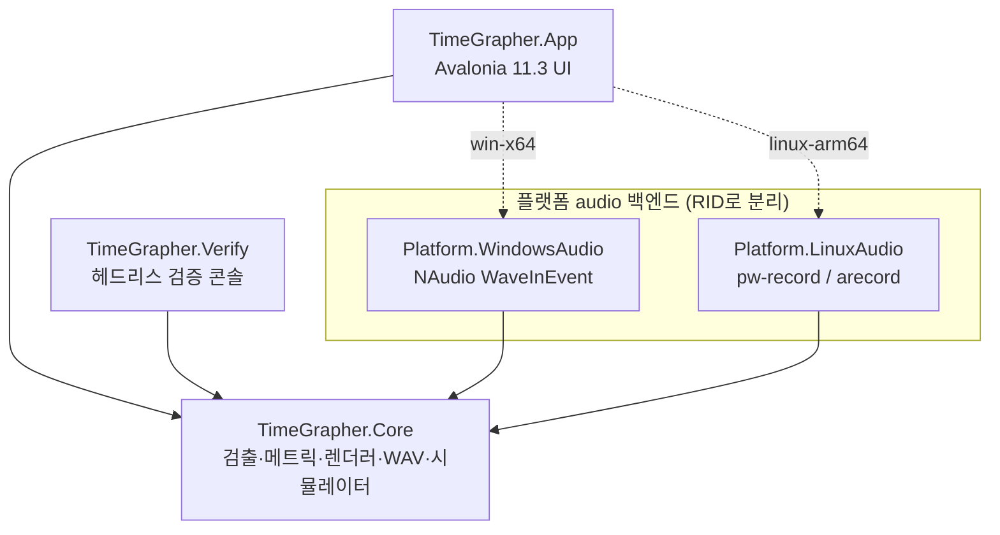
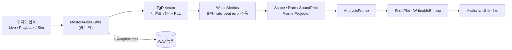
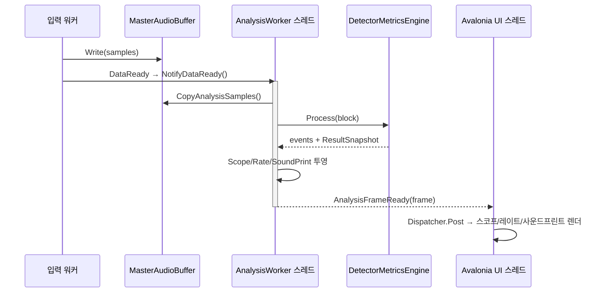
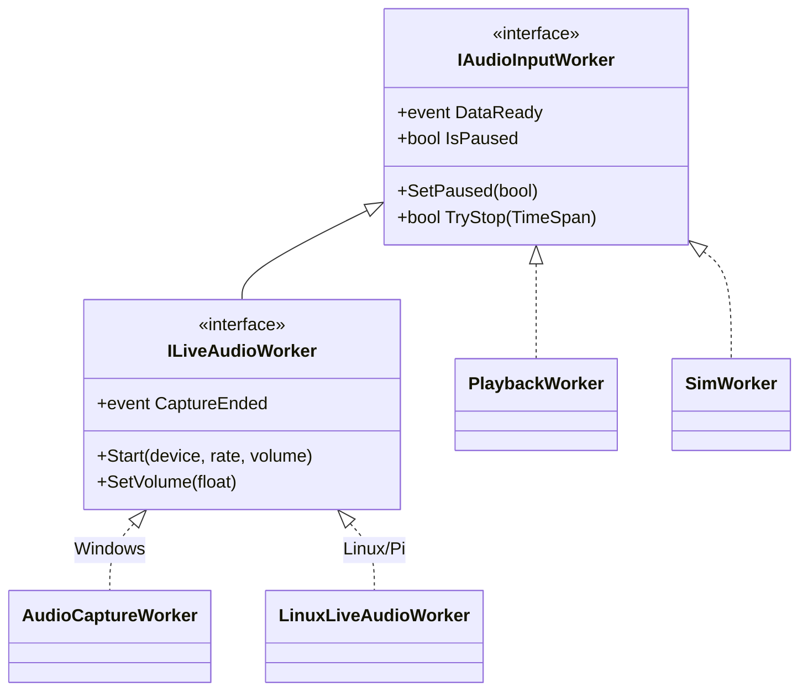
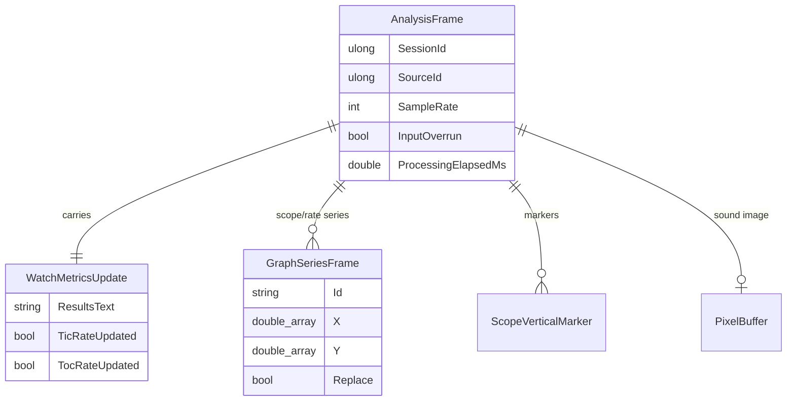
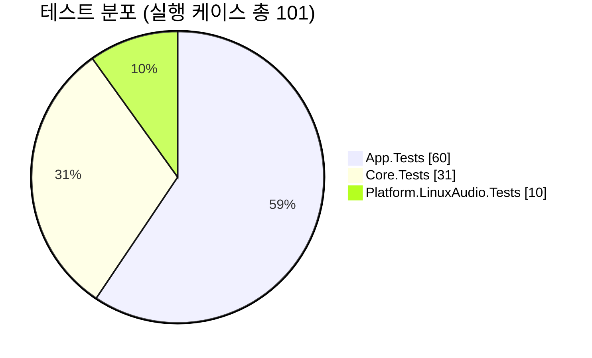

# TimeGrapherNet

시계 틱 오디오에서 비트레이트(BPH), 레이트 오차(s/d), 비트 에러(ms), 진폭(°)을 실시간 추정해
스코프·레이트 플롯과 폴디드 사운드 이미지로 시각화하는 **Avalonia + C# (.NET 8)** 크로스플랫폼
데스크톱 앱이다. Qt/C++ TimeGrapher(`D:\TimeGrapher_Refactoring`)를 .NET으로 포팅했으며
Windows(`win-x64`)와 Raspberry Pi 5/ARM64(`linux-arm64`)를 단일 코드베이스로 지원한다.

## 주요 기능

- **실시간 검출**: 시계 틱(tic/toc) 이벤트를 검출하고 BPH를 자동/수동으로 결정, PLL로 동기 추적.
- **메트릭 산출**: 레이트 오차(s/d), 비트 에러(ms), 진폭(°)을 롤링 평균/최소자승으로 계산.
- **시각화 2종 탭**:
  - `Rate/Scope` — 정류 파형·트리거 임계선 스코프 + tic/toc 레이트 산점도(ScottPlot).
  - `Sound Print` — 주기로 폴딩한 사운드 이미지(ARGB32 PixelBuffer → WriteableBitmap).
- **세 가지 입력 소스**: Live(마이크/캡처), Playback(WAV 재생), Sim(합성 시계 신호).
- **WAV 녹음**: 분석과 동시에 입력을 백그라운드 큐로 WAV 기록.
- **플랫폼별 live audio 백엔드**: Windows는 NAudio, Linux/Pi는 PipeWire `pw-record` →
  ALSA `arecord` fallback. RID 기준으로 한 플랫폼 백엔드만 publish에 포함.
- **헤드리스 검증/스모크**: GUI 없이 검출 정확도와 오디오 장치 상태를 확인하는 콘솔 경로.

## 아키텍처

`TimeGrapher.Core`는 UI·플랫폼·네이티브 의존성이 전혀 없는 순수 도메인 라이브러리이고, App과
플랫폼 백엔드, 검증 콘솔이 모두 Core를 참조한다. App은 RID 조건부 `ProjectReference`로 한
플랫폼 백엔드만 끌어온다(CI가 경계를 강제).



*그림 1. 프로젝트 의존성. 실선은 항상 참조, 점선은 RID 조건부 참조.*

### 데이터 파이프라인

오디오 입력 워커가 링 버퍼에 샘플을 쓰면, 전용 분석 스레드가 깨어나 검출 → 메트릭 → 투영을
거쳐 한 번의 패스마다 `AnalysisFrame` 하나를 만들고 UI 스레드에 전달한다.



*그림 2. 입력에서 화면까지의 데이터 흐름. 녹음은 분석과 동일 샘플 스트림에서 분기한다.*

### 요청-응답 시퀀스 (프레임 1개 생성)



*그림 3. `DataReady` 신호 한 번이 `AnalysisFrame` 한 개로, 다시 UI 갱신 한 번으로 이어진다.*

### 입력 워커 계약

Live/Playback/Sim 워커는 공통 `IAudioInputWorker` 수명주기(pause/stop/data-ready)를 공유하고,
live 백엔드만 `ILiveAudioWorker`로 장치 선택·볼륨·캡처 종료 이벤트를 추가한다. Core는 이 작은
계약 뒤에서만 백엔드를 본다.



*그림 4. 입력 워커 계층. live 백엔드는 플랫폼 어셈블리에 구현된다.*

### 프레임 데이터 모델

`AnalysisFrame`은 한 번의 분석 패스가 만든 모든 UI 갱신 단위(스코프 시리즈, 이벤트 마커, 레이트
플롯, 결과 텍스트, 사운드 이미지, 스레드 통계)를 한 객체에 담아 단일 프레임 일관성을 보장한다.



*그림 5. `AnalysisFrame` 구성. 사운드 이미지는 갱신된 패스에만 채워진다(0..1).*

## 프로젝트 구성

| 프로젝트 | 내용 |
|---|---|
| `TimeGrapher.Core` | UI/플랫폼 무관 도메인 — 검출 코어(tg_* 포트), 메트릭, 사운드 이미지 렌더러, WAV reader/writer, 시뮬레이터, 분석 워커 |
| `TimeGrapher.App` | Avalonia 11.3 UI — MainWindow/SplashWindow, 정보 탭 목록/전달자, ScottPlot 렌더러, 플랫폼별 live audio 선택 |
| `TimeGrapher.Platform.WindowsAudio` | Windows live audio backend — NAudio WaveInEvent capture, 엔드포인트 볼륨 헬퍼 |
| `TimeGrapher.Platform.LinuxAudio` | Linux/Pi live audio backend — PipeWire `pw-record`, ALSA `arecord` fallback, source probing |
| `TimeGrapher.Verify` | 헤드리스 검증 콘솔 — 샘플/합성 WAV의 파일명 BPH와 검출 BPH 비교, 전부 일치 시 exit 0 |
| `TimeGrapher.Core.Tests` | xUnit 회귀 테스트 — 합성 시계 신호 검출, WAV writer/reader round-trip, 워커 pause 계약 |
| `TimeGrapher.App.Tests` | 정보 탭 규칙, 렌더 데이터 규칙, 실행 명령/선택 조정자, UI 전달 데이터 축소 회귀 테스트 |
| `TimeGrapher.Platform.LinuxAudio.Tests` | Linux/Pi audio source 파서와 process timeout 계약 테스트 |

핵심 기술 매핑: Qt Widgets→Avalonia, QCustomPlot→ScottPlot.Avalonia, Qt Multimedia→플랫폼별
audio backend, QImage→PixelBuffer(ARGB32)→WriteableBitmap, QThread/signal→전용 Thread +
`AutoResetEvent` + `Dispatcher.UIThread.Post`. WPF 미사용. Core는 NAudio/PipeWire/`TimeGrapher.Platform`을
참조하지 않으며, 이 경계는 CI에서 텍스트 스캔으로 강제된다.

문서(`docs/`):

- `docs/README.md`: 문서 읽는 순서
- `docs/QT_CPP_TO_AVALONIA_PORTING.md`: Qt/C++ → Avalonia/.NET 전환 과정
- `docs/ARCHITECTURE_PRESENTATION.md`: 발표용 아키텍처 개선 정리
- `docs/ARCHITECTURE_REVIEW_FIXES.md`: 아키텍처 리뷰 반영 내역
- `docs/source-notes/`: 초기 포팅/계약/리뷰 원문 기록

## 빌드 / 실행

요구: .NET SDK 8.0.421+ (`global.json`, `rollForward: latestFeature`).

```powershell
dotnet restore TimeGrapherNet.sln --locked-mode
dotnet build TimeGrapherNet.sln -c Release      # 첫 복원은 사내망에서 ~3분
dotnet test TimeGrapherNet.sln -c Release
dotnet run --project src/TimeGrapher.App        # GUI
dotnet run --project src/TimeGrapher.Verify -c Release -- D:\TimeGrapher_Refactoring\samples
```

### Raspberry Pi 5 / ARM64 publish

```powershell
dotnet publish .\src\TimeGrapher.App\TimeGrapher.App.csproj -c Release -r linux-arm64 --self-contained true
```

Pi GUI 실행에는 XWayland/Avalonia 의존성(`libx11-6`, `libice6`, `libsm6`, `libfontconfig1`,
`xwayland`)이 필요하다. Pi live audio는 먼저 PipeWire source를 `wpctl status`로 열거하고
`pw-record` raw float mono stream을 분석 pipeline에 공급한다. PipeWire source가 없으면 ALSA
capture를 `arecord -l`로 열거해 `arecord` raw S16 mono stream으로 fallback한다. capture source가
없으면 UI는 `Playback/Sim`만 표시한다.

### Pi 작업표시줄 아이콘 (선택)

Pi OS 패널(wf-panel-pi)은 `.desktop`의 `Icon=`만 사용하므로, 작업표시줄 아이콘 표시에는
`deploy/linux/`의 두 파일을 설치한다(상세: `deploy/linux/README.md`).

```bash
mkdir -p ~/.local/share/icons ~/.local/share/applications
cp src/TimeGrapher.App/Assets/App/AppIcon-256.png ~/.local/share/icons/timegrapher.png
cp deploy/linux/TimeGrapher.App.desktop ~/.local/share/applications/   # Exec/Icon 경로 수정
```

`.desktop` 파일명과 `StartupWMClass`는 app-id(`TimeGrapher.App`)와 일치해야 패널이 매칭한다.

## 설정 / 환경

### 중앙 관리 패키지 버전 (`Directory.Packages.props`)

| 패키지 | 버전 | 용도 |
|---|---|---|
| Avalonia(.Desktop/.Themes.Fluent/.Fonts.Inter) | 11.3.2 | UI 프레임워크 |
| ScottPlot.Avalonia | 5.0.55 | 스코프/레이트 플롯 |
| NAudio.Wasapi / NAudio.WinMM | 2.2.1 | Windows 캡처/볼륨 |
| Tmds.DBus.Protocol | 0.21.3 | Linux 오디오 보조 |
| xunit / xunit.runner.visualstudio | 2.9.2 / 2.8.2 | 테스트 |
| Microsoft.NET.Test.Sdk | 17.12.0 | 테스트 호스트 |

빌드는 결정적(`Deterministic=true`)이며 `RestorePackagesWithLockFile=true`로
`packages.lock.json`을 커밋, `--locked-mode`로 복원한다.

## 테스트 / CI

`dotnet test TimeGrapherNet.sln -c Release` 기준 현재 통과 분포(Fact/Theory 전개 케이스):



*그림 6. 테스트 케이스 분포. 전부 통과, 실패 0.*

CI(`.github/workflows/ci.yml`)는 두 잡으로 구성된다.

- **core-boundary (ubuntu)**: Core/LinuxAudio/Verify/테스트 `--locked-mode` 복원 →
  `TreatWarningsAsErrors` 빌드 → Core·LinuxAudio 테스트 → 생성/바이트 WAV 검증 →
  Core 플랫폼 의존성 텍스트 스캔 → `linux-arm64` self-contained publish 및 산출물 경계 확인
  (LinuxAudio 포함·WindowsAudio 미포함).
- **build-test (windows)**: 솔루션 `--locked-mode` 복원 → 빌드 → 전체 테스트 → 생성/바이트 WAV
  검증 → `win-x64` framework-dependent publish → 산출물 경계 확인 + SHA256 기록 + `--smoke`
  스모크(실제 exit code 확인).

> Windows publish 산출물은 framework-dependent(`--self-contained false`)이므로 실행 환경에
> .NET 8 Runtime이 필요하다. 런타임 설치 전제를 없애려면 self-contained 산출물을 별도로 만든다.

## 체크리스트

| 항목 | 명령 / 확인 | 상태 |
|---|---|---|
| 복원 | `dotnet restore TimeGrapherNet.sln --locked-mode` | ✅ |
| 빌드 | `dotnet build TimeGrapherNet.sln -c Release` (오류 0) | ✅ |
| 테스트 | `dotnet test TimeGrapherNet.sln -c Release` (101/101) | ✅ |
| 검출 검증 | `... TimeGrapher.Verify -- --generated --byte-fixtures` (exit 0) | ✅ |
| GUI 실행 | `dotnet run --project src/TimeGrapher.App` | ✅ |
| Linux publish | `dotnet publish ... -r linux-arm64 --self-contained true` | ✅ |
| Pi GUI 스모크 | `./TimeGrapher.App --smoke` (`DISPLAY=:0`) | ✅ |
| Pi 오디오 스모크 | `./TimeGrapher.App --audio-smoke` / `--capture-smoke` | ⏳ live capture source 대기 |
| 보안 경계 | Core 플랫폼 의존성 0 (CI 스캔) | ✅ |
