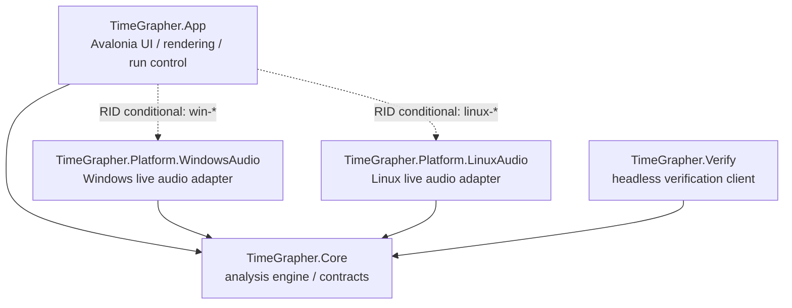
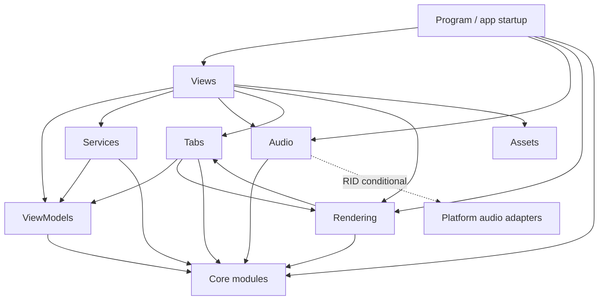
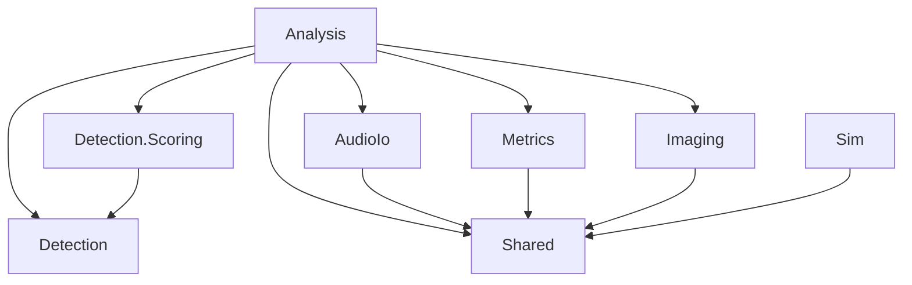

# TimeGrapher Module Uses View - JD Draft

## 1. Primary Presentation

이 view는 TimeGrapher runtime source의 structural dependency를 보여준다. 숙제의 `.cpp/.h dependency diagram` 요구를 C#/.NET 프로젝트 구조에 맞게 번역한 것이다.

Notation:

- `A --> B`: A가 B를 사용한다.
- `-. RID conditional .->`: runtime identifier 조건에 따라 포함되는 dependency다.
- `Core --> none`: Core가 UI, OS-specific adapter, external package에 의존하지 않는다는 architecture rule이다.



Core dependency rule:

```text
TimeGrapher.Core -> no project reference, no package reference
```

Evidence files:

- `src/TimeGrapher.App/TimeGrapher.App.csproj`
- `src/TimeGrapher.Core/TimeGrapher.Core.csproj`
- `src/TimeGrapher.Platform.WindowsAudio/TimeGrapher.Platform.WindowsAudio.csproj`
- `src/TimeGrapher.Platform.LinuxAudio/TimeGrapher.Platform.LinuxAudio.csproj`
- `src/TimeGrapher.Verify/TimeGrapher.Verify.csproj`

## 2. Element Catalog

| Element | Responsibility | Uses |
|---|---|---|
| `TimeGrapher.App` | Avalonia UI, graph rendering, tabs, run lifecycle, user settings | `Core`, platform audio adapters by RID, Avalonia, ScottPlot |
| `TimeGrapher.Core` | detection, metrics, audio contracts, simulation, frame/projector logic | none at project/package level |
| `TimeGrapher.Platform.WindowsAudio` | Windows audio capture implementation | `Core.Shared`, NAudio |
| `TimeGrapher.Platform.LinuxAudio` | Linux/Pi audio capture implementation | `Core.Shared`, Linux audio CLI stack |
| `TimeGrapher.Verify` | headless detector-quality verification | `Core` |

## 3. Folder / Module-Level Refinement

### App Internal Modules



### Core Internal Modules



## 4. Context / Scope

Included:

- Runtime source projects under `src/`.
- Runtime-relevant folder/module dependencies.
- `.csproj` project/package reference evidence.

Excluded:

- `bin/`
- `obj/`
- generated files
- publish output
- every individual `.cs` file inventory
- test project details unless a separate testability view is needed

## 5. Variability Guide

Platform audio is bound by RID:

| RID condition | Included adapter |
|---|---|
| development/no RID | WindowsAudio + LinuxAudio |
| `win-*` | WindowsAudio |
| `linux-*` | LinuxAudio |

This keeps OS-specific audio code outside `Core` while allowing one App project to publish for Windows and Raspberry Pi/Linux targets.

## 6. Design Rationale / ADR Links

- `Core` remains dependency-free to preserve testability, portability, and modifiability.
- Platform audio is isolated in adapter projects so OS APIs do not leak into `Core`.
- The analysis flow is documented as partial Pipe-and-Filter; see `ADR-002-partial-pipe-and-filter.md`.

## 7. Related Views

- `docs/for-ai/MODULE_USES_VIEW.md`
- `docs/for-ai/SAP_TACTICS_ANALYSIS.md`
- `docs/ADR/ADR-001.md`
- `TempDocs/JD/ADR-002-partial-pipe-and-filter.md`
