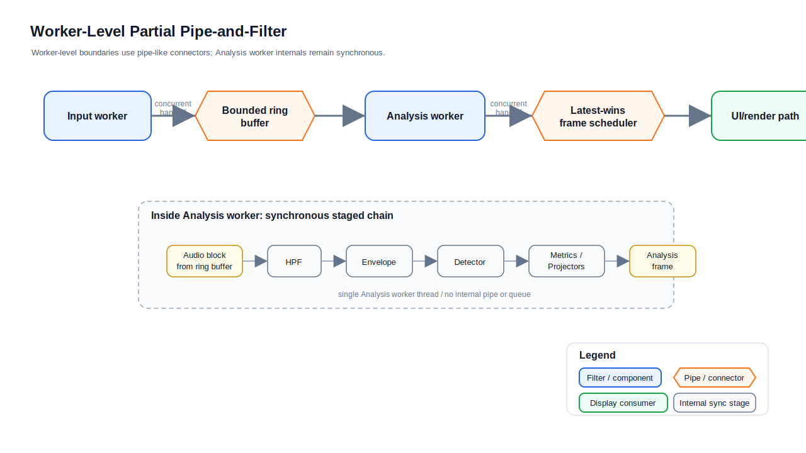

# ADR 2: Worker-Level Partial Pipe-and-Filter 적용

TimeGrapher의 실시간 오디오 분석은 worker/path가 filter 또는 final display consumer 역할을 하고 bounded connector가 pipe 역할을 하는 worker-level flow로 동작한다. Pipe-and-Filter를 어디까지 적용할지에는 다음 요인(force)들이 영향을 미쳤다.

- **실시간 예산**: 28800 BPH 기준 각 beat는 125 ms budget 안에서 처리되어야 하므로, 분석 hot path는 stage마다 늘어나는 latency를 감당할 수 없다.
- **동시성 경계**: input capture, analysis, UI rendering은 서로 다른 속도로 동작하며 서로를 막아서는 안 된다.
- **녹음**: 검출 결과는 analysis를 멈추지 않고 recording writer까지 전달되어야 한다.
- **구조적 명확성**: runtime flow는 input, analysis, rendering의 책임을 리뷰어가 명확히 볼 수 있어야 한다.

Editable source: [worker-level-partial-pipe-and-filter.drawio](../assets/worker-level-partial-pipe-and-filter.drawio)

Analysis worker 내부의 DSP/metrics path는 별도 pipe/queue/thread로 쪼개지지 않는다. 같은 analysis thread에서 block 단위로 순차 실행되는 synchronous staged chain이다. 이 ADR은 worker-level flow에는 Pipe-and-Filter를 적용하고, worker 내부 hot path에는 적용하지 않는 결정을 기록한다.

## Decision

우리는 Pipe-and-Filter를 worker-level partial application으로 적용할 것이며, worker-level flow는 다음 filter/pipe 경계로 구성한다.

- Filter: Input worker -> Pipe: bounded ring buffer -> Filter: Analysis worker
- Filter: Analysis worker -> Pipe: latest-wins frame scheduler -> Final display consumer: UI/render path
- Filter: Analysis worker -> Pipe: bounded recording queue -> Recording consumer: recording writer

우리는 Analysis worker 내부의 HPF, envelope, detector, metrics/projectors를 worker-level filter/pipe boundary가 아니라 내부 synchronous staged chain으로 유지할 것이다.

## Rationale

Worker-level Pipe-and-Filter는 입력, 분석, 렌더링의 책임과 concurrency boundary를 명확히 한다. Ring buffer와 latest-wins frame scheduler는 producer/consumer 속도 차이를 흡수하며, UI rendering이 input capture나 detection을 직접 막지 않게 한다.

Analysis worker 내부는 28800 BPH 기준 125 ms beat budget 안에서 처리되어야 하는 hot path이다. 이를 synchronous chain으로 유지하면 full Pipe-and-Filter 분리가 critical path에 더할 latency·allocation·상태 관리 비용을 피할 수 있다.

기각된 대안

- **Analysis worker 내부까지 full Pipe-and-Filter 적용**: 내부 chain을 독립 pipe/filter stage로 분리하면 stage 간 queueing·synchronization·scheduling latency, 추가 buffer/message allocation 또는 copy, audio block과 event 순서 보장 로직, detector·sync PLL·rolling metrics의 상태 관리 복잡도가 모두 125 ms budget 안에서 발생하므로 기각.
- **worker 간 pipe 없는 단일 synchronous flow**: input capture·analysis·UI rendering이 서로를 막고, 느린 UI frame이 detection이나 input capture를 멈출 수 있어 기각.

## Status

승인됨(Accepted)

## Consequences

긍정적:

- worker-level runtime flow를 Pipe-and-Filter 관점으로 명확히 설명한다.
- input, analysis, UI rendering이 서로 직접 막히지 않는다.
- Analysis worker 내부 hot path에서 불필요한 queue/thread overhead를 피한다.
- block 처리 순서와 detector/metrics 상태 일관성을 단순하게 유지한다.

부정적 / 트레이드오프:

- worker 내부 stage는 parallel speedup을 제공하지 않는다.
- Analysis worker 내부 stage는 별도 pipe/connector를 가진 독립 runtime component가 아니다.
- 이 결정은 full Pipe-and-Filter가 아니라 worker-level partial application으로 설명해야 한다.

## Related Quality Attributes (QAS)

이 결정과 연결되는 품질 속성 시나리오(QAS, Architectural Drivers 문서):

- **QAS-2 Performance(Latency)**: worker-level pipe(ring buffer·latest-wins frame scheduler·bounded queue)가 입력·분석·렌더링이 서로를 막지 않게 분리하고, 분석 hot path를 동기 체인으로 유지해 28800 BPH 기준 125 ms 비트 예산을 지킨다. bounded connector가 producer/consumer 속도 차를 흡수해 dropped block·missed beat도 막는다.
