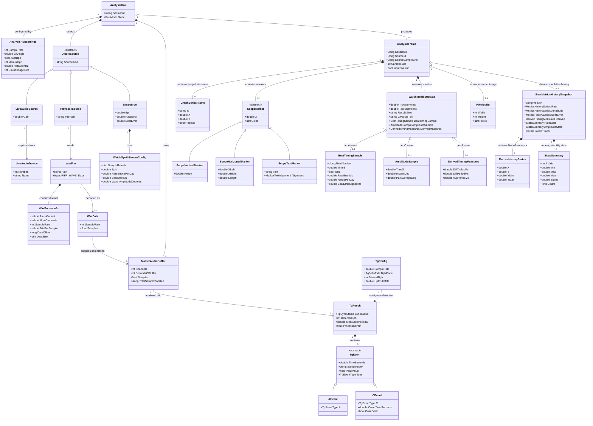

# Data Model View

TimeGrapherNet은 별도 데이터베이스를 사용하지 않는다. 따라서 전통적인 persisted domain element는 WAV 파일이며, 나머지는 실행 중 생성·전달·렌더링되는 도메인 데이터 구조다. 이 다이어그램은 프로젝트가 조작하는 주요 데이터 엔티티와 1:1, 1:n, 집합/집약, 일반화/특수화 관계를 함께 보여준다.

## Entity summary

| Entity | Source in project | Meaning |
|---|---|---|
| `WavFile`, `WavFormatInfo`, `WavData` | `Core.AudioIo` | Persisted or decoded audio data used for playback, recording, and verification |
| `AnalysisRunSettings` | `TimeGrapher.App` | User-selected run parameters converted into analysis worker configuration |
| `AudioSource` specializations | App run modes and Core workers | Live microphone, WAV playback, or synthetic signal input |
| `MasterAudioBuffer` | `Core.Shared` | Shared mono float ring buffer between input workers and analysis |
| `TgConfig`, `TgResult`, `TgEvent` | `Core.Detection` | Detector configuration, sync state, processed PCM, and tick/tock events |
| `AnalysisFrame` | `Core.Shared` | One UI update payload produced by an analysis pass |
| `GraphSeriesFrame`, `ScopeMarker`, `WatchMetricsUpdate`, `PixelBuffer` | `Core.Shared` | Data displayed as scope/rate graphs, markers, numeric results, and sound-print image |
| `BeatTimingSample`, `AmplitudeSample`, `DerivedTimingMeasures` | `Core.Shared` | Machine-readable per-beat values (rate error, signed beat error, amplitude, DiffTicTac/DiffPeriod/AvgPeriod) emitted per A/C event |
| `BeatMetricsHistorySnapshot`, `MetricsHistorySeries` | `Core.Shared` (built by `Core.Metrics.BeatMetricsHistory`) | Immutable cumulative history of rate/amplitude/beat-error series shared across frames; survives latest-wins frame coalescing |
| `StatsSummary` | `Core.Shared` (fed by `Core.Metrics.RunningStats`) | Running min/max/mean/population-σ since start for rate and amplitude — exact per-beat statistics independent of series decimation (Vario display) |

## Relationship notes

| Relationship type | Representation in this project |
|---|---|
| 1:1 | One `AnalysisRun` has one `AnalysisRunSettings`, one selected `AudioSource`, and one `MasterAudioBuffer` |
| 1:n | One `AnalysisRun` produces many `AnalysisFrame` objects; one `TgResult` contains many `TgEvent` objects; one `AnalysisFrame` contains many graph series and markers |
| n:n | No native persisted many-to-many relationship exists because the app has no database and most runtime data is owned by a single run/frame |
| Generalization / specialization | `AudioSource` specializes into live/playback/sim sources; `TgEvent` specializes into A and C events; `ScopeMarker` specializes into vertical/horizontal/text markers |
| Aggregation / composition | `AnalysisFrame` is composed from graph series, markers, metrics, and optional sound image; `WavFile` contains format metadata and can be decoded into `WavData`; `BeatMetricsHistorySnapshot` aggregates three `MetricsHistorySeries` and is shared (aggregation, not owned) by many frames |
