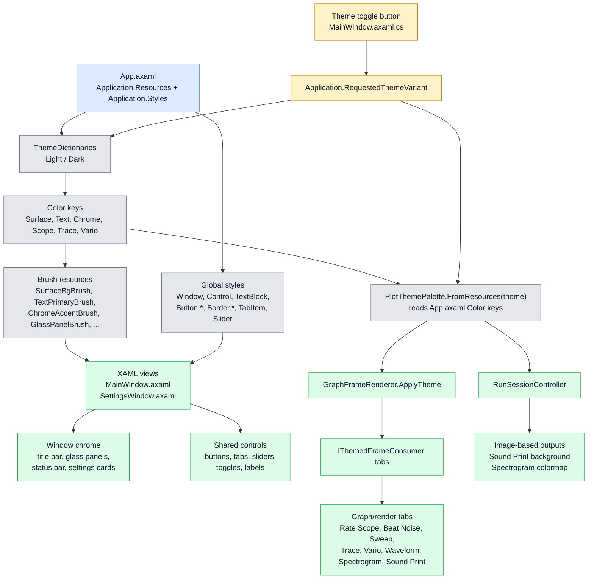

# App.axaml Resource Architecture

`App.axaml`은 전체 UI 테마의 단일 출처다. 창 XAML은 brush/style 리소스를 직접 가져다 쓰고, 그래프 렌더러는 같은 Color 키를 `PlotThemePalette`로 읽어서 ScottPlot/bitmap 계열 화면에 전달한다.

## 핵심 흐름

1. `App.axaml`의 `ThemeDictionaries`가 Light/Dark별 Color 키를 선언한다.
2. 같은 파일 안에서 Color 키가 `SolidColorBrush`, glass gradient, shadow 리소스로 변환된다.
3. `Application.Styles`가 전역 control 스타일과 class 기반 스타일을 정의한다.
4. `MainWindow.axaml`과 `SettingsWindow.axaml`은 `{DynamicResource ...}` / `{StaticResource ...}`로 이 리소스를 직접 사용한다.
5. 그래프 계열은 XAML brush를 직접 쓰지 않고, `PlotThemePalette.FromResources(theme)`가 같은 Color 키를 ARGB 값으로 읽은 뒤 `GraphFrameRenderer.ApplyTheme()`를 통해 `IThemedFrameConsumer` 렌더러로 전달한다.
6. 테마 토글은 `Application.RequestedThemeVariant`를 바꾸고, 같은 시점에 그래프 팔레트와 image-based 출력 배경/colormap도 갱신한다.

## 대표 리소스 묶음

| 묶음 | App.axaml 키 예시 | 주요 사용처 |
|---|---|---|
| Font/style | `AppFontFamily`, `TitleFontFamily`, `Window`, `Control`, `TextBlock`, `TabItem` styles | 전체 텍스트, 탭, 버튼 기본 스타일 |
| UI chrome | `AmbientBackdropBrush`, `GlassPanelBrush`, `GlassRimBrush`, `GlassShadow`, `ChromeAccentBrush` | title bar, status bar, `GlassCard`, settings panel |
| Text/semantic brush | `TextPrimaryBrush`, `TextSecondaryBrush`, `ChromeBorderBrush`, `VarioGoodBrush`, `VarioWarnBrush`, `VarioBadBrush` | readout, labels, position/result badges, Vario UI |
| Graph palette | `ScopeBgColor`, `ScopeGridColor`, `TraceWaveColor`, `TraceTickColor`, `TraceTockColor`, `Vario*Color` | `PlotThemePalette` -> graph renderers |
| Toggle/button states | `ToggleSwitchFillOn*`, `ToggleSwitchStrokeOn*`, `Button.TitleBarIconButton`, `Button.PrimaryRunIconButton` | title bar buttons, run buttons, settings toggles |

## 코드 기준

- `src/TimeGrapher.App/App.axaml`: theme dictionaries, brushes, global styles.
- `src/TimeGrapher.App/Views/MainWindow.axaml`: App-level resources consumed by main window chrome and controls.
- `src/TimeGrapher.App/Views/SettingsWindow.axaml`: same App-level resources consumed by settings UI.
- `src/TimeGrapher.App/Rendering/PlotThemePalette.cs`: reads App-level Color keys for graph rendering.
- `src/TimeGrapher.App/Rendering/GraphFrameRenderer.cs`: forwards `PlotThemePalette` to themed tab consumers.
- `src/TimeGrapher.App/Views/MainWindow.axaml.cs`: theme toggle updates `RequestedThemeVariant`, graph palette, sound background, and spectrogram colormap.
