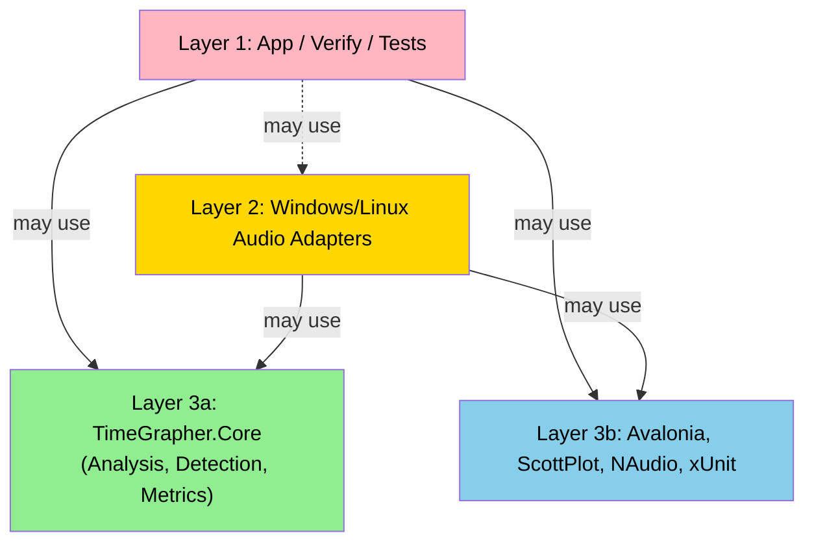
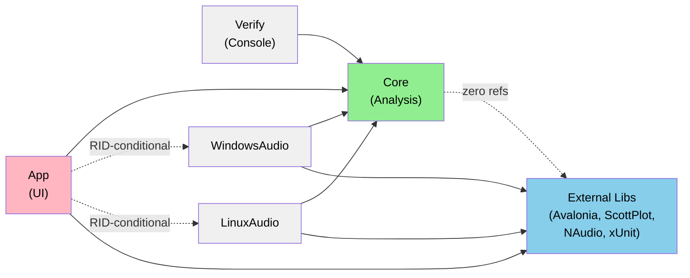
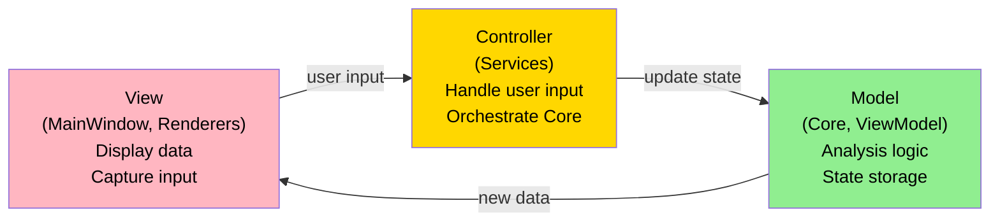
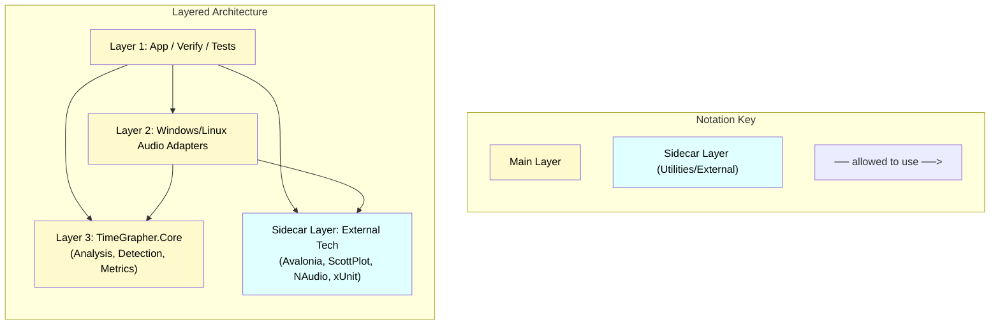
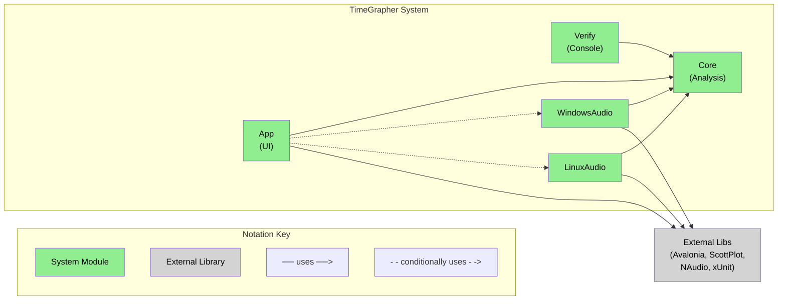
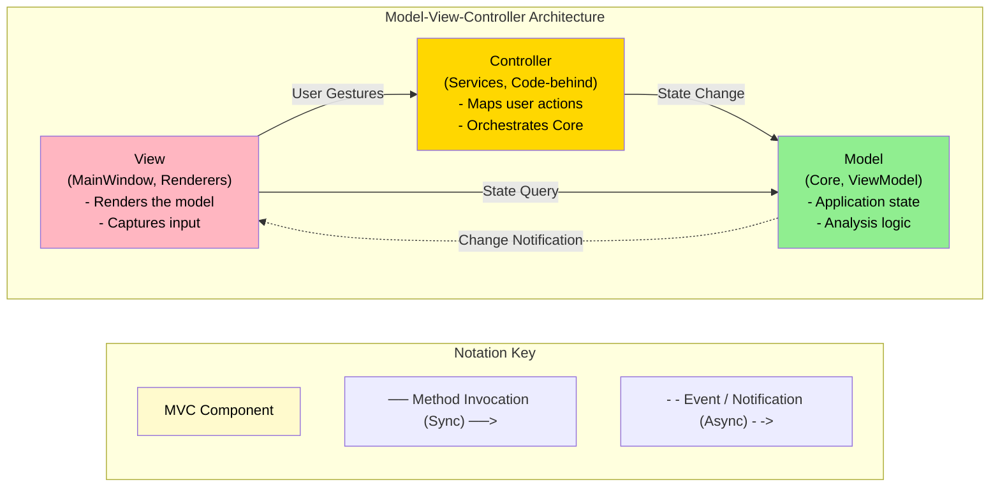

## 1. LAYERED VIEW – Permission-Based Architecture

**Purpose:** Shows which layers are permitted to use which lower layers. Defines allowed dependencies, not implementation details.

**Key Concept:**
- **Relaxed Layering**: Upper layers can skip intermediate layers and use any lower layer they need.
- **Upward Dependency Forbidden**: Only downward flow (App → Core; never Core → App).

**4 Layers:**
1. **Layer 1 – Entry Points & UI**: App (Avalonia UI), Verify (console), Test Suites
2. **Layer 2 – Platform Adapters**: WindowsAudio (NAudio), LinuxAudio (PipeWire/ALSA tools)
3. **Layer 3a – Portable Core**: `TimeGrapher.Core` (analysis, detection, metrics – no external dependencies)
4. **Layer 3b – External Tech**: Avalonia, ScottPlot, NAudio, xUnit

**Permission Rules:**
```
App → Platform Adapters
App → Core
Platform Adapters → Core
Core → Nothing (zero dependencies)
```

**Simplified Diagram:**


---

## 2. MODULE USES VIEW – Actual Dependencies

**Purpose:** Documents real `ProjectReference` and `using` statements. Shows what code actually couples to what.

**Key Principle:**
- Graph is **code-based**: every arrow exists in .csproj or .cs files.
- Defines the concrete dependency graph; Layered View defines permissions.

**3 Levels:**

**Level 1 – Project-Level Uses:**
- `App` → `Core` (required)
- `App` → `WindowsAudio` / `LinuxAudio` (conditional on RID)
- `Verify` → `Core`
- Platform adapters → `Core`
- Tests → their target + `Core` (transitive)

**Level 2 – App Internal (Folders):**
- `Services` → `Core.Shared`, `ViewModels`
- `Rendering` → `Core.Shared`, `Services`
- `Tabs` → `Rendering`, `Core.Shared`

**Level 3 – Core Internal (Namespaces):**
- `Analysis` → `Detection`, `Metrics`, `Shared`
- `Detection` → `Metrics`, `Shared`
- `Metrics` → `Shared`
- `Shared` → nothing (contracts only)

**Simplified Diagram:**


---

## 3. MVC VIEW – Responsibility Separation

**Purpose:** Divides TimeGrapher into Model (data), View (display), and Controller (logic), clarifying who owns what.

**Key Roles:**

| MVC Component | Owns | Example |
|---|---|---|
| **Model** | Data persistence & domain logic | Core analysis engine, MainWindowViewModel, BeatMetricsHistorySnapshot |
| **View** | Display & user input capture | MainWindow.axaml, renderers, plot controls |
| **Controller** | Input handling & orchestration | MainWindow code-behind, RunCommandService, AudioBackend selection |

**Data Flow:**
```
User Input (View)
    ↓
    → Controller (RunCommandService, LiveAudioBackend)
         ↓
         → Model (AnalysisWorker, ViewModel state)
              ↓
              → View (render AnalysisFrame + BeatMetricsHistorySnapshot)
                   ↓
                   → Display
```

**Key Constraint:**
- **Core is UI-agnostic**: No Avalonia, no App references → portable, testable
- **App is mixed**: Views/Controllers intertwine with Avalonia code-behind

**Simplified Diagram:**


---

## Summary Table

| View | What It Shows | Main Insight |
|---|---|---|
| **Layered** | Permission hierarchy | "App *may* use Core, but Core must never know about App" |
| **Uses** | Actual code dependencies | "App directly references Core; Core references nothing" |
| **MVC** | Responsibility domains | "Core is portable; App handles UI coupling" |

각 view는 **다른 질문**에 답합니다:
- **Layered**: *이상적인 아키텍처는?*
- **Uses**: *실제로 코드가 무엇을 쓰는가?*
- **MVC**: *누가 무엇을 소유하는가?*


제공해주신 문서와 다이어그램은 전반적으로 각 뷰의 목적을 잘 이해하고 작성되었으나, 소프트웨어 아키텍처 관점에서 볼 때 몇 가지 치명적인 오류와 개선해야 할 부분들이 있습니다.

### 💡 문서 및 다이어그램의 잘못된 부분과 개선점

**1. 범례(Notation Key / Legend)의 전면 누락 (공통 오류)**
모든 아키텍처 다이어그램에는 기호, 선(실선 vs 점선), 색상의 의미를 명확히 설명하는 범례가 반드시 포함되어야 합니다. 점선과 실선이 다이어그램에 혼용되어 있으나 그 의미가 범례로 명시되어 있지 않아 모호함을 유발합니다.

**2. Layered View: 외부 기술 계층의 부적절한 배치**
`Layer 3b - External Tech`는 시스템의 여러 계층(App, Platform Adapters 등)에서 공통으로 사용되는 유틸리티나 프레임워크들의 모음입니다. 이를 메인 스택(Main Stack)의 한 계층으로 두기보다는, 다른 계층들이 공통으로 접근할 수 있는 **사이드카 계층(Sidecar layer)**으로 표현하는 것이 아키텍처 모범 사례에 부합합니다.

**3. Module Uses View: 'Zero refs' 화살표 오류 (가장 치명적)**
다이어그램에 포함된 `Core -.->|zero refs| External` 화살표는 명백한 오류입니다. Uses 뷰에서 모듈 간의 의존성(depends-on)은 한 모듈이 올바르게 작동하기 위해 다른 모듈의 올바른 구현을 요구(사용)할 때만 선을 그어 표현합니다. 의존성이 없다면 다이어그램에 어떤 형태의 선도 그리지 않아야 합니다.

**4. Module Uses View: 텍스트와 다이어그램 수준의 불일치**
문서 텍스트에서는 Level 1, 2, 3으로 나누어 네임스페이스와 폴더 수준의 구체적인 의존성을 설명하고 있지만, 제공된 다이어그램은 Level 1(프로젝트 단위)만을 보여줍니다. 다이어그램의 이름을 '프로젝트 수준 Uses View'로 명시하거나, 서브그래프를 활용해 내부 서브모듈의 구조를 다이어그램에 반영하는 것이 좋습니다.

---

### 📝 수정된 아키텍처 문서 제안

위의 분석을 바탕으로, 범례를 추가하고 사이드카 패턴을 적용하며, 불필요한 화살표를 제거하여 모호함을 없앤 더 나은 형태의 문서로 수정했습니다.

## 1. LAYERED VIEW – Permission-Based Architecture

**Purpose:** Shows which layers are permitted to use which lower layers. Defines allowed dependencies, not implementation details.

**Key Concept:**
- **Relaxed Layering**: Upper layers can skip intermediate layers and use any lower layer they need.
- **Upward Dependency Forbidden**: Only downward flow (App → Core; never Core → App).
- **Sidecar Layer**: Common external utilities and frameworks are placed in a sidecar layer accessible by permitted layers.

**Layers:**
1. **Layer 1 – Entry Points & UI**: App (Avalonia UI), Verify (console), Test Suites
2. **Layer 2 – Platform Adapters**: WindowsAudio (NAudio), LinuxAudio (PipeWire/ALSA tools)
3. **Layer 3 – Portable Core**: `TimeGrapher.Core` (analysis, detection, metrics – no external dependencies)
- **Sidecar Layer – External Tech**: Avalonia, ScottPlot, NAudio, xUnit

**Permission Rules:**
```text
App → Platform Adapters
App → Core
Platform Adapters → Core
App & Platform Adapters → External Tech
Core → Nothing (zero dependencies)
```

**Diagram:**


---
## 2. MODULE USES VIEW – Project Level Actual Dependencies

**Purpose:** Documents real `ProjectReference` and `using` statements at the project level. Shows what code actually couples to what.

**Key Principle:**
- Graph is **code-based**: every arrow represents an existing syntactic reference in .csproj or .cs files.
- Defines the concrete dependency graph; whereas the Layered View defines design permissions.
- Zero dependencies mean no connection lines are drawn.

**Project-Level Uses:**
- `App` → `Core` (required)
- `App` → `WindowsAudio` / `LinuxAudio` (conditional on OS)
- `Verify` → `Core`
- Platform adapters → `Core`
- `App` & Platform adapters → `External Libs`
- `Core` has no dependencies on other projects or external libraries.

*(Note: Internal folder and namespace usage details for Level 2 & 3 are documented in separate sub-module views.)*

**Diagram:**


작성해주신 'MVC VIEW' 문서와 다이어그램 역시 MVC의 기본 역할을 잘 이해하고 작성하셨지만, 소프트웨어 아키텍처 관점과 강의에서 강조한 모범 사례(`[Bass13] MVC.pdf` 및 `W2 Class 21 MVC`)에 비추어 볼 때 몇 가지 중요한 아키텍처적 오류와 개선점이 존재합니다.

### 💡 문서 및 다이어그램의 잘못된 부분과 개선점

**1. 범례(Notation Key / Legend)의 누락 (공통 오류)**
이전 뷰들과 마찬가지로, 이 다이어그램에도 상자와 화살표가 구체적으로 어떤 아키텍처 요소와 관계(Connector)를 의미하는지 설명하는 범례가 빠져 있습니다.

**2. 불완전한 MVC 상호작용 (View $\rightarrow$ Model 상태 조회 누락)**
작성하신 다이어그램은 `View -> Controller -> Model -> View`로 이어지는 단순한 단방향 흐름만 보여주고 있습니다. 하지만 표준 MVC 패턴에서 View는 Model의 상태가 변경되었다는 알림(Notification)을 받은 후, 데이터를 화면에 렌더링하기 위해 **Model에 직접 '상태 조회(State Query)'를 요청**해야 합니다. 현재 다이어그램에는 이 `View -> Model` 간의 핵심적인 동기식 호출(Method Invocation) 관계가 누락되어 있습니다.

**3. 커넥터 유형의 모호성 (제어 흐름 vs 데이터 흐름)**
강의에서는 아키텍처 설계 시 **동기식(Synchronous) 호출과 비동기식(Asynchronous) 이벤트/알림을 명확히 구분**하라고 강조합니다. 
작성하신 다이어그램의 화살표는 단순히 "user input", "new data"와 같이 데이터의 흐름만을 모호하게 적어두었습니다. Model이 View에게 변경을 알리는 것은 주로 옵서버 패턴(Observer pattern)을 활용한 **이벤트 알림(Event Notification, 비동기)**이며, View가 Controller를 호출하거나 Model을 조회하는 것은 **메서드 호출(Method Invocation, 동기)**입니다. 이 두 가지 다른 성격의 커넥터를 선의 모양(실선 vs 점선)으로 명확히 구분해야 합니다.

---

### 📝 수정된 아키텍처 문서 제안

위의 분석과 교재(`[Bass13]`)의 표준 MVC 정의를 바탕으로, 상호작용의 성격(동기/비동기)을 명확히 하고 누락된 상태 조회(State Query) 흐름을 추가하여 더 정확하고 전문적인 아키텍처 문서로 수정했습니다.

## 3. MVC VIEW – Responsibility Separation

**Purpose:** Divides TimeGrapher into Model (data), View (display), and Controller (logic), clarifying who owns what and how they interact to maintain separation of concerns.

**Key Roles:**

| MVC Component | Owns | Example |
|---|---|---|
| **Model** | Application state & domain logic. Responds to state queries and notifies views of changes. | Core analysis engine, MainWindowViewModel, BeatMetricsHistorySnapshot |
| **View** | Renders the model and captures user input. | MainWindow.axaml, renderers, plot controls |
| **Controller** | Defines application behavior. Maps user gestures to model updates. | MainWindow code-behind, RunCommandService, AudioBackend selection |

**Interaction Flow (Control Flow):**
1. **User Gestures:** View captures user input and invokes the Controller.
2. **State Change:** Controller translates actions into method invocations to update the Model's state.
3. **Change Notification:** Model fires an event/notification to the View that its state has changed (typically via Observer pattern).
4. **State Query:** View synchronously queries the Model for the updated data to render the display.

**Key Constraint:**
- **Core is UI-agnostic**: The Model (Core) has zero dependencies on the View or Controller. It communicates outward only via decoupled event notifications $\rightarrow$ highly portable and testable.
- **App is mixed**: Views and Controllers may intertwine with Avalonia framework specifics, but they rely on the agnostic Model.

**Diagram:**
