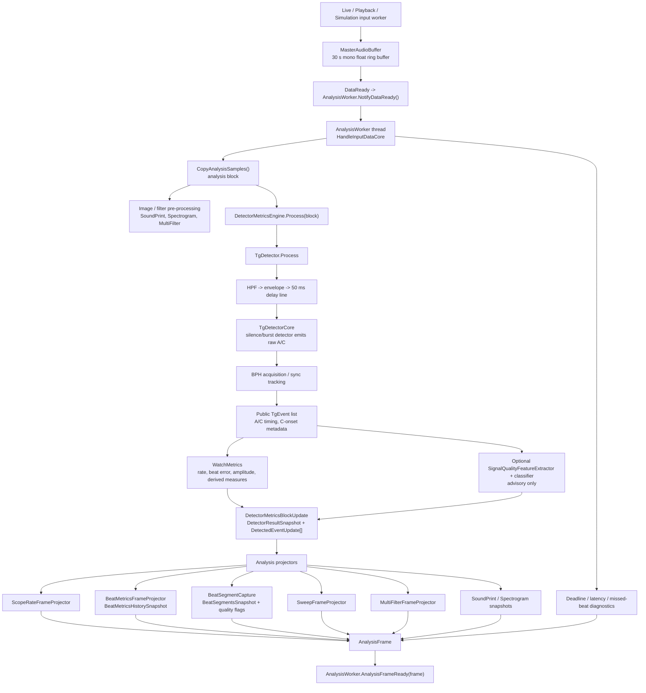
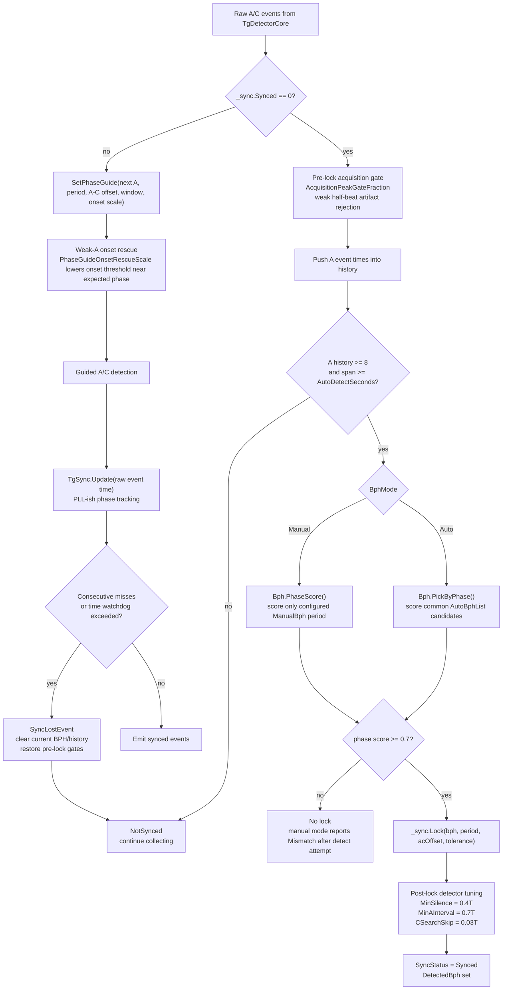
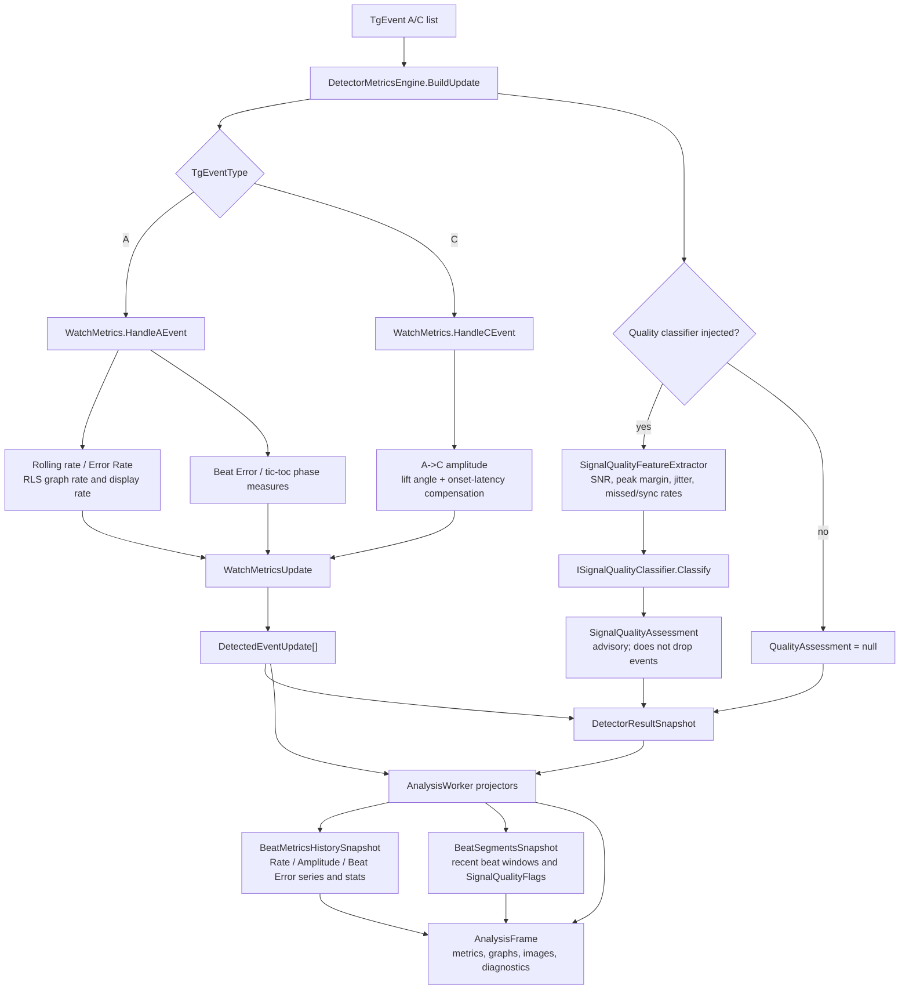
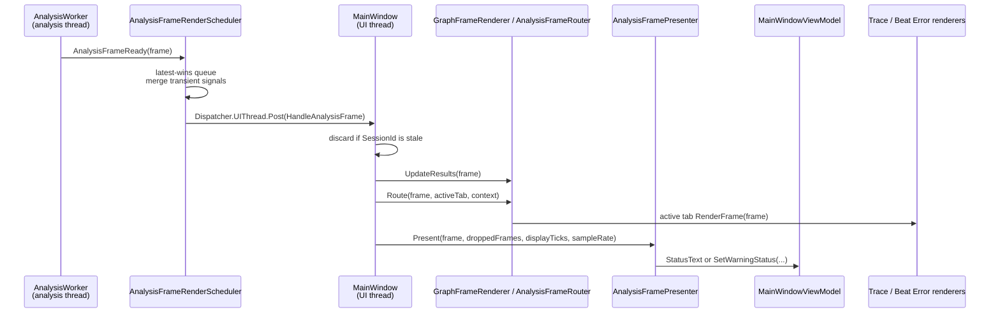
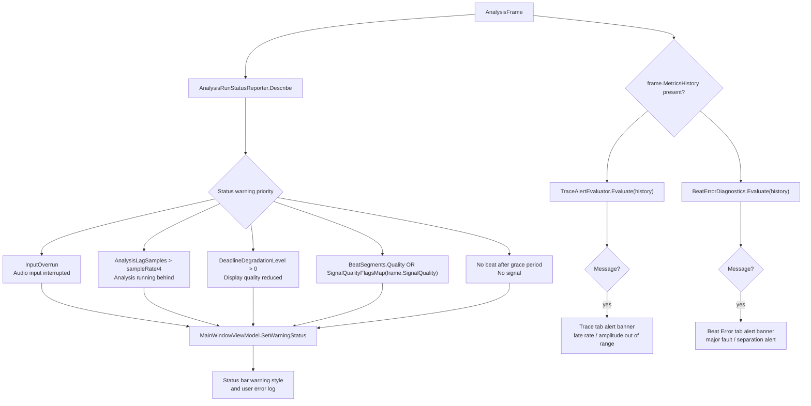
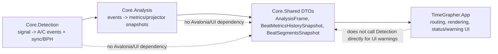

# Core Signal Processing and Warning Flow

이 문서는 `TimeGrapher.Core.Detection`과 `TimeGrapher.Core.Analysis`가 오디오 샘플을 BPH lock, post-lock 추적, 메트릭, `AnalysisFrame`으로 바꾸는 흐름과 App이 그 데이터를 받아 경고 UI를 표시하는 흐름을 요약한다. Mermaid 다이어그램은 실제 코드 경계에 맞춰 작성했다.

주요 코드 위치:

- `src/TimeGrapher.Core/Detection/TgDetector.cs`
- `src/TimeGrapher.Core/Detection/Detector.cs`
- `src/TimeGrapher.Core/Detection/Bph.cs`
- `src/TimeGrapher.Core/Analysis/DetectorMetricsEngine.cs`
- `src/TimeGrapher.Core/Analysis/AnalysisWorker.cs`
- `src/TimeGrapher.App/Services/AnalysisFramePresenter.cs`
- `src/TimeGrapher.App/Services/AnalysisRunStatusReporter.cs`
- `src/TimeGrapher.App/Rendering/TraceAlertEvaluator.cs`
- `src/TimeGrapher.App/Rendering/BeatErrorDiagnostics.cs`

## 1. Core 전체 파이프라인

`DetectorMetricsEngine`가 Detection과 Metrics의 공유 경계다. `TgDetector`는 raw A/C event와 sync 상태를 만들고, `WatchMetrics`는 lock된 BPH와 A/C event를 이용해 Error Rate, Amplitude, Beat Error, Avg. Period 구간을 계산한다. `AnalysisWorker`는 같은 block update를 여러 projector에 fan-out해서 한 번의 UI 갱신 단위인 `AnalysisFrame`으로 합친다.

## 2. BPH acquisition, manual BPH, lock 이후 처리

Manual BPH는 "즉시 lock"이 아니다. Auto 후보 목록 선택만 건너뛰고, 사용자가 지정한 BPH 하나에 대해 phase score를 계산한다. 충분한 A-event history가 쌓이고 score가 0.7 이상일 때만 `_sync.Lock(...)`이 호출된다.

Lock 이후에는 다음 변화가 생긴다.

- detector가 BPH period를 알기 때문에 silence gate와 A-to-A minimum interval을 더 강하게 제한한다.
- C-search skip이 beat period의 약 3%로 조정된다.
- 다음 block부터 `SetPhaseGuide(...)`가 예상 A phase 주변 window를 전달한다.
- `Weak-A onset rescue`는 별도 후처리 단계가 아니라 phase guide 안에서 onset threshold scale을 바꾸는 lock-aware detection 보정이다.
- sync loss가 발생하면 current BPH, event history, sync state를 지우고 pre-lock gate 값으로 되돌아간다.

## 3. A/C event에서 메트릭과 프레임으로 가는 흐름

`SignalQualityAssessment`와 `SignalQualityFlags`는 trust/warning annotation이다. 이 경로는 검출된 event나 metric을 제거하지 않는다. Per-beat geometry 경고는 `BeatSegmentCapture`가 `WeakSignal`, `NoisySignal`, `CTimingUnstable`, `PossibleFalseC`, `ClippedSignal` 같은 flags로 싣고, optional classifier는 window-level `SignalQualityAssessment`를 싣는다.

## 4. App으로 넘어간 뒤 경고 UI가 뜨는 흐름

경고 UI는 크게 두 계열이다.

상태바 경고는 active tab과 무관하게 `AnalysisFramePresenter`가 처리한다. 반면 Trace tab과 Beat Error tab의 alert banner는 해당 tab renderer가 `BeatMetricsHistorySnapshot`을 평가해서 표시한다. 둘 다 Core가 만든 같은 frame/history 데이터를 읽으므로 그래프 값과 경고 문구가 같은 source를 공유한다.

## 5. 경고별 데이터 출처

| 경고 UI | 평가 위치 | Core/App 데이터 | 조건 요약 |
|---|---|---|---|
| Status bar: audio interrupted | `AnalysisRunStatusReporter` | `AnalysisFrame.InputOverrun`, `InputSamplesDropped` | 입력 ring buffer overrun |
| Status bar: analysis behind | `AnalysisRunStatusReporter` | `AnalysisFrame.AnalysisLagSamples`, `ProcessingElapsedMs` | lag가 sample rate의 1/4초 초과 |
| Status bar: reduced quality | `AnalysisRunStatusReporter` | `AnalysisFrame.DeadlineDegradationLevel` | deadline monitor가 display quality degradation 적용 |
| Status bar: signal quality | `AnalysisRunStatusReporter` | `BeatSegmentsSnapshot.Quality`, `AnalysisFrame.SignalQuality` | per-beat flags와 classifier verdict를 OR |
| Status bar: no signal | `AnalysisRunStatusReporter` | `BeatSynced`, `BeatSegments`, `GraphTickEnd` | 일정 시간 beat/sync/segment 없음 |
| Trace tab banner | `TraceAlertEvaluator` | `BeatMetricsHistorySnapshot.RateSPerDay`, `AmplitudeDeg` | late-running 또는 amplitude 정상 밴드 이탈 |
| Beat Error tab banner | `BeatErrorDiagnostics` | `BeatMetricsHistorySnapshot.BeatErrorSignedMs`, `RateSPerDay`, `Bph` | tic/toc separation 초과 또는 slope major fault |

## 6. 책임 경계

Core는 UI를 모른다. 경고창/경고 배너 여부는 App이 `AnalysisFrame`과 그 안의 snapshot DTO를 읽어서 결정한다. Core 쪽 책임은 신호처리, BPH/sync 상태, metric, quality annotation을 UI-independent DTO로 내보내는 데서 끝난다.
