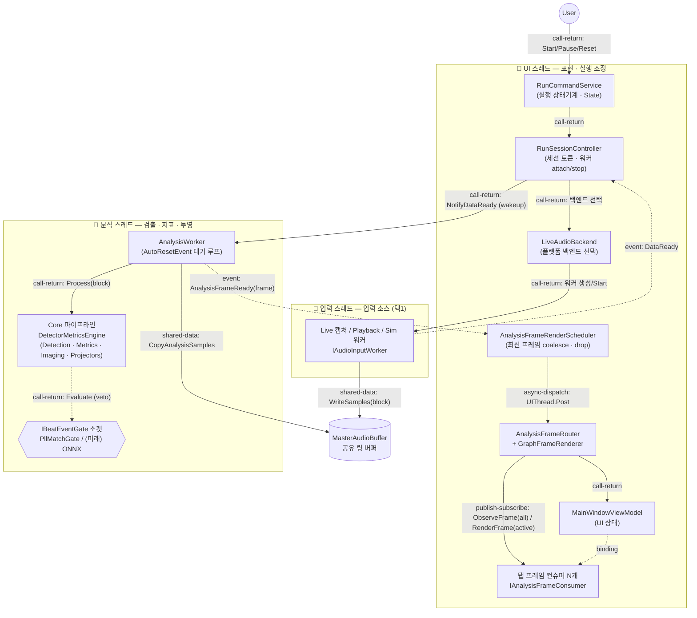

# 컴포넌트-커넥터 뷰 (C&C View)

이 문서는 TimeGrapherNet을 **Component-and-Connector(C&C) 관점**으로 본다. 모듈 분해 뷰가 정적인 소스 단위(프로젝트/폴더)를 다룬다면, 이 뷰는 **런타임에 실제로 존재하는 계산 단위(컴포넌트)**와 **그들이 상호작용하는 경로(커넥터)**를 보여준다. 따라서 박스는 클래스 파일이 아니라 실행 중 살아 있는 인스턴스(스레드, 워커, 공유 버퍼, 이벤트 채널)이고, 화살표는 `using` 관계가 아니라 **데이터·제어가 흐르는 런타임 연결**이다.

TimeGrapherNet의 런타임은 한 프로세스 안에서 **세 개의 동시 실행 스레드**로 나뉜다. 이 분리가 이 뷰의 골격이다.

- **입력 스레드** — 오디오 block을 만들어 공유 버퍼에 쓴다 (Live 캡처 / Playback / Simulation 중 하나).
- **분석 스레드** — 공유 버퍼에서 block을 읽어 검출·지표·프레임 투영을 수행하고 `AnalysisFrame`을 만든다.
- **UI 스레드** — 사용자 입력을 받아 실행을 조정하고, 분석 프레임을 화면에 렌더한다.

## 표기 기준 — 컴포넌트 타입과 커넥터 타입

### 컴포넌트 타입

| 타입 | 의미 | 표기 |
|---|---|---|
| 스레드 컴포넌트 | 자체 제어 흐름(thread)을 가진 능동 컴포넌트 | 굵은 테두리 `subgraph` |
| 처리 컴포넌트 | 스레드 안에서 호출되어 계산을 수행하는 수동 컴포넌트 | 일반 박스 |
| 공유-데이터 저장소 | 스레드 경계를 넘어 읽고/쓰는 데이터 보관 컴포넌트 | 원통(`[( )]`) |
| 소켓(확장점) | 런타임에 주입되는 선택적 컴포넌트 | 점선 박스 |

### 커넥터 타입

| 커넥터 | 의미 | 코드상의 실현 |
|---|---|---|
| **shared-data** | 한 컴포넌트가 쓰고 다른 컴포넌트가 읽는 공유 저장소 접근 | `MasterAudioBuffer.WriteSamples` / `CopyAnalysisSamples` |
| **event(notify)** | 생산자가 소비자에게 "데이터/상태 준비됨"을 알리는 비동기 신호 | `DataReady`, `AnalysisFrameReady` 이벤트 |
| **async-dispatch** | 스레드 경계를 넘겨 다른 스레드의 실행 큐로 작업을 옮김 | `Dispatcher.UIThread.Post` |
| **call-return** | 동기 프로시저 호출(생성/시작/중지/처리) | 메서드 호출 |
| **publish-subscribe** | 한 프레임을 등록된 다수 소비자에게 fan-out | `AnalysisFrameRouter.Route` → consumers |

## C&C 다이어그램

> 굵은 점선 이벤트 화살표(`DataReady`, `AnalysisFrameReady`)가 **스레드 경계를 넘는 핵심 비동기 커넥터**다. 공유-데이터 커넥터(`MasterAudioBuffer`)는 입력 스레드와 분석 스레드를 **시간적으로 분리(decouple)**한다. `Dispatcher.UIThread.Post`는 분석 스레드에서 UI 스레드로 제어를 넘기는 유일한 합법 경로다.

## 컴포넌트 카탈로그

| 컴포넌트 | 스레드 | 종류 | 런타임 책임 | 코드 위치 |
|---|---|---|---|---|
| `RunCommandService` | UI | 처리 | 실행 생명주기 상태기계(State 패턴): Stopped/Starting/Running/Paused/Stopping/StopFailed | `Services/RunCommandService.cs`, `RunCommandService.States.cs` |
| `RunSessionController` | UI | 처리 | 세션 토큰 발급, 입력/분석 워커 attach·stop, `DataReady`→`NotifyDataReady` 중계, 공유 버퍼 생성 | `Services/RunSessionController.cs` |
| `LiveAudioBackend` | UI | 처리 | `#if` 상수로 OS별 라이브 워커 선택·생성 | `Audio/LiveAudioBackend.cs` |
| 입력 워커 | **입력** | 스레드 | 한 가지 소스에서 block 생성: `AudioCaptureWorker`(Win/NAudio), `LinuxLiveAudioWorker`(PipeWire/ALSA), `PlaybackWorker`(WAV), `SimWorker`(합성) | `Platform.*`, `Core/AudioIo`, `Core/Sim` |
| `MasterAudioBuffer` | (공유) | 공유-데이터 | 입력 스레드가 쓰고 분석 스레드가 읽는 오디오 링 버퍼 | `Core/Shared/MasterAudioBuffer.cs` |
| `AnalysisWorker` | **분석** | 스레드 | `AutoResetEvent` 대기 루프, block당 1 프레임 생성, `AnalysisFrameReady` 발행 | `Core/Analysis/AnalysisWorker.cs` |
| Core 파이프라인 | 분석 | 처리 | `DetectorMetricsEngine`이 검출·지표·이미징·프레임 투영을 조율 | `Core/Analysis`, `Core/Detection`, `Core/Metrics`, `Core/Imaging` |
| `IBeatEventGate` 소켓 | 분석 | 소켓 | 지표 초크포인트의 veto 전용 게이트. 현재 `PllMatchGate`, 미래 ONNX 추론 게이트 주입 | `Core/Detection/Scoring` |
| `AnalysisFrameRenderScheduler` | UI | 처리 | UI 스레드에서 최신 프레임만 유지(coalesce)하고 초과분 drop 계측 | `Services/AnalysisFrameRenderScheduler.cs` |
| `AnalysisFrameRouter` + `GraphFrameRenderer` | UI | 처리 | 프레임을 전 컨슈머에 `ObserveFrame`, 활성 탭에만 `RenderFrame` | `Tabs/AnalysisFrameRouter.cs` |
| 탭 프레임 컨슈머 | UI | 처리 | 탭별 그래프/이미지 렌더 (`IAnalysisFrameConsumer`) | `Rendering/`, `Tabs/` |
| `MainWindowViewModel` | UI | 처리 | UI 상태(실행 상태, 선택 위치, 리뷰 바 등) 보유·바인딩 | `ViewModels/MainWindowViewModel.cs` |

## 커넥터 카탈로그

| # | 커넥터 | 타입 | 양단(생산자 → 소비자) | 역할 |
|---|---|---|---|---|
| C1 | `MasterAudioBuffer` 접근 | shared-data | 입력 워커 → 분석 워커 | 입력/분석을 시간적으로 분리하는 생산자-소비자 링 버퍼 |
| C2 | `DataReady` | event(notify) | 입력 워커 → `RunSessionController` | "새 block 있음" 신호. 세션 토큰으로 stale 콜백 필터 |
| C3 | `NotifyDataReady` (wakeup) | call-return | `RunSessionController` → `AnalysisWorker` | `AutoResetEvent`를 set해 분석 스레드를 깨움 |
| C4 | `Process(block)` | call-return | `AnalysisWorker` → Core 파이프라인 | 검출·지표·프레임 투영 동기 실행 |
| C5 | 게이트 `Evaluate` | call-return | 파이프라인 → `IBeatEventGate` | veto 전용 비트 이벤트 게이팅(주입형) |
| C6 | `AnalysisFrameReady` | event(notify) | `AnalysisWorker` → `AnalysisFrameRenderScheduler` | 완성 프레임을 분석 스레드에서 발행 |
| C7 | `Dispatcher.UIThread.Post` | async-dispatch | 스케줄러 → UI 스레드 | 분석 스레드 → UI 스레드 마샬링 |
| C8 | `Route` | publish-subscribe | 라우터 → N개 컨슈머 | 전 컨슈머 `ObserveFrame`, 활성 탭만 `RenderFrame` |
| C9 | 실행 명령 | call-return | User → `RunCommandService` → `RunSessionController` → `LiveAudioBackend`/워커 | Start/Pause/Reset로 워커 생성·시작·중지 |

## 데이터 흐름 요약 — 한 프레임의 생애

1. 입력 워커가 block을 `MasterAudioBuffer`에 **쓴다**(C1) → `DataReady`를 **발행**(C2).
2. `RunSessionController`가 세션 토큰을 확인하고 분석 워커를 **깨운다**(C3).
3. 분석 워커가 버퍼에서 block을 **읽고**(C1) Core 파이프라인을 **호출**(C4), 필요 시 게이트로 veto(C5) → `AnalysisFrame` 완성.
4. `AnalysisFrameReady` **발행**(C6) → 스케줄러가 최신 프레임만 남기고 `UIThread.Post`로 **마샬링**(C7).
5. UI 스레드에서 라우터가 프레임을 전 컨슈머에 fan-out하고 활성 탭만 렌더(C8).

## 제약과 근거

| 제약 | 근거 (관련 뷰·tactic) |
|---|---|
| Core 컴포넌트는 UI/플랫폼 컴포넌트를 **호출하지 않는다** | `AnalysisWorker`·파이프라인은 `AnalysisFrameReady` **이벤트만** 발행하고 소비자를 모른다. Core 무의존 원칙(Module Uses View) |
| 스레드 경계는 **이벤트 + 공유-데이터 + async-dispatch 커넥터로만** 넘는다 | 직접 메서드 호출로 다른 스레드 객체를 만지지 않는다. UI 갱신은 반드시 `Dispatcher.UIThread.Post` 경유 |
| 입력↔분석은 **공유 버퍼로 분리** | `introduce concurrency` tactic: UI가 느려도 검출이 지연되지 않음 (SAP Tactics §5.1) |
| 늦게 도착한 이벤트는 **세션 토큰으로 폐기** | `timestamp` tactic: `_runSessionToken`/`AnalysisSessionId`로 이전 실행의 stale 콜백 차단 (SAP Tactics §변경/가용성) |
| 프레임 백프레셔는 **최신 1개만 유지** | `AnalysisFrameRenderScheduler`가 초과 프레임 drop, `Route`는 활성 탭만 렌더 — `schedule resources`·`limit event response` tactic |
| 검출 게이트는 **소켓으로 주입** | `IBeatEventGate`는 런타임 주입형 컴포넌트라 Core에 신규 프로젝트 엣지를 만들지 않음 (미래 ONNX 게이트 확장점) |

## 다른 뷰와의 관계

- **모듈 분해 뷰 / 모듈 사용 뷰**: 정적 소스 단위와 `uses` 관계를 다룬다. 이 C&C 뷰의 컴포넌트는 그 모듈들이 런타임에 인스턴스화된 모습이고, 커넥터는 `uses` 엣지 중 **실제로 제어/데이터가 흐르는 경로**만 남긴 것이다.
- **계층 뷰**: 어떤 컴포넌트가 어떤 컴포넌트를 사용할 수 있는지의 허용 관계를 준다. C&C는 그중 런타임에 실현된 상호작용을 보여준다.
- **MVC 뷰**: View/Controller/Model 역할 분담을 다룬다. C&C의 UI 스레드 컴포넌트는 View+Controller, 분석/입력 스레드와 공유 버퍼는 Model에 해당한다.
- **실행 수명주기 시퀀스 뷰**: 이 뷰의 커넥터들이 시간 순서로 어떻게 호출되는지를 trace로 보여준다. C1~C9 커넥터의 동적 순서가 그 시퀀스다.
- **SAP Tactics 분석**: 위 제약 표의 각 tactic(`introduce concurrency`, `timestamp`, `schedule resources`, `bound queue sizes`)이 이 C&C 구조로 실현된다.
