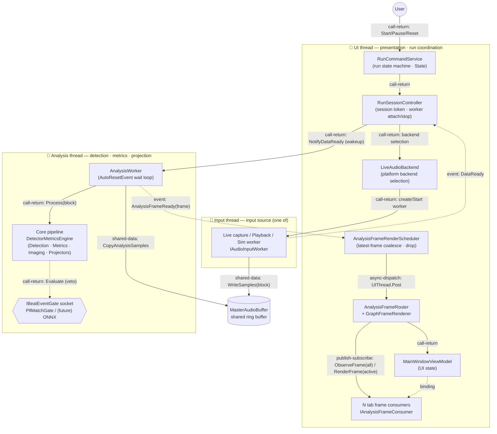

# Component-and-Connector View (C&C View)

This document looks at TimeGrapherNet through a **Component-and-Connector (C&C) lens**. Where the module decomposition view deals with static source units (projects/folders), this view shows the **units of computation that actually exist at runtime (components)** and the **paths through which they interact (connectors)**. So a box here is not a class file but a live instance during execution (a thread, a worker, a shared buffer, an event channel), and an arrow is not a `using` relationship but a **runtime connection along which control and data flow**.

At runtime TimeGrapherNet runs as **three concurrent threads** inside a single process. That split is the skeleton of this view.

- **Input thread** — produces audio blocks and writes them into the shared buffer (one of Live capture / Playback / Simulation).
- **Analysis thread** — reads blocks from the shared buffer, runs detection / metrics / frame projection, and produces an `AnalysisFrame`.
- **UI thread** — takes user input, coordinates the run, and renders analysis frames to the screen.

## Notation — Component Types and Connector Types

### Component types

| Type | Meaning | Notation |
|---|---|---|
| Thread component | Active component with its own thread of control | bold-bordered `subgraph` |
| Processing component | Passive component invoked within a thread to compute | plain box |
| Shared-data store | Data store read/written across thread boundaries | cylinder (`[( )]`) |
| Socket (extension point) | Optional component injected at runtime | dashed/hexagon box |

### Connector types

| Connector | Meaning | Realization in code |
|---|---|---|
| **shared-data** | Access to a shared store one component writes and another reads | `MasterAudioBuffer.WriteSamples` / `CopyAnalysisSamples` |
| **event (notify)** | Asynchronous signal from a producer telling a consumer "data/state is ready" | `DataReady`, `AnalysisFrameReady` events |
| **async-dispatch** | Hands work across a thread boundary onto another thread's execution queue | `Dispatcher.UIThread.Post` |
| **call-return** | Synchronous procedure call (create/start/stop/process) | method call |
| **publish-subscribe** | Fans one frame out to multiple registered consumers | `AnalysisFrameRouter.Route` → consumers |

## C&C Diagram

> The bold dashed event arrows (`DataReady`, `AnalysisFrameReady`) are the **key asynchronous connectors that cross thread boundaries**. The shared-data connector (`MasterAudioBuffer`) **temporally decouples** the input thread from the analysis thread. `Dispatcher.UIThread.Post` is the only legal path that hands control from the analysis thread to the UI thread.

## Component Catalog

| Component | Thread | Kind | Runtime responsibility | Code location |
|---|---|---|---|---|
| `RunCommandService` | UI | processing | Run lifecycle state machine (State pattern): Stopped/Starting/Running/Paused/Stopping/StopFailed | `Services/RunCommandService.cs`, `RunCommandService.States.cs` |
| `RunSessionController` | UI | processing | Issues session tokens, attaches/stops input & analysis workers, relays `DataReady`→`NotifyDataReady`, creates the shared buffer | `Services/RunSessionController.cs` |
| `LiveAudioBackend` | UI | processing | Selects/creates the OS-specific live worker via `#if` constants | `Audio/LiveAudioBackend.cs` |
| Input worker | **Input** | thread | Produces blocks from one source: `AudioCaptureWorker` (Win/NAudio), `LinuxLiveAudioWorker` (PipeWire/ALSA), `PlaybackWorker` (WAV), `SimWorker` (synthetic) | `Platform.*`, `Core/AudioIo`, `Core/Sim` |
| `MasterAudioBuffer` | (shared) | shared-data | Audio ring buffer written by the input thread and read by the analysis thread | `Core/Shared/MasterAudioBuffer.cs` |
| `AnalysisWorker` | **Analysis** | thread | `AutoResetEvent` wait loop, one frame per block, publishes `AnalysisFrameReady` | `Core/Analysis/AnalysisWorker.cs` |
| Core pipeline | Analysis | processing | `DetectorMetricsEngine` orchestrates detection, metrics, imaging, and frame projection | `Core/Analysis`, `Core/Detection`, `Core/Metrics`, `Core/Imaging` |
| `IBeatEventGate` socket | Analysis | socket | Veto-only gate at the metrics choke point. Currently `PllMatchGate`; a future ONNX inference gate is injected here | `Core/Detection/Scoring` |
| `AnalysisFrameRenderScheduler` | UI | processing | Keeps only the latest frame on the UI thread (coalesce) and meters dropped excess | `Services/AnalysisFrameRenderScheduler.cs` |
| `AnalysisFrameRouter` + `GraphFrameRenderer` | UI | processing | `ObserveFrame` to all consumers, `RenderFrame` only to the active tab | `Tabs/AnalysisFrameRouter.cs` |
| Tab frame consumers | UI | processing | Per-tab graph/image rendering (`IAnalysisFrameConsumer`) | `Rendering/`, `Tabs/` |
| `MainWindowViewModel` | UI | processing | Holds and binds UI state (run state, selected position, review bar, etc.) | `ViewModels/MainWindowViewModel.cs` |

## Connector Catalog

| # | Connector | Type | Endpoints (producer → consumer) | Role |
|---|---|---|---|---|
| C1 | `MasterAudioBuffer` access | shared-data | input worker → analysis worker | Producer-consumer ring buffer that temporally decouples input from analysis |
| C2 | `DataReady` | event (notify) | input worker → `RunSessionController` | "New block available" signal; stale callbacks filtered by session token |
| C3 | `NotifyDataReady` (wakeup) | call-return | `RunSessionController` → `AnalysisWorker` | Sets the `AutoResetEvent` to wake the analysis thread |
| C4 | `Process(block)` | call-return | `AnalysisWorker` → Core pipeline | Synchronous detection · metrics · frame projection |
| C5 | gate `Evaluate` | call-return | pipeline → `IBeatEventGate` | Veto-only beat-event gating (injected) |
| C6 | `AnalysisFrameReady` | event (notify) | `AnalysisWorker` → `AnalysisFrameRenderScheduler` | Publishes the finished frame from the analysis thread |
| C7 | `Dispatcher.UIThread.Post` | async-dispatch | scheduler → UI thread | Marshals analysis thread → UI thread |
| C8 | `Route` | publish-subscribe | router → N consumers | `ObserveFrame` to all consumers, `RenderFrame` only to the active tab |
| C9 | run commands | call-return | User → `RunCommandService` → `RunSessionController` → `LiveAudioBackend`/worker | Start/Pause/Reset create, start, and stop workers |

## Data-Flow Summary — Life of One Frame

1. The input worker **writes** a block to `MasterAudioBuffer` (C1) → **publishes** `DataReady` (C2).
2. `RunSessionController` checks the session token and **wakes** the analysis worker (C3).
3. The analysis worker **reads** the block from the buffer (C1), **calls** the Core pipeline (C4), vetoes via the gate if needed (C5) → an `AnalysisFrame` is produced.
4. **Publishes** `AnalysisFrameReady` (C6) → the scheduler keeps only the latest frame and **marshals** it via `UIThread.Post` (C7).
5. On the UI thread the router fans the frame out to all consumers and renders only the active tab (C8).

## Constraints and Rationale

| Constraint | Rationale (related view · tactic) |
|---|---|
| Core components **do not call** UI/platform components | `AnalysisWorker` and the pipeline **only publish** the `AnalysisFrameReady` event and know nothing of their consumers. Core no-dependency principle (Module Uses View) |
| Thread boundaries are crossed **only by event + shared-data + async-dispatch connectors** | No other thread's objects are touched by a direct method call. UI updates always go through `Dispatcher.UIThread.Post` |
| Input↔analysis are **decoupled by a shared buffer** | `introduce concurrency` tactic: detection is not delayed even when the UI is slow (SAP Tactics §5.1) |
| Late-arriving events are **discarded by session token** | `timestamp` tactic: `_runSessionToken`/`AnalysisSessionId` block stale callbacks from a previous run (SAP Tactics §modifiability/availability) |
| Frame back-pressure **keeps only the latest one** | `AnalysisFrameRenderScheduler` drops excess frames; `Route` renders only the active tab — `schedule resources` · `limit event response` tactics |
| The detection gate is **injected as a socket** | `IBeatEventGate` is a runtime-injected component, so it adds no new project edge to Core (future ONNX-gate extension point) |

## Relationship to Other Views

- **Module Decomposition View / Module Uses View**: deal with static source units and `uses` relationships. The components in this C&C view are those modules instantiated at runtime, and the connectors keep only the `uses` edges along which control/data **actually flows**.
- **Layered View**: gives the allowed "can-use" relationships among components. C&C shows which of those interactions are realized at runtime.
- **MVC View**: covers the View/Controller/Model role split. The UI-thread components here are View+Controller; the analysis/input threads and the shared buffer are the Model.
- **Run Lifecycle Sequence View**: shows, as a trace, how these connectors are invoked in time order. The dynamic ordering of connectors C1–C9 is that sequence.
- **SAP Tactics Analysis**: each tactic in the constraints table above (`introduce concurrency`, `timestamp`, `schedule resources`, `bound queue sizes`) is realized by this C&C structure.
