# 데이터 모델 뷰

TimeGrapherNet은 데이터베이스가 없다. 유일하게 영속되는 도메인 요소는 WAV 파일이고, 나머지는 실행 중 생성·전달·렌더링되는 런타임 도메인 데이터 구조다. 아래 클래스 다이어그램은 주요 데이터 엔티티와 그 관계(1:1, 1:n, 집약/합성, 일반화/특수화)를 보여준다.

> 개념(conceptual) 노드 안내: `AnalysisRun`, `AudioSource` 및 그 특수화(`LiveAudioSource`/`PlaybackSource`/`SimSource`)는 단일 실재 클래스가 아니다. 한 번의 분석 세션 수명주기와 입력 소스 종류를 나타내는 도메인 개념으로, 실제로는 `AnalysisWorker`·`RunCommandService`·세 입력 워커(`AudioCaptureWorker`/`LinuxLiveAudioWorker`, `PlaybackWorker`, `SimWorker`)와 `RunCommandMode` 열거형에 분산되어 구현된다. 이들 노드의 속성은 실제 설정/런타임 사용에 근거한 표시용이다.

```mermaid
classDiagram
direction TB

class AnalysisRun {
    <<conceptual>>
    +ulong SessionId
    +RunCommandMode Mode
}

class AnalysisRunSettings {
    +int SampleRate
    +double LiftAngle
    +int AveragingPeriod
    +bool UseCOnset
    +bool AutoBph
    +int ManualBph
    +double HpfCutoffHz
    +int SoundImageWidth
    +int SoundImageHeight
    +int ScopeSnapshotPointBudget
    +bool PllEventVeto
}

class AudioSource {
    <<conceptual>>
}

class LiveAudioSource {
    <<conceptual>>
    +double Gain
}

class PlaybackSource {
    <<conceptual>>
    +string FilePath
}

class SimSource {
    <<conceptual>>
    +double Bph
    +double RateErrorSPerDay
    +double BeatErrorMs
}

class LiveAudioDevice {
    +int Number
    +string Name
}

class WatchSynthStreamConfig {
    +uint SampleRateHz
    +double Bph
    +double RateErrorSPerDay
    +double BeatErrorMs
    +double WatchAmplitudeDegrees
    +double LiftAngleDegrees
    +int EnableRealisticPacket
    +double ImpulseNoiseRatePerSecond
    +음향/노이즈/패킷 모델 등 다수 필드 생략
}

class WavFile {
    <<conceptual>>
    +string Path
    +RIFF/WAVE 바이트
}

class WavFormatInfo {
    +ushort AudioFormat
    +ushort NumChannels
    +int SampleRate
    +uint ByteRate
    +ushort BlockAlign
    +ushort BitsPerSample
    +long DataOffset
    +uint DataSize
}

class WavData {
    +int SampleRate
    +float[] Samples
}

class MasterAudioBuffer {
    +const int Channels = 1
    +const int SecondsOfBuffer = 30
    +WriteSamples()
    +CopyAnalysisSamples()
    +TryGetCaptureTimestamp()
}

class AnalysisFrame {
    +ulong SessionId
    +ulong SourceId
    +int SampleRate
    +bool InputOverrun
    +ulong InputSamplesDropped
    +ulong PendingSamples
    +ulong AnalysisLagSamples
    +double ProcessingElapsedMs
    +int DeadlineDegradationLevel
    +long CaptureTimestamp
    +bool CaptureTimestampIsLowerBound
    +long ProcessingCompletedTimestamp
    +ulong MissedBeats
    +uint SyncLossCount
    +bool BeatSynced
    +ulong GraphTickEnd
    +bool SoundImageUpdated
    +bool SpectrogramImageUpdated
    +int SpectrogramLiveColumn
    +long SpectrogramTotalColumns
    +double SpectrogramColumnSeconds
    +double SpectrogramBeatPeriodS
    +bool ForegroundStatsUpdated
    +double BackgroundFps/Sps/Spf
    +double ForegroundFps/Sps/Spf
}

class GraphSeriesFrame {
    +string Id
    +IReadOnlyList~double~ X
    +IReadOnlyList~double~ Y
    +bool Replace
}

class ScopeVerticalMarker {
    +double X
    +double Height
    +uint Color
}

class ScopeHorizontalMarker {
    +HorizontalMarkerDirection Direction
    +double XLeft
    +double XRight
    +double Length
    +double Height
    +uint Color
}

class ScopeTextMarker {
    +double X
    +double Height
    +string Text
    +uint Color
    +MarkerTextAlignment Alignment
}

class WatchMetricsUpdate {
    +bool TicRateUpdated
    +bool TocRateUpdated
    +IReadOnlyList~double~ XTic/YTic
    +IReadOnlyList~double~ XToc/YToc
    +bool ResultsUpdated
    +string ResultsText
    +string CMarkerText
    +bool BeatTimingSampleUpdated
    +BeatTimingSample BeatTimingSample
    +bool AmplitudeSampleUpdated
    +AmplitudeSample AmplitudeSample
    +bool DerivedMeasuresUpdated
    +DerivedTimingMeasures DerivedMeasures
}

class BeatTimingSample {
    +ulong BeatNumber
    +double TimeS
    +bool IsTic
    +double RateErrorMs
    +bool RateValid
    +double RateSPerDay
    +bool BeatErrorValid
    +double BeatErrorSignedMs
    +int Bph
}

class AmplitudeSample {
    +double TimeS
    +bool InstantValid
    +double InstantDeg
    +bool PairAverageUpdated
    +double PairAverageDeg
}

class DerivedTimingMeasures {
    +bool DiffTicTacValid
    +double DiffTicTacMs
    +bool DiffPeriodValid
    +double DiffPeriodMs
    +bool AvgPeriodValid
    +double AvgPeriodMs
}

class BeatMetricsHistorySnapshot {
    +ulong Version
    +MetricsHistorySeries Rate
    +MetricsHistorySeries Amplitude
    +MetricsHistorySeries BeatError
    +DerivedTimingMeasures Derived
    +bool RateValid
    +double RateSPerDay
    +int Bph
    +bool AmplitudeValid
    +double AmplitudeDeg
    +bool BeatErrorValid
    +double BeatErrorSignedMs
    +double LatestTimeS
    +double StatsElapsedS
    +StatsSummary RateStats
    +StatsSummary AmplitudeStats
    +WatchPosition ActivePosition
    +IReadOnlyList~PositionSummary~ Positions
    +IReadOnlyList~PositionChange~ PositionChanges
}

class WatchPosition {
    <<enumeration>>
    CH
    CB
    P6H
    P9H
    P3H
    P12H
    P6H45
    P9H45
    P3H45
    P12H45
}

class PositionSummary {
    +WatchPosition Position
    +StatsSummary Rate
    +StatsSummary Amplitude
    +StatsSummary BeatError
}

class PositionChange {
    +double TimeS
    +WatchPosition Position
}

class StatsSummary {
    +bool Valid
    +double Min
    +double Max
    +double Mean
    +double Sigma
    +long Count
}

class MetricsHistorySeries {
    +IReadOnlyList~double~ X
    +IReadOnlyList~double~ Y
    +IReadOnlyList~double~ YMin
    +IReadOnlyList~double~ YMax
}

class BeatSegmentsSnapshot {
    +ulong Version
    +IReadOnlyList~BeatSegment~ Segments
    +double LiftAngleDeg
    +BeatNoiseAverageSnapshot Average
}

class BeatSegment {
    +ReadOnlyMemory~float~ Samples
    +bool RawValid
    +ReadOnlyMemory~float~ RawMin
    +ReadOnlyMemory~float~ RawMax
    +double MsPerPoint
    +double StartTimeS
    +bool IsTic
    +double AOffsetMs
    +float PeakValue
    +bool CPeakValid
    +double CPeakOffsetMs
    +bool COnsetValid
    +double COnsetOffsetMs
}

class BeatNoiseAverageSnapshot {
    +bool SigmaEnabled
    +bool Frozen
    +int IntervalsPerLane
    +double MsPerPoint
    +int Lane1Count
    +int Lane2Count
    +IReadOnlyList~float~ Lane1
    +IReadOnlyList~float~ Lane2
    +double Lane1MeanPeak
    +double Lane2MeanPeak
    +IReadOnlyList~BeatNoiseAverageMilestone~ Milestones
}

class BeatNoiseAverageMilestone {
    +int IntervalCount
    +IReadOnlyList~float~ Lane1
    +IReadOnlyList~float~ Lane2
}

class PixelBuffer {
    +int Width
    +int Height
    +uint[] Pixels
}

class TgConfig {
    +double SampleRate
    +TgBphMode BphMode
    +int ManualBph
    +double HpfCutoffHz
    +double EnvelopeSmoothMs
    +double SyncTolerancePct
    +double AutoDetectSeconds
    +int SyncLossMisses
    +double PllPeriodGain
    +double PllAcGain
    +double OnsetFractionInit
    +double MinPeakFractionInit
    +bool SuppressPreSyncEvents
    +TgCPlacement CPlacement
    +bool TrackEventPllMatch
}

class TgResult {
    +TgSyncStatus SyncStatus
    +int DetectedBph
    +double MeasuredPeriodS
    +List~TgEvent~ Events
    +float[] ProcessedPcm
    +int ProcessedPcmLen
    +ulong ProcessedPcmStartSample
    +bool SyncLostEvent
    +bool SyncAcquiredEvent
    +bool DetectorResetEvent
    +float OnsetThreshold
    +float MinPeakThreshold
    +float NoiseFloor
    +float ReferencePeak
}

class TgEvent {
    +double TimeSeconds
    +ulong SampleIndex
    +double SubSampleOffset
    +float PeakValue
    +TgEventType Type
    +bool IsPreSync
    +ulong OnsetSampleIndex
    +double OnsetSubSampleOffset
    +double OnsetTimeSeconds
    +bool OnsetValid
}

class DetectorResultSnapshot {
    +TgSyncStatus SyncStatus
    +int DetectedBph
    +double MeasuredPeriodS
    +IReadOnlyList~TgEvent~ Events
    +float[] ProcessedPcm
    +int ProcessedPcmLen
    +ulong ProcessedPcmStartSample
    +bool SyncLostEvent
    +bool SyncAcquiredEvent
    +bool DetectorResetEvent
    +float OnsetThreshold/MinPeakThreshold
    +float NoiseFloor/ReferencePeak
    +ulong MissedBeats
    +uint SyncLossCount
    +ulong VetoedEvents
}

class DetectorMetricsBlockUpdate {
    +DetectorResultSnapshot Result
    +IReadOnlyList~DetectedEventUpdate~ DisplayEvents
    +IReadOnlyList~DetectedEventUpdate~ MetricsEvents
}

class DetectedEventUpdate {
    +TgEvent Event
    +double EventSample
    +WatchMetricsUpdate MetricsUpdate
}

class BeatCandidate {
    +TgEvent Event
    +bool Synced
    +int DetectedBph
    +double BeatPeriodS
    +float NoiseFloor
    +float ReferencePeak
    +bool PllMatched
}

class BeatEventGateConfig {
    +IBeatEventGate Gate
}

AudioSource <|-- LiveAudioSource
AudioSource <|-- PlaybackSource
AudioSource <|-- SimSource

AnalysisRun "1" *-- "1" AnalysisRunSettings : 설정으로 사용
AnalysisRun "1" *-- "1" AudioSource : 입력 소스 선택
AnalysisRun "1" *-- "1" MasterAudioBuffer : 소유
AnalysisRun "1" o-- "0..*" AnalysisFrame : 생성

LiveAudioSource "1" --> "1" LiveAudioDevice : 캡처 대상
PlaybackSource "1" --> "1" WavFile : 읽음
SimSource "1" *-- "1" WatchSynthStreamConfig : 합성 파라미터

WavFile "1" *-- "1" WavFormatInfo : 포맷 포함
WavFile "1" --> "0..1" WavData : 디코딩 결과
WavData "1" --> "0..*" MasterAudioBuffer : 샘플 공급
MasterAudioBuffer "1" --> "0..*" TgResult : 분석 입력

TgConfig "1" --> "0..*" TgResult : 검출 설정
TgResult "1" *-- "0..*" TgEvent : 이벤트 목록
TgConfig "1" --> "0..*" DetectorMetricsBlockUpdate : 엔진 설정에 반영
DetectorMetricsBlockUpdate "1" *-- "1" DetectorResultSnapshot : 원검출 스냅샷
DetectorMetricsBlockUpdate "1" o-- "0..*" DetectedEventUpdate : 표시/메트릭 이벤트
DetectedEventUpdate "1" *-- "1" WatchMetricsUpdate : 이벤트별 메트릭
BeatEventGateConfig "1" --> "0..*" BeatCandidate : 게이트 판정 입력

AnalysisFrame "1" *-- "0..*" GraphSeriesFrame : 스코프/레이트 시리즈
AnalysisFrame "1" *-- "0..*" ScopeVerticalMarker : 수직 마커
AnalysisFrame "1" *-- "0..*" ScopeHorizontalMarker : 수평 마커
AnalysisFrame "1" *-- "0..*" ScopeTextMarker : 텍스트 마커
AnalysisFrame "1" *-- "1" WatchMetricsUpdate : 수치 결과
AnalysisFrame "1" o-- "0..1" PixelBuffer : 사운드 이미지
AnalysisFrame "1" o-- "0..1" PixelBuffer : 스펙트로그램 이미지
AnalysisFrame "1" o-- "0..1" BeatMetricsHistorySnapshot : 누적 이력 공유
AnalysisFrame "1" o-- "0..1" BeatSegmentsSnapshot : 최근 비트 윈도우 공유

WatchMetricsUpdate "1" *-- "1" BeatTimingSample : A 이벤트별(Updated 플래그)
WatchMetricsUpdate "1" *-- "1" AmplitudeSample : C 이벤트별(Updated 플래그)
WatchMetricsUpdate "1" *-- "1" DerivedTimingMeasures : A 이벤트별(Updated 플래그)
BeatMetricsHistorySnapshot "1" *-- "3" MetricsHistorySeries : rate/amplitude/beat error
BeatMetricsHistorySnapshot "1" *-- "2" StatsSummary : 현재 위치 안정도 통계
BeatMetricsHistorySnapshot "1" --> "1" WatchPosition : 신규 비트 태깅
BeatMetricsHistorySnapshot "1" *-- "0..10" PositionSummary : 측정된 위치만
BeatMetricsHistorySnapshot "1" *-- "0..*" PositionChange : 위치 전환 이력(시작 포함, 시간순)
PositionSummary "1" --> "1" WatchPosition : 위치 식별
PositionChange "1" --> "1" WatchPosition : 전환 후 위치
PositionSummary "1" *-- "3" StatsSummary : rate/amplitude/beat error
BeatSegmentsSnapshot "1" o-- "0..8" BeatSegment : 최근 비트(최대 8), 오래된 순
BeatSegmentsSnapshot "1" *-- "1" BeatNoiseAverageSnapshot : Scope 2 레인 상태
BeatNoiseAverageSnapshot "1" *-- "0..5" BeatNoiseAverageMilestone : 10/20/30/40/50 중간 평균 스냅샷
```

## 엔티티 요약

| 엔티티 | 소속 | 의미 |
|---|---|---|
| `WavFile`, `WavFormatInfo`, `WavData` | `Core.AudioIo` | 영속/디코딩된 오디오 데이터. 재생·녹음·검증에 사용. `WavFile`은 개념 노드(파일 자체) |
| `AnalysisRunSettings` | `TimeGrapher.App` | 사용자가 고른 실행 파라미터(`AnalysisWorker.Config`로 변환). `PllEventVeto`가 켜지면 `PllMatchGate`를 연결한다(적응형 floor·regime guard는 기본 동작) |
| `AudioSource` 특수화 | App 실행 모드 / Core 워커 | 라이브 마이크, WAV 재생, 합성 신호 입력. 단일 클래스가 아니라 `RunCommandMode`와 세 워커로 표현되는 개념 |
| `LiveAudioDevice` | `Core.Shared` | 라이브 입력 장치(번호/이름) |
| `WatchSynthStreamConfig` | `Core.Sim` | 합성 워치 스트림 설정. BPH·레이트오차·비트오차·진폭/리프트각 외에 패킷·공진·노이즈·임펄스 모델 등 다수 필드. 다이어그램은 대표 필드만 표시 |
| `MasterAudioBuffer` | `Core.Shared` | 입력 워커(쓰기)와 분석 워커(읽기) 간 공유 모노 float 링버퍼(30초). 입력 throughput 카운터와 지연 보고용 캡처 타임스탬프 조회 제공 |
| `TgConfig`, `TgResult`, `TgEvent` | `Core.Detection` | 검출기 설정 / sync 상태·처리 PCM·이벤트 목록·sync edge 플래그·검출 임계값 / A·C 이벤트(`TgEvent.Type`로 구분, C-onset 메타 포함) |
| `DetectorResultSnapshot`, `DetectorMetricsBlockUpdate`, `DetectedEventUpdate` | `Core.Analysis` | 공유 검출/메트릭 엔진의 블록당 계약. 원검출 스냅샷과 표시/메트릭 이벤트 스트림을 라이브 워커와 Verify가 공유 |
| `BeatCandidate`, `BeatEventGateConfig` | `Core.Detection.Scoring`, `Core.Analysis` | 게이트(`IBeatEventGate`)에 넘기는 후보 이벤트 문맥(이벤트·sync·임계값·PLL 매치 판정)과 엔진 레벨 게이트 설정 |
| `BeatWindowFeatures` | `Core.Detection.Scoring` | 엔벨로프 윈도우의 고정 길이 특징 벡터(128점, bucket-max 데시메이션 후 피크 정규화) 추출기 |
| `AnalysisFrame` | `Core.Shared` | 한 번의 분석 패스가 만드는 UI 업데이트 단위. 소스 위치·백로그/데드라인 상태·지연 타임스탬프·sync 카운터·그래프 tick·beat-sync 상태·선택적 이미지·누적 스냅샷 포함 |
| `GraphSeriesFrame`, 마커 3종, `WatchMetricsUpdate`, `PixelBuffer` | `Core.Shared` | 스코프/레이트 그래프 데이터, 마커 DTO, 수치 결과, 사운드/스펙트로그램 이미지. 스펙트로그램은 최근 입력 윈도우의 STFT(x=시간, y=주파수, 색=dB)로 고정 버퍼 풀에서 발행 |
| `BeatTimingSample`, `AmplitudeSample`, `DerivedTimingMeasures` | `Core.Shared` | A/C 이벤트별 기계 판독 가능 값. 레이트오차/유효성/부호 비트오차/락 BPH/진폭/쌍평균 갱신/DiffTicTac·DiffPeriod·AvgPeriod |
| `BeatMetricsHistorySnapshot`, `MetricsHistorySeries` | `Core.Shared` (`Core.Metrics.BeatMetricsHistory`가 생성) | rate/amplitude/beat-error 누적 이력 시리즈 + 최신 판독값·통계·활성 위치·락 BPH. 프레임 간 공유되며 latest-wins 합병에도 손실 없음 |
| `StatsSummary` | `Core.Shared` (`Core.Metrics.RunningStats`가 공급) | 현재 위치 시작 이후 min/max/mean/모집단 σ. 시리즈 데시메이션과 무관한 정확한 비트별 통계(Vario 표시) |
| `WatchPosition` | `Core.Shared` | NIHS 95-10 / ISO 3158 표준 검사 위치. 내부 enum은 기존 CH/CB/6H/9H/3H/12H 계열 식별자를 유지하지만, 사용자 표시 용어는 요구 그림 기준 DU(다이얼 위)·DD(다이얼 아래)·CR/CU/CL/CD와 CU(R)/CU(L)/CD(L)/CD(R) 중간 포지션까지 총 10단계다 |
| `PositionSummary` | `Core.Shared` (`BeatMetricsHistory`가 집계) | 위치별 rate/amplitude/부호 비트오차 누적 통계. 측정된 위치만 등장(최대 `WatchPositions.Count`=10) |
| `PositionChange` | `Core.Shared` (`Core.Metrics.BeatMetricsHistory`가 채움) | 측정 시작 이후 시간순 워치 위치 전환 이력(`TimeS`·`Position`). 첫 항목은 시작 위치를 **첫 플롯 지점(시리즈에 처음 들어가는 샘플, 첫 비트가 아님)의 경과 시간**에 기록하고(0이 아니라 — Long-Term 그래프 시작 라벨이 첫 그려진 점과 정렬), 이후 각 항목은 새 위치로 돌린 시점의 경과 시간. Long-Term 그래프가 각 전환 지점에 점선 수직선과 위치 이름을 표시(`LongTermPerfRenderer`). 수동 전환 횟수에만 비례해 증가하므로 `WatchPositions.Count` 제한과 무관 |
| `BeatSegmentsSnapshot`, `BeatSegment` | `Core.Shared` (`Core.Analysis.BeatSegmentCapture`가 생성) | 최근 비트별 엔벨로프 윈도우의 링(최대 8개, `SegmentRingCount`). A/C-peak/C-onset 오프셋과 위상·리프트각 포함. 원파형 min/max(`RawMin`/`RawMax`)는 `RawValid`일 때만 채워진다. 샘플은 캡처의 풀 버퍼를 참조하며 발행 게이트로 불변 보장(Beat-Noise Scope) |
| `BeatNoiseAverageSnapshot`, `BeatNoiseAverageMilestone` | `Core.Shared` (`Core.Analysis.BeatNoiseAverager`가 생성) | Scope 2 상태. 위상 교대 20ms 평균 레인 2개(의도적으로 trace 1/2로 표기, tic/toc 아님)와 레인별 카운트·ms/point·평균 피크·동결 플래그를 포함한다. Σ 평균화 중 양쪽 레인이 10/20/30/40/50 interval에 도달하면 해당 시점의 평균 trace를 `BeatNoiseAverageMilestone`으로 보존해 Avg Envelope가 Witschi식 중간 평균 변화를 직접 표시한다 |

## 관계 노트

| 관계 종류 | 본 프로젝트에서의 표현 |
|---|---|
| 1:1 | 한 `AnalysisRun`은 `AnalysisRunSettings` 하나, 선택된 `AudioSource` 하나, `MasterAudioBuffer` 하나를 가진다 |
| 1:n | 한 `AnalysisRun`은 다수 `AnalysisFrame`을 생성하고, 한 `TgResult`는 다수 `TgEvent`를, 한 `AnalysisFrame`은 다수 그래프 시리즈·마커 DTO를 포함한다 |
| Pre/post-gate 이벤트 스트림 | 게이트가 설정되면 `DetectorResultSnapshot.Events`는 PRE-gate 원검출 스트림(진단용)을, `DetectorMetricsBlockUpdate`의 `DisplayEvents`/`MetricsEvents`는 `WatchMetrics`에 도달한 POST-gate 스트림을 전달한다. `DetectorResultSnapshot.VetoedEvents`는 누락 이벤트 수(쌍 거부된 C 포함)를 센다 |
| n:n | DB가 없고 대부분의 런타임 데이터는 단일 run/frame이 소유하므로 영속 다대다 관계는 없다 |
| 일반화/특수화 | `AudioSource`는 live/playback/sim으로 특수화된다(개념 수준). 검출 이벤트는 `TgEvent.Type`로 구분되는 단일 DTO이며, 마커는 공유 상위형 없이 3개의 별도 DTO다 |
| 집약/합성 | `AnalysisFrame`은 그래프 시리즈·마커·메트릭·선택적 이미지(`PixelBuffer`)로 합성된다. 단, 누적 스냅샷(`BeatMetricsHistorySnapshot`/`BeatSegmentsSnapshot`)은 여러 프레임이 같은 불변 인스턴스를 공유하므로 집약(소유 아님)이다. `BeatMetricsHistorySnapshot`은 `MetricsHistorySeries` 3개와 최대 10개 `PositionSummary`를, `BeatSegmentsSnapshot`은 최대 8개(`SegmentRingCount`)의 `BeatSegment`를 모은다. `BeatNoiseAverageSnapshot`은 현재 평균과 최대 5개의 milestone 평균 스냅샷을 함께 합성해 UI가 Core 내부 누적 배열을 직접 참조하지 않게 한다 |
