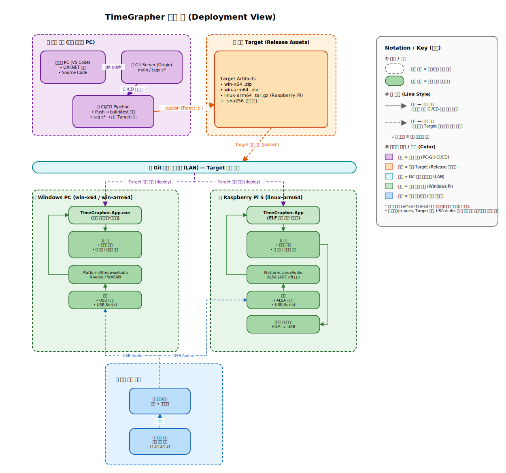

## 4. TimeGrapher System Deploment View

### 배포 흐름 (3단계)

1. **개발·공유** — 다수 개발자가 각 PC에서 C#/.NET으로 개발하고, `git push`로 Git 서버에 코드를 모은다.
2. **검증·생성** — Git 서버는 push된 사항에 대해 CI/CD로 build/test를 검증하고, `tag v*`에서 타겟별(Windows / Raspberry Pi) 배포 Target을 생성한다.
3. **배포·설치** — 생성된 Target을 Git 서버 네트워크(LAN)를 통해 연결된 각 노드로 배포·설치한다.

런타임에는 별도의 외부 입력 경로가 있다: 기계식 시계의 **음향 비트 신호**가 마이크/픽업을 거쳐 전기신호로 변환되고, **USB 오디오**로 각 노드의 오디오 입력에 들어간다.
