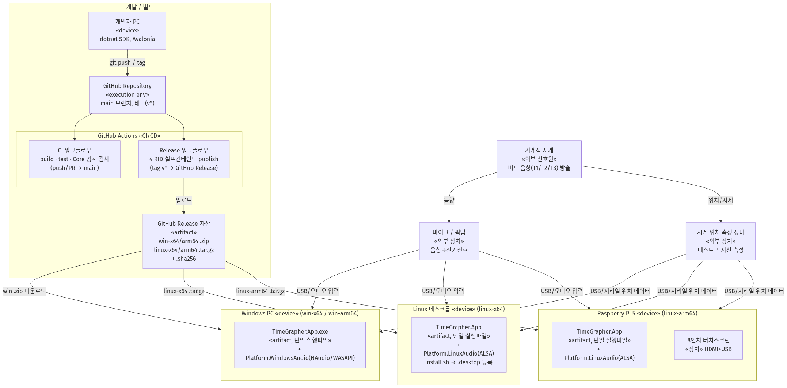
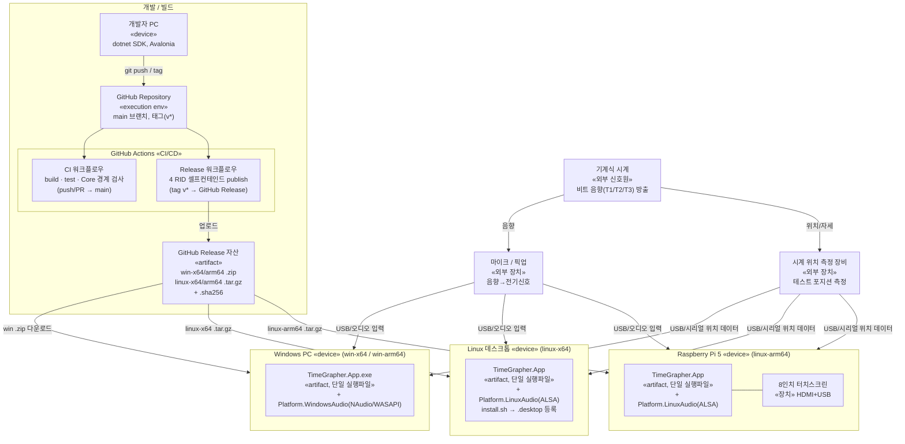

# 배포 뷰

이 문서는 TimeGrapherNet을 배포(Deployment) 관점으로 해석한다. 기계식 시계가 내는 **음향 비트 신호**(각 테스트 위치·동작 상태가 반영된 소리)를 마이크로 캡처해 실시간으로 가공·시각화하는 Avalonia(.NET 8) 데스크톱 애플리케이션을, 어떤 하드웨어 노드에 어떤 산출물로 올리고 어떤 채널로 전달하는지 보여준다. 노드 내부의 런타임 상호작용은 [RATE_SCOPE_SEQUENCE_VIEW.md](RATE_SCOPE_SEQUENCE_VIEW.md), 정적 모듈 구조는 [MODULE_DECOMPOSITION_VIEW.md](MODULE_DECOMPOSITION_VIEW.md)를 참고한다.

하나의 코드베이스에서 **Windows / Linux 데스크톱 / Raspberry Pi** 세 종류 하드웨어로 배포되며, 빌드·배포 파이프라인은 **GitHub Actions**로 운영한다. 모든 타겟은 런타임 무설치(셀프컨테인드 단일 실행 파일)로 배포된다.

> 렌더 이미지: [PNG](images/deployment-view.png) · [SVG(확대 가능)](images/deployment-view.svg)

## 배포 다이어그램

## 노드 / 산출물 매핑

| 노드(하드웨어) | RID | 실행 산출물 | 오디오 백엔드 | 비고 |
|---|---|---|---|---|
| Windows PC | `win-x64`, `win-arm64` | `TimeGrapher.App.exe` (단일 파일) | `Platform.WindowsAudio` (NAudio WASAPI/WinMM) | .zip 압축 배포 |
| Linux 데스크톱 | `linux-x64` | `TimeGrapher.App` (ELF 단일 파일) | `Platform.LinuxAudio` (ALSA/libasound) | `install.sh`로 데스크톱 메뉴 등록 |
| Raspberry Pi 5 | `linux-arm64` | `TimeGrapher.App` (ELF 단일 파일) | `Platform.LinuxAudio` (ALSA) | 터치스크린, AGC off 필요 |

## 통신 / 의존 경로

- **시계 → 마이크 → 노드**: 음향 신호가 마이크/픽업을 통해 전기신호로 변환되어 각 노드의 오디오 입력(USB/사운드카드)으로 들어온다.
- **시계 → 위치 측정 장비 → 노드**: 별도의 외부 장비가 시계의 테스트 포지션(자세)을 측정해 USB/시리얼 데이터로 각 노드에 전달한다. 음향과 독립된 입력 채널로, 측정값은 해당 비트 데이터의 active position에 결합된다.
- **개발자 PC → GitHub**: `git push`(→ CI) / `git tag v*`(→ Release).
- **GitHub Actions → Release 자산**: 4개 RID를 셀프컨테인드·단일 파일로 cross-publish 후 체크섬과 함께 GitHub Release에 업로드.
- **Release 자산 → 실행 노드**: 사용자가 해당 RID 아카이브를 내려받아 압축 해제 후 실행(런타임 설치 불필요).

## 배포 결정과 근거

| 특성 | 구현 | 근거(품질 속성) |
|---|---|---|
| 런타임 무설치 | `--self-contained` + `PublishSingleFile` (.NET 8 동봉) | 라즈베리파이 등 타겟에서 SDK 설치 부담 제거 |
| 단일 코드베이스·다중 타겟 | `RuntimeIdentifiers = win/linux × x64/arm64`, 플랫폼별 `ProjectReference` 조건부 포함 | 이식성, 수정용이성 |
| 플랫폼 격리 | `TimeGrapher.Core`는 플랫폼 오디오에 비의존(CI가 경계 검사) | 확장성, 모듈성 |
| 무결성 검증 | 아카이브별 `.sha256` 동봉 | 배포 신뢰성 |
| 로케일 독립 | `InvariantGlobalization=true` → Linux ICU 의존 제거 | Pi/임의 로케일에서 동일 동작 |

## 비고

- 이 시스템은 **단말 독립 실행형**이라 서버/네트워크 노드가 없다(원격 통신은 GitHub 배포 채널뿐). 향후 클라우드 로깅·원격 모니터링이 추가되면 별도 노드/채널로 확장이 필요하다.
- 마이크 연결 방식(USB 오디오 vs 보드 직결)과 Pi의 AGC off 설정은 측정 정확도에 직접 영향을 주므로 배포 체크리스트에 포함하는 것을 권장한다.
- 입력 경로는 두 가지다: (1) 음향 신호(마이크), (2) 시계의 테스트 포지션(CH/CB/6H/9H/3H/12H)을 측정하는 **외부 위치 측정 장비**. 위치 데이터는 음향 분석으로 산출되는 측정값과 결합되어 포지션별 동작 특성을 평가하는 데 쓰인다.
- 위치 측정 장비의 연결 인터페이스(USB/시리얼 등)와 데이터 포맷은 초안 가정이며, 실제 장비 사양 확정 시 채널 표기를 갱신해야 한다.
