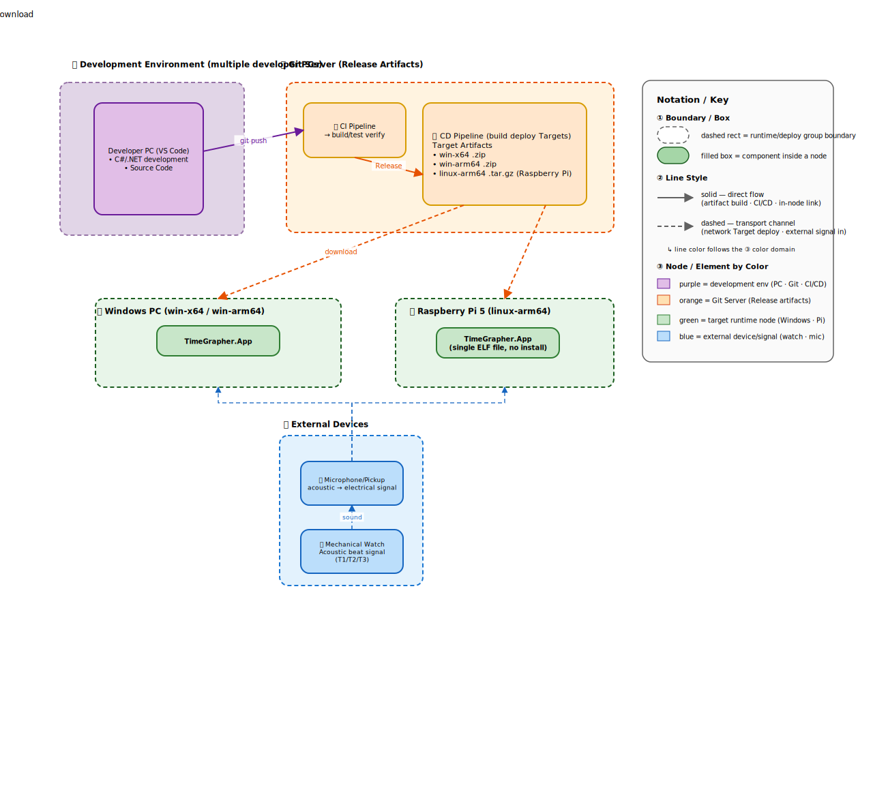

## 4. TimeGrapher System Deployment View

### Deployment Flow (3 stages)

1. **Develop & Share** — Multiple developers work on their own PCs in C#/.NET and collect the code on the Git server via `git push`.
2. **Verify & Build** — On each push the Git server runs build/test verification through CI/CD, and on `tag v*` it builds per-target (Windows / Raspberry Pi) deploy Targets.
3. **Deploy & Install** — The built Targets are distributed and installed onto each connected node over the Git server network (LAN).

At runtime there is a separate external input path: the **acoustic beat signal** of a mechanical watch is converted to an electrical signal through a microphone/pickup and enters each node's audio input via **USB audio**.
