# Detection Improvements Comparison

핵심은 두 개뿐이다.

1. `Spurious beat rejection`: BPH acquisition 중, pre-lock 상태에서 약한 half-beat 잡음을 버려서 2x BPH lock을 막는다.
2. `Weak-A onset rescue`: BPH lock 뒤 phase guide 안에서 onset threshold를 낮춰 약한 A를 제 위치에서 잡는다.

```mermaid
flowchart LR
    audio["Audio"] --> detector["Detector"]
    detector --> acq["BPH acquisition"]
    acq --> spurious["Spurious beat rejection<br/>pre-lock peak gate"]
    spurious --> phase["Phase scoring<br/>BPH candidate pick"]
    phase --> lock["BPH lock"]
    lock --> guide["Phase guide setup<br/>SetPhaseGuide(...)"]
    guide --> rescue["Weak-A onset rescue<br/>onset-scale override"]
    rescue --> detectA["A detection<br/>near expected phase"]
    detectA --> metrics["Metrics / display"]

    acq -. "without spurious rejection" .-> badBph["Risk<br/>weak half-beat noise enters A candidates<br/>2x BPH can be picked"]
    badBph -. "pollutes phase scoring" .-> phase

    guide -. "without weak-A rescue" .-> badA["Risk<br/>hard threshold misses weak A<br/>B is latched as late A"]
    badA -. "late A timing" .-> detectA

    classDef common fill:#e5e7eb,stroke:#6b7280,color:#111827;
    classDef risk fill:#fee2e2,stroke:#dc2626,color:#111827;
    classDef improvement fill:#dcfce7,stroke:#16a34a,color:#111827;

    class audio,detector,acq,phase,lock,guide,detectA,metrics common;
    class spurious,rescue improvement;
    class badBph,badA risk;
```

## 읽는 법

회색은 개선 전/후에 모두 있는 공통 파이프라인이다.

초록은 새로 들어간 두 개선이다. `Spurious beat rejection`은 pre-lock acquisition gate이고, phase scoring에 들어갈 A 후보를 정리한다. `Weak-A onset rescue`는 별도 후처리 단계가 아니라 `SetPhaseGuide(...)`에 들어가는 onset-scale override다.

빨강은 그 개선이 없을 때 옆으로 빠지는 실패 경로다. BPH acquisition에서는 약한 half-beat 잡음이 A처럼 들어와 2x BPH로 lock될 수 있고, phase guide 이후에는 약한 A를 놓쳐 뒤쪽 B를 A처럼 늦게 잡을 수 있다.

## 코드 이름

| 설정 창 이름 | Core 이름 | 정확한 위치 |
|---|---|---|
| `Spurious beat rejection` | `AcquisitionPeakGateFraction` | `Detector.cs`에서 `PhaseGuideEnabled == 0`일 때만 동작하는 acquisition peak gate |
| `Weak-A onset rescue` | `PhaseGuideOnsetRescueScale` | `TgDetector.cs`가 `SetPhaseGuide(..., onsetScaleOverride)`로 넘기고, `Detector.cs`가 `PhaseGuideOnsetScale`로 사용 |
