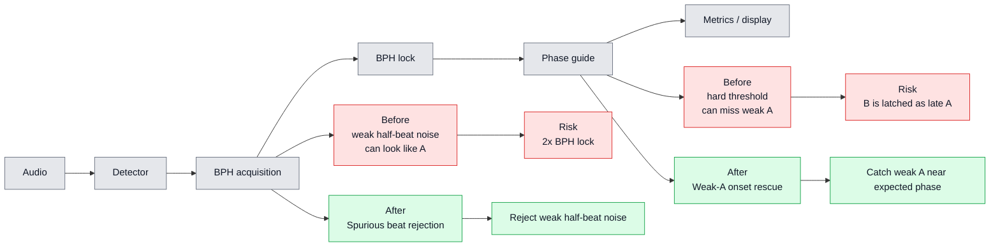

# Detection Improvements Comparison

핵심은 두 개뿐이다.

1. `Spurious beat rejection`: BPH를 잡기 전에 약한 half-beat 잡음을 버려서 2x BPH lock을 막는다.
2. `Weak-A onset rescue`: BPH lock 뒤에 약한 A를 제 위치에서 잡아서 B를 A로 늦게 착각하는 일을 줄인다.

## 읽는 법

회색은 개선 전/후에 모두 있는 공통 파이프라인이다.

빨강은 두 개선이 없을 때 생기는 핵심 실패 경로다. BPH acquisition에서는 약한 half-beat 잡음이 A처럼 들어와 2x BPH로 lock될 수 있고, phase guide 이후에는 약한 A를 놓쳐 뒤쪽 B를 A처럼 늦게 잡을 수 있다.

초록은 두 개선이 켜졌을 때 추가되는 방어 경로다. `Spurious beat rejection`은 BPH lock 전에 약한 half-beat 잡음을 버리고, `Weak-A onset rescue`는 lock 이후 예상 phase 근처의 약한 A를 더 잘 잡는다.

## 코드 이름

| 설정 창 이름 | Core 이름 | 역할 |
|---|---|---|
| `Spurious beat rejection` | `AcquisitionPeakGateFraction` | BPH lock 전 weak half-beat artifact 제거 |
| `Weak-A onset rescue` | `PhaseGuideOnsetRescueScale` | BPH lock 후 weak A onset 구제 |
