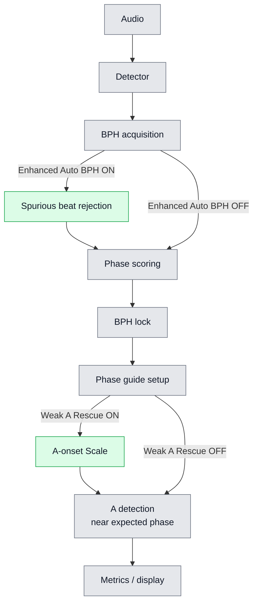

# ACCURACY

```mermaid
flowchart TD
    audio["Audio"] --> detector["Detector"]
    detector --> acq["BPH acquisition"]
    acq -->|"Enhanced Auto BPH ON"| spurious["Spurious beat rejection"]
    spurious --> phase["Phase scoring"]
    phase --> lock["BPH lock"]
    lock --> guide["Phase guide setup"]
    guide -->|"Weak A Rescue ON"| rescue["A-onset Scale"]
    rescue --> detectA["A detection<br/>near expected phase"]
    detectA --> metrics["Metrics / display"]
	acq -->|"Enhanced Auto BPH OFF"| phase
	guide -->|"Weak A Rescue OFF"| detectA


    classDef common fill:#e5e7eb,stroke:#6b7280,color:#111827;
    classDef risk fill:#fee2e2,stroke:#dc2626,color:#111827;
    classDef improvement fill:#dcfce7,stroke:#16a34a,color:#111827;

    class audio,detector,acq,phase,lock,guide,detectA,metrics common;
    class spurious,rescue improvement;
    class badBph,badA risk;
```
