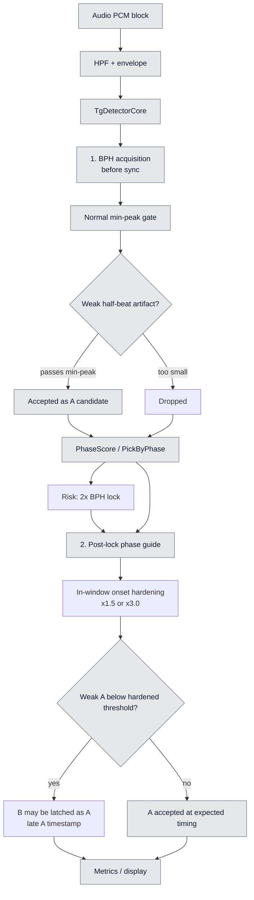
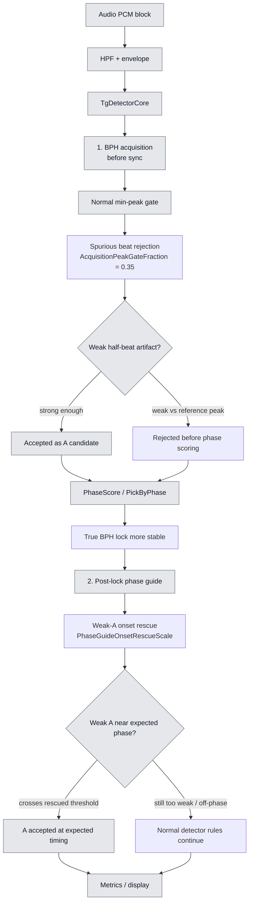

# Detection Improvements Comparison

이 문서는 검출 알고리즘에 추가된 두 개선을 비교한다.

- `Spurious beat rejection`: BPH acquisition 중 약한 half-beat 잡음이 실제 beat처럼 들어와 BPH가 2x로 lock되는 것을 막는다.
- `Weak-A onset rescue`: lock 이후 예상 A phase 근처에서 약한 A onset이 기존 hardening 때문에 묻힐 때, A를 더 일찍 잡아 B를 A로 착각하는 late timing 오류를 줄인다.

코드 기준 명칭은 다음과 같다.

| 사용자 설정 | App 설정 값 | Core 설정 값 | 동작 구간 | 기본 앱 정책 |
|---|---|---|---|---|
| `Spurious beat rejection` | `SpuriousBeatRejection` | `AcquisitionPeakGateFraction` | BPH lock 전 acquisition | 켜짐, `0.35` |
| `Weak-A onset rescue` | `WeakAOnsetRescue`, `WeakAOnsetRescueStrengthStep` | `PhaseGuideOnsetRescueScale` | BPH lock 후 phase-guide window | 켜짐, Standard step |

주의할 점은 Core library 기본값은 둘 다 `0.0`, 즉 off라는 점이다. 앱의 Settings window 기본값이 on이고, 실행 시작 시 `AnalysisRunSettings`가 이를 `DetectorMetricsEngineConfig`와 `TgConfig`로 변환한다.

## 1. 두 개선이 없었을 때

### 해석

개선 전 플로우도 지금과 같은 detector 파이프라인이다. 차이는 두 지점이 off인 것이다.

1. BPH acquisition에서는 normal min-peak만 본다. 그래서 half-beat 위치의 약한 artifact가 min-peak를 통과하면 A 후보가 되고, 반복되면 `PhaseScore / PickByPhase`가 2x BPH 쪽으로 흔들릴 수 있다.
2. post-lock에서는 phase guide 안에서 onset threshold hardening이 그대로 적용된다. 약한 A가 이 hardened threshold 아래에 있으면 진짜 A를 놓치고 뒤쪽 B cluster를 A처럼 늦게 잡을 수 있다.

## 2. 두 개선이 들어갔을 때

### 해석

개선 후에도 전체 플로우가 바뀐 것은 아니다. 같은 detector 파이프라인에서 두 판단 조건만 추가된다.

1. BPH acquisition 앞쪽에는 `Spurious beat rejection`이 붙는다. normal min-peak를 통과한 burst라도 최근 reference peak 대비 너무 약하면 phase scoring 전에 버린다. 목적은 2x BPH alias를 만드는 half-beat artifact를 acquisition 단계에서 제거하는 것이다.
2. post-lock phase guide 안에는 `Weak-A onset rescue`가 붙는다. 기존 hardening을 설정 scale로 대체해서, expected phase 근처의 약한 A가 threshold 바로 아래에서 묻히는 경우를 줄인다. 목적은 A를 새로 만들어내는 것이 아니라 weak A를 제 시점에 잡는 것이다.

## 3. 같은 점과 다른 점

| 구간 | 개선 전 | 개선 후 |
|---|---|---|
| 공통 파이프라인 | PCM -> HPF/envelope -> `TgDetectorCore` -> BPH acquisition -> post-lock phase guide -> metrics/display | 동일 |
| BPH acquisition 입력 | normal min-peak를 통과한 weak half-beat artifact도 A 후보가 될 수 있음 | `AcquisitionPeakGateFraction`이 weak artifact를 pre-lock에서 제거 |
| BPH lock 위험 | half-beat artifact가 반복되면 2x BPH alias 가능 | phase scoring에 들어가는 A 후보가 정리되어 true cadence lock 가능성 증가 |
| post-lock A timing | phase-guide window 안에서 threshold hardening이 항상 적용됨 | `PhaseGuideOnsetRescueScale`이 hardening을 대체해 weak A를 expected phase에서 잡음 |
| Settings window 의미 | 두 toggle이 off인 것과 같은 동작 | 두 toggle이 on이면 위 두 판단 조건이 켜짐 |

## 4. 근거 코드

- `src/TimeGrapher.App/Views/SettingsWindow.axaml`: `Weak-A onset rescue`, `Rescue strength`, `Spurious beat rejection` UI.
- `src/TimeGrapher.App/AnalysisRunSettings.cs`: 앱 설정을 `PhaseGuideOnsetRescueScale`과 `AcquisitionPeakGateFraction`으로 변환.
- `src/TimeGrapher.App/WeakAOnsetRescueStrengthPolicy.cs`: strength step을 scale `1.25..0.75`로 변환.
- `src/TimeGrapher.Core/Analysis/DetectorMetricsEngine.cs`: `DetectorMetricsEngineConfig`에서 `TgConfig`로 전달.
- `src/TimeGrapher.Core/Detection/TgTypes.cs`: 두 옵션의 Core contract와 기본 off 값.
- `src/TimeGrapher.Core/Detection/TgDetector.cs`: acquisition gate 설정과 post-lock phase guide scale 전달.
- `src/TimeGrapher.Core/Detection/Detector.cs`: pre-lock weak burst reject 조건과 post-lock onset scale override.
- `tests/TimeGrapher.Core.Tests/AcquisitionPeakGateTests.cs`: half-beat artifact가 BPH를 2x로 alias시키는 시나리오와 gate 검증.
- `tests/TimeGrapher.Core.Tests/PhaseGuideRescueTests.cs`: weak A에서 rescue가 A timing error를 줄이는 검증.
