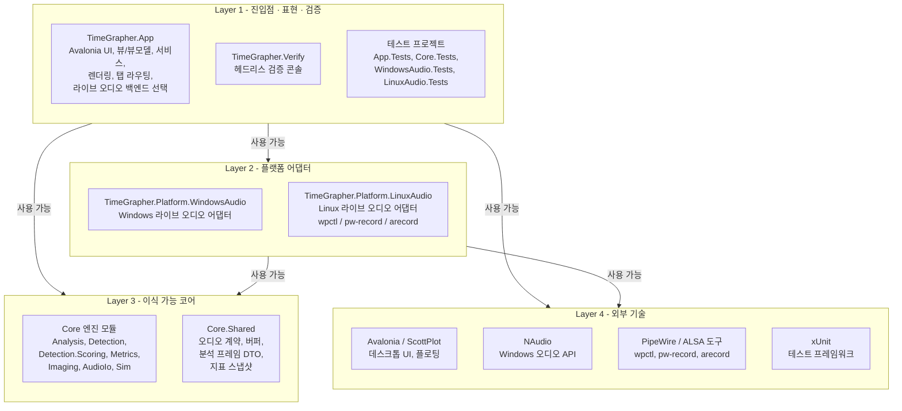

# 계층 뷰

이 문서는 TimeGrapherNet의 모듈을 논리적 layer로 묶고, 각 layer가 사용할 수 있는 아래 layer를 보여준다. 화살표 `A --> B`는 "A가 B를 사용할 수 있다"는 허용 관계이며, 사용 방향은 항상 위에서 아래로만 흐른다.

이 프로젝트는 인접 layer만 쓸 수 있는 strict layering이 아니라, 위 layer가 필요한 아래 layer를 직접 사용할 수 있는 **relaxed layering**으로 정리한다. 단, 아래 layer가 위 layer를 사용하는 **역방향 의존은 금지**한다.

## 사용 허용 계층

> 엣지는 layer 단위의 **허용 관계**다. 실제 `ProjectReference`는 더 좁다: `TimeGrapher.Verify`와 각 테스트 프로젝트는 자신이 검증하는 모듈만 참조한다(아래 규칙 표 참조).

## 계층별 책임

| Layer | 모듈 | 제공하는 응집된 서비스 |
|---|---|---|
| Layer 1 진입점·표현·검증 | `TimeGrapher.App`, `TimeGrapher.Verify`, `*.Tests` | 사용자 상호작용, 탭/프레임 라우팅, 라이브 오디오 백엔드 선택, 헤드리스 검증, 회귀 검증 |
| Layer 2 플랫폼 어댑터 | `TimeGrapher.Platform.WindowsAudio`, `TimeGrapher.Platform.LinuxAudio` | Core 오디오 계약 뒤에서 OS별 라이브 오디오 입력 구현 |
| Layer 3 이식 가능 코어 | `TimeGrapher.Core` 하위 모듈 | UI/OS 비의존적인 시계 음향 분석, WAV I/O, 시뮬레이션, 지표 계산, 공유 프레임 DTO, 오디오 계약 |
| Layer 4 외부 기술 | Avalonia, ScottPlot, NAudio, PipeWire/ALSA 도구, xUnit | 프로젝트 외부에서 공급되는 프레임워크·OS·플로팅·오디오·테스트 기능 |

## 사용 허용 규칙

| 규칙 | 이 프로젝트에서의 의미 |
|---|---|
| L1 → L2 | `TimeGrapher.App`이 `RuntimeIdentifier`와 `DefineConstants`(`TIMEGRAPHER_WINDOWS_AUDIO` / `TIMEGRAPHER_LINUX_AUDIO`) 조건으로 Windows/Linux 어댑터를 참조하고, `LiveAudioBackend`에서 런타임에 선택한다. WindowsAudio.Tests·LinuxAudio.Tests는 해당 어댑터를 검증한다 |
| L1 → L3 | App·Verify·Core.Tests가 Core 분석/WAV/시뮬레이션/검출 및 `AnalysisFrame`, `BeatMetricsHistorySnapshot` 같은 `Core.Shared` DTO를 사용한다 |
| L1 → L4 | App은 Avalonia·ScottPlot를, 테스트는 xUnit을 사용한다 |
| L2 → L3 | 어댑터가 `Core.Shared`의 라이브 오디오 계약(`ILiveAudioWorker`)을 구현한다 (`AudioCaptureWorker`, `LinuxLiveAudioWorker`) |
| L2 → L4 | WindowsAudio는 NAudio(`NAudio.Wasapi`, `NAudio.WinMM`)를, LinuxAudio는 PipeWire/ALSA 도구(`wpctl`, `pw-record`, `arecord`)를 호출한다 |

## 제약

| 제약 | 근거 |
|---|---|
| 아래→위 역방향 의존 금지 | `TimeGrapher.Core`는 `ProjectReference`·`PackageReference`가 전혀 없어 App·Platform·외부 패키지를 참조하지 않는다. 분석 엔진을 이식 가능·테스트 가능하게 유지한다 |
| 플랫폼 코드 격리 | Windows/Linux 캡처 구현은 어댑터 프로젝트에만 두고, App은 `LiveAudioBackend`로 선택한다. 캡처 세부사항이 Core에 섞이지 않는다 |
| UI 기술은 Core 위에 위치 | Avalonia·ScottPlot는 App layer만 사용하고, 이식 가능 분석 엔진은 사용하지 않는다 |
| 테스트는 최상위 | 테스트는 런타임 모듈을 사용할 수 있으나, 런타임 모듈은 테스트를 의존하지 않는다 |
