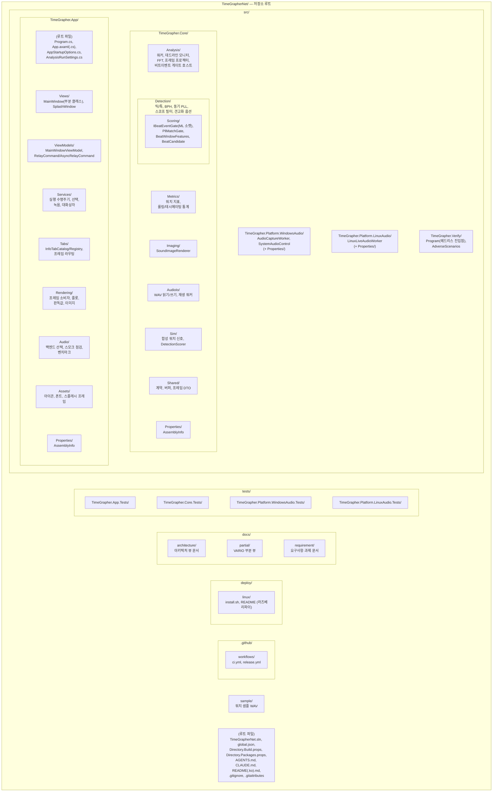

# 모듈 분해 뷰

이 문서는 TimeGrapherNet 솔루션을 **실제 디렉터리 트리** 그대로 모듈 분해 관점에서 보여준다. 중첩은 폴더 포함 관계를 따르며, **임의 그룹핑은 두지 않는다**. 박스 이름은 실제 폴더/프로젝트명이고, 폴더가 아닌 항목(프로젝트 루트 파일 등)은 괄호로 구분한다. 빌드 산출물(`artifacts/`, `bin/`, `obj/`)은 제외한다.

## 분해 다이어그램

## 최상위 항목 요약

| 경로 | 하위 항목 | 역할 |
|---|---|---|
| `src/TimeGrapher.App/` | 루트 파일(`Program.cs`, `App.axaml(.cs)`, `AppStartupOptions.cs`, `AnalysisRunSettings.cs`), `Views/`, `ViewModels/`, `Services/`, `Tabs/`, `Rendering/`, `Audio/`, `Assets/`, `Properties/` | Avalonia UI, 실행 수명주기 조정, 탭 프레임 라우팅/렌더링, 플랫폼 오디오 백엔드 선택 |
| `src/TimeGrapher.Core/` | `Analysis/`, `Detection/`(하위 폴더 `Scoring/`), `Metrics/`, `Imaging/`, `AudioIo/`, `Sim/`, `Shared/`, `Properties/` | UI/OS 독립적인 워치 음향 분석 엔진과 공유 계약. `Detection/Scoring`은 veto 전용 `IBeatEventGate` 소켓(현재 `PllMatchGate`, 추후 leaf 추론 프로젝트의 ONNX 게이트)과 `BeatWindowFeatures`/`BeatCandidate` 계약을 정의한다. `Detection`은 적응형 플로어·레짐 가드·PLL 기반 post-lock A-onset 게이팅을 포함하고, `Analysis`는 지표 초크포인트에서 게이트를 호스팅하며, `Sim`은 정답 기반 `DetectionScorer`를 제공한다 |
| `src/TimeGrapher.Platform.WindowsAudio/` | `AudioCaptureWorker`, `SystemAudioControl`, `Properties/` | Core 라이브 오디오 계약 뒤에서 NAudio 기반 마이크 캡처와 시스템 볼륨 연동 |
| `src/TimeGrapher.Platform.LinuxAudio/` | `LinuxLiveAudioWorker`, `Properties/` | Core 라이브 오디오 계약 뒤에서 PipeWire/ALSA CLI(`wpctl`/`pw-record`/`arecord`) 기반 마이크 캡처 |
| `src/TimeGrapher.Verify/` | `Program`, `AdverseScenarios` | 헤드리스 검증 도구. `Program`이 생성 신호/WAV 픽스처 검증을 수행하고, `AdverseScenarios`가 적대적 조건의 검출 품질 시나리오를 담는다 |
| `tests/` | `TimeGrapher.App.Tests/`, `TimeGrapher.Core.Tests/`, `TimeGrapher.Platform.WindowsAudio.Tests/`, `TimeGrapher.Platform.LinuxAudio.Tests/` | UI 서비스/렌더링/탭, Core 분석 계약, Windows/Linux 오디오 동작에 대한 회귀 테스트(xUnit) |
| `docs/` | `architecture/`, `partial/`, `requirement/` | 아키텍처 뷰, VARIO 부분 뷰, 요구사항·과제 문서 |
| `deploy/` | `linux/` | 라즈베리파이 배포 통합(`install.sh`, README) |
| `sample/` | 워치 샘플 `.wav` | 수동 재생/검증용 실제 무브먼트 녹음 샘플 |
| `.github/` | `workflows/` | CI/릴리스 자동화(`ci.yml`, `release.yml`) |
| 루트 파일 | `TimeGrapherNet.sln`, `global.json`, `Directory.Build.props`, `Directory.Packages.props`, `AGENTS.md`, `CLAUDE.md`, `README(.ko).md`, `.gitignore`, `.gitattributes` | 솔루션/빌드 설정, 패키지 버전 중앙 관리, 에이전트·프로젝트 가이드 |

> 표기 참고: 박스 이름은 실제 폴더/프로젝트명이다. `Scoring/`은 `Detection/` 아래 하위 폴더라 `Detection` 박스 안에 중첩으로 그렸다. App과 각 프로젝트의 루트 파일들은 어떤 하위 폴더에도 속하지 않으며, App의 루트 파일은 합성 루트(composition root)다. 각 프로젝트의 `Properties/`는 자동 생성 `AssemblyInfo`다.
>
> 향후 확장 참고: `Scoring/`이 언급하는 ONNX 추론 leaf 프로젝트는 아직 존재하지 않는 확장 지점이며, Core를 의존성 없는 상태로 유지한 채 구성 루트에서 주입하도록 설계된 소켓이다.
