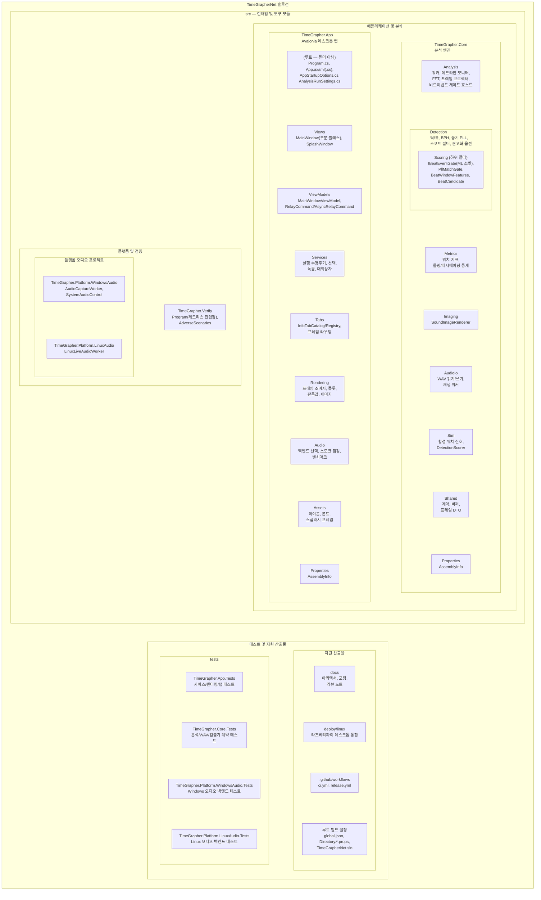

# 모듈 분해 뷰

이 문서는 TimeGrapherNet 솔루션을 모듈 분해 관점에서 보여준다. 외곽 상자는 상위 모듈이고, 그 안의 상자들은 해당 모듈에 포함되는 하위 모듈이다. **하위 모듈 상자 이름은 실제 소스 폴더명을 그대로 따르며**, 폴더가 아닌 항목(프로젝트 루트 파일 등)은 괄호로 구분한다.

## 분해 다이어그램

## 모듈 요약

| 모듈 | 하위 모듈 / 구성 요소 | 역할 |
|---|---|---|
| `TimeGrapher.App` | 루트 파일(`Program.cs`, `App.axaml(.cs)`, `AppStartupOptions.cs`, `AnalysisRunSettings.cs`), `Views`, `ViewModels`, `Services`, `Tabs`, `Rendering`, `Audio`, `Assets`, `Properties` | Avalonia UI, 실행 수명주기 조정, 탭 프레임 라우팅/렌더링, 플랫폼 오디오 백엔드 선택 |
| `TimeGrapher.Core` | `Analysis`, `Detection`(하위 폴더 `Scoring`), `Metrics`, `Imaging`, `AudioIo`, `Sim`, `Shared`, `Properties` | UI/OS 독립적인 워치 음향 분석 엔진과 공유 계약. `Detection/Scoring`은 veto 전용 `IBeatEventGate` 소켓(현재 `PllMatchGate`, 추후 leaf 추론 프로젝트의 ONNX 게이트)과 `BeatWindowFeatures`/`BeatCandidate` 계약을 정의한다. `Detection`은 적응형 플로어, 레짐 가드, PLL 기반 post-lock A-onset 게이팅을 포함한다. `Analysis`는 지표 초크포인트에서 게이트를 호스팅하고, `Sim`은 정답 기반 `DetectionScorer`를 제공한다 |
| `TimeGrapher.Platform.WindowsAudio` | `AudioCaptureWorker`, `SystemAudioControl` | Core 라이브 오디오 계약 뒤에서 NAudio 기반 마이크 캡처와 시스템 볼륨 연동 |
| `TimeGrapher.Platform.LinuxAudio` | `LinuxLiveAudioWorker` | Core 라이브 오디오 계약 뒤에서 PipeWire/ALSA CLI(wpctl/pw-record/arecord) 기반 마이크 캡처 |
| `TimeGrapher.Verify` | `Program`, `AdverseScenarios` | 헤드리스 검증 도구. `Program`이 생성 신호/WAV 픽스처 검증을 수행하고, `AdverseScenarios`가 적대적 조건의 검출 품질 시나리오를 담는다 |
| `tests` | `TimeGrapher.App.Tests`, `TimeGrapher.Core.Tests`, `TimeGrapher.Platform.WindowsAudio.Tests`, `TimeGrapher.Platform.LinuxAudio.Tests` | UI 서비스/렌더링/탭, Core 분석 계약, Windows/Linux 오디오 동작에 대한 회귀 테스트(xUnit) |
| 지원 산출물 | `docs`, `deploy/linux`, `.github/workflows`, 루트 빌드 설정 | 아키텍처/강의 문서, 라즈베리파이 배포 통합, CI/릴리스 자동화, 공유 빌드 메타데이터 |

> 폴더 표기 참고: 박스 이름은 실제 소스 폴더명이다. `Scoring`은 `Detection/` 아래의 하위 폴더라 `Detection` 박스 안에 중첩으로 그렸고, App의 루트 파일들은 어떤 하위 폴더에도 속하지 않는 합성 루트(composition root)다. App·Core의 `Properties/`는 자동 생성 `AssemblyInfo`다.
>
> 향후 확장 참고: `Scoring`이 언급하는 ONNX 추론 leaf 프로젝트는 아직 존재하지 않는 확장 지점이며, Core를 의존성 없는 상태로 유지한 채 구성 루트에서 주입하도록 설계된 소켓이다.
