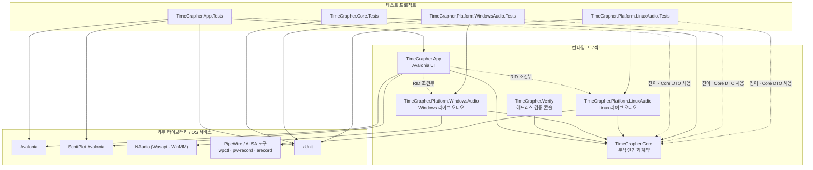
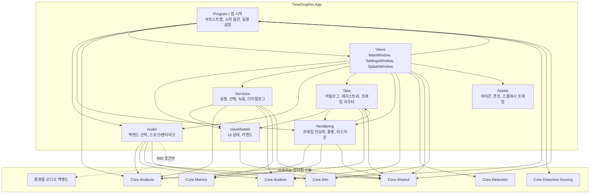
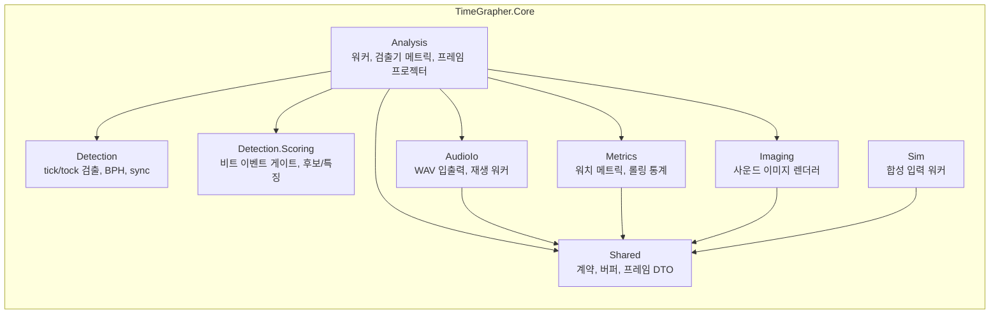

# 모듈 사용 뷰

이 문서는 TimeGrapherNet의 모듈 간 **uses(사용)** 관계를 보여준다. `A --> B`는 "A가 B를 사용한다"는 뜻이며, 이 관계가 모듈 간 결합을 만든다. 모든 엣지는 실제 코드(`.csproj`의 `ProjectReference`/`PackageReference`, `.cs`의 `using`/타입 참조)에 근거한다.

다이어그램은 세 층위로 나뉜다: (1) 프로젝트 수준, (2) `TimeGrapher.App` 내부, (3) `TimeGrapher.Core` 내부.

## 1. 프로젝트 수준 사용 관계

### 의존 규칙

- `TimeGrapher.Core`는 **아무것도 참조하지 않는다**(UI·플랫폼 무의존). 외부 패키지도 없다.
- `TimeGrapher.Platform.*`와 `TimeGrapher.Verify`는 `Core`만 참조한다.
- 두 플랫폼 어댑터는 각각 `Core.Shared`만 사용한다(`AudioCaptureWorker`, `LinuxLiveAudioWorker`).

### App의 플랫폼 어댑터 참조 (RID 조건부)

`TimeGrapher.App.csproj`의 플랫폼 어댑터 `ProjectReference`는 `RuntimeIdentifier` 조건부다(`RuntimeIdentifiers`는 `win-x64;win-arm64;linux-x64;linux-arm64`).

| RID 조건 | 포함되는 어댑터 | DefineConstants |
|---|---|---|
| 비어 있음(개발/테스트 빌드) | WindowsAudio + LinuxAudio 둘 다 | `TIMEGRAPHER_WINDOWS_AUDIO`, `TIMEGRAPHER_LINUX_AUDIO` |
| `win-*` publish | WindowsAudio | `TIMEGRAPHER_WINDOWS_AUDIO` |
| `linux-*` publish | LinuxAudio | `TIMEGRAPHER_LINUX_AUDIO` |

`LiveAudioBackend`는 이 상수로 `#if` 분기하여 백엔드를 선택한다.

### 테스트 프로젝트의 Core 의존

`*.Tests`는 각자 검증 대상 프로젝트 **하나만** `ProjectReference`로 직접 참조한다(`App.Tests→App`, `WindowsAudio.Tests→WindowsAudio`, `LinuxAudio.Tests→LinuxAudio`). `Core`는 전이 참조이지만, 어서션에서 `Core` DTO를 직접 `using`하므로 점선으로 표시했다. `Core.Tests`만 `Core`를 직접 참조한다. `App.Tests`는 컨트롤(`AvaPlot`, `SplashWindow`)을 구성하므로 `Avalonia`·`ScottPlot`도 직접 사용한다.

### 미래 계획 노드: TimeGrapher.Inference

검출 강건성 동작(적응 플로어, 레짐 가드, PLL 후행 A-onset 게이팅)은 `Detection` 알고리즘에 흡수되어 있고, 이벤트 게이트 소켓(`IBeatEventGate`/`BeatEventGateHost`)은 `Core` 내부 요소라 **프로젝트 간 신규 엣지를 만들지 않는다**. 미래의 TinyML 게이트는 ONNX Runtime을 참조하는 리프 프로젝트 `TimeGrapher.Inference`로 들어올 계획이며, 그때 엣지는 `App → Inference → Core`, `Verify → Inference`로 `Platform.*` 패턴을 미러링한다. `Core`는 계속 무의존을 유지한다.

## 2. TimeGrapher.App 내부 사용 관계

폴더 수준 추상화로 묶었고, 모든 엣지는 실제 `using`/타입 참조에 근거한다. `Program` 노드는 루트 네임스페이스(`Program`, `App`, `AppStartupOptions`, `AnalysisRunSettings`)를 가리킨다.

### 폴더별 사용 요약

| 폴더 | 사용하는 App 폴더 | 사용하는 Core 하위모듈 |
|---|---|---|
| Program / 앱 시작 | Views, Audio, Rendering | Analysis, AudioIo, Detection.Scoring, Shared |
| Views | Program, ViewModels, Services, Audio, Tabs, Rendering, Assets | AudioIo, Detection, Shared, Sim |
| ViewModels | — | Shared |
| Services | ViewModels | Analysis, AudioIo, Metrics, Shared |
| Audio | — | Analysis, AudioIo, Shared, Sim, 플랫폼 백엔드(RID 조건부) |
| Tabs | ViewModels, Rendering | Analysis, Shared |
| Rendering | Tabs | Analysis, Metrics, Shared |

- `Program`은 `AnalysisRunSettings`에서 `AnalysisWorker.Config`를 조립하며 `PllMatchGate`(`Core.Detection.Scoring`)와 `PlotThemePalette`(`Rendering`)를 직접 사용한다.
- `Rendering`과 `Tabs`는 순환처럼 보이지만 분리되어 있다: `Rendering`의 프레임 컨슈머가 `Tabs`의 라우팅 계약(`IAnalysisFrameConsumer`/`IThemedFrameConsumer`)을 구현하고, `Tabs`의 레지스트리가 컨슈머를 등록한다.

## 3. TimeGrapher.Core 내부 사용 관계

`using TimeGrapher.Core.` 전수 조사로 검증했다. `Shared`는 의존 없는 최하위 계약 모듈이고, `Analysis`가 가장 결합도가 높다.

### 검증 결과

- **`Analysis`**는 `Detection`, `Detection.Scoring`, `Metrics`, `Imaging`, `AudioIo`, `Shared`를 모두 사용한다. `Detection.Scoring` 의존은 `AnalysisWorker`, `DetectorMetricsEngine`, `BeatEventGateHost`에서 확인된다.
- **`Detection`**(`TgDetector`, `TgDetectorCore`, `Bph` 등)은 다른 `Core` 하위모듈을 사용하지 않는다. 같은 부모 아래의 `Detection.Scoring`도 참조하지 않으므로 `Detection → Detection.Scoring` 엣지는 없다.
- **`Detection.Scoring`**(`IBeatEventGate`, `PllMatchGate`, `BeatCandidate`, `BeatWindowFeatures`)은 자기 네임스페이스 타입만 쓰고 `Shared`조차 참조하지 않는 리프다.
- **`Sim`**의 `DetectionScorer`는 `Detection`을 사용하지 않는다(이름에 보이는 `usedDetection`은 지역 변수). `Sim`은 `Shared`만 사용한다.
- **`AudioIo`·`Metrics`·`Imaging`**은 각각 `Shared`만 사용한다.

## 결합 요약

| 사용 모듈 | 사용 대상 | 만들어지는 결합 |
|---|---|---|
| `TimeGrapher.App` | `TimeGrapher.Core`, RID 선택 플랫폼 오디오, Avalonia, ScottPlot | UI가 Core 계약/결과, 데스크톱 UI 라이브러리, 선택된 플랫폼 오디오 어댑터에 결합 |
| `TimeGrapher.Verify` | `TimeGrapher.Core` (Analysis, AudioIo, Detection, Detection.Scoring, Metrics, Shared, Sim) | 콘솔 검증이 앱과 동일한 분석·검출·시뮬레이터 모듈을 공유 |
| `TimeGrapher.Platform.WindowsAudio` | `TimeGrapher.Core.Shared`, NAudio | Windows 입력 백엔드가 Core 라이브 오디오 계약과 NAudio API에 결합 |
| `TimeGrapher.Platform.LinuxAudio` | `TimeGrapher.Core.Shared`, `wpctl`·`pw-record`·`arecord` | Linux 입력 백엔드가 Core 라이브 오디오 계약과 Linux 오디오 CLI 도구에 결합 |
| `TimeGrapher.App.Rendering` | `TimeGrapher.App.Tabs`, `Core.Analysis`, `Core.Metrics`, `Core.Shared` | 프레임 컨슈머가 탭 라우팅 계약을 구현하고 Core 프레임/메트릭 DTO를 렌더 |
| `TimeGrapher.Core.Analysis` | `Detection`, `Detection.Scoring`, `Metrics`, `Imaging`, `AudioIo`, `Shared` | 핵심 알고리즘 모듈을 조율하는 가장 결합도 높은 Core 하위모듈 |
| `*.Tests` | 검증 대상 프로젝트(직접), `Core` DTO(전이), App UI 라이브러리(컨트롤 테스트), xUnit | 검증 대상과 어서션에 쓰이는 계약 DTO, 테스트 프레임워크에 의존 |
