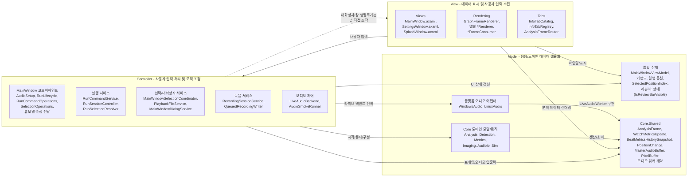

# 모델-뷰-컨트롤러 뷰

이 문서는 TimeGrapherNet을 Model-View-Controller(MVC) 관점으로 해석한다. 실제 구현은 Avalonia 바인딩과 `ViewModels`를 사용하는 MVVM/MVC 혼합 구조이지만, 사용자 입력 처리와 분석 상태 갱신 흐름은 View/Controller/Model 역할로 나누어 설명할 수 있다.

## MVC 역할 매핑

| MVC 요소 | 프로젝트 모듈 | 책임 |
|---|---|---|
| Model | `TimeGrapher.Core.*`, `TimeGrapher.Core.Shared`, `MainWindowViewModel`, 플랫폼 오디오 어댑터 | 분석 데이터, UI 상태, 실행 옵션, 선택된 워치 위치, 오디오 버퍼, 워커 계약, 검출 결과, 생성된 프레임, 백엔드 상태를 보유 |
| View | `TimeGrapher.App.Views`, `TimeGrapher.App.Rendering`, 표시용 `TimeGrapher.App.Tabs` | 창/컨트롤/플롯/사운드프린트·스펙트로그램 이미지/탭 콘텐츠/위치별 측정 표로 현재 상태를 보여주고 사용자 입력을 받음 |
| Controller | `MainWindow` 부분 클래스 코드비하인드, `TimeGrapher.App.Services`, `TimeGrapher.App.Audio` | 버튼/메뉴 동작, 실행 생명주기, 파일 선택, 녹음, 라이브 오디오 선택, 분석 워커 조정, UI 상태 변경의 워커 전달을 처리 |

## 탭 카탈로그

`InfoTabCatalog.All`이 분석 표시 탭의 진실 원본이다. 현재 13개 탭을 다음 순서로 선언한다: `Rate/Scope`, `Sound Print`, `Trace`, `Sweep`, `Vario`, `Beat Error`, `Filter Scope`, `Long-Term`, `Positions`, `Beat Noise`, `Escapement`, `Waveforms`, `Spectrogram`.

## 프레임 라우팅

- `InfoTabRegistry.FromCatalog`는 카탈로그 정의마다 `TabItem` 하나와 `IAnalysisFrameConsumer` 하나를 1:1로 생성한다.
- `GraphFrameRenderer`는 모든 consumer를 `Initialize`/`Reset`하고 공용 수치 결과 readout을 소유한다.
- 프레임 전달 시 `AnalysisFrameRouter.Route`는 모든 consumer에 `ObserveFrame`을 호출한 뒤, 활성 탭의 consumer에만 `RenderFrame`을 호출한다.
- `RenderToAll`은 pause 종료 시 리뷰 커서를 모든 탭에서 한 번에 지우는 fan-out 전용 경로다(렌더만 수행; 보관 프레임은 이미 모든 consumer가 `ObserveFrame`으로 관찰했음).
- 정적 실행 옵션(`UseCOnset`, `PllEventVeto`)은 더 이상 탭이 아니라 타이틀바 톱니바퀴 버튼(`SettingsTitleBarButton`)이 여는 별도 팝업 창 `SettingsWindow`에 있다. 이 창은 `MainWindow`의 `MainWindowViewModel`을 DataContext로 공유해 체크박스 토글이 동일한 실행-설정 흐름(`AreRunParametersEnabled` 게이트 포함)에 그대로 반영되며, 분석 프레임 라우팅에는 참여하지 않는다. 따라서 이 설정은 더 이상 분석 표시 탭이 아니며, 카탈로그는 13개 탭을 유지한다.
- 리뷰 바는 **일시정지 중이면서 Long-Term 탭이 활성일 때만** 보인다(`MainWindowViewModel.IsReviewBarVisible => RunState==Paused && _isLongTermTabActive`). 탭 전환 시 `MainWindow`가 `SetLongTermTabActive(activeTab == LongTermPerfTabId)`로 토글하고, 렌더러가 Long-Term 그래프 X축 데이터 영역의 패드를 계산해 뷰모델 콜백 `UpdateReviewSliderAlignment(...)`를 호출하면, 뷰모델이 리뷰 슬라이더(`ReviewSliderMargin`/`ReviewMinimumS`)를 그 영역에 맞춘다. Long-Term 그래프는 `BeatMetricsHistorySnapshot.PositionChanges`를 경과시간 축의 파선(dashed) 위치-전환 마커로 그린다(`LongTermPerfRenderer`).

### Positions 탭과 위치 입력

- `Positions`는 단일 탭(`InfoTabCatalog.TestPositionsTabId`, 제목 `Positions`)으로 active position diagram, 시퀀스 측정 표, 포지션 맵, X/D/VH 요약 카드를 담는다. 탭 카탈로그의 위치와 순서는 변경하지 않고 탭 내부 표시만 확장한다.
- `InfoTabRegistry.CreateTestPositionsRegistration`이 탭 콘텐츠를 구성하면서, 왼쪽 설정 패널과 탭 영역 사이에 항상 보이는 1열 위치 선택기(`PositionButtonGrid`)를 채운다.
- `TestPositionsFrameConsumer.ObserveFrame`은 매 프레임마다 위치 선택기를 갱신하고, `RenderFrame`은 Positions 탭이 활성일 때만 시퀀스 표를 갱신한다. 둘 다 동일한 `BeatMetricsHistorySnapshot`을 읽는다.
- 위치 입력 흐름: 버튼 클릭 → `MainWindowViewModel.SelectedPositionIndex` 갱신 → `MainWindow.axaml.cs`가 해당 속성 변경을 관찰 → `RunSessionController.SetActivePosition`으로 `WatchPosition`을 실행 중인 `AnalysisWorker`에 전달. 전달된 위치는 이후 메트릭 스냅샷의 active position과 위치별 집계에 반영되며, 스코프/레이트 그래프와 검출기 비트 락은 유지된다.

### 실행 생명주기 (State Pattern)

`RunCommandService`는 `RunCommandService.States.cs`에 정의된 State Pattern으로 실행 생명주기를 다룬다. 상태는 `Stopped`, `Starting`, `Running`, `Paused`, `Stopping`, `StopFailed`이며, `MainWindowViewModel.RunState`로 현재 상태를 결정한다.

| 상태 | 노출되는 조작 |
|---|---|
| Stopped | Start, Reset |
| Running | Pause |
| Paused | Resume, Reset |
| Stopping / StopFailed | Reset(중지 재시도) |

- Stopped에서 Reset: 앱이 렌더한 실행 상태를 지우고 장치 목록을 새로 고침(`CompleteReset`).
- Paused에서 Reset: 중지 후 리셋 의도(`ResetAfterStop`)로 중지 경로에 진입하고, 중지 완료 후 리셋을 마무리.
- 중지 실패/미완료: UI가 멈추지 않도록 `StopFailed` 복구 상태로 진입해 재시도를 허용.
- `StopRunWithoutReset`은 입력 종료 정리를 위한 내부 생명주기 경로이며, 메인 UI 버튼이 아니다.

## MVC 제약

| 제약 | 충족 방식 |
|---|---|
| View → Model 의존 | Views/renderer가 `MainWindowViewModel`에 바인딩하고 `AnalysisFrame`, `BeatMetricsHistorySnapshot`, `BeatSegmentsSnapshot`, `PixelBuffer`, 그래프 시리즈, 워치 지표 등 Core 데이터를 렌더 |
| View → Controller 의존(허용) | `MainWindow`의 사용자 입력이 커맨드/서비스를 호출해 시작·일시정지·리셋·파일 선택·탭 전환·위치 전달을 수행 |
| Controller → Model 의존 | 컨트롤러/서비스가 뷰모델을 갱신하고 Core 분석 워커를 구성·제어하며 위치 상태를 전달하고 분석 프레임을 소비 |
| Controller → View 의존(허용) | 대화상자/창 생명주기 코드가 `MainWindow` 및 Avalonia 창 객체와 상호작용 |
| Model → View/Controller 비의존 | `TimeGrapher.Core`는 `TimeGrapher.App`을 참조하지 않으며, Core 분석과 공유 계약은 UI에 독립적 |

## 비고

가장 강한 MVC 경계는 `TimeGrapher.Core` 둘레에 있다. Core는 이식 가능한 도메인 모델로서 Avalonia 뷰나 앱 컨트롤러를 알지 못한다. 반면 앱 계층은 Avalonia 코드비하인드·커맨드·서비스가 `MainWindowViewModel`을 중심으로 사용자 입력을 조정하므로 더 혼합적이다. 따라서 이 다이어그램은 순수 MVC 프레임워크 구현을 주장하기보다 아키텍처적 역할을 문서화한다.
