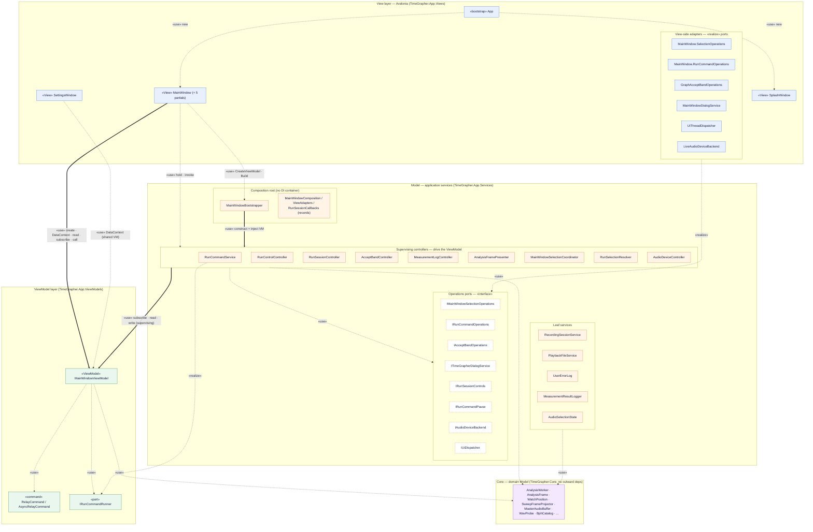
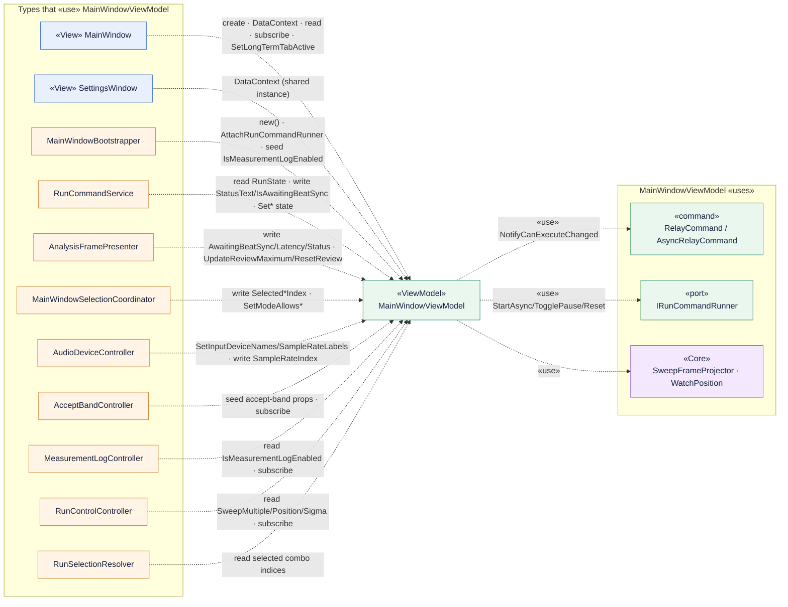
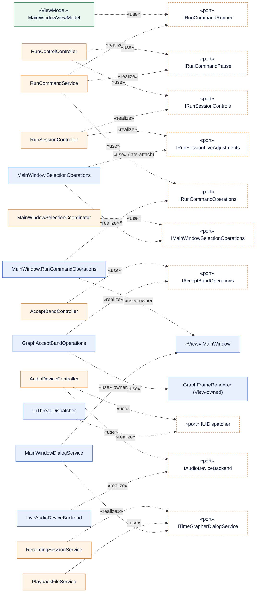

# MVVM «use» Relationship View

> **Scope & method.** This view documents the MVVM `<<use>>` (dependency) relationships of
> `TimeGrapher.App`, derived **strictly from the source code** under `src/TimeGrapher.App/` and
> `src/TimeGrapher.Core/` (no existing design document was consulted). Every edge below has a
> code-level witness; the principal edges were cross-checked against the actual code in an
> adversarial verification pass. Generated 2026-06-21.

## 1. Architecture in one paragraph

`TimeGrapher.App` is an **MVVM application with a supervising-controller / ports-and-adapters**
shape and **no DI container**. There is a single view-model, `MainWindowViewModel`, that holds all
main-window UI state (run-state machine, review-scrub cursor, knob values) and exposes `ICommand`s.
The `MainWindow` View **creates** the view-model, binds it as `DataContext`, **reads** its
properties, **subscribes** to its `PropertyChanged`, and calls a few of its methods. A family of
**controllers** (`RunCommandService`, `AnalysisFramePresenter`, `MainWindowSelectionCoordinator`,
`AudioDeviceController`, `AcceptBandController`, `MeasurementLogController`, `RunControlController`,
`RunSelectionResolver`) are injected with the same view-model and **drive** it — they subscribe to
its changes and read/write its state. Controllers never reference the concrete View: they depend on
**operations ports** (`IRunCommandOperations`, `IMainWindowSelectionOperations`,
`IAcceptBandOperations`, `ITimeGrapherDialogService`, `IRunSessionControls`, `IRunCommandPause`,
`IAudioDeviceBackend`, `IUiDispatcher`) that **View-side adapters realize**. The single
plain-construction composition root is `MainWindowBootstrapper.Build`. `TimeGrapher.Core` (the
domain Model) has no outward dependency — the dependency flow is strictly one-way `App → Core`.

## 2. Legend

| Notation | Meaning |
|---|---|
| `«View»` `«ViewModel»` `«command»` `«port»` `«bootstrap»` | UML stereotype / MVVM role of the type |
| `-.->│«use»│` (dashed arrow) | UML **`<<use>>`** dependency (ctor-param, field, `new`, method-call, read/write property, subscribe) |
| `==>│«use»│` (thick arrow) | An **aggregate** `<<use>>` edge that bundles many concrete edges (used in the overview) |
| `-.->│«realize»│` | Interface realization (a concrete type `implements` a port) |
| Blue = View · Green = ViewModel · Orange = App services · Dashed-border = port interface · Purple = Core | Color key in the diagrams |

---

## 3. Layered `<<use>>` overview

The big picture: the four layers and the dominant cross-layer dependencies. Controller/port/adapter
clusters are aggregated here; sections 4–5 break them out.

---

## 4. ViewModel-centric `<<use>>` detail

The MVVM core: **who uses `MainWindowViewModel`** (left) and **what `MainWindowViewModel` uses**
(right). The view-model itself depends only on its commands, the `IRunCommandRunner` port, and two
Core types — it never references the View or any concrete service.

> **Note — `RunSessionController` is deliberately VM-free.** Unlike the other controllers it does
> **not** take `MainWindowViewModel`; the bootstrapper hands it only an `Action<string> setStatus`
> wired to `viewModel.StatusText = status`. So it pushes status text into the VM indirectly, without
> a compile-time dependency on the view-model.

---

## 5. Ports & adapters — the dependency-inversion loop

How the View stays reachable from the controllers **without** any controller or the view-model
referencing the concrete `MainWindow`: controllers depend on **ports** (`«interface»`); View-side
adapters **realize** those ports and hold the concrete window/renderer. `RunCommandService` closes
the loop by realizing the view-model's own `IRunCommandRunner` port. One **reverse** edge exists
since the selection-ops refactor: the View-side adapter `MainWindow.SelectionOperations` *uses* the
`IRunSessionLiveAdjustments` port (late-attached after `Build`) which the `RunSessionController`
service realizes — so that adapter no longer holds the window for the live volume / simulation-parameter
forwards.

---

## 6. `<<use>>` relationship reference (with code evidence)

### View → ViewModel
| From | Kind | To | Evidence |
|---|---|---|---|
| `MainWindow` | local-new / field | `MainWindowViewModel` | `mViewModel = MainWindowBootstrapper.CreateViewModel();` (MainWindow.axaml.cs:103) |
| `MainWindow` | datacontext | `MainWindowViewModel` | `DataContext = mViewModel;` (MainWindow.axaml.cs:161) |
| `MainWindow` | reads-property | `MainWindowViewModel` | `mViewModel.LiftAngle / UseCOnset / PllEventVeto / SelectedPositionIndex / ReviewCursorTimeS` (BuildRunSettings/BuildTab*Context) |
| `MainWindow` | subscribes-event | `MainWindowViewModel` | `mViewModel.PropertyChanged += mSelectionCoordinator.OnViewModelPropertyChanged;` + `… += OnReviewCursorPropertyChanged;` (:172–173) |
| `MainWindow` | method-call | `MainWindowViewModel` | `mViewModel.SetLongTermTabActive(...)` (:175, :411) |
| `SettingsWindow` | datacontext | `MainWindowViewModel` | `new SettingsWindow { DataContext = mViewModel }` (MainWindow.axaml.cs:292) — **same instance** |

### ViewModel → its dependencies
| From | Kind | To | Evidence |
|---|---|---|---|
| `MainWindowViewModel` | field / local-new / method-call | `AsyncRelayCommand`, `RelayCommand` | fields :25–29; `new …Command(...)` :78–82; `NotifyCanExecuteChanged()` :605–609 |
| `MainWindowViewModel` | field / method-call | `IRunCommandRunner` | `IRunCommandRunner? _runner` :30; `AttachRunCommandRunner(...)` :90; `_runner.StartAsync()/TogglePause()/Reset()` :103/107/79 |
| `MainWindowViewModel` | reads-property | `Core.SweepFrameProjector` | `_sweepMultiple = SweepFrameProjector.DefaultSweepMultiple` :55 |
| `MainWindowViewModel` | method-call | `Core.WatchPosition` | `((WatchPosition)_selectedPositionIndex).ShortName()` :353 |

### Controllers → ViewModel (supervising)
| From | Kind | To | Evidence |
|---|---|---|---|
| `RunCommandService` | ctor-param / read / write / call | `MainWindowViewModel` | `RunCommandService(MainWindowViewModel, IRunCommandOperations)`; `_viewModel.RunState`, `_viewModel.StatusText=`, `SetStarting()/SetRunning()/…/SetModeAllows*()` |
| `AnalysisFramePresenter` | ctor-param / write / call | `MainWindowViewModel` | writes `IsAwaitingBeatSync/LatencyText/StatusText`; calls `UpdateReviewMaximum(...)`, `ResetReview()` |
| `MainWindowSelectionCoordinator` | ctor-param / write / call | `MainWindowViewModel` | writes `SelectedInputDeviceIndex/SelectedSampleRateIndex`; calls `SetModeAllows*` |
| `AudioDeviceController` | ctor-param / call / write | `MainWindowViewModel` | `SetInputDeviceNames(...)`, `SetSampleRateLabels(...)`, `SelectedSampleRateIndex = -1` |
| `AcceptBandController` | ctor-param / write / subscribe | `MainWindowViewModel` | seeds `RateAcceptMin/Max…` then `PropertyChanged +=` |
| `MeasurementLogController` | ctor-param / read / subscribe | `MainWindowViewModel` | reads `IsMeasurementLogEnabled`; `PropertyChanged +=` |
| `RunControlController` | ctor-param / read / subscribe | `MainWindowViewModel` | reads `SweepMultiple/SelectedPositionIndex/ShouldPauseOnPositionChange/SigmaAveraging`; `PropertyChanged +=` |
| `RunSelectionResolver` | ctor-param / read | `MainWindowViewModel` | reads `SelectedAveragingPeriodIndex/SelectedBphIndex/SelectedSimBphIndex/SelectedSampleRateIndex` |
| `MainWindowBootstrapper` | write / method-call | `MainWindowViewModel` | `viewModel.IsMeasurementLogEnabled = …`; `viewModel.AttachRunCommandRunner(runCommandService)` |
| `RunSessionController` | *(none — uses `Action<string>`)* | `MainWindowViewModel` | no VM ctor-param; status flows via the `setStatus` delegate the bootstrapper wires to `viewModel.StatusText` |

### Realizations (`«realize»`)
| Adapter / service (realizer) | Port realized |
|---|---|
| `RunCommandService` | `IRunCommandRunner`, `IRunCommandPause` |
| `RunSessionController` | `IRunSessionControls`, `IRunSessionLiveAdjustments` |
| `MainWindow.RunCommandOperations` (nested) | `IRunCommandOperations` |
| `MainWindow.SelectionOperations` (nested) | `IMainWindowSelectionOperations` |
| `GraphAcceptBandOperations` | `IAcceptBandOperations` |
| `MainWindowDialogService` | `ITimeGrapherDialogService` |
| `LiveAudioDeviceBackend` | `IAudioDeviceBackend` |
| `UiThreadDispatcher` | `IUiDispatcher` |
| `MainWindowSelectionCoordinator` | `ISelectionEventGate` |
| `UserErrorLog`, `NullUserErrorLog` | `IUserErrorLog` |
| `MeasurementResultLogger` | `IMeasurementResultSink` |

### Composition root
`MainWindow` ctor → `MainWindowBootstrapper.CreateViewModel()` + `MainWindowBootstrapper.Build(viewModel, adapters, runSessionCallbacks, AppStartupOptions.Current)`; `Build` constructs every controller/service, injects the view-model + the View-supplied adapters, and returns a `MainWindowComposition` record the View stores in fields.

## 7. Verified invariants

All checked against source (adversarial verification pass, all **confirmed**):

1. **View→VM is strictly one-way.** The View creates/binds/reads/subscribes; the view-model never references the View or any concrete service (it knows only the `IRunCommandRunner` port, attached post-construction).
2. **Controllers drive the VM through injection**, not the other way around — the supervising-controller pattern.
3. **Controllers depend on ports, never the concrete View.** Each operations interface is realized by a View-side adapter that holds the window/renderer.
4. **`MainWindowBootstrapper.Build` is the single plain-construction composition root** (no DI container).
5. **`TimeGrapher.Core` has no outward dependency** — `TimeGrapher.Core.csproj` declares zero project references and no `using TimeGrapher.App`; the flow is one-way `App → Core`.
