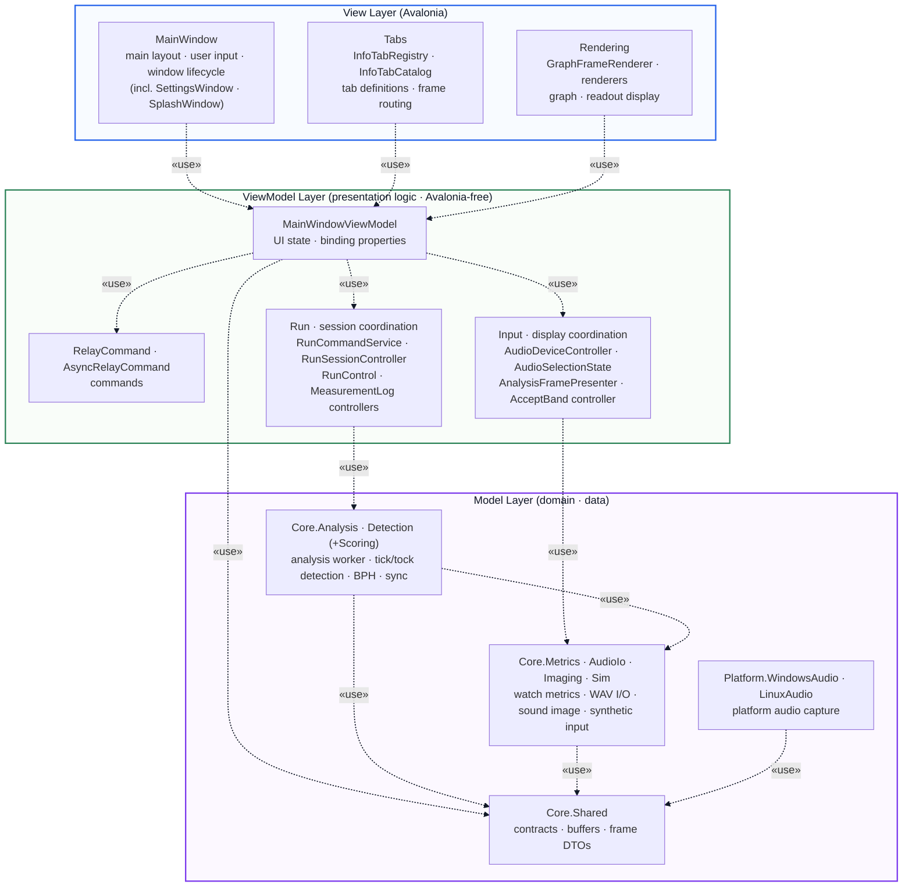

# MVVM View Architecture (Dependency View)

This document presents the UI layer of `TimeGrapher.App` as a dependency
(depends-on) view of the **MVVM model** (for the course presentation — focused on
showing the core MVVM structure rather than implementation detail). Dependencies
flow in **one direction only: View → ViewModel → Model**, with no reverse
dependency.

**Notation (UML dependency).** An arrow points from the *depending* side to the
*depended-on* side (A ┄┄▷ B); the line is dashed and the arrowhead is open (`>`).
The label «use» is a stereotype naming the purpose of the dependency
(reference / call).

## Dependency View (depends-on)

## Key Points

Dependencies flow top to bottom in a single direction; the absence of reverse
dependencies is the defining property of MVVM.

- **The ViewModel does not know the View.** The ViewModel holds no reference to
  the View — UI updates happen through data binding and `PropertyChanged`. That
  is runtime *data flow* (ViewModel→View), not a compile-time dependency, so it
  creates no dependency edge. (`ViewModelPurityTests` locks the ViewModel's
  Avalonia-free boundary.)
- **The Model does not know the ViewModel.** The Model is the lowest layer,
  referencing nothing above it; it builds and tests independently of the UI.
  `Core.Shared` is the contract base and `Core.Analysis` is the hub that
  coordinates the detection and support modules.
- **The helper services belong to the ViewModel layer.** The application
  services that handle run, session, device, and measurement-log concerns are
  presentation / coordination logic, so they are grouped with the ViewModel.
  They use the Model but never reference the View.

## Responsibility Summary

| Layer | Sub-grouping | Responsibility | Representative components |
| --- | --- | --- | --- |
| **View** | Windows | main / aux windows, layout, user input, window lifecycle | `MainWindow`, `SettingsWindow`, `SplashWindow` |
| | Tabs | tab definition / registration, frame routing | `InfoTabRegistry`, `InfoTabCatalog` |
| | Rendering | graph / readout display | `GraphFrameRenderer`, `Rendering/*` |
| **ViewModel** | View-model & commands | UI state, binding properties, commands | `MainWindowViewModel`, `RelayCommand`, `AsyncRelayCommand` |
| | Run & session coordination | run-state transitions, analysis-session lifecycle, measurement log | `RunCommandService`, `RunSessionController`, `MeasurementLogController` |
| | Input & display coordination | device enumeration / selection, frame→VM presentation, accept-band apply | `AudioDeviceController`, `AnalysisFramePresenter`, `AcceptBandController` |
| **Model** | Analysis & detection | beat analysis, tick/tock detection, BPH / sync | `Core.Analysis`, `Core.Detection` (+`Scoring`) |
| | Support modules | metrics, WAV I/O, sound image, synthetic input | `Core.Metrics`, `Core.AudioIo`, `Core.Imaging`, `Core.Sim` |
| | Contracts & platform | shared DTOs / buffers, platform audio capture | `Core.Shared`, `TimeGrapher.Platform.*` |

> This diagram is the presentation ideal. For the precise, class / interface-level
> module dependency graph (seam interfaces, composition root, accepted
> residuals), see [`MODULE_USES_VIEW.md`](MODULE_USES_VIEW.md).
