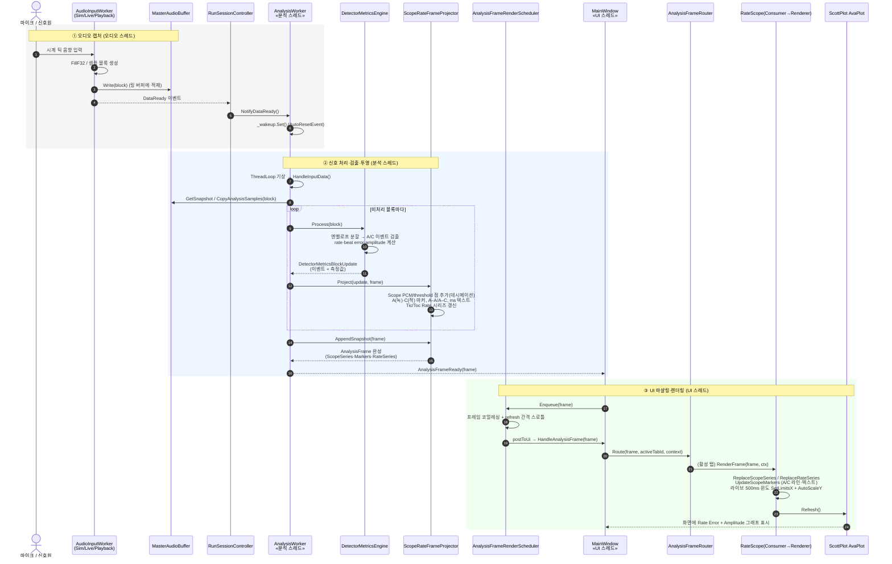

# Rate/Scope 시퀀스 뷰

이 문서는 TimeGrapherNet의 Rate/Scope 탭을 런타임(시퀀스) 관점으로 해석한다. 마이크로 들어온 시계 음향 신호가 검출·측정되어 Rate Error / Amplitude 그래프로 표현되기까지의 객체 간 상호작용을 시간 순서로 보여준다. 정적 모듈 구조는 [MODULE_DECOMPOSITION_VIEW.md](MODULE_DECOMPOSITION_VIEW.md), 역할 분리는 [MVC_VIEW.md](MVC_VIEW.md)를 참고한다.

핵심 흐름은 **세 개의 스레드 경계**를 가로지른다. 오디오 캡처 스레드가 샘플을 링 버퍼에 적재하고, 전용 분석 스레드(`AnalysisWorker`)가 비트 이벤트를 검출해 그래프용 프레임으로 투영하며, UI 스레드가 프레임을 코얼레싱·스로틀한 뒤 활성 탭만 렌더한다. 스레드 간 전달은 `AutoResetEvent`(분석 스레드 기상)와 UI 마샬링(`AnalysisFrameRenderScheduler`)으로 디커플링된다.

## 참여 요소 매핑

| 참여자 | 모듈 / 타입 | 책임 |
|---|---|---|
| AudioInputWorker | `TimeGrapher.Core.Sim.SimWorker`, `TimeGrapher.Platform.LinuxAudio.LinuxLiveAudioWorker`, `TimeGrapher.Core.AudioIo.PlaybackWorker` | 합성/라이브/재생 소스에서 샘플 블록을 만들어 링 버퍼에 적재하고 `DataReady`를 발생 |
| MasterAudioBuffer | `TimeGrapher.Core.Shared.MasterAudioBuffer` | 생산자(오디오)–소비자(분석) 사이의 공유 링 버퍼, 캡처 타임스탬프 보관 |
| RunSessionController | `TimeGrapher.App.Services.RunSessionController` | 워커·버퍼·분석 스레드 배선, `DataReady → NotifyDataReady` 중계 |
| AnalysisWorker | `TimeGrapher.Core.Analysis.AnalysisWorker` | 전용 스레드에서 블록을 소비해 검출·투영을 수행하고 `AnalysisFrameReady`를 발생 |
| DetectorMetricsEngine | `TimeGrapher.Core.Analysis.DetectorMetricsEngine` | 검출기 + 메트릭 파이프라인. A/C 이벤트와 rate·beat error·amplitude 산출 |
| ScopeRateFrameProjector | `TimeGrapher.Core.Analysis.ScopeRateFrameProjector` | 검출 결과를 Rate/Scope용 그래프 시리즈·마커로 투영해 `AnalysisFrame`에 채움 |
| AnalysisFrameRenderScheduler | `TimeGrapher.App.Services.AnalysisFrameRenderScheduler` | 분석 스레드 프레임을 UI 스레드로 마샬링, 코얼레싱·refresh 스로틀 |
| AnalysisFrameRouter | `TimeGrapher.App.Tabs.AnalysisFrameRouter` | 모든 consumer에 `ObserveFrame`, 활성 탭 consumer에만 `RenderFrame` |
| RateScope Consumer/Renderer | `TimeGrapher.App.Rendering.RateScopeFrameConsumer`, `RateScopeRenderer` | 프레임의 시리즈·마커를 ScottPlot 플롯에 반영하고 Refresh |
| ScottPlot AvaPlot | `ScottPlot.Avalonia.AvaPlot` | Rate Error / Amplitude 그래프를 화면에 렌더 |

## 단계별 상호작용

### ① 오디오 캡처 (오디오 워커 스레드)

- 워커(`SimWorker`/`LiveAudioWorker`/`PlaybackWorker`)가 한 블록 분량 샘플을 만들어 `MasterAudioBuffer`에 기록한다.
- 기록 후 `DataReady` 이벤트를 발생시키고, `RunSessionController`가 등록한 핸들러가 `AnalysisWorker.NotifyDataReady()`를 호출한다.
- `NotifyDataReady`는 `AutoResetEvent(_wakeup)`만 set 한다. 캡처와 분석은 이 시점에서 비동기로 분리되어, 오디오 스레드는 블로킹 없이 다음 블록 생성으로 돌아간다.

### ② 신호 처리·검출·투영 (분석 스레드)

- `AnalysisWorker.ThreadLoop`가 기상하면 `HandleInputData()`가 버퍼 스냅샷을 잡고 미처리 샘플을 `CopyAnalysisSamples`로 가져온다.
- 블록마다 `DetectorMetricsEngine.Process(block)`가 엔벨로프를 SILENCE/BURST로 분할해 비트당 두 이벤트(A=onset, C=peak)를 검출하고 rate·beat error·amplitude를 계산해 `DetectorMetricsBlockUpdate`로 반환한다.
- `ScopeRateFrameProjector.Project`가 결과를 그래프 표현으로 투영한다: 데시메이션된 Scope PCM/threshold 점, A(녹)·C(적) 수직 마커, A–A 외향 화살표와 A–C 내향 마커, ms 텍스트, Tic/Toc Rate 시리즈.
- 패스 종료 시 `AppendSnapshot(frame)`이 2초 윈도 트림 후 시리즈·마커·Rate 시리즈를 `AnalysisFrame`에 확정하고, `AnalysisFrameReady(frame)`로 한 프레임을 발행한다.

### ③ UI 마샬링·렌더링 (UI 스레드)

- `MainWindow.OnAnalysisFrameReady`가 프레임을 `AnalysisFrameRenderScheduler.Enqueue`에 넘긴다. 스케줄러는 대기 중 프레임이 있으면 최신본으로 합치고(`MergeTransientSignals`로 일회성 신호 보존), refresh 간격으로 렌더 빈도를 제한한 뒤 UI 스레드로 post 한다.
- UI 스레드에서 `HandleAnalysisFrame`이 세션 ID를 확인하고 `AnalysisFrameRouter.Route(frame, activeTabId, context)`를 호출한다.
- 라우터는 모든 consumer에 `ObserveFrame`을 돌린 뒤 활성 탭 consumer(`RateScopeFrameConsumer`)에만 `RenderFrame`을 호출한다.
- `RateScopeRenderer.RenderFrame`이 Scope/Rate 시리즈를 교체하고 마커를 풀에서 재배치하며, 라이브 추종 중이면 500ms 윈도로 X축을 잡고 Y를 오토스케일한 뒤 `AvaPlot.Refresh()`로 화면을 갱신한다.

## 설계 관찰

| 관찰 | 근거 |
|---|---|
| 검출(Core)과 렌더(App)의 분리 | `TimeGrapher.Core`는 `AnalysisFrame`까지만 생산하고 ScottPlot/Avalonia를 알지 못한다. 렌더는 App 계층 책임이다. |
| 스레드 경계의 비동기 디커플링 | 오디오→분석은 `AutoResetEvent`, 분석→UI는 스케줄러 마샬링으로 분리되어 한 스레드의 지연이 다른 스레드를 블로킹하지 않는다. |
| 프레임 코얼레싱·스로틀 | 분석 프레임(블록당 수십 Hz)이 화면 refresh보다 빠르게 도착해도, 스케줄러가 최신 프레임만 그려 UI 부하를 제한한다. |
| 단일 활성 탭 렌더 | 라우터가 비활성 탭에는 `RenderFrame`을 호출하지 않아(관찰만 수행) 렌더 비용을 활성 탭으로 한정한다. |

이 흐름은 프로젝트의 **저지연·실시간 성능**과 **확장성/수정용이성** 품질 속성을 직접 뒷받침한다. 관련 전술 분석은 [SAP_TACTICS_ANALYSIS.md](SAP_TACTICS_ANALYSIS.md)를 참고한다.

## 비고

이 시퀀스는 Rate/Scope 탭을 기준으로 그렸으나, 캡처→분석→마샬링→라우팅의 골격은 모든 분석 탭이 공유한다. 탭마다 다른 것은 `AnalysisWorker`가 함께 돌리는 프로젝터(예: `SoundPrintFrameProjector`, `SweepFrameProjector`)와 라우터가 활성 탭에 위임하는 consumer/renderer뿐이다. 따라서 새 탭을 추가해도 이 상호작용 골격은 바뀌지 않는다.
