# 실행 수명주기 시퀀스 뷰

이 문서는 TimeGrapherNet의 프로그램 실행부터 입력 모드 선택, 측정 시작, 측정 종료, 프로그램 종료까지의 대표 상호작용 trace를 sequence diagram으로 보여준다. 구조 전체를 모두 나열하는 문서가 아니라, `35 Behavior - intro, sequence diagram, activity diagram, BPMN.pdf`의 sequence diagram 기준처럼 객체 간 상호작용의 특정 흐름과 가능한 대안 경로를 함께 표현한다.

> 입력 모드는 코드 기준의 `RunCommandMode`에 맞춰 `Live`, `Playback`, `Simulation` 세 갈래로 둔다. 사용자 관점의 "측정 종료"는 현재 UI에서 별도 Stop 버튼이 아니라 실행 중단/리셋, Playback/Simulation 자연 종료, 창 종료 경로를 통해 수행된다.

## 추상화 수준

다이어그램은 동작을 설명하는 데 필요한 세로줄만 남긴다. `MainWindowViewModel`, `RunCommandService`, `RunCommandOperations`, `LiveAudioBackend`는 모두 App 계층의 시작/중지 조정 책임으로 묶고, 렌더링과 녹음 저장 세부 경로는 제외한다. Playback의 WAV 파일 선택은 입력 소스 선택이므로 남긴다.

## 시퀀스 다이어그램

```mermaid
%%{init: {"theme": "base", "themeVariables": {"activationBkgColor": "#bfdbfe", "activationBorderColor": "#1d4ed8", "labelBoxBkgColor": "#f8fafc", "labelBoxBorderColor": "#64748b", "labelTextColor": "#0f172a", "loopTextColor": "#14532d"}}}%%
sequenceDiagram

    actor User as User
    participant App as "App layer<br/>MainWindow/ViewModel/RunCommandService"
    participant Sess as "RunSessionController"
    participant Input as "Input worker<br/>Live/Playback/Simulation"
    participant Buffer as "MasterAudioBuffer"
    participant Analysis as "AnalysisWorker"
    participant Core as "Core pipeline<br/>Detection/Metrics/Projectors"

    User->>App: 프로그램 실행
    activate App
    App->>App: UI, ViewModel, command/service 구성
    activate App
    deactivate App
    App->>App: Live devices + Playback + Simulation source 목록 구성
    activate App
    deactivate App
    deactivate App

    User->>App: Start 선택
    activate App
    App->>App: RunState = Starting<br/>CurrentMode 결정
    activate App
    deactivate App

    rect rgb(219, 234, 254)
        alt Live mode
            App->>App: live backend 설정<br/>device/rate/gain 검증
            activate App
            deactivate App
            App->>Sess: PrepareInputRun(sampleRate)
            activate Sess
            Sess->>Sess: runSessionToken 발급
            activate Sess
            deactivate Sess
            Sess->>Buffer: new MasterAudioBuffer(sampleRate)
            activate Buffer
            Buffer-->>Sess: buffer
            deactivate Buffer
            Sess->>Analysis: new AnalysisWorker(buffer, config)
            activate Analysis
            Analysis-->>Sess: analysis worker
            deactivate Analysis
            Sess->>Analysis: Start()
            activate Analysis
            Analysis-->>Sess: analysis thread started
            deactivate Analysis
            Sess-->>App: buffer + runSessionToken
            deactivate Sess
            App->>Input: create live worker<br/>Start(device, sampleRate, gain)
            activate Input
            Input-->>App: capture thread started
            deactivate Input

        else Playback mode
            App->>User: WAV 파일 선택 요청
            User-->>App: WAV 파일 선택
            App->>App: 이전 live audio 상태 저장<br/>Playback source/rate 적용
            activate App
            deactivate App
            App->>Sess: PrepareInputRun(sampleRate)
            activate Sess
            Sess->>Sess: runSessionToken 발급
            activate Sess
            deactivate Sess
            Sess->>Buffer: new MasterAudioBuffer(sampleRate)
            activate Buffer
            Buffer-->>Sess: buffer
            deactivate Buffer
            Sess->>Analysis: new AnalysisWorker(buffer, config)
            activate Analysis
            Analysis-->>Sess: analysis worker
            deactivate Analysis
            Sess->>Analysis: Start()
            activate Analysis
            Analysis-->>Sess: analysis thread started
            deactivate Analysis
            Sess-->>App: buffer + runSessionToken
            deactivate Sess
            App->>Input: new PlaybackWorker(buffer, rate)<br/>Start(filePath)
            activate Input
            Input-->>App: playback thread started
            deactivate Input

        else Simulation mode
            App->>App: WatchSynthStreamConfig 구성<br/>Simulation source/rate 적용
            activate App
            deactivate App
            App->>Sess: PrepareInputRun(sampleRate)
            activate Sess
            Sess->>Sess: runSessionToken 발급
            activate Sess
            deactivate Sess
            Sess->>Buffer: new MasterAudioBuffer(sampleRate)
            activate Buffer
            Buffer-->>Sess: buffer
            deactivate Buffer
            Sess->>Analysis: new AnalysisWorker(buffer, config)
            activate Analysis
            Analysis-->>Sess: analysis worker
            deactivate Analysis
            Sess->>Analysis: Start()
            activate Analysis
            Analysis-->>Sess: analysis thread started
            deactivate Analysis
            Sess-->>App: buffer + runSessionToken
            deactivate Sess
            App->>Input: new SimWorker(buffer, rate)<br/>Start(config)
            activate Input
            Input-->>App: sim thread started
            deactivate Input
        end
    end

    App->>App: RunState = Running<br/>Status = "Running"
    activate App
    deactivate App
    deactivate App

    rect rgb(220, 252, 231)
        loop 측정 중: 입력 block마다
            activate Input
            Input->>Buffer: WriteSamples(block)
            activate Buffer
            Buffer-->>Input: samples stored
            deactivate Buffer
            Input-->>Sess: DataReady
            deactivate Input

            activate Sess
            Sess->>Sess: runSessionToken 확인
            activate Sess
            deactivate Sess
            Sess->>Analysis: NotifyDataReady()
            activate Analysis
            Analysis-->>Sess: wakeup signaled
            deactivate Analysis
            deactivate Sess

            activate Analysis
            Analysis->>Buffer: CopyAnalysisSamples()
            activate Buffer
            Buffer-->>Analysis: analysis block
            deactivate Buffer
            Analysis->>Core: Process(block)
            activate Core
            Core-->>Analysis: detection / metrics / projected frame data
            deactivate Core
            Analysis-->>App: AnalysisFrameReady(frame)
            activate App
            App->>App: 최신 frame으로 UI 상태/화면 갱신
            activate App
            deactivate App
            App-->>Analysis: frame accepted
            deactivate App
            deactivate Analysis
        end
    end

    rect rgb(219, 234, 254)
        alt 사용자가 측정 종료를 요청한 경우
            User->>App: Pause 후 Reset 또는 내부 stop 요청
            activate App
            App->>App: RunState = Stopping
            activate App
            deactivate App
            App->>Sess: StopInputWorker(CurrentMode)
            activate Sess
            Sess->>Input: TryStop(timeout)
            activate Input
            Input-->>Sess: stopped
            deactivate Input
            Sess-->>App: input stopped
            deactivate Sess
            App->>Sess: StopAnalysisThread()
            activate Sess
            Sess->>Analysis: TryStop(timeout)
            activate Analysis
            Analysis-->>Sess: stopped
            deactivate Analysis
            Sess-->>App: analysis stopped
            deactivate Sess
            App->>Sess: InvalidateRunSession()
            activate Sess
            Sess-->>App: token advanced
            deactivate Sess
            opt Playback 또는 Simulation이면
                App->>App: RestorePlaybackOrSimulationAudioState()
                activate App
                deactivate App
            end
            App->>App: RunState = Stopped<br/>Status = "Stopped" 또는 "Reset"
            activate App
            deactivate App
            deactivate App

        else Playback/Simulation 입력이 자연 종료된 경우
            Input-->>App: DoneReadingFile / SimDone
            activate App
            App->>Sess: IsCurrentRunSession(token)
            activate Sess
            Sess-->>App: current
            deactivate Sess
            App->>Sess: InvalidateRunSession()
            activate Sess
            Sess-->>App: token advanced
            deactivate Sess
            App->>Sess: StopInputWorker(Playback/Simulation)
            activate Sess
            Sess->>Input: TryStop(timeout)
            activate Input
            Input-->>Sess: stopped
            deactivate Input
            Sess-->>App: input stopped
            deactivate Sess
            App->>Sess: StopAnalysisThread(completeInput: true)
            activate Sess
            Sess->>Analysis: CompleteInput(timeout)
            activate Analysis
            Analysis->>Core: DrainAndFlushInput()
            activate Core
            Core-->>Analysis: final projected data
            deactivate Core
            Analysis-->>App: final AnalysisFrameReady(frame)
            activate App
            App-->>Analysis: final frame accepted
            deactivate App
            Analysis-->>Sess: completed
            deactivate Analysis
            Sess-->>App: analysis completed
            deactivate Sess
            App->>App: RestorePlaybackOrSimulationAudioState()
            activate App
            deactivate App
            App->>App: RunState = Stopped<br/>Status = "Stopped"
            activate App
            deactivate App
            deactivate App
        end
    end

    User->>App: 프로그램 종료
    activate App
    App->>App: OnWindowClosed()
    activate App
    deactivate App
    App->>Sess: InvalidateRunSession()
    activate Sess
    Sess-->>App: token advanced
    deactivate Sess
    App->>Sess: StopInputWorker("Input")
    activate Sess
    Sess->>Input: TryStop(timeout)
    activate Input
    Input-->>Sess: stopped
    deactivate Input
    Sess-->>App: input stopped
    deactivate Sess
    App->>Sess: StopAnalysisThread()
    activate Sess
    Sess->>Analysis: TryStop(timeout)
    activate Analysis
    Analysis-->>Sess: stopped
    deactivate Analysis
    Sess-->>App: analysis stopped
    deactivate Sess
    App-->>User: 프로세스 종료
    deactivate App
```

## 표기 기준

| 표기 | 의미 |
|---|---|
| `alt` | 하나의 실행 trace 안에서 조건에 따라 갈라지는 입력 모드 또는 종료 경로. Mermaid 기본 `rect`로 옅은 파란 배경을 둔다 |
| `opt` | Playback/Simulation에서만 필요한 상태 복원처럼 조건부로 실행되는 상호작용 |
| `loop` | 입력 worker가 오디오 block을 쓰고 분석 worker가 frame을 만드는 반복 흐름. Mermaid 기본 `rect`로 옅은 초록 배경을 둔다 |
| `activate` / `deactivate` | 호출을 수행하는 동안의 focus of control 세로 막대. Mermaid 기본 테마 변수로 전체 막대 색만 통일한다 |
| `RunSessionController`의 token 확인 | 오래된 입력 콜백이 새 실행 세션을 깨뜨리지 않게 하는 timestamp tactic |

## 근거 모듈

| 책임 | 코드 위치 |
|---|---|
| 실행 상태 전이 | `src/TimeGrapher.App/Services/RunCommandService.cs`, `RunCommandService.States.cs` |
| 세션 token, worker attach/stop, 분석 worker 시작 | `src/TimeGrapher.App/Services/RunSessionController.cs` |
| Live/Playback/Simulation 시작과 종료 wiring | `src/TimeGrapher.App/Views/MainWindow.RunLifecycle.cs`, `MainWindow.RunCommandOperations.cs` |
| Live backend 선택 | `src/TimeGrapher.App/Audio/LiveAudioBackend.cs` |
| 공통 입력 worker 계약 | `src/TimeGrapher.Core/Shared/IAudioInputWorker.cs`, `ILiveAudioWorker.cs` |
| 오디오 ring buffer와 분석 처리 | `src/TimeGrapher.Core/Shared/MasterAudioBuffer.cs`, `src/TimeGrapher.Core/Analysis/AnalysisWorker.cs` |

## 아키텍처 해석

- Layered View 기준으로 App은 UI/controller 계층에서 Core와 플랫폼 어댑터를 사용하고, Core는 App/UI/플랫폼을 알지 않는다.
- MVC View 기준으로 사용자 입력은 App 계층(`MainWindow`, `MainWindowViewModel`, `RunCommandService`)에서 조정되고, 분석 데이터는 Core와 `AnalysisWorker`를 거쳐 App 계층에 전달된다.
- SAP tactics 기준으로 실행 세션 token은 `timestamp`, 입력/분석 분리는 `introduce concurrency`, 실행 상태 객체는 State Pattern에 해당한다.
