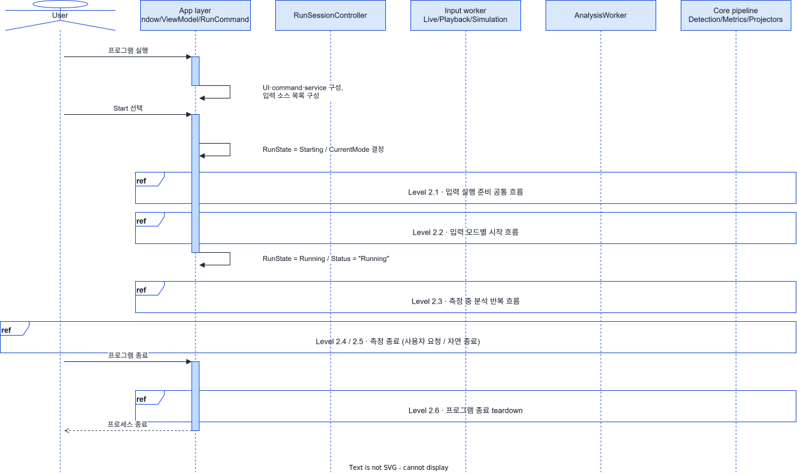
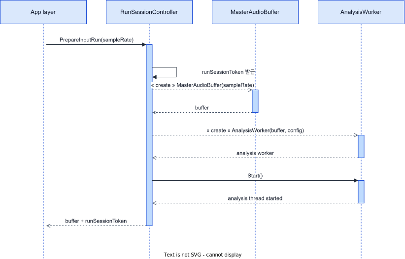
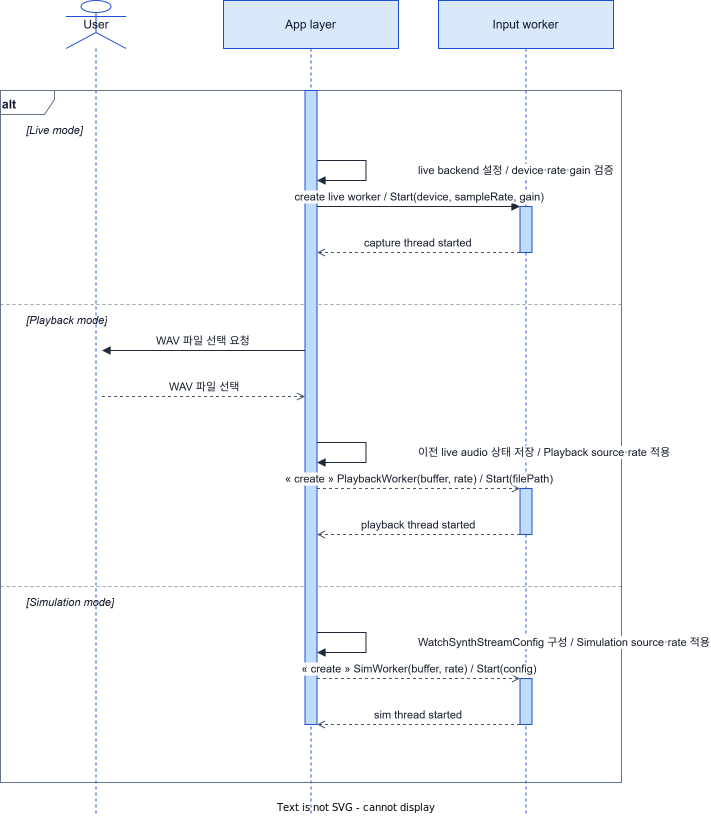
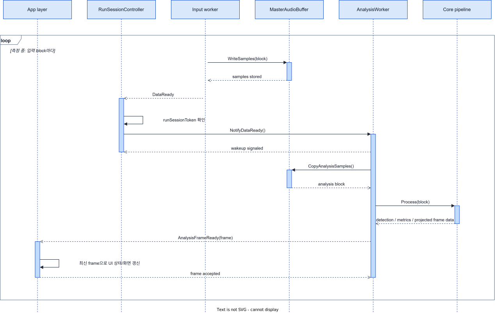
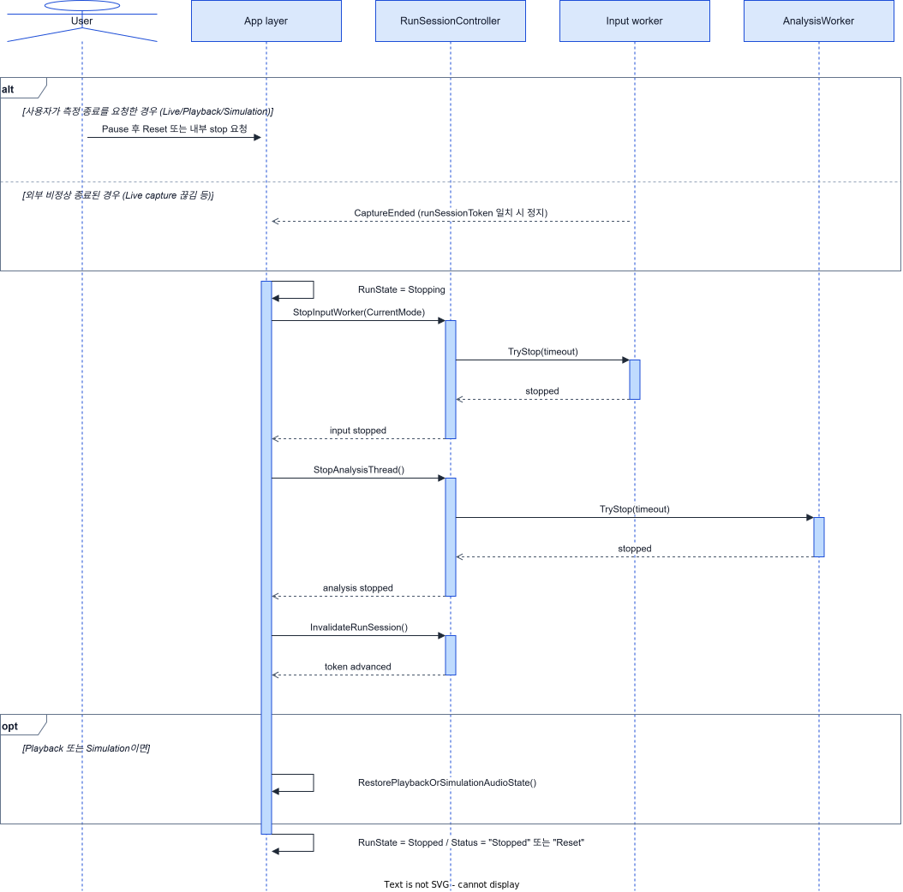
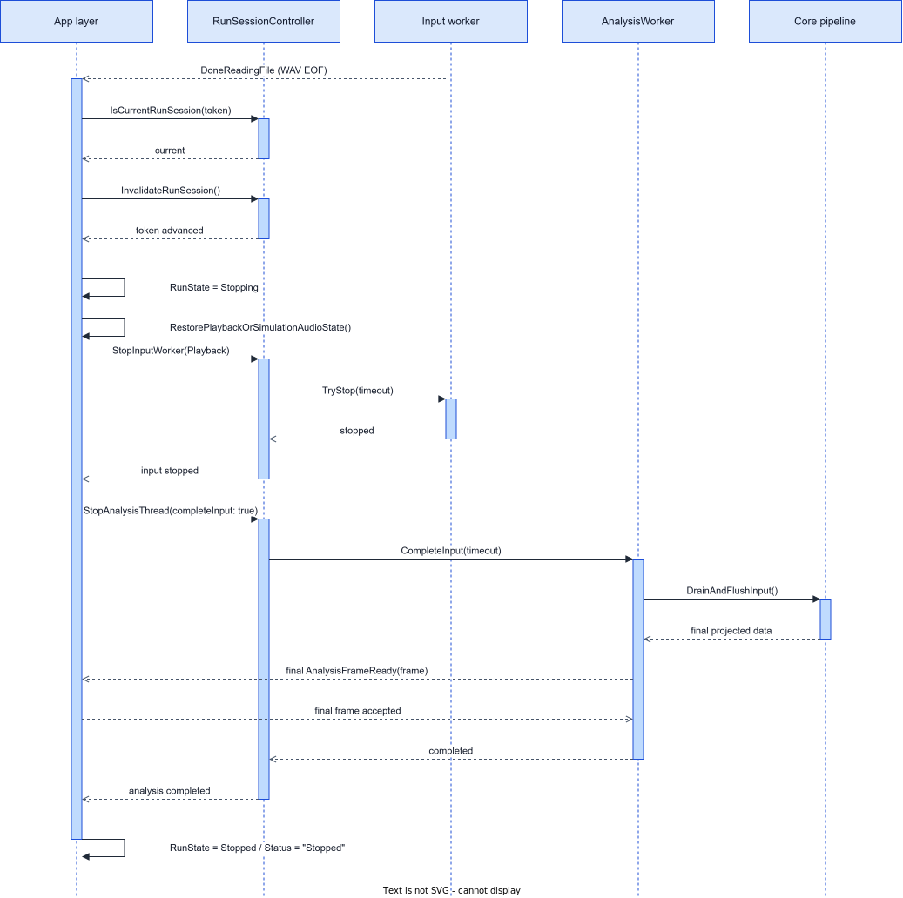
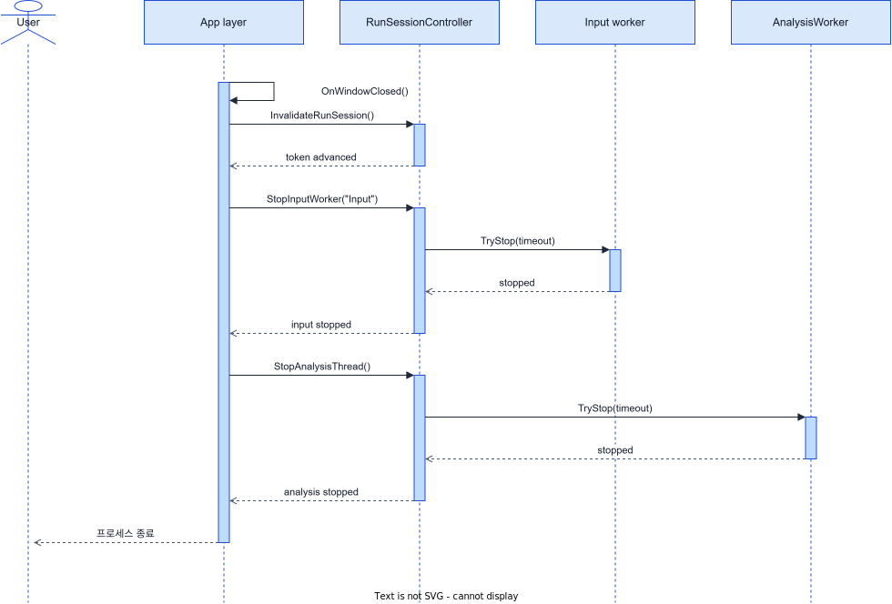

# 실행 수명주기 시퀀스 뷰

| 페이지 | 내용 |
| --- | --- |
| Level 1 | 실행 수명주기 개요 |
| Level 2.1 | 입력 실행 준비 공통 흐름 |
| Level 2.2 | 입력 모드별 시작 흐름 |
| Level 2.3 | 측정 중 분석 반복 흐름 |
| Level 2.4 | 측정 종료 (사용자 요청 / 외부 비정상 종료) |
| Level 2.5 | Playback 자연 종료 |
| Level 2.6 | 프로그램 종료 teardown |

## 참여 객체 (lifeline)

다이어그램의 lifeline은 역할명만 표시한다. 각 역할의 구성요소는 다음과 같다.

| Lifeline | 포함 구성요소 |
| --- | --- |
| User | 사용자 |
| App layer | `MainWindow`, `MainWindowViewModel`, `RunCommandService` — UI·시작/중지 orchestration |
| RunSessionController | 실행 세션 token, 입력 worker attach/stop, 분석 worker 수명 |
| Input worker | Live=`AudioCaptureWorker`, Playback=`PlaybackWorker`, Simulation=`SimWorker` |
| MasterAudioBuffer | 입력↔분석 공유 오디오 ring buffer |
| AnalysisWorker | 분석 스레드 |
| Core pipeline | Detection / Metrics / Projectors |

## Level 1 · 실행 수명주기 개요

실행 → 시작 → 측정 → 종료 골격만 보여주고, 세부 흐름은 `ref [Level 2.x]`로 가린다.

## Level 2 · 세부 시퀀스

### Level 2.1 · 입력 실행 준비 공통 흐름

세 입력 모드가 공통으로 거치는 분석 세션 준비: `PrepareInputRun`, `runSessionToken` 발급, `MasterAudioBuffer` 생성, `AnalysisWorker` 생성/시작.

### Level 2.2 · 입력 모드별 시작 흐름

Live / Playback / Simulation의 소스 준비와 worker 생성 차이만 `alt`로 표시한다.

### Level 2.3 · 측정 중 분석 반복 흐름

입력 block마다 `Input → Buffer → AnalysisWorker → Core → App UI 갱신`이 반복된다. 이 루프는 Live·Simulation에서는 정지 전까지 무한 반복되고, Playback에서는 WAV EOF에서 자연 종료한다(→ Level 2.5).

### Level 2.4 · 측정 종료 (사용자 요청 / 외부 비정상 종료)

두 트리거가 같은 즉시 정지 시퀀스로 수렴한다: **사용자 요청**(Reset/내부 stop — Live/Playback/Simulation 모두), 또는 **외부 비정상 종료**(Live capture가 device 끊김 등으로 스스로 끝남 — `CaptureEnded` → `StopRunAndRefreshDevices`). 입력·분석 worker를 `TryStop`으로 멈추고 세션을 무효화하며, Playback/Simulation이면 오디오 상태를 복원한 뒤 `RunState = Stopped`로 전이한다. Simulation은 자연 종료가 없어, **사용자 요청 정지의 `TryStop` interruption으로만 무한 생성 루프가 끝난다.**

### Level 2.5 · Playback 자연 종료

Playback은 WAV 파일이 끝나면(`DoneReadingFile`) 현재 세션을 확인·무효화하고 `RunState = Stopping`으로 전이한 뒤 오디오 상태를 복원한다. 이어서 `CompleteInput` → `DrainAndFlushInput`으로 마지막 frame까지 반영하고 정리한다. (Simulation은 무한 생성이라 자연 종료가 없으며, 정지는 Level 2.4를 따른다.)

### Level 2.6 · 프로그램 종료 teardown

창이 닫히면(`OnWindowClosed`) 현재 세션을 먼저 무효화한 뒤 입력·분석 worker를 정지하고 프로세스를 종료한다.

## 표기 규칙

메시지 라벨은 종류에 따라 다르게 적는다.

| 메시지 종류 | 표기 | 예 |
| --- | --- | --- |
| Actor(User) ↔ 시스템 | 사용자의 행위·의도로 적는다 (사용자는 메서드를 호출하지 않는다) | `프로그램 실행`, `Start 선택`, `WAV 파일 선택`, `프로그램 종료` |
| 시스템 객체 간 호출 | 오퍼레이션 시그니처(메서드명)로 적어 코드 추적성을 둔다 | `PrepareInputRun(sampleRate)`, `TryStop(timeout)` |
| self-message | 상태 효과는 행위, 단일 메서드 호출은 메서드명 | `RunState = Stopping`(효과) / `OnWindowClosed()`(메서드) |

- `RunState = X`는 실행 제어 상태를 가리키는 맥락 표기이며, 전이 규칙은 [상태 머신 다이어그램](RUN_LIFECYCLE_STATE_MACHINE.md)에서 다룬다.
