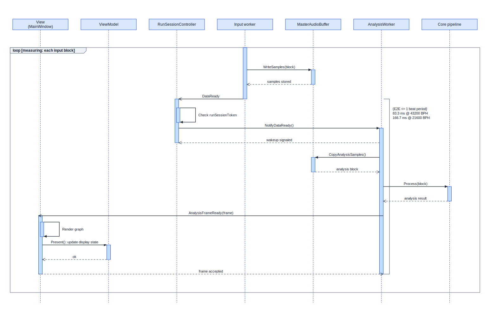
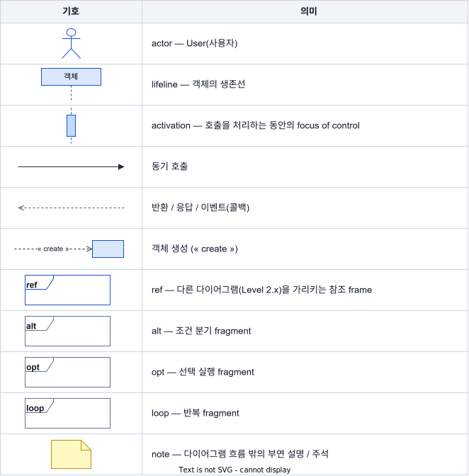

# 실행 수명주기 시퀀스 뷰 (MVVM)

측정 실행(run)의 시작 → 측정 → 종료 동안 객체들이 "누가 누구를 호출하나"를 보여주는 동작(behavior) 뷰다. MVC → MVVM 리팩토링 이후의 **View / ViewModel / RunCommandService** 협력 구조를 반영한다.

> 반복 루프가 있어 가장 세분화가 필요한 **측정 흐름만 Level 2 자식 뷰**로 분리했다.

## 문서 로드맵

| 페이지 | 내용 |
| --- | --- |
| Level 1 | 실행 수명주기 개요 |
| Level 2 | 측정 중 분석 반복 흐름 (Level 1의 `ref`를 펼친 자식 뷰) |

## 1. 주 표현 (Primary Presentation) · Level 1 · 실행 수명주기 개요

한 장에 수명주기 전체를 담는다. 세부 분석 반복은 `ref`로 접고 Level 2에서 펼친다.

실행 제어 상태(`RunState`)의 전이는 이 뷰에서 표현하지 않고 [상태 머신 뷰](RUN_LIFECYCLE_STATE_MACHINE.md)에서 다룬다.

## 2. 요소 카탈로그 (Element Catalog)

각 lifeline의 역할과 근거 코드. `MasterAudioBuffer`·`Core pipeline`은 Level 2에서만 등장한다.

| Lifeline | MVVM 레이어 | 책임 | 코드 위치 |
| --- | --- | --- | --- |
| User | (actor) | 사용자 | — |
| View (`MainWindow`) | View | UI 이벤트 수신, 렌더링·스레드 마샬링, `RunSessionController`로 입력·분석 worker 수명 구동, 서비스의 `IRunCommandOperations` 콜백 구현 | `src/TimeGrapher.App/Views/MainWindow*.cs` |
| ViewModel (`MainWindowViewModel`) | ViewModel | `PlayPauseCommand`/`ResetCommand` 노출, 관찰 가능한 `RunState`/`StatusText`. 도메인을 직접 호출하지 않음 | `src/TimeGrapher.App/ViewModels/MainWindowViewModel.cs` |
| RunCommandService | App 서비스 (State Pattern) | 시작/일시정지/정지 오케스트레이션. ViewModel 상태를 갱신하고 `IRunCommandOperations`로 View를 호출 | `src/TimeGrapher.App/Services/RunCommandService*.cs` |
| RunSessionController | Model 경계 | 실행 세션 token, 입력 worker attach/stop, 분석 worker 수명 | `src/TimeGrapher.App/Services/RunSessionController.cs` |
| Input worker | Model | Live=`AudioCaptureWorker`, Playback=`PlaybackWorker`, Simulation=`SimWorker` | `App.Audio` / `Core.AudioIo` / `Core.Sim` |
| MasterAudioBuffer | Model | 입력↔분석 공유 오디오 ring buffer | `TimeGrapher.Core` |
| AnalysisWorker | Model | 분석 스레드 | `TimeGrapher.Core.Analysis` |
| Core pipeline | Model | Detection / Metrics / Projectors | `TimeGrapher.Core` |

## 3. 동작 (Behavior) · Level 2 · 측정 중 분석 반복 흐름

Level 1의 측정 `ref`를 펼친 **자식 뷰**다. 반복 조건과 시간 제약은 다이어그램 안에 표시한다.

## 4. 표기 (Notation)

공통 표기는 아래 범례 이미지를 따른다.

라벨 규칙: User↔시스템 화살표는 사용자의 의도/행위, 객체 간 화살표는 오퍼레이션 시그니처다.

## 5. 가변성 (Variability)

입력 소스(Live / Playback / Simulation)가 유일한 변이점이며, 런타임에 `CurrentMode` 분기로 처리된다.

## 6. 설계 근거 (Design Rationale)

- **결정**: MVC의 단일 거대 컨트롤러(`MainWindow`)에 섞여 있던 UI 상태·명령·실행 오케스트레이션을 MVVM 세 역할로 분리했다 — View(렌더링·플랫폼·세션 배선), ViewModel(바인딩 가능한 상태/명령), RunCommandService(실행 상태기계, State Pattern).
- **근거**: 관심사 분리로 수정용이성·시험용이성을 높인다. ViewModel은 도메인을 직접 호출하지 않아 윈도 없이 단위 테스트가 가능하고(`RunState`/명령 활성화 로직), 서비스↔View 결합은 `IRunCommandRunner`(명령 본문 주입)와 `IRunCommandOperations`(서비스→View 콜백) 인터페이스로 역전해 의존을 단방향으로 유지한다.
- **기각한 대안**: View가 명령 본문을 `Func`/`Action` 델리게이트로 ViewModel에 주입하던 MVC 잔재 방식. 명령이 자기 본문을 ViewModel 안에 두도록 `IRunCommandRunner`를 주입하는 방식으로 대체했다.
- **의도된 예외**: Playback 자연 종료·프로그램 종료는 worker 완료/창 닫힘 콜백을 받는 View가 직접 처리하여 `RunCommandService`를 우회한다.

## 7. 관련 뷰 (Related Views)

- [상태 머신 다이어그램](RUN_LIFECYCLE_STATE_MACHINE.md) — 같은 실행 수명주기를 제어 상태(`RunUiState` + State Pattern)의 전이로 본 자매 뷰.
- [원본 실행 수명주기 시퀀스 뷰](../RUN_LIFECYCLE_SEQUENCE_VIEW.md) — 레벨링 이전 단일 시퀀스(아직 MVVM 분리를 반영하지 않을 수 있음).
- 편집 원본: [sequence.drawio](sequence.drawio) — draw.io로 직접 편집하는 단일 소스. SVG 갱신은 `python _drawio_to_svg.py`([_drawio_to_svg.py](_drawio_to_svg.py))로 한다(draw.io 설치 불필요). 초기 골격 생성기 [_gen_sequence.py](_gen_sequence.py)는 보관용이며, 다시 실행하면 수동 편집한 drawio를 덮어쓴다.
