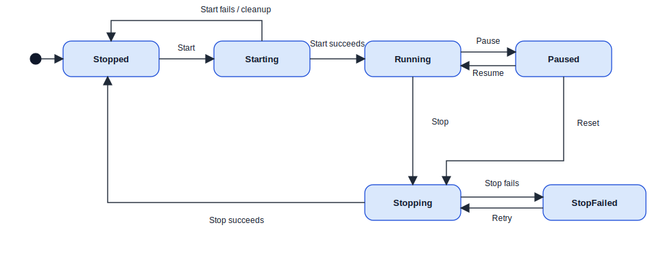

# 실행 수명주기 상태 머신

> English version: [Run lifecycle state machine](RUN_LIFECYCLE_STATE_MACHINE_EN.md)

`RunCommandService`의 실행 제어 상태(State Pattern)와 `MainWindowViewModel.RunState`(`RunUiState`)를 상태 머신으로 본 뷰다. 객체 간 호출 순서는 [시퀀스 뷰](RUN_LIFECYCLE_SEQUENCE_VIEW_LEVELED.md)에서, 실행 제어 상태의 변화는 이 문서에서 다룬다.

편집 원본: [state.drawio](state.drawio)

## 1. 범위

이 상태 머신의 기준 상태 값은 `RunUiState`다. `RunCommandService`는 현재 `RunUiState`에 맞는 상태 객체(`StoppedState`, `RunningState` 등)를 선택하고, 각 상태 객체가 `StartAsync`, `TogglePause`, `StopRunWithoutReset`, `StopRunAndRefreshDevices`, `Reset` 명령을 허용하거나 무시한다.

실제 worker 생성·정지·녹음 close·장치 복원은 `IRunCommandOperations` 포트를 통해 View 쪽 구현으로 위임된다. 따라서 이 뷰는 "어떤 상태로 넘어가는가"를 표현하고, 입력 worker/분석 worker의 상세 호출 순서는 시퀀스 뷰에 둔다.

## 2. 상태

| 상태 | 코드 기준 의미 |
| --- | --- |
| `Stopped` | 측정 중이 아닌 기본 상태. 시작 전 설정을 바꿀 수 있고, `StartAsync`가 허용된다. |
| `Starting` | 시작 절차 진행 중. 중복 시작·정지·리셋 명령은 무시된다. |
| `Running` | 입력 worker와 분석 worker가 동작 중인 상태. Pause 또는 stop intent가 허용된다. |
| `Paused` | worker는 살아 있고 입력만 pause gate에 걸린 상태. Resume 또는 Reset이 허용된다. |
| `Stopping` | stop intent를 수행 중인 상태. 정지가 아직 끝나지 않은 경우 Stop/Reset 재시도 표면이 유지된다. |
| `StopFailed` | worker stop timeout 또는 recording close 실패로 완전 정지에 실패한 상태. Stop/Reset 재시도로 같은 pending intent를 다시 수행한다. |

## 3. 전이

| From → To | 트리거 / 조건 | 코드 근거 |
| --- | --- | --- |
| initial → `Stopped` | 앱 시작 시 기본값 | `MainWindowViewModel._runState = RunUiState.Stopped` |
| `Stopped` → `Starting` | Play/Pause 버튼의 Start | `StoppedState.StartAsync` → `StartFromStoppedAsync` → `SetStarting` |
| `Starting` → `Running` | Live / Playback / Simulation 시작 성공 | `StartLiveAsync` / `StartPlaybackAsync` / `StartSimulationAsync`가 View 쪽 `SetGuiRunMode` 호출 |
| `Starting` → `Stopped` | 시작 실패 또는 사용자가 Playback 파일 선택 취소 | `CleanupFailedStart`, `ShowStartFailureAsync`, `SetStopped` |
| `Running` → `Paused` | Pause | `RunningState.TogglePause` → `PauseRunning` → `SetWorkersPaused(true)` |
| `Paused` → `Running` | Resume | `PausedState.TogglePause` → `ResumePaused` → `SetWorkersPaused(false)` |
| `Running` → `Stopping` | 외부 stop intent: live capture 종료, playback/simulation 자연 종료 등 | `StopRunWithoutReset`, `StopRunAndRefreshDevices`, `CompletePlaybackOrSimulationRun` |
| `Paused` → `Stopping` | Reset | `PausedState.Reset` → `ResetFromPaused` → `BeginStop(ResetAfterStop)` |
| `Stopping` → `Stopped` | worker stop, analysis stop, audio close 성공 | `CompleteStop`, `SetStopped` |
| `Stopping` → `StopFailed` | worker stop timeout 또는 recording close 실패 | `RunCommandStopOutcome.Stopping` 또는 `CloseAudio() == false` |
| `StopFailed` → `Stopping` | Stop 또는 Reset 재시도 | `StopFailedState.StopRunWithoutReset/Reset` → `RetryPendingStop` |

다이어그램은 `Running` → `Stopping`을 `Stop`, `Paused` → `Stopping`을 `Reset`으로 분리해 표현한다. 실제 UI에서는 `Running` 동안 Reset 버튼이 비활성이고, 사용자 리셋 경로는 Pause 후 Reset으로 들어온다. `Running`에서의 정지는 내부 stop 요청, live capture 종료, playback/simulation 완료 같은 경로가 담당한다.

## 4. Stop Intent

`RunCommandService`는 정지 중 실패하더라도 사용자의 의도를 잃지 않도록 `_pendingStopIntent`를 보관한다.

| Intent | 진입 경로 | 성공 시 후처리 |
| --- | --- | --- |
| `StopOnly` | 일반 stop 요청 | 세션 무효화, 필요 시 Playback/Simulation 오디오 상태 복원, `Stopped` |
| `RefreshDevicesAfterStop` | Live capture 비정상 종료 후 장치 목록 갱신 | `Stopped` 후 `RefreshDevices` |
| `ResetAfterStop` | Paused 상태에서 Reset | `Stopped` 전환 후 `ResetRunState`, `RefreshDevices`, Status=`Reset` |

`StopFailed`에서 재시도하면 보관된 intent를 다시 수행한다. pending intent가 없으면 `StopOnly`로 간주한다.

## 5. 자연 종료와 실패 복구

Playback / Simulation worker가 파일 끝 또는 합성 입력 종료로 자연 완료되면 View가 `CompletePlaybackOrSimulationRun`을 실행한다. 이 경로는 `RunCommandService`의 버튼 명령을 거치지 않지만 같은 `RunUiState`를 사용한다.

- 완료 처리 시작: `SetGuiStoppingMode`로 `Stopping`.
- 입력 worker stop + 분석 worker `CompleteInput` + audio close 성공: `SetGuiStopMode`로 `Stopped`.
- worker timeout 또는 audio close 실패: `SetStopFailed`로 복구 대기.

Live capture가 예기치 않게 끝나면 `StopRunAndRefreshDevices`를 통해 `RunCommandService` 경로로 들어오며, 정지 성공 후 장치 목록을 갱신한다. 창 종료는 복구 UI가 사라지는 shutdown 경로라 상태 머신의 재시도 표면에는 포함하지 않는다.

## 6. UI 파생 상태

`RunUiState`는 버튼 활성화와 라벨도 함께 결정한다.

| UI 속성 | 상태 조건 |
| --- | --- |
| 실행 설정 활성화 | `Stopped` |
| Play/Pause 활성화 | `Stopped`, `Running`, `Paused` |
| Reset 활성화 | `Stopped`, `Paused`, `Stopping`, `StopFailed` |
| Play/Pause 라벨 | `Stopped`=`Start`, `Paused`=`Resume`, 그 외=`Pause` |
| Review bar 활성화 | `Paused` |

`Paused`를 벗어날 때는 review cursor를 먼저 지워서 정지/재개 후 오래된 scrub 표시가 남지 않게 한다.

## 7. 근거 모듈

| 책임 | 코드 위치 |
| --- | --- |
| 상태 값과 UI 파생 속성 | `src/TimeGrapher.App/ViewModels/MainWindowViewModel.cs` (`RunUiState`) |
| 상태 객체와 명령 허용/무시 규칙 | `src/TimeGrapher.App/Services/RunCommandService.States.cs` |
| 시작·정지 전이와 pending stop intent | `src/TimeGrapher.App/Services/RunCommandService.cs` |
| worker/audio/session 작업 포트 | `src/TimeGrapher.App/Services/IRunCommandOperations.cs` |
| View 쪽 포트 구현 | `src/TimeGrapher.App/Views/MainWindow.RunCommandOperations.cs` |
| Live/Playback/Simulation 시작·자연 종료 | `src/TimeGrapher.App/Views/MainWindow.RunLifecycle.cs` |
| input/analysis worker stop outcome | `src/TimeGrapher.App/Services/RunSessionController.cs` |

## 8. 표기

- 채워진 원: 초기 의사상태(initial pseudostate).
- 둥근 사각형: `RunUiState` 상태.
- 화살표: 상태 전이. 라벨은 사용자 명령 또는 내부 stop/completion intent를 요약한다.

> SAP tactics 기준으로 실행 상태 객체는 State Pattern에 해당한다. 시퀀스 뷰에 흩어진 `RunState = X` 맥락은 이 상태 머신의 상태를 가리킨다.
