# 데이터 모델 뷰

TimeGrapherNet은 데이터베이스가 없다. 영속되는 도메인 엔티티는 WAV 파일뿐이고(분석 CSV 로그는 `--analysis-log` CLI 옵션으로만, 측정 CSV 로그는 `--measurement-log` CLI 옵션 또는 Settings 토글로 남기는 선택적 진단·증거 산출물로 별도 영속), 나머지는 실행 중 생성·전달·렌더링되는 런타임 도메인 데이터 구조다. 아래 클래스 다이어그램은 주요 데이터 엔티티와 그 관계(1:1, 1:n, 집약/합성, 일반화/특수화)를 보여준다.

> 개념(conceptual) 노드 안내: `AnalysisRun`, `AudioSource` 및 그 특수화(`LiveAudioSource`/`PlaybackSource`/`SimSource`)는 단일 실재 클래스가 아니다. 한 번의 분석 세션 수명주기와 입력 소스 종류를 나타내는 도메인 개념으로, 실제로는 `AnalysisWorker`·`RunCommandService`·세 입력 워커(`AudioCaptureWorker`/`LinuxLiveAudioWorker`, `PlaybackWorker`, `SimWorker`)와 `RunCommandMode` 열거형에 분산되어 구현된다. 이들 노드의 속성은 실제 설정/런타임 사용에 근거한 표시용이다.

```mermaid
classDiagram
direction TB

class AnalysisRun {
    <<conceptual>>
    +ulong SessionId
    +RunCommandMode Mode
}

class RunCommandMode {
    <<enumeration>>
    Unknown
    Live
    Playback
    Simulation
}

class TgSyncStatus {
    <<enumeration>>
    NotSynced
    Synced
    Mismatch
}

class AnalysisRunSettings {
    +int SampleRate
    +double LiftAngle
    +int AveragingPeriod
    +bool UseCOnset
    +bool AutoBph
    +int ManualBph
    +double HpfCutoffHz
    +int SoundImageWidth
    +int SoundImageHeight
    +int ScopeSnapshotPointBudget
    +int AnalysisBlockSize
    +bool WeakAOnsetRescue
    +int WeakAOnsetRescueStrengthStep
    +bool SpuriousBeatRejection
}

class AudioSource {
    <<conceptual>>
}

class LiveAudioSource {
    <<conceptual>>
    +double Gain
}

class PlaybackSource {
    <<conceptual>>
    +string FilePath
}

class SimSource {
    <<conceptual>>
    +double Bph
    +double RateErrorSPerDay
    +double BeatErrorMs
}

class LiveAudioDevice {
    +int Number
    +string Name
}

class WatchSynthStreamConfig {
    +uint SampleRateHz
    +double Bph
    +double RateErrorSPerDay
    +double BeatErrorMs
    +double WatchAmplitudeDegrees
    +double LiftAngleDegrees
    +int EnableRealisticPacket
    +double ImpulseNoiseRatePerSecond
    +음향/노이즈/패킷 모델 등 다수 필드 생략
}

class WatchSynthEventKind {
    <<enumeration>>
    Tick
    Tock
}

class WatchSynthStreamEvent {
    +ulong BeatIndex
    +WatchSynthEventKind Kind
    +double TimeS
    +ulong SampleIndex
    +double IntervalFromPreviousUs
    +double AppliedIntervalOffsetUs
    +double TimingJitterUs
    +double BphWanderUs
    +double PacketGain
    +double AToCTimeS
    +double WatchAmplitudeDegrees
    +double LiftAngleDegrees
    +double AClusterLevelScale
    +double BClusterLevelScale
    +double CClusterLevelScale
}

class WatchSynthStreamFillResult {
    +ulong FirstSampleIndex
    +ulong NextSampleIndex
    +int SamplesWritten
    +int EventsWritten
    +int EventsDropped
}

class WavFile {
    <<conceptual>>
    +string Path
    +RIFF/WAVE 바이트
}

class WavFormatInfo {
    +ushort AudioFormat
    +ushort NumChannels
    +int SampleRate
    +uint ByteRate
    +ushort BlockAlign
    +ushort BitsPerSample
    +long DataOffset
    +uint DataSize
}

class WavData {
    +int SampleRate
    +float[] Samples
}

class MasterAudioBuffer {
    +const int Channels = 1
    +const int SecondsOfBuffer = 30
    +WriteSamples()
    +CopyAnalysisSamples()
    +TryGetCaptureTimestamp()
}

class AnalysisFrame {
    +ulong SessionId
    +ulong SourceId
    +int SampleRate
    +bool InputOverrun
    +ulong InputSamplesDropped
    +ulong PendingSamples
    +ulong AnalysisLagSamples
    +double ProcessingElapsedMs
    +int DeadlineDegradationLevel
    +long CaptureTimestamp
    +bool CaptureTimestampIsLowerBound
    +long ProcessingCompletedTimestamp
    +ulong MissedBeats
    +uint SyncLossCount
    +bool BeatSynced
    +ulong GraphTickEnd
    +bool SoundImageUpdated
    +bool SpectrogramImageUpdated
    +int SpectrogramLiveColumn
    +long SpectrogramTotalColumns
    +double SpectrogramColumnSeconds
    +double SpectrogramBeatPeriodS
    +double BackgroundFps
    +double BackgroundSps
    +double BackgroundSpf
    +double ForegroundFps
    +double ForegroundSps
    +double ForegroundSpf
    +SignalQualityAssessment SignalQuality
}

class GraphSeriesFrame {
    +string Id
    +IReadOnlyList~double~ X
    +IReadOnlyList~double~ Y
    +bool Replace
    +double TicPhaseOffsetMs
}

class ScopeFilterSample {
    +double F0
    +double F1
    +double F2
    +double F3
}

class ScopeVerticalMarker {
    +double X
    +double Height
    +uint Color
}

class ScopeHorizontalMarker {
    +HorizontalMarkerDirection Direction
    +double XLeft
    +double XRight
    +double Length
    +double Height
    +uint Color
}

class ScopeTextMarker {
    +double X
    +double Height
    +string Text
    +uint Color
    +MarkerTextAlignment Alignment
}

class WatchMetricsUpdate {
    +bool TicRateUpdated
    +bool TocRateUpdated
    +IReadOnlyList~double~ XTic
    +IReadOnlyList~double~ YTic
    +IReadOnlyList~double~ XToc
    +IReadOnlyList~double~ YToc
    +bool ResultsUpdated
    +string ResultsText
    +string CMarkerText
    +bool BeatTimingSampleUpdated
    +BeatTimingSample BeatTimingSample
    +bool AmplitudeSampleUpdated
    +AmplitudeSample AmplitudeSample
    +bool DerivedMeasuresUpdated
    +DerivedTimingMeasures DerivedMeasures
    +bool AveragePeriodRateIntervalUpdated
    +AveragePeriodRateInterval AveragePeriodRateInterval
}

class BeatTimingSample {
    +ulong BeatNumber
    +double TimeS
    +bool IsTic
    +double RateErrorMs
    +bool RateValid
    +double RateSPerDay
    +bool BeatErrorValid
    +double BeatErrorSignedMs
    +int Bph
}

class AmplitudeSample {
    +double TimeS
    +bool InstantValid
    +double InstantDeg
    +bool PairAverageUpdated
    +double PairAverageDeg
}

class DerivedTimingMeasures {
    +bool DiffTicTacValid
    +double DiffTicTacMs
    +bool DiffPeriodValid
    +double DiffPeriodMs
    +bool AvgPeriodValid
    +double AvgPeriodMs
}

class BeatMetricsHistorySnapshot {
    +ulong Version
    +MetricsHistorySeries Rate
    +MetricsHistorySeries Amplitude
    +MetricsHistorySeries BeatError
    +DerivedTimingMeasures Derived
    +IReadOnlyList~AveragePeriodRateInterval~ AveragePeriodRateIntervals
    +bool RateValid
    +double RateSPerDay
    +int Bph
    +bool AmplitudeValid
    +double AmplitudeDeg
    +bool BeatErrorValid
    +double BeatErrorSignedMs
    +double LatestTimeS
    +double StatsElapsedS
    +StatsSummary RateStats
    +StatsSummary AmplitudeStats
    +WatchPosition ActivePosition
    +IReadOnlyList~PositionSummary~ Positions
    +IReadOnlyList~PositionChange~ PositionChanges
}

class WatchPosition {
    <<enumeration>>
    CH
    CB
    P6H
    P9H
    P3H
    P12H
    P6H45
    P9H45
    P3H45
    P12H45
}

class PositionSummary {
    +WatchPosition Position
    +StatsSummary Rate
    +StatsSummary Amplitude
    +StatsSummary BeatError
}

class PositionChange {
    +double TimeS
    +WatchPosition Position
}

class StatsSummary {
    +bool Valid
    +double Min
    +double Max
    +double Mean
    +double Sigma
    +long Count
}

class MetricsHistorySeries {
    +IReadOnlyList~double~ X
    +IReadOnlyList~double~ Y
    +IReadOnlyList~double~ YMin
    +IReadOnlyList~double~ YMax
}

class BeatSegmentsSnapshot {
    +ulong Version
    +IReadOnlyList~BeatSegment~ Segments
    +IReadOnlyList~BeatNoiseMarker~ Markers
    +double LiftAngleDeg
    +BeatNoiseAverageSnapshot Average
    +SignalQualityFlags Quality
}

class BeatNoiseMarker {
    +double TimeS
    +BeatNoiseMarkerKind Kind
}

class BeatNoiseMarkerKind {
    <<enumeration>>
    A
    CPeak
    COnset
}

class BeatSegment {
    +ReadOnlyMemory~float~ Samples
    +bool RawValid
    +ReadOnlyMemory~float~ RawMin
    +ReadOnlyMemory~float~ RawMax
    +double MsPerPoint
    +double StartTimeS
    +bool IsTic
    +double AOffsetMs
    +float PeakValue
    +bool CPeakValid
    +double CPeakOffsetMs
    +bool COnsetValid
    +double COnsetOffsetMs
    +SignalQualityFlags Quality
}

class BeatNoiseAverageSnapshot {
    +bool SigmaEnabled
    +bool Frozen
    +int IntervalsPerLane
    +double MsPerPoint
    +int Lane1Count
    +int Lane2Count
    +IReadOnlyList~float~ Lane1
    +IReadOnlyList~float~ Lane2
    +double Lane1MeanPeak
    +double Lane2MeanPeak
    +IReadOnlyList~BeatNoiseAverageMilestone~ Milestones
}

class BeatNoiseAverageMilestone {
    +int IntervalCount
    +IReadOnlyList~float~ Lane1
    +IReadOnlyList~float~ Lane2
}

class PixelBuffer {
    +int Width
    +int Height
    +uint[] Pixels
}

class TgBphMode {
    <<enumeration>>
    Auto
    Manual
}

class TgEventType {
    <<enumeration>>
    Unknown
    A
    C
}

class TgCPlacement {
    <<enumeration>>
    Peak
    Onset
}

class TgConfig {
    +double SampleRate
    +TgBphMode BphMode
    +int ManualBph
    +double HpfCutoffHz
    +double EnvelopeSmoothMs
    +double SyncTolerancePct
    +double AutoDetectSeconds
    +int SyncLossMisses
    +double PllPeriodGain
    +double PllAcGain
    +double OnsetFractionInit
    +double MinPeakFractionInit
    +bool SuppressPreSyncEvents
    +TgCPlacement CPlacement
    +double PhaseGuideOnsetRescueScale
    +double AcquisitionPeakGateFraction
}

class TgResult {
    +TgSyncStatus SyncStatus
    +int DetectedBph
    +double MeasuredPeriodS
    +List~TgEvent~ Events
    +float[] ProcessedPcm
    +int ProcessedPcmLen
    +ulong ProcessedPcmStartSample
    +bool SyncLostEvent
    +bool SyncAcquiredEvent
    +bool DetectorResetEvent
    +float OnsetThreshold
    +float MinPeakThreshold
    +float NoiseFloor
    +float ReferencePeak
}

class TgEvent {
    +double TimeSeconds
    +ulong SampleIndex
    +double SubSampleOffset
    +float PeakValue
    +TgEventType Type
    +bool IsPreSync
    +ulong OnsetSampleIndex
    +double OnsetSubSampleOffset
    +double OnsetTimeSeconds
    +bool OnsetValid
}

class DetectorResultSnapshot {
    +TgSyncStatus SyncStatus
    +int DetectedBph
    +double MeasuredPeriodS
    +IReadOnlyList~TgEvent~ Events
    +ReadOnlyMemory~float~ ProcessedPcm
    +int ProcessedPcmLen
    +ulong ProcessedPcmStartSample
    +bool SyncLostEvent
    +bool SyncAcquiredEvent
    +bool DetectorResetEvent
    +float OnsetThreshold
    +float MinPeakThreshold
    +float NoiseFloor
    +float ReferencePeak
    +ulong MissedBeats
    +uint SyncLossCount
    +SignalQualityAssessment QualityAssessment
}

class DetectorMetricsEngineConfig {
    +int SampleRate
    +double LiftAngle
    +int AveragingPeriod
    +bool UseCOnset
    +bool AutoBph
    +int ManualBph
    +double HpfCutoffHz
    +double AmplitudeOnsetLatencyS
    +double PhaseGuideOnsetRescueScale
    +double AcquisitionPeakGateFraction
}

class DetectorMetricsBlockUpdate {
    +DetectorResultSnapshot Result
    +IReadOnlyList~DetectedEventUpdate~ DisplayEvents
    +IReadOnlyList~DetectedEventUpdate~ MetricsEvents
}

class DetectedEventUpdate {
    +TgEvent Event
    +double EventSample
    +WatchMetricsUpdate MetricsUpdate
}

class SignalQualityClass {
    <<enumeration>>
    Unknown
    Good
    Noisy
    WeakSignal
    Unstable
}

class SignalQualityFlags {
    <<enumeration>>
    None
    WeakSignal
    NoisySignal
    CTimingUnstable
    PossibleFalseC
    ClippedSignal
    NoSignal
}

class SignalQualityFeatures {
    +float SnrDb
    +float PeakMarginRatio
    +float NoiseFloorLevel
    +float IntervalJitterCv
    +float PeakLevelCv
    +float MissedBeatRate
    +float SyncLossRate
    +float SyncedFraction
}

class SignalQualityAssessment {
    +SignalQualityClass Class
    +float Confidence
    +SignalQualityFeatures Features
}

class AveragePeriodRateInterval {
    +double StartBeatIndex
    +double EndBeatIndex
    +double StartTimeS
    +double EndTimeS
    +double RateSPerDay
    +bool AmplitudeValid
    +double AmplitudeDeg
    +bool BeatErrorValid
    +double BeatErrorMs
}

class HorizontalMarkerDirection {
    <<enumeration>>
    Outward
    Inward
}

class MarkerTextAlignment {
    <<enumeration>>
    LeftTop
    CenterTop
}

AudioSource <|-- LiveAudioSource
AudioSource <|-- PlaybackSource
AudioSource <|-- SimSource

AnalysisRun "1" --> "1" RunCommandMode : 실행 모드
AnalysisRun "1" *-- "1" AnalysisRunSettings : 설정으로 사용
AnalysisRun "1" *-- "1" AudioSource : 입력 소스 선택
AnalysisRun "1" *-- "1" MasterAudioBuffer : 소유
AnalysisRun "1" o-- "0..*" AnalysisFrame : 생성

LiveAudioSource "1" --> "1" LiveAudioDevice : 캡처 대상
PlaybackSource "1" --> "1" WavFile : 읽음
SimSource "1" *-- "1" WatchSynthStreamConfig : 합성 파라미터
WatchSynthStreamConfig "1" --> "0..*" WatchSynthStreamEvent : 합성 시 그라운드트루스 이벤트(FillF32)
WatchSynthStreamConfig "1" --> "0..*" WatchSynthStreamFillResult : FillF32 채움 결과
WatchSynthStreamEvent "1" --> "1" WatchSynthEventKind : 틱/톡 구분

WavFile "1" *-- "1" WavFormatInfo : 포맷 포함
WavFile "1" --> "0..1" WavData : 전체 파일 디코딩(WavFileReader, Verify·벤치마크용)
WavFile "1" --> "0..*" MasterAudioBuffer : 라이브 재생 시 PlaybackWorker가 블록 디코딩·스트리밍
WavData "1" --> "0..*" MasterAudioBuffer : 벤치마크 경로(AnalysisBenchmarkRunner)가 디코딩 샘플 공급
MasterAudioBuffer "1" --> "1" TgResult : 데이터 흐름(소유 아님, 분석 워커가 블록을 읽어 엔진 파이프라인에 투입). TgResult 1개는 DetectorMetricsEngine이 소유·재사용해 채움

TgConfig "1" --> "1" TgResult : 검출 설정(엔진 내부 재사용 결과)
TgConfig "1" --> "1" TgBphMode : BPH 모드
TgConfig "1" --> "1" TgCPlacement : C 배치
TgResult "1" --> "1" TgSyncStatus : sync 상태
TgResult "1" *-- "0..*" TgEvent : 이벤트 목록
TgEvent "1" --> "1" TgEventType : 이벤트 종류
DetectorResultSnapshot "1" --> "1" TgSyncStatus : sync 상태
DetectorMetricsEngineConfig "1" --> "0..*" DetectorMetricsBlockUpdate : 공유 엔진 계약(블록당 산출)
DetectorMetricsEngineConfig "1" --> "1" TgConfig : 엔진이 내부 검출기 설정 파생
DetectorMetricsBlockUpdate "1" *-- "1" DetectorResultSnapshot : 원검출 스냅샷
DetectorMetricsBlockUpdate "1" o-- "0..*" DetectedEventUpdate : 표시/메트릭 이벤트
DetectedEventUpdate "1" *-- "1" WatchMetricsUpdate : 이벤트별 메트릭

AnalysisFrame "1" *-- "0..*" GraphSeriesFrame : 스코프/레이트 시리즈
ScopeFilterSample "1" --> "0..*" GraphSeriesFrame : Filter Scope F0–F3 투영(MultiFilterFrameProjector)
AnalysisFrame "1" *-- "0..*" ScopeVerticalMarker : 수직 마커
AnalysisFrame "1" *-- "0..*" ScopeHorizontalMarker : 수평 마커
AnalysisFrame "1" *-- "0..*" ScopeTextMarker : 텍스트 마커
AnalysisFrame "1" *-- "1" WatchMetricsUpdate : 수치 결과
AnalysisFrame "1" o-- "0..1" PixelBuffer : 사운드 이미지
AnalysisFrame "1" o-- "0..1" PixelBuffer : 스펙트로그램 이미지
AnalysisFrame "1" o-- "0..1" BeatMetricsHistorySnapshot : 누적 이력 공유
AnalysisFrame "1" o-- "0..1" BeatSegmentsSnapshot : 최근 비트 윈도우 공유

WatchMetricsUpdate "1" *-- "1" BeatTimingSample : A 이벤트별(Updated 플래그)
WatchMetricsUpdate "1" *-- "1" AmplitudeSample : C 이벤트별(Updated 플래그)
WatchMetricsUpdate "1" *-- "1" DerivedTimingMeasures : A 이벤트별(Updated 플래그)
BeatMetricsHistorySnapshot "1" *-- "3" MetricsHistorySeries : Error Rate/amplitude/BEAT ERROR
BeatMetricsHistorySnapshot "1" *-- "2" StatsSummary : 현재 위치 안정도 통계
BeatMetricsHistorySnapshot "1" --> "1" WatchPosition : 신규 비트 태깅
BeatMetricsHistorySnapshot "1" *-- "0..10" PositionSummary : 측정된 위치만
BeatMetricsHistorySnapshot "1" *-- "0..*" PositionChange : 위치 전환 이력(시작 포함, 시간순)
PositionSummary "1" --> "1" WatchPosition : 위치 식별
PositionChange "1" --> "1" WatchPosition : 전환 후 위치
PositionSummary "1" *-- "3" StatsSummary : Error Rate/amplitude/BEAT ERROR
BeatSegmentsSnapshot "1" o-- "0..8" BeatSegment : 최근 비트(최대 8), 오래된 순
BeatSegmentsSnapshot "1" o-- "0..*" BeatNoiseMarker : A/C 이벤트 마커(절대 스트림 시간)
BeatSegmentsSnapshot "1" *-- "1" BeatNoiseAverageSnapshot : Scope 2 레인 상태
BeatNoiseMarker "1" --> "1" BeatNoiseMarkerKind : 마커 종류
BeatNoiseAverageSnapshot "1" *-- "0..5" BeatNoiseAverageMilestone : 10/20/30/40/50 중간 평균 스냅샷

ScopeHorizontalMarker "1" --> "1" HorizontalMarkerDirection : 마커 방향
ScopeTextMarker "1" --> "1" MarkerTextAlignment : 텍스트 정렬
DetectorResultSnapshot "1" o-- "0..1" SignalQualityAssessment : 권고용 품질 주석(기능 ON일 때만)
AnalysisFrame "1" o-- "0..1" SignalQualityAssessment : 윈도우 품질 주석(권고용, 이벤트 미변경)
SignalQualityAssessment "1" *-- "1" SignalQualityFeatures : 도출 피처 벡터
SignalQualityAssessment "1" --> "1" SignalQualityClass : 품질 등급
BeatSegment "1" --> "1" SignalQualityFlags : 품질 플래그
BeatSegmentsSnapshot "1" --> "1" SignalQualityFlags : 품질 플래그
WatchMetricsUpdate "1" --> "0..1" AveragePeriodRateInterval : 완료 구간(Updated 플래그)
BeatMetricsHistorySnapshot "1" o-- "0..*" AveragePeriodRateInterval : 완료된 Avg. Period Error Rate 구간
```

## 엔티티 요약

| 엔티티 | 소속 | 의미 |
|---|---|---|
| `WavFile`, `WavFormatInfo`, `WavData` | `Core.AudioIo` | 영속/디코딩된 오디오 데이터. `WavData`는 `WavFileReader.ReadMonoFloat`의 전체 파일 디코딩 결과로, Verify는 이를 `DetectorMetricsEngine`에 블록 단위로 직접 공급하고 분석 벤치마크(`AnalysisBenchmarkRunner`)는 `MasterAudioBuffer`에 써넣어 `AnalysisWorker`로 흘린다. 라이브 재생은 `PlaybackWorker`가 `WavFile`을 블록 단위로 디코딩해 `MasterAudioBuffer`에 스트리밍한다(WavData 미경유). 녹음은 별도 `QueuedWavStreamWriter` 경로다. `WavFile`은 개념 노드(파일 자체). 재생/읽기 경로는 `WavAcceptanceProfile`(`RequireIeeeFloat32`·`RequireMono`·`AcceptedSampleRates`)로 지원 WAV을 게이트한다(`PlaybackFloatMonoStandardRates` 프로파일을 `WavFileReader`/`PlaybackWorker`가 사용) |
| `AnalysisRunSettings` | `TimeGrapher.App` | 사용자가 고른 실행 파라미터(`AnalysisWorker.Config`로 변환). 적응형 floor·regime guard는 기본 동작이다. `AnalysisBlockSize`는 검출기 입력 블록(윈도우) 크기(샘플)로 `Config.AnalysisBlockSize`로 흐른다. `WeakAOnsetRescue`(App "Weak-A onset rescue" 토글, 기본 on)가 꺼지면 `PhaseGuideOnsetRescueScale = 0.0`으로 변환된다. 켜지면 `WeakAOnsetRescueStrengthStep`(0=Safer, 5=Standard, 10=Stronger; 기본 0=Safer)을 `1.25 - step × 0.05`로 변환해 `PhaseGuideOnsetRescueScale`에 넣고 `DetectorMetricsEngineConfig`→`TgConfig.PhaseGuideOnsetRescueScale`로 흐른다(post-lock 약한 A onset 구제). 같은 방식으로 `SpuriousBeatRejection`(App "Enhanced Auto BPH" 토글, 기본 on)이 켜지면 `AcquisitionPeakGateFraction = 0.35`(꺼지면 0.0)으로 변환되어 `DetectorMetricsEngineConfig`→`TgConfig.AcquisitionPeakGateFraction`로 흐른다(미동기 acquisition 구간에서 하프비트 약한 잡음을 제거해 BPH 2× alias 방지) |
| `AppSettings`, `AppSettingsStore`, `SamplingSettings`, `AcceptBandSettings`, `LeftPanelSettings`, `SettingsWindowSettings` | `TimeGrapher.App` | 사용자 UI 설정 스냅샷. `AppSettingsStore`가 OS별 per-user application-data 폴더(Windows `%AppData%`, Linux/Raspberry Pi `$XDG_CONFIG_HOME` 또는 `~/.config`, macOS `~/Library/Application Support`) 아래 `TimeGrapher/settings.json` 한 파일에 저장한다. application-data 루트가 없으면 상대경로로 내려가지 않고 경로 생성 단계에서 실패한다. `SamplingSettings`는 설정 창 Run Parameters의 Avg. Period(초), 분석 블록 크기(검출기 입력 윈도우, 샘플), 캡처 버퍼 길이(ms)이고 실행 시작 시점에 읽혀 다음 실행부터 적용된다. `AcceptBandSettings`는 Error Rate/Amplitude/Beat Error 정상 밴드이며 변경 즉시 그래프에 live 적용된다. `LeftPanelSettings`는 좌측 패널의 입력 소스 표시명, sample rate, gain, BPH/lift angle, simulation 파라미터를 저장하고, 장치·sample rate는 시작 후 실제 목록에 matching될 때만 복원된다. `SettingsWindowSettings`는 Use C-onset, Weak-A onset rescue(기본 on), Weak-A rescue strength step(0..10, 기본 0=Safer), Enhanced Auto BPH(기본 on), position-change pause, high-pass cutoff, measurement-log 토글을 저장한다. 누락·손상·invalid JSON 및 필수 필드가 빠진 partial JSON은 `AppSettings.Default`로 폴백하고, 예전 settings 파일에 `WeakAOnsetRescueStrengthStep`만 없으면 Safer step 0으로 로드한다. Avg. Period는 완료 구간의 같은 위상 period 차이 평균을 s/24h Error Rate로 변환하지만, 상단바 Error Rate는 그래프/히스토리와 동일한 rolling RLS 값(단일 rate 소스)을 표시한다. 상단바 Amplitude와 BEAT ERROR는 같은 완료 구간의 쌍평균 진폭/절대 beat error 평균을 표시한 뒤 다음 구간 완료 전까지 유지한다. 그래프/히스토리 이벤트 시리즈는 기존 A/C 이벤트 샘플(RLS rate, 부호 beat error, tic/toc 쌍평균 진폭)을 계속 사용하고, 완료된 Error Rate 구간만 `AveragePeriodRateInterval`로 별도 보존해 Rate/Scope와 Beat Error의 Error Rate 그래프에 구간 overlay로 표시한다. 캡처 버퍼는 Windows `BufferMilliseconds`/Linux `pw-record --latency`·`arecord --buffer-time`로 매핑하며 기본값(`LiveAudioDefaults.BufferMilliseconds`)에서는 플래그를 생략해 현 동작을 보존 |
| `VerdictBeatPolicy` | `TimeGrapher.App.Rendering` | Vario, Positions, Health 판정이 Measuring에서 실제 판정으로 넘어가기 전에 요구하는 최소 beat 수를 제공한다. 값은 `SettingsWindowSettings.VerdictMinimumBeats`에서 읽고 기본값은 30이며, Settings 창 Assessment / Verdict Beats에서 1..999 범위로 편집·저장된다. 같은 측정 세션 안에서 판정 기준이 바뀌지 않도록 실행 중에는 입력이 잠긴다. 예전 settings 파일에 필드가 없으면 기본 30으로 로드되므로 기존 사용자 설정 파일은 그대로 유효하다 |
| `AudioSource` 특수화 | App 실행 모드 / Core 워커 | 라이브 마이크, WAV 재생, 합성 신호 입력. 단일 클래스가 아니라 `RunCommandMode`와 세 워커로 표현되는 개념 |
| `LiveAudioDevice` | `Core.Shared` | 라이브 입력 장치(번호/이름) |
| `WatchSynthStreamConfig` | `Core.Sim` | 합성 워치 스트림 설정. BPH·Error Rate·BEAT ERROR·진폭/리프트각 외에 패킷·공진·노이즈·임펄스 모델 등 다수 필드. 다이어그램은 대표 필드만 표시 |
| `WatchSynthStreamEvent`, `WatchSynthStreamFillResult`, `WatchSynthEventKind` | `Core.Sim` | 합성 스트림의 그라운드트루스 사이드채널. `FillF32`가 비트별 진실 이벤트(틱/톡·시간·샘플·간격오프셋·진폭·리프트각, 그리고 패킷에 적용된 A/B/C 클러스터 레벨 스케일 `AClusterLevelScale`/`BClusterLevelScale`/`CClusterLevelScale` — B를 A·C로 오인할 위험을 라벨링하는 진실값)와 채움 결과(쓴/드롭 샘플·이벤트 수)를 반환해 `Verify`의 이벤트 수준 채점(`DetectionScorer`) 진실값으로 사용 |
| `MasterAudioBuffer` | `Core.Shared` | 입력 워커(쓰기)와 분석 워커(읽기) 간 공유 모노 float 링버퍼(30초). 입력 throughput 카운터와 지연 보고용 캡처 타임스탬프 조회 제공 |
| `TgConfig`, `TgResult`, `TgEvent` | `Core.Detection` | 검출기 설정 / sync 상태·처리 PCM·이벤트 목록·sync edge 플래그·검출 임계값 / A·C 이벤트(`TgEvent.Type`로 구분, C-onset 메타 포함). `TgResult`는 `DetectorMetricsEngine`이 블록마다 비우고 다시 채우는 재사용 버퍼 1개이며, UI/Verify에 발행되는 블록당 불변 계약은 `DetectorResultSnapshot`/`DetectorMetricsBlockUpdate`다 |
| `DetectorMetricsEngineConfig` | `Core.Analysis` | 공유 검출/메트릭 엔진(`DetectorMetricsEngine`)의 입력 계약(샘플레이트·리프트각·평균구간·C-onset·BPH·HPF·`AmplitudeOnsetLatencyS`). `AmplitudeOnsetLatencyS`는 A-온셋 검출 지연(임계 교차가 실제 온셋보다 늦고 C 피크보다 더 늦음)을 보정하려고 진폭 계산 전 A→C 구간에 더하는 초 단위 값(기본 ~45µs, 기준 합성기 기준 보정·실측 리그 재보정 가능). 선택적 튜닝 파라미터로 `PhaseGuideOnsetRescueScale`(post-lock 약한 A onset 구제; 라이브러리 기본 0=off, 앱 weak-A rescue 토글이 켜지면 strength step 0..10을 scale 1.25..0.75로 변환)와 `AcquisitionPeakGateFraction`(acquisition spurious-beat 게이트; 기본 0=off, 앱 spurious-beat 토글이 켜지면 0.35)도 받는다. `AnalysisWorker`와 `Verify`가 동일하게 구성하며, 엔진이 이로부터 내부 `TgConfig`를 파생 |
| `DetectorResultSnapshot`, `DetectorMetricsBlockUpdate`, `DetectedEventUpdate` | `Core.Analysis` | 공유 검출/메트릭 엔진의 블록당 계약. 원검출 스냅샷과 표시/메트릭 이벤트 스트림을 라이브 워커와 Verify가 공유. `DetectorResultSnapshot`은 신호 품질 기능이 켜졌을 때 분류기 판정을 `QualityAssessment`(nullable)로 함께 싣는다 |
| `SignalQualityAssessment`, `SignalQualityClass`, `SignalQualityFeatures`, `SignalQualityFlags` | `Core.Shared` (분류기 동작은 `Core.Analysis.Quality`) | 신호 품질 주석 DTO 군. `SignalQualityAssessment`(Class·Confidence·Features)는 현재 윈도우의 분류기 판정으로, `DetectorResultSnapshot.QualityAssessment`와 `AnalysisFrame.SignalQuality`에 실려 **권고(advisory)** 로만 쓰인다 — 검출 이벤트·메트릭을 드롭하거나 바꾸지 않는다(제거된 이벤트 veto와 대비되는 condition monitoring). `SignalQualityFeatures`는 파이프라인이 이미 계산한 값만으로 만든 8개 float 피처 벡터(라이브 분류기와 오프라인 학습기가 공유하는 단일 계약)다. `SignalQualityClass`(Unknown/Good/Noisy/WeakSignal/Unstable)는 Core를 표현 무의존으로 두려고 App이 안내 문구를 키잉한다. 한편 `[Flags] SignalQualityFlags`(WeakSignal/NoisySignal/CTimingUnstable/PossibleFalseC/ClippedSignal/NoSignal)는 `BeatSegment`/`BeatSegmentsSnapshot.Quality`가 싣는 별도의 비트 플래그 계약으로 App이 graph warning/상태바 문구를 통일한다 |
| `AnalysisFrame` | `Core.Shared` | 한 번의 분석 패스가 만드는 UI 업데이트 단위. 세션·소스 식별자(`SessionId`/`SourceId`, 단조 증가)·백로그/데드라인 상태·지연 타임스탬프·sync 카운터·그래프 tick·beat-sync 상태·선택적 이미지·누적 스냅샷, 그리고 선택적 `SignalQuality`(윈도우 품질 주석, 기능 OFF면 null·권고용) 포함 |
| `GraphSeriesFrame`, 마커 3종, `WatchMetricsUpdate`, `PixelBuffer` | `Core.Shared` | 스코프/레이트 그래프 데이터, 마커 DTO(수평 마커는 `HorizontalMarkerDirection{Outward,Inward}`, 텍스트 마커는 `MarkerTextAlignment{LeftTop,CenterTop}` enum을 가짐), 수치 결과, 사운드/스펙트로그램 이미지. 스펙트로그램은 최근 입력 윈도우의 STFT(x=시간, y=주파수, 색=dB)로 고정 버퍼 풀에서 발행 |
| `ScopeFilterSample` | `Core.Detection` | Filter Scope 필터뱅크의 샘플당 4채널(F0–F3) 출력. `MultiFilterFrameProjector`가 `AnalysisFrame`의 스코프 시리즈 `filter.f0`–`filter.f3`로 투영(Sweep은 `sweep.trace`) |
| `BeatTimingSample`, `AmplitudeSample`, `DerivedTimingMeasures`, `AveragePeriodRateInterval` | `Core.Shared` | A/C 이벤트별 기계 판독 가능 값. Error Rate/유효성/부호 BEAT ERROR/락 BPH/진폭/쌍평균 갱신/DiffTicTac·DiffPeriod·AvgPeriod. Error Rate 이벤트 샘플은 그래프/히스토리와 상단바 Error Rate가 공유하는 rolling RLS 값(단일 rate 소스)이고, Avg. Period가 완료될 때의 구간 범위·Error Rate·Amplitude·BEAT ERROR는 `AveragePeriodRateInterval`로 따로 전달되어 두 Error Rate 그래프의 구간 overlay에 쓰인다 |
| `BeatMetricsHistorySnapshot`, `MetricsHistorySeries` | `Core.Shared` (`Core.Metrics.BeatMetricsHistory`가 생성) | Error Rate/amplitude/BEAT ERROR 누적 이력 시리즈 + 최신 판독값·통계·활성 위치·락 BPH + 완료된 Avg. Period Error Rate 구간 목록. 시리즈는 이벤트 샘플 기반 그래프 값으로 유지되고, 완료 구간 목록은 두 Error Rate 그래프의 구간 overlay와 구간별 Error Rate/Amplitude/BEAT ERROR 라벨에만 사용된다. 같은 구간의 Amplitude/BEAT ERROR 평균이 rate 구간보다 늦게 완성되면 히스토리는 중복 추가가 아니라 마지막 matching interval을 교체해 latest-wins 합병에도 손실이 없다 |
| `StatsSummary` | `Core.Shared` (`Core.Metrics.RunningStats`가 공급) | 현재 위치 시작 이후 min/max/mean/모집단 σ. 시리즈 데시메이션과 무관한 정확한 비트별 통계(Vario 표시) |
| `WatchPosition` | `Core.Shared` | NIHS 95-10 / ISO 3158 표준 검사 위치. 내부 enum은 기존 CH/CB/6H/9H/3H/12H 계열 식별자와 0..9 ordinal을 유지하지만, 사용자 표시 용어와 `WatchPositions.All` 표시 순서는 메일의 제안 용어 기준 CH, CB, 12H, 1:30H, 3H, 4:30H, 6H, 7:30H, 9H, 10:30H 총 10단계다 |
| `PositionSummary` | `Core.Shared` (`BeatMetricsHistory`가 집계) | 위치별 Error Rate/amplitude/부호 BEAT ERROR 누적 통계. 측정된 위치만 등장(최대 `WatchPositions.Count`=10) |
| `PositionChange` | `Core.Shared` (`Core.Metrics.BeatMetricsHistory`가 채움) | 측정 시작 이후 시간순 워치 위치 전환 이력(`TimeS`·`Position`). 첫 항목은 시작 위치를 **첫 플롯 지점(시리즈에 처음 들어가는 샘플, 첫 비트가 아님)의 경과 시간**에 기록하고(0이 아니라 — Long-Term 그래프 시작 라벨이 첫 그려진 점과 정렬), 이후 각 항목은 새 위치로 돌린 시점의 경과 시간. Long-Term 그래프가 각 전환 지점에 파선(dashed) 수직선과 위치 이름을 표시(`LongTermPerfRenderer`). 수동 전환 횟수에만 비례해 증가하므로 `WatchPositions.Count` 제한과 무관 |
| `BeatSegmentsSnapshot`, `BeatSegment` | `Core.Shared` (`Core.Analysis.BeatSegmentCapture`가 생성) | 최근 비트별 엔벨로프 윈도우의 링(최대 8개, `SegmentRingCount`). A/C-peak/C-onset 오프셋과 위상·리프트각 포함. 원파형 min/max(`RawMin`/`RawMax`)는 `RawValid`일 때만 채워진다. 샘플은 캡처의 풀 버퍼를 참조하며 발행 게이트로 불변 보장(Beat Noise). `Markers`(`BeatNoiseMarker`/`BeatNoiseMarkerKind{A,CPeak,COnset}`)는 완료 세그먼트 윈도우를 덮는 A/C 이벤트의 절대 스트림 시간 마커 목록. 세그먼트·스냅샷 모두 `Quality`(`SignalQualityFlags`) 비트 플래그를 실어 약신호/노이즈/불안정 C 등을 표시 |
| `BeatNoiseAverageSnapshot`, `BeatNoiseAverageMilestone` | `Core.Shared` (`Core.Analysis.BeatNoiseAverager`가 생성) | Scope 2 상태. 위상 교대 20ms 평균 레인 2개(의도적으로 trace 1/2로 표기, tic/toc 아님)와 레인별 카운트·ms/point·평균 피크·동결 플래그를 포함한다. Σ 평균화 중 양쪽 레인이 10/20/30/40/50 interval에 도달하면 해당 시점의 평균 trace를 `BeatNoiseAverageMilestone`으로 보존해 Avg Envelope가 Witschi식 중간 평균 변화를 직접 표시한다 |

## 관계 노트

| 관계 종류 | 본 프로젝트에서의 표현 |
|---|---|
| 1:1 | 한 `AnalysisRun`은 `AnalysisRunSettings` 하나, 선택된 `AudioSource` 하나, `MasterAudioBuffer` 하나를 가진다 |
| 1:n | 한 `AnalysisRun`은 다수 `AnalysisFrame`을 생성하고, 한 `TgResult`는 다수 `TgEvent`를, 한 `AnalysisFrame`은 다수 그래프 시리즈·마커 DTO를 포함한다 |
| n:n | DB가 없고 대부분의 런타임 데이터는 단일 run/frame이 소유하므로 영속 다대다 관계는 없다 |
| 일반화/특수화 | `AudioSource`는 live/playback/sim으로 특수화된다(개념 수준). 검출 이벤트는 `TgEvent.Type`로 구분되는 단일 DTO이며, 마커는 공유 상위형 없이 3개의 별도 DTO다 |
| 집약/합성 | `AnalysisFrame`은 그래프 시리즈·마커·메트릭·선택적 이미지(`PixelBuffer`)로 합성된다. 단, 누적 스냅샷(`BeatMetricsHistorySnapshot`/`BeatSegmentsSnapshot`)은 여러 프레임이 같은 불변 인스턴스를 공유하므로 집약(소유 아님)이다. `BeatMetricsHistorySnapshot`은 `MetricsHistorySeries` 3개와 최대 10개 `PositionSummary`를, `BeatSegmentsSnapshot`은 최대 8개(`SegmentRingCount`)의 `BeatSegment`를 모은다. `BeatNoiseAverageSnapshot`은 현재 평균과 최대 5개의 milestone 평균 스냅샷을 함께 합성해 UI가 Core 내부 누적 배열을 직접 참조하지 않게 한다 |
