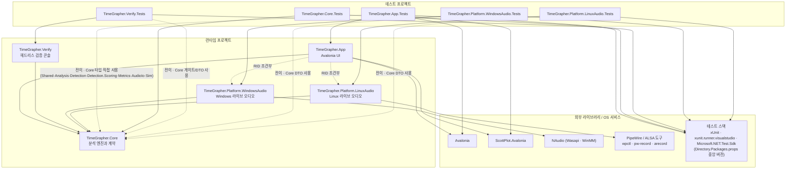
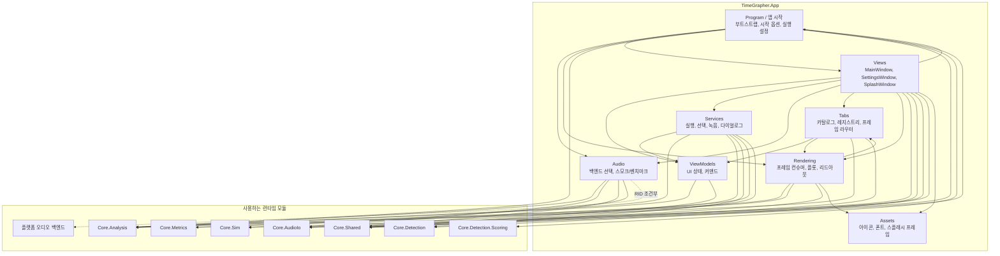
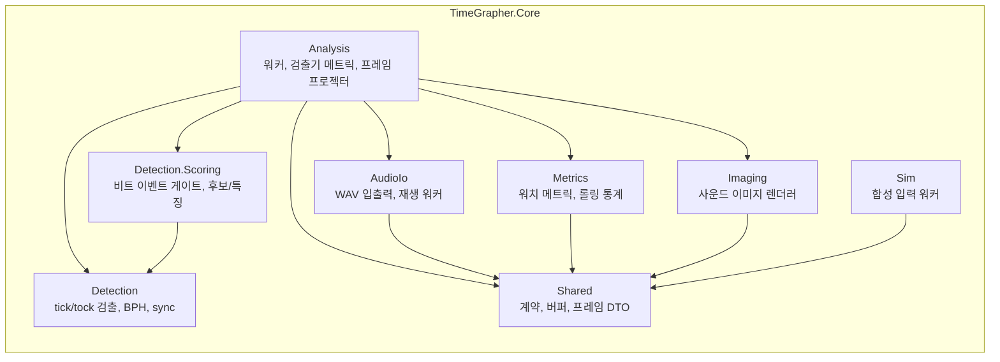

# 모듈 사용 뷰

이 문서는 TimeGrapherNet의 모듈 간 **uses(사용)** 관계를 보여준다. `A --> B`는 "A가 B를 사용한다"는 뜻이며, 이 관계가 모듈 간 결합을 만든다. 모든 엣지는 실제 코드(`.csproj`의 `ProjectReference`/`PackageReference`, `.cs`의 `using`/타입 참조)에 근거한다.

다이어그램은 세 층위로 나뉜다: (1) 프로젝트 수준, (2) `TimeGrapher.App` 내부, (3) `TimeGrapher.Core` 내부.

## 1. 프로젝트 수준 사용 관계

### 의존 규칙

- `TimeGrapher.Core`는 **아무것도 참조하지 않는다**(UI·플랫폼 무의존). 외부 패키지도 없다.
- 프로젝트 참조(`ProjectReference`) 기준으로 `TimeGrapher.Platform.*`와 `TimeGrapher.Verify`는 `Core`만 참조한다. 단 `TimeGrapher.Platform.WindowsAudio`는 외부 NuGet 패키지 `NAudio.Wasapi`·`NAudio.WinMM`도 참조한다(위 도식의 `WindowsAudio --> NAudio` 엣지). `TimeGrapher.Platform.LinuxAudio`는 CLI 도구를 프로세스로 구동하므로 패키지 의존이 없고, `TimeGrapher.Verify`도 외부 패키지가 없다.
- 두 플랫폼 어댑터는 각각 `Core.Shared`만 사용한다(`AudioCaptureWorker`, `LinuxLiveAudioWorker`).

### App의 플랫폼 어댑터 참조 (RID 조건부)

`TimeGrapher.App.csproj`의 플랫폼 어댑터 `ProjectReference`는 `RuntimeIdentifier` 조건부다(`RuntimeIdentifiers`는 `win-x64;win-arm64;linux-x64;linux-arm64`).

| RID 조건 | 포함되는 어댑터 | DefineConstants |
|---|---|---|
| 비어 있음(개발/테스트 빌드) | WindowsAudio + LinuxAudio 둘 다 | `TIMEGRAPHER_WINDOWS_AUDIO`, `TIMEGRAPHER_LINUX_AUDIO` |
| `win-*` publish | WindowsAudio | `TIMEGRAPHER_WINDOWS_AUDIO` |
| `linux-*` publish | LinuxAudio | `TIMEGRAPHER_LINUX_AUDIO` |

`LiveAudioBackend`는 이 상수로 `#if` 분기하여 백엔드를 선택한다.

### 테스트 프로젝트의 Core 의존

`*.Tests`는 각자 검증 대상 프로젝트 **하나만** `ProjectReference`로 직접 참조한다(`App.Tests→App`, `Core.Tests→Core`, `Verify.Tests→Verify`, `WindowsAudio.Tests→WindowsAudio`, `LinuxAudio.Tests→LinuxAudio`). `Verify.Tests`는 `Verify`가 `InternalsVisibleTo`로 노출한 악조건 게이트 평가기(`AdverseScenarios.Evaluate`)와 `--gate` 스펙 해석(`TryResolveArm`)을 직접 단언하고, `Core`의 `DetectorResultSnapshot`/`TgEvent`/`DetectionScorer.Score`를 전이로 구성한다. `Core`는 전이 참조이지만, 어서션·테스트 지원에서 `Core` 타입을 직접 `using`하므로 점선으로 표시했다 — `App.Tests`는 `Shared`(DTO)에 더해 `Analysis`·`Detection`·`Detection.Scoring`·`Metrics`(예: `AnalysisRunSettingsTests`, `GraphFrameRendererTests`, `RunSelectionResolverTests`)와 `Core.AudioIo`·`Core.Sim`(`AnalysisBenchmarkRunnerTests`의 `WavStreamWriter`·`WatchSynthStream`)까지 직접 `using`한다(그래도 `ProjectReference`는 App 하나뿐이라 여전히 전이 참조다). `Core.Tests`만 `Core`를 직접 참조한다. `App.Tests`는 컨트롤(`AvaPlot`, `SplashWindow`)을 구성하므로 `Avalonia`·`ScottPlot`도 직접 사용한다.

### 미래 계획 노드: TimeGrapher.Inference

검출 강건성 동작(적응 플로어, 레짐 가드, PLL 후행 A-onset 게이팅)은 `Detection` 알고리즘에 흡수되어 있고, 이벤트 게이트 소켓(`IBeatEventGate`/`BeatEventGateHost`)은 `Core` 내부 요소라 **프로젝트 간 신규 엣지를 만들지 않는다**. 미래의 TinyML 게이트는 ONNX Runtime을 참조하는 리프 프로젝트 `TimeGrapher.Inference`로 들어올 계획이며, 그때 엣지는 `App → Inference → Core`, `Verify → Inference`로 `Platform.*` 패턴을 미러링한다. `Core`는 계속 무의존을 유지한다.

## 2. TimeGrapher.App 내부 사용 관계

폴더 수준 추상화로 묶었고, 코드 엣지는 실제 `using`/타입 참조에 근거한다. 예외는 `Views → Assets`로, 이는 `using`/타입 참조가 아니라 `avares://` 리소스 URI·XAML `Icon` 참조다(`Assets`는 png/ttf 리소스 폴더이며 코드 네임스페이스가 아니다). `Program` 노드는 루트 네임스페이스(`Program`, `App`, `AppStartupOptions`, `AnalysisRunSettings`)를 가리킨다.

### 폴더별 사용 요약

| 폴더 | 사용하는 App 폴더 | 사용하는 Core 하위모듈 |
|---|---|---|
| Program / 앱 시작 | Views, Audio, Rendering | Analysis, AudioIo, Detection.Scoring, Shared |
| Views | Program, ViewModels, Services, Audio, Tabs, Rendering, Assets | AudioIo, Detection, Shared, Sim |
| ViewModels | — | Analysis, Shared |
| Services | ViewModels | Analysis, AudioIo, Detection, Metrics, Shared |
| Audio | — | Analysis, AudioIo, Shared, Sim, 플랫폼 백엔드(RID 조건부) |
| Tabs | ViewModels, Rendering | Analysis, Shared |
| Rendering | Tabs, Assets | Analysis, Metrics, Shared |

- `Program`은 `AnalysisRunSettings`에서 `AnalysisWorker.Config`를 조립하며 `PllMatchGate`(`Core.Detection.Scoring`)와 `PlotThemePalette`(`Rendering`)를 직접 사용한다. 또한 시작 시 `AcceptBandSettingsStore.Load()`로 사용자 정상 밴드를 `AcceptBandSettings.Current`(`Rendering`)에 복원한다(그래프 생성 이전). 마찬가지로 `SamplingSettingsStore.Load()`로 샘플링 파라미터(분석 블록 크기·캡처 버퍼)를 `SamplingSettings.Current`에 복원해 설정 창 입력의 시드로 쓴다(창 생성 이전).
- `ViewModels`는 스윕 배수 기본값을 `SweepFrameProjector.DefaultSweepMultiple`(`Core.Analysis`)로 초기화하므로 `Shared` 외에 `Analysis`에도 의존한다.
- `Rendering`과 `Tabs`는 순환처럼 보이지만 분리되어 있다: `Rendering`의 프레임 컨슈머가 `Tabs`의 라우팅 계약(`IAnalysisFrameConsumer`/`IThemedFrameConsumer`/`IAcceptBandConsumer`)을 구현하고, `Tabs`의 레지스트리가 컨슈머를 등록한다. `IAcceptBandConsumer`는 사용자 정상 밴드 편집을 모든 밴드 그래프에 라이브로 팬아웃하는 두 번째 브로드캐스트 계약으로, 테마 팬아웃(`IThemedFrameConsumer`)과 같은 패턴이다.
- Positions 탭의 활성 워치 자세는 `WatchModelView`(자체 CPU 소프트웨어 렌더)가 표시한다. 번들된 vertex-color GLB(`Assets/Model/watch_model_round_vertexcolor.glb`)를 `GlbMeshLoader`가 읽고 `WatchModelRasterizer`가 `System.Numerics`만으로 원근 투영·z-buffer·flat 음영 래스터화한다(GPU/외부 3D 라이브러리 무의존 — 이식성 driver, `SAP_TACTICS_ANALYSIS.md` 참고). 포지션 버튼이 `WatchPositionsRenderer`를 통해 `Position`을 바꾸면 `WatchModelOrientation`이 정한 목표 사원수로 `Quaternion.Slerp`(650 ms) 애니메이션한다. 즉 `Rendering`이 `Assets`(avares 모델 리소스)를 사용한다.

### MVVM 리팩토링 후 App 내부 구조 (순수 MVVM 정리)

`MainWindow` code-behind가 쥐고 있던 애플리케이션/실행 로직은 `Services`로 이전됐다. 역할은 세 가지로 나뉜다.

- **view-model `PropertyChanged` 구독 컨트롤러**(`MainWindowSelectionCoordinator`와 같은 패턴 — 구독 후 operations 인터페이스 또는 결과 sink로 위임): `AcceptBandController`(정상밴드 시드+라이브 적용, `IAcceptBandOperations`), `SamplingSettingsController`(샘플링 파라미터 시드+영속화; 라이브 재적용 없이 다음 실행에 반영되므로 주입된 persist 델리게이트로만 위임), `RunControlController`(스윕/위치/Σ 노브 + 위치변경 자동정지, `IRunSessionControls`), `MeasurementLogController`(operations 인터페이스가 아니라 주입된 sink 팩토리/`IMeasurementResultSink`로 위임; 측정 CSV 로그 생명주기·CLI 경로 1회 소비, `IDisposable`).
- **명시적 호출로 구동되는 소유자**(`PropertyChanged` 구독자가 아님): `AudioDeviceController`(입력장치 열거·레이트 프로브; `LoadAudioDevices`/`PopulateSampleRates`를 ctor·콤보 드롭다운·디바이스 새로고침·선택-operations에서 명시적으로 호출, 캐시 식별성+UI 스레드 재진입 보존), `RunSessionController`(분석/입력 워커 생명주기), `AudioSelectionState`(입력장치/레이트 선택 상태 보관).
- **composition root** `MainWindowBootstrapper`: 서비스 그래프 생성·배선(`Build`가 view-model을 시드하고 `RunCommandService`를 `IRunCommandRunner`로 view-model에 attach). 단 `AudioDeviceController`는 view 어댑터·델리게이트가 필요하므로 `MainWindow` 생성자가 직접 생성하고, bootstrapper가 만든 코디네이터를 `ISelectionEventGate`로 late-attach한다. 커맨드 본문은 view-model로 옮겨 주입된 `IRunCommandRunner`(`ViewModels`)를 호출한다.
- **좁은 시밍 인터페이스**로 결합을 좁히고 테스트를 가능케 한다: `IRunCommandRunner`는 `ViewModels`, 나머지(`IAcceptBandOperations`/`IRunSessionControls`/`IRunCommandPause`/`IMeasurementResultSink`/`IAudioDeviceBackend`/`IUiDispatcher`/`ISelectionEventGate`)는 `Services`. `ISelectionEventGate`(코디네이터가 구현)+late-attach가 코디네이터↔디바이스 컨트롤러 생성 순환을 끊는다.
- **View 쪽 어댑터**(`GraphAcceptBandOperations`/`LiveAudioDeviceBackend`/`UiThreadDispatcher`)는 `Views`에서 이 `Services` 계약을 구현한다(창이 아니라 렌더러/`LiveAudioBackend`/`Dispatcher`를 감싸므로 view back-edge가 아니다). 따라서 **폴더 수준 엣지는 변하지 않는다**(`Views→Services`/`Views→Audio`/`Services→ViewModels` 모두 기존 엣지). 추가된 폴더 간 엣지는 `MainWindowBootstrapper`가 `BphCatalog`(`Core.Detection`)를 직접 참조하는 `Services→Core.Detection` 하나뿐이며, 위 표의 `Services` 행에 반영했다.

#### 순수성 상태와 받아들인 잔여물 (accepted residuals)

이 리팩토링 후 **`ViewModels`는 Avalonia 무의존**이다(마지막으로 남아 있던 review-slider 마진의 `Avalonia.Thickness`가 View 계층 변환기 `ReviewSliderMarginConverter`(`Tabs/` 폴더의 `TimeGrapher.App.Tabs` Avalonia value converter)로 옮겨졌고, `ViewModelPurityTests`가 이를 잠근다). 전면 "순수 MVVM"이라고 단정하지는 않는다 — 행위 보존과 아키텍처 변경 최소화를 위해 다음 두 잔여물을 의도적으로 View에 남겼다:

- **실행 수명주기 어댑터**: `RunCommandService`(`Services`)는 여전히 View-중첩 `RunCommandOperations`(`IRunCommandOperations` 구현)를 통해 `MainWindow`의 실행 본문(`LiveStart`/`PlaybackStart`/`SimStart`, 정지/복원)을 호출한다. 실행 설정 조립(`BuildRunSettings`)은 `RunCommandOperations`가 아니라 `MainWindowRunSessionCallbacks.CreateAnalysisConfig` 콜백으로 `RunSessionController`에 따로 전달된다. 컴파일 시점 의존은 인터페이스/콜백으로 역전됐지만(서비스→인터페이스, 창 아님), 본문은 아직 code-behind에 있다. 이를 서비스로 추출하는 것은 별도의 더 큰 변경이라 이번 패스의 범위 밖이다.
- **선택-operations 볼륨 통과**: `MainWindowSelectionOperations`는 `SetAudioInputVolume`(→ `RunSessionController.SetLiveInputVolume`) 한 호출을 위해서만 `_owner`(창)를 보유한다. 한 통과 호출에 새 시밍+late-attach를 도입할 가치가 없어 그대로 둔다.

## 3. TimeGrapher.Core 내부 사용 관계

`using TimeGrapher.Core.` 전수 조사로 검증했다. `Shared`는 의존 없는 최하위 계약 모듈이고, `Analysis`가 가장 결합도가 높다.

### 검증 결과

- **`Analysis`**는 `Detection`, `Detection.Scoring`, `Metrics`, `Imaging`, `AudioIo`, `Shared`를 모두 사용한다. `Detection.Scoring` 의존은 `AnalysisWorker`, `DetectorMetricsEngine`, `BeatEventGateHost`에서 확인된다.
- **`Detection`**(`TgDetector`, `TgDetectorCore`, `Bph` 등)은 다른 `Core` 하위모듈을 사용하지 않는다. 같은 부모 아래의 `Detection.Scoring`도 참조하지 않으므로 `Detection → Detection.Scoring` 엣지는 없다.
- **`Detection.Scoring`**(`IBeatEventGate`, `PllMatchGate`, `BeatCandidate`, `BeatWindowFeatures`)은 `Shared`를 참조하지 않지만 리프는 아니다 — `BeatCandidate`가 후보 컨텍스트로 `Detection`의 `TgEvent`를 담으므로 `Detection.Scoring → Detection` 의존이 있다(`IBeatEventGate`/`PllMatchGate`/`BeatWindowFeatures`는 자기 네임스페이스 타입만 사용).
- **`Sim`**의 `DetectionScorer`는 `Detection`을 사용하지 않는다(이름에 보이는 `usedDetection`은 지역 변수). `Sim`은 `Shared`만 사용한다.
- **`AudioIo`·`Metrics`·`Imaging`**은 각각 `Shared`만 사용한다.

## 결합 요약

| 사용 모듈 | 사용 대상 | 만들어지는 결합 |
|---|---|---|
| `TimeGrapher.App` | `TimeGrapher.Core`, RID 선택 플랫폼 오디오, Avalonia, ScottPlot | UI가 Core 계약/결과, 데스크톱 UI 라이브러리, 선택된 플랫폼 오디오 어댑터에 결합 |
| `TimeGrapher.Verify` | `TimeGrapher.Core` (Analysis, AudioIo, Detection, Detection.Scoring, Metrics, Shared, Sim) | 콘솔 검증이 앱과 동일한 분석·검출·시뮬레이터 모듈을 공유 |
| `TimeGrapher.Platform.WindowsAudio` | `TimeGrapher.Core.Shared`, NAudio | Windows 입력 백엔드가 Core 라이브 오디오 계약과 NAudio API에 결합 |
| `TimeGrapher.Platform.LinuxAudio` | `TimeGrapher.Core.Shared`, `wpctl`·`pw-record`·`arecord` | Linux 입력 백엔드가 Core 라이브 오디오 계약과 Linux 오디오 CLI 도구에 결합 |
| `TimeGrapher.App.Rendering` | `TimeGrapher.App.Tabs`, `Core.Analysis`, `Core.Metrics`, `Core.Shared` | 프레임 컨슈머가 탭 라우팅 계약을 구현하고 Core 프레임/메트릭 DTO를 렌더 |
| `TimeGrapher.Core.Analysis` | `Detection`, `Detection.Scoring`, `Metrics`, `Imaging`, `AudioIo`, `Shared` | 핵심 알고리즘 모듈을 조율하는 가장 결합도 높은 Core 하위모듈 |
| `*.Tests` | 검증 대상 프로젝트(직접), `Core` DTO(전이), App UI 라이브러리(컨트롤 테스트), xUnit | 검증 대상과 어서션에 쓰이는 계약 DTO, 테스트 프레임워크에 의존 |
