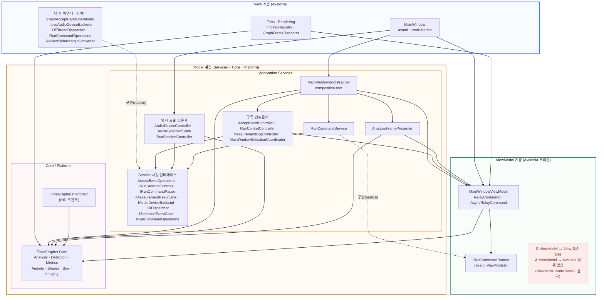
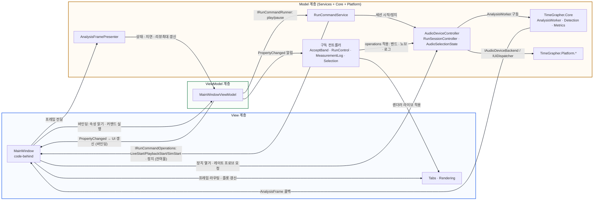

# MVVM 뷰 아키텍처 (의존성 뷰 · 사용 뷰)

이 문서는 순수 MVVM 리팩토링 이후 `TimeGrapher.App`의 UI 계층을 두 개의 소프트웨어
아키텍처 뷰로 제시한다. **같은 컴포넌트 집합을 서로 다른 관계로** 본다.

- **의존성 뷰(depends-on)** — *컴파일 시점*의 참조 방향. `A --> B`는 "A가 B의 타입을
  알고 참조한다"는 뜻이다. 이 그래프는 **비순환이며 안쪽(View→ViewModel→Model)으로만**
  향한다. MVVM의 정의적 성질이 여기서 드러난다: **ViewModel은 View·Avalonia에 대한
  컴파일 의존이 없다**(`ViewModelPurityTests`가 잠금). View가 ViewModel을 향하는 역방향
  호출(실행 수명주기)은 인터페이스로 역전(DIP)되어 의존 엣지를 만들지 않는다.
- **사용 뷰(uses)** — *런타임*의 호출·데이터 흐름. `A ==> B`는 "A가 동작 중 B를
  호출하거나 B로 데이터를 보낸다"는 뜻이다. 여기에는 의존 뷰에 **없는 피드백 루프**가
  나타난다: 바인딩/`PropertyChanged`로 ViewModel→View로 UI가 갱신되고,
  `IRunCommandOperations`를 통해 서비스가 View의 실행 본문을 되부른다.

이 프로젝트에는 별도 `Models` 폴더가 없다. MVVM의 Model 역할은 애플리케이션 서비스,
`TimeGrapher.Core` 도메인 로직, `TimeGrapher.Platform.*` 구현에 분산되어 있다.

## 1. 의존성 뷰 (depends-on, 컴파일 시점)

**읽는 법.** 모든 실선 엣지는 안쪽(View→ViewModel→Model)으로만 향한다. ViewModel에서
나가는 의존은 자기 네임스페이스의 `IRunCommandRunner`와 `Core`의 DTO(`Analysis`/`Shared`)
뿐이며 — 붉은 박스가 강조하듯 **View·Avalonia로 향하는 엣지는 없다**. 서비스가 View의
실행 본문을 되부르는 관계는 `RunCommandService → IRunCommandOperations`(서비스가 인터페이스에
의존)와 `VAdapters ⟶ 구현`(View가 인터페이스를 실현)으로 **역전**되어, `Services → View`
컴파일 엣지가 생기지 않는다. 컨트롤러는 `MainWindowViewModel`을 참조해 구독하지만
(구독자 패턴), 그 의존은 ViewModel을 향하지 View를 향하지 않는다.

## 2. 사용 뷰 (uses, 런타임 호출·데이터 흐름)

**읽는 법.** 런타임에는 양방향 협력 루프가 돈다: View가 바인딩으로 ViewModel을
사용하고(①), ViewModel이 `IRunCommandRunner`로 실행을 시작하면(②) `RunCommandService`가
`IRunCommandOperations`로 View의 실행 본문을 되부른다(③ — 의도적으로 남긴 잔여물).
세션이 워커를 돌려 `AnalysisFrame`이 콜백으로 돌아오면, View가 그것을
`AnalysisFramePresenter`로 넘겨 ViewModel 상태를 갱신하고, ViewModel은 `PropertyChanged`로
다시 View의 UI를 갱신한다. **이 피드백 루프는 의존성 뷰에는 없다** — 모두 바인딩과
인터페이스로 디커플링되어 컴파일 엣지를 만들지 않기 때문이다. 두 뷰의 차이가 곧
"바인딩과 DIP가 무엇을 역전시켰는가"를 보여준다.

## 책임 요약

| 계층 | 주 책임 | 대표 파일 |
| --- | --- | --- |
| View | UI 레이아웃·창 수명주기, 프레임 라우팅, 실행 본문(잔여물), 렌더 브리지 | `MainWindow.axaml`, `MainWindow.*.cs`, `*Operations`, `ReviewSliderMarginConverter.cs` |
| ViewModel | UI 상태·바인딩 속성·커맨드 (Avalonia 무의존) | `MainWindowViewModel.cs`, `IRunCommandRunner.cs`, `RelayCommand.cs`, `AsyncRelayCommand.cs` |
| Application Services | composition root, 구독 컨트롤러, 실행/세션/측정 로그/장치 열거, 프레임→VM 프레젠터, 시밍 인터페이스 | `MainWindowBootstrapper.cs`, `AcceptBandController.cs`, `RunControlController.cs`, `MeasurementLogController.cs`, `AudioDeviceController.cs`, `RunSessionController.cs`, `RunCommandService.cs`, `AnalysisFramePresenter.cs`, `I*.cs` |
| Rendering / Tabs | 그래프 등록·활성 탭 렌더·플롯 갱신 | `InfoTabRegistry.cs`, `GraphFrameRenderer.cs`, `Rendering/*` |
| Core / Platform Model | 오디오 계약·캡처 워커·검출·분석 | `TimeGrapher.Core.*`, `TimeGrapher.Platform.*` |

## 발표용 설명

순수 MVVM 리팩토링 이후 `MainWindowViewModel`은 UI 프레임워크 타입을 전혀 갖지 않으며
(`ViewModelPurityTests`가 잠금), 의존성 뷰는 View→ViewModel→Model의 비순환 안쪽 방향만
보인다. View가 서비스의 명령을 받아 실행 본문을 수행하던 옛 구조는 컨트롤러·시밍
인터페이스로 분해되어, 서비스→View 역의존이 인터페이스로 역전됐다. 사용 뷰는 바인딩과
`PropertyChanged`, `IRunCommandOperations`가 런타임에 만들어내는 협력 루프를 드러낸다 —
컴파일 의존 없이 동작이 양방향으로 흐르는 것이 MVVM의 핵심이다.

> 받아들인 잔여물: `RunCommandService`가 `IRunCommandOperations`(View 중첩)로 호출하는
> 실행 본문(`LiveStart`/`PlaybackStart`/`SimStart`, `BuildRunSettings`)은 행위 보존과
> 아키텍처 변경 최소화를 위해 View에 남겼다. 컴파일 의존은 역전됐고 본문만 code-behind에
> 있다. 자세한 모듈 엣지는 [`MODULE_USES_VIEW.md`](MODULE_USES_VIEW.md)를 참조한다.
