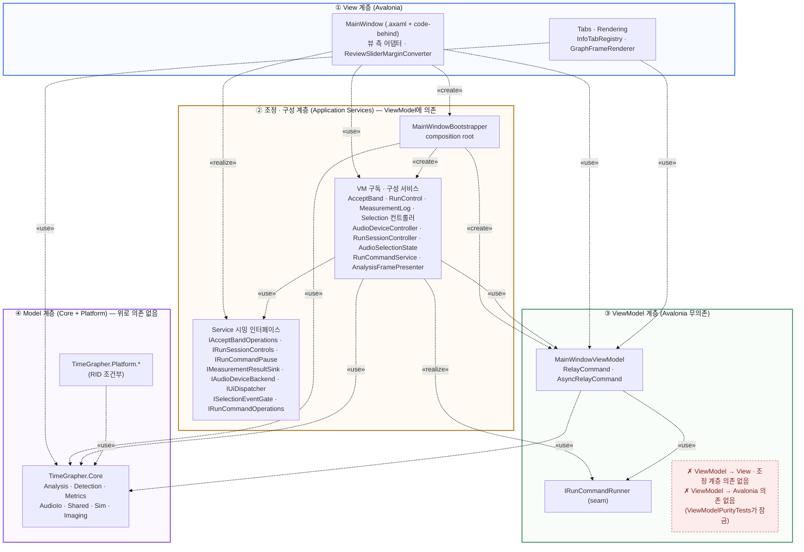

# MVVM 뷰 아키텍처 (의존성 뷰)

이 문서는 순수 MVVM 리팩토링 이후 `TimeGrapher.App`의 UI 계층을 **의존성(depends-on)
뷰**로 제시한다. `A --> B`는 "A가 *컴파일 시점*에 B의 타입을 알고 참조한다"는 뜻이다.
이 그래프는 **비순환이며 모든 엣지가 한 방향(아래로)** 향한다 — MVVM의 정의적 성질이
여기서 드러난다.

계층은 **의존 방향(누가 누구를 참조하는가)** 순서로 위에서 아래로 배치했다.

1. **View** — ViewModel과 조정·구성 계층을 참조한다.
2. **조정 · 구성 계층(Application Services)** — ViewModel을 *구독·구성·갱신*하므로
   ViewModel에 의존한다(관찰자/구성 루트 패턴). 따라서 ViewModel **위**에 둔다.
3. **ViewModel** — 자기 seam(`IRunCommandRunner`)과 `Core` DTO만 참조한다. **위 두
   계층(View·조정)·Avalonia에 대한 의존이 없다**(`ViewModelPurityTests`가 잠금).
4. **Model(Core + Platform)** — 아무것도 위로 참조하지 않는 최하위 싱크. **Model은
   ViewModel을 모른다.**

런타임에는 바인딩·`PropertyChanged`로 데이터가 아래→위로도 흐르지만, 이는 바인딩·
인터페이스로 디커플링된 제어 역전이라 **의존 엣지를 만들지 않는다**. 그래서 의존성 뷰는
단방향으로 유지된다. (이 프로젝트엔 별도 `Models` 폴더가 없고, Model 역할은 서비스·
`TimeGrapher.Core`·`TimeGrapher.Platform.*`에 분산되어 있다.)

## 의존성 뷰 (depends-on, 컴파일 시점)

**표기(UML 의존 관계).** 화살표는 *의존하는* 쪽에서 *의존되는* 쪽을 향하고(A ┄┄▷ B),
선은 점선·머리는 열린 화살표(`>`)다. 라벨의 «create»·«use»·«realize»는 의존의 목적을
밝히는 스테레오타입이다(«create» 생성, «use» 참조·호출, «realize» 인터페이스 실현).

**읽는 법.** 모든 엣지가 위에서 아래로만 향한다(계층 내부 배선은 박스 안에 머문다).
ViewModel에서 *나가는* 의존은 자기 네임스페이스의 `IRunCommandRunner`와 `Core`
DTO(`Analysis`/`Shared`)뿐이며 — 붉은 박스가 강조하듯 **View·조정 계층·Avalonia로
향하는 엣지는 없다**. 조정 계층은 ViewModel을 구독·구성·갱신하므로 ViewModel을
참조하지만(아래로), 그 역은 없다. 서비스가 View의 실행 본문을 되부르는 관계도
`RunCommandService ┄«use»┄▷ IRunCommandOperations`(서비스가 인터페이스에 의존)와
`View ┄«realize»┄▷ IRunCommandOperations`(View가 그 인터페이스를 실현)으로 **역전**되어,
`Services → View`로 올라가는 엣지가 생기지 않는다. 마찬가지로 ViewModel의 커맨드는
`IRunCommandRunner` seam을 거치고
`RunCommandService`가 이를 실현하므로, ViewModel이 서비스를 위로 참조하지 않는다.

## 책임 요약

| 계층 | 주 책임 | 대표 파일 |
| --- | --- | --- |
| ① View | UI 레이아웃·창 수명주기, 프레임 라우팅, 실행 본문(잔여물), 렌더 브리지 | `MainWindow.axaml`, `MainWindow.*.cs`, `*Operations`, `ReviewSliderMarginConverter.cs` |
| ② 조정 · 구성 (Application Services) | composition root, ViewModel 구독 컨트롤러, 실행/세션/측정 로그/장치 열거, 프레임→VM 프레젠터, 시밍 인터페이스 | `MainWindowBootstrapper.cs`, `AcceptBandController.cs`, `RunControlController.cs`, `MeasurementLogController.cs`, `AudioDeviceController.cs`, `RunSessionController.cs`, `RunCommandService.cs`, `AnalysisFramePresenter.cs`, `I*.cs` |
| ③ ViewModel | UI 상태·바인딩 속성·커맨드 (Avalonia 무의존) | `MainWindowViewModel.cs`, `IRunCommandRunner.cs`, `RelayCommand.cs`, `AsyncRelayCommand.cs` |
| ④ Model (Core / Platform) | 오디오 계약·캡처 워커·검출·분석 (위로 의존 없음) | `TimeGrapher.Core.*`, `TimeGrapher.Platform.*` |

> Rendering / Tabs(`InfoTabRegistry.cs`, `GraphFrameRenderer.cs`, `Rendering/*`)는 View
> 계층에 속하며 ViewModel과 `Core`를 참조한다(위 도식의 `VTabs`).

## 발표용 설명

순수 MVVM 리팩토링 이후 `MainWindowViewModel`은 UI 프레임워크 타입을 전혀 갖지 않으며
(`ViewModelPurityTests`가 잠금), 의존성 뷰는 모든 엣지가 한 방향(아래로)만 향하는 비순환
그래프다. 핵심은 계층을 **의존 방향대로** 배치한 것이다: ViewModel을 구독·구성·갱신하는
서비스들은 ViewModel에 의존하므로 그 *위*(조정·구성 계층)에 놓이고, ViewModel이 의존하지
않는 진짜 Model(Core/Platform)만 맨 아래 싱크에 놓인다. View가 서비스의 명령을 받아 실행
본문을 수행하던 옛 구조는 컨트롤러·시밍 인터페이스로 분해되어, 서비스→View 역의존이
인터페이스로 역전됐다. 런타임 데이터는 바인딩·`PropertyChanged`로 양방향으로 흐르지만 이는
디커플된 제어 역전이라 의존 엣지를 만들지 않으므로, 의존성은 단방향으로 유지된다 —
이것이 MVVM의 핵심이다.

> 받아들인 잔여물: `RunCommandService`가 `IRunCommandOperations`(View 중첩)로 호출하는
> 실행 본문(`LiveStart`/`PlaybackStart`/`SimStart`, `BuildRunSettings`)은 행위 보존과
> 아키텍처 변경 최소화를 위해 View에 남겼다. 컴파일 의존은 역전됐고 본문만 code-behind에
> 있다. 자세한 모듈 엣지는 [`MODULE_USES_VIEW.md`](MODULE_USES_VIEW.md)를 참조한다.
