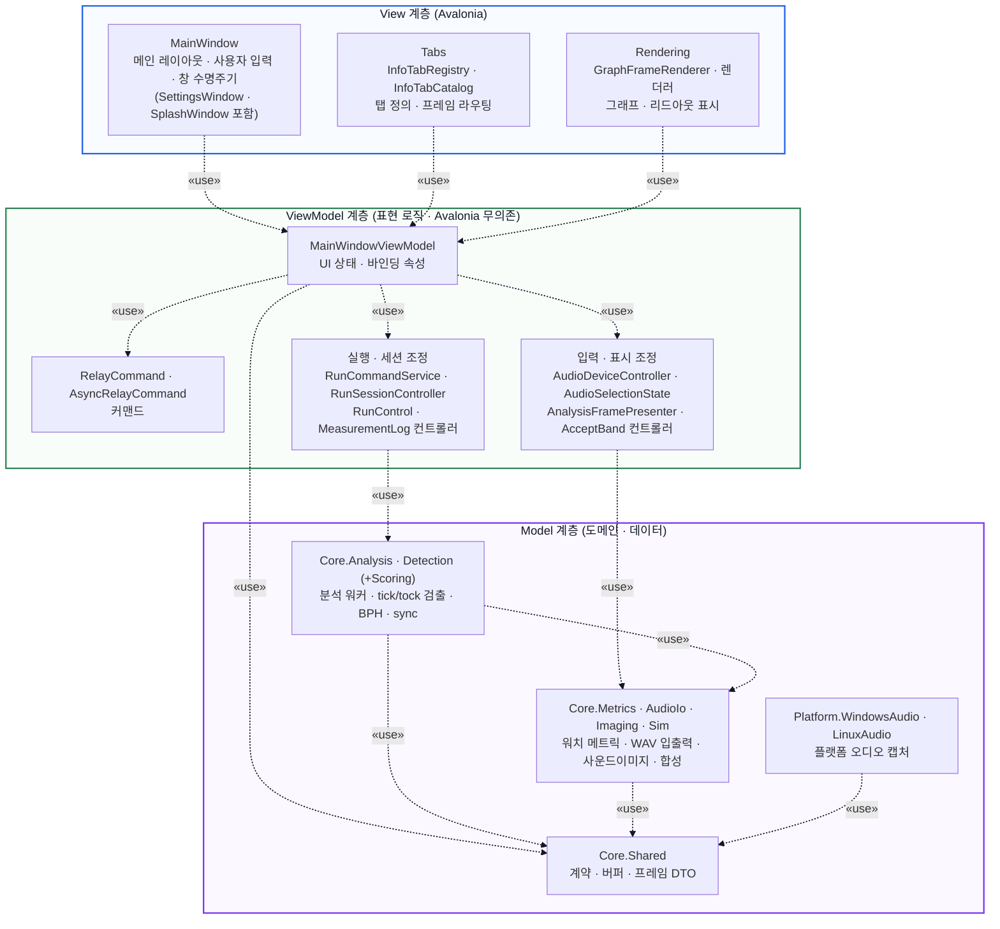

# MVVM 뷰 아키텍처 (의존성 뷰)

이 문서는 `TimeGrapher.App`의 UI 계층을 **MVVM 모델**의 의존성(depends-on) 뷰로 제시한다
(과제 발표용 — 실제 구현의 세부보다 MVVM의 핵심 구조를 보이는 데 초점). 의존은
**View → ViewModel → Model 한 방향**으로만 흐르며, 역방향 의존은 없다.

**표기(UML 의존 관계).** 화살표는 *의존하는* 쪽에서 *의존되는* 쪽을 향하고(A ┄┄▷ B),
선은 점선·머리는 열린 화살표(`>`)다. 라벨 «use»는 의존의 목적(참조·호출)을 나타내는
스테레오타입이다.

## 의존성 뷰 (depends-on)

## 핵심

의존은 위에서 아래로 한 방향이며, 역방향 의존이 없는 것이 MVVM의 정의적 성질이다.

- **ViewModel은 View를 모른다.** ViewModel은 View를 참조하지 않는다 — UI 갱신은 데이터
  바인딩과 `PropertyChanged`로 일어난다. 이는 런타임 *데이터 흐름*(ViewModel→View)이지
  컴파일 의존이 아니므로 의존 엣지를 만들지 않는다. (`ViewModelPurityTests`가 ViewModel의
  Avalonia 무의존을 잠근다.)
- **Model은 ViewModel을 모른다.** Model은 위 계층을 참조하지 않는 최하위 계층으로,
  UI와 무관하게 단독으로 빌드·테스트된다. `Core.Shared`가 계약 기반이고
  `Core.Analysis`가 검출·지원 모듈을 조율하는 허브다.
- **보조 서비스는 ViewModel 계층에 속한다.** 실행·세션·장치·측정 로그를 다루는
  애플리케이션 서비스는 표현·조정 로직이므로 ViewModel과 한 계층으로 묶었다. 이들은
  Model을 사용할 뿐 View를 참조하지 않는다.

## 책임 요약

| 계층 | 세부 묶음 | 책임 | 대표 구성요소 |
| --- | --- | --- | --- |
| **View** | 창 | 메인/보조 창, 레이아웃, 사용자 입력, 창 수명주기 | `MainWindow`, `SettingsWindow`, `SplashWindow` |
| | 탭 | 탭 정의·등록, 프레임 라우팅 | `InfoTabRegistry`, `InfoTabCatalog` |
| | 렌더링 | 그래프·리드아웃 표시 | `GraphFrameRenderer`, `Rendering/*` |
| **ViewModel** | 뷰모델·커맨드 | UI 상태·바인딩 속성·커맨드 | `MainWindowViewModel`, `RelayCommand`, `AsyncRelayCommand` |
| | 실행·세션 조정 | 실행 상태 전이, 분석 세션 수명주기, 측정 로그 | `RunCommandService`, `RunSessionController`, `MeasurementLogController` |
| | 입력·표시 조정 | 장치 열거·선택, 프레임→VM 표현, 정상밴드 적용 | `AudioDeviceController`, `AnalysisFramePresenter`, `AcceptBandController` |
| **Model** | 분석·검출 | 비트 분석, tick/tock 검출, BPH·sync | `Core.Analysis`, `Core.Detection` (+`Scoring`) |
| | 지원 모듈 | 메트릭, WAV 입출력, 사운드이미지, 합성 입력 | `Core.Metrics`, `Core.AudioIo`, `Core.Imaging`, `Core.Sim` |
| | 계약 · 플랫폼 | 공용 DTO·버퍼, 플랫폼 오디오 캡처 | `Core.Shared`, `TimeGrapher.Platform.*` |

> 이 도식은 발표용 MVVM 이상형이다. 클래스·인터페이스 단위의 정밀한 실제 모듈 의존
> 그래프(시밍 인터페이스, composition root, 받아들인 잔여물 포함)는
> [`MODULE_USES_VIEW.md`](MODULE_USES_VIEW.md)를 참조한다.
