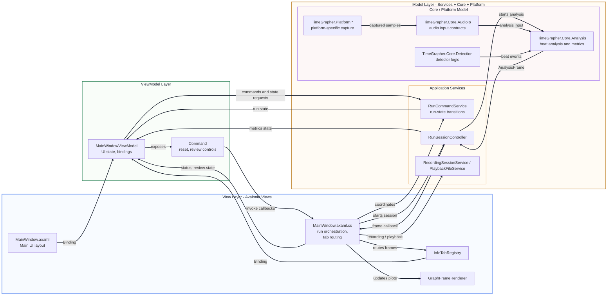

# MVVM View Architecture

이 문서는 TimeGrapher-Net의 Avalonia UI 계층을 MVVM 관점에서 설명하기 위한
뷰 아키텍처 다이어그램이다. 발표나 리뷰에서는 View, ViewModel, Model의
역할 분리를 중심으로 설명한다. 이 프로젝트에는 별도 `Models` 폴더가 없으며,
MVVM의 Model 역할은 애플리케이션 서비스, Core 도메인 로직, Platform 구현에
분산되어 있다.

## Architecture Diagram

## Responsibility Summary

| Layer | Main responsibility | Representative files |
| --- | --- | --- |
| View | UI layout, window lifecycle, tab routing, rendering bridge | `MainWindow.axaml`, `MainWindow.axaml.cs` |
| ViewModel | UI state, binding properties, commands, review controls | `MainWindowViewModel.cs`, `RelayCommand.cs`, `AsyncRelayCommand.cs` |
| Model | Runtime state, application behavior, domain analysis, audio contracts, platform capture | `RunCommandService.cs`, `RunSessionController.cs`, `TimeGrapher.Core.*`, `TimeGrapher.Platform.*` |
| Application Services | Run-state transitions, analysis session lifecycle, recording, playback | `RunCommandService.cs`, `RunSessionController.cs`, `RecordingSessionService.cs`, `PlaybackFileService.cs` |
| Rendering / Tabs | Graph view registration, active-tab rendering, plot updates | `InfoTabRegistry.cs`, `GraphFrameRenderer.cs`, renderer classes under `Rendering/` |
| Core / Platform Model | Audio contracts, capture workers, detector and analysis logic | `TimeGrapher.Core.*`, `TimeGrapher.Platform.*` |

## Presentation Description

TimeGrapher-Net uses the MVVM pattern in the Avalonia UI layer. Views define
the interface and bind to `MainWindowViewModel`; the ViewModel owns UI state
and commands; the Model layer is implemented by application Services plus Core
and Platform modules. Services coordinate run lifecycle, analysis sessions,
recording, and playback, while Core and Platform provide analysis, detection,
audio, and capture behavior.
