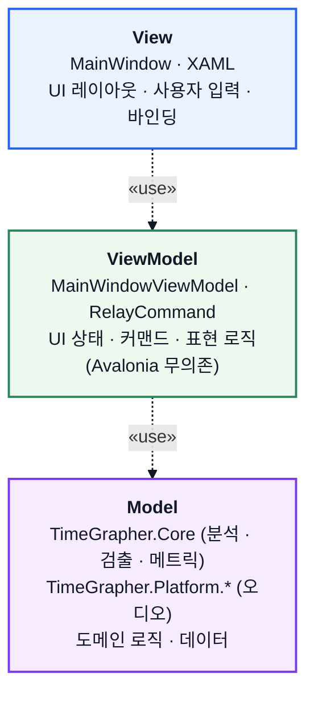

# MVVM 뷰 아키텍처 (의존성 뷰)

이 문서는 `TimeGrapher.App`의 UI 계층을 **이상적 MVVM 모델**의 의존성(depends-on)
뷰로 제시한다(과제 발표용 — 실제 구현의 세부보다 MVVM의 핵심 구조를 보이는 데 초점).
의존은 **View → ViewModel → Model 한 방향**으로만 흐르며, 역방향 의존은 없다.

**표기(UML 의존 관계).** 화살표는 *의존하는* 쪽에서 *의존되는* 쪽을 향하고(A ┄┄▷ B),
선은 점선·머리는 열린 화살표(`>`)다. 라벨 «use»는 의존의 목적(참조·호출)을 나타내는
스테레오타입이다.

## 의존성 뷰 (depends-on)

**핵심.** 의존은 한 방향으로만 향한다.

- **ViewModel은 View를 모른다.** ViewModel은 View를 참조하지 않는다 — UI 갱신은 데이터
  바인딩과 `PropertyChanged`로 일어나며, 이는 *데이터 흐름*이지 컴파일 의존이 아니다.
  (`ViewModelPurityTests`가 ViewModel의 Avalonia 무의존을 잠근다.)
- **Model은 ViewModel을 모른다.** Model은 위 계층을 참조하지 않는 최하위 계층으로,
  UI와 무관하게 단독으로 빌드·테스트된다(`TimeGrapher.Core`는 무의존).

## 책임 요약

| 계층 | 책임 | 대표 구성요소 |
| --- | --- | --- |
| **View** | UI 레이아웃, 사용자 입력, 바인딩 | `MainWindow`, XAML |
| **ViewModel** | UI 상태·커맨드·표현 로직 (보조 서비스 포함, Avalonia 무의존) | `MainWindowViewModel`, `RelayCommand`, `Services/*` |
| **Model** | 도메인 분석·검출·오디오 데이터 | `TimeGrapher.Core`, `TimeGrapher.Platform.*` |

> 이 도식은 발표용 이상형이다. ViewModel을 구독·구성·갱신하는 애플리케이션 서비스
> (컨트롤러·composition root·프레젠터)는 표현 로직이므로 ViewModel 계층으로 묶었다.
> 클래스·인터페이스 단위의 정밀한 실제 모듈 의존 그래프는
> [`MODULE_USES_VIEW.md`](MODULE_USES_VIEW.md)를 참조한다.
