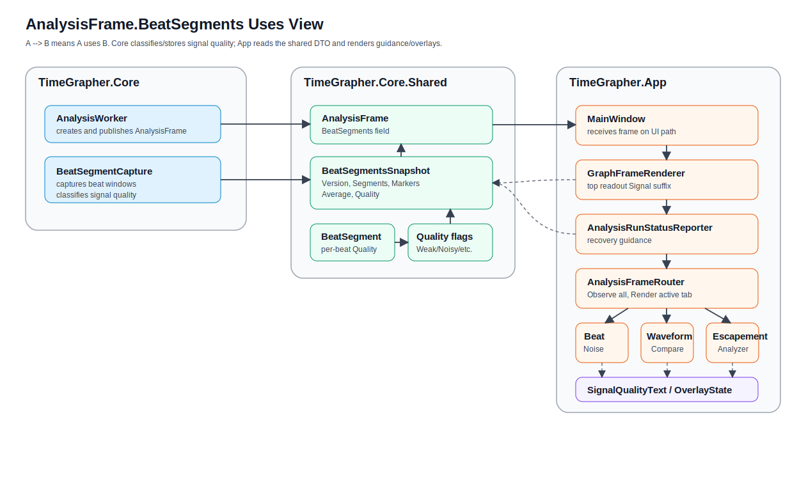
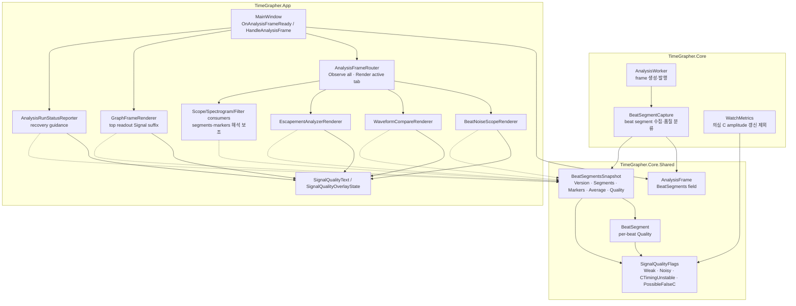
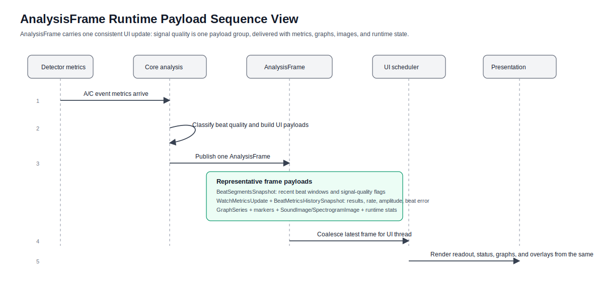
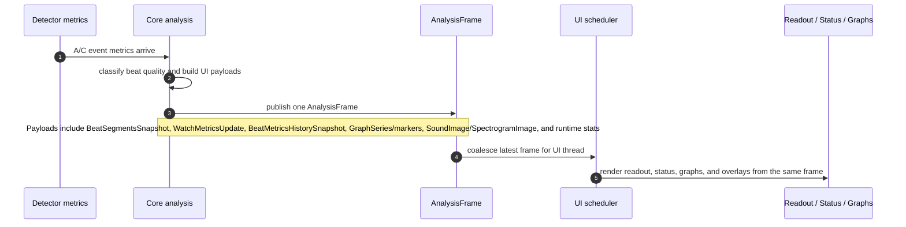

# Signal Quality 테스트 가이드

이 문서는 `feature/signal-quality-propagation` 브랜치의 stage 1, stage 2,
그리고 그래프 overlay signal-quality 변경사항을 검증하기 위한 가이드다.

## 변경 내용

앱은 이제 beat-segment 공유 DTO를 통해 signal-quality warning을 전달한다.
현재 사용하는 flag는 다음과 같다.

- `WeakSignal`: 표시 중인 beat segment에서 사용할 수 있는 C marker를 찾지 못했다.
- `NoisySignal`: 감지된 C timing이 최근 A-to-C timing과 일관되지 않는다.
- `CTimingUnstable`: A-to-C interval이 최근 median/MAD band에서 벗어났다.
- `PossibleFalseC`: C 후보가 비정상적으로 이르며 B/noise가 C로 잡혔을 가능성이 있다.
- `ClippedSignal`: clipping classification을 위해 예약된 flag다.
- `NoSignal`: no-signal classification을 위해 예약된 flag다.

Stage 1에서는 공유 quality 상태를 상단 readout과 Beat Noise에 표시했다.
Stage 2에서는 recovery guidance를 추가하고, 의심스러운 C 후보를 amplitude 갱신에서
제외하며, quality 상태를 beat-aligned analysis view까지 전달했다. 이번 graph-overlay
변경에서는 Beat Noise, Waveform Compare, Escapement Analyzer의 우측 상단에 warning
overlay를 추가하여 사용자가 현재 보고 있는 diagnostic view 안에서 바로 경고를 볼 수
있게 했다.

## Architecture View: `AnalysisFrame.BeatSegments` 전달 구조

이 섹션은 signal-quality 평가값이 어디에 저장되고 어떤 경로로 각 그래프에 전달되는지 보여준다. 핵심은 `Core`가 품질을 판단하고, `Core.Shared` DTO인 `BeatSegmentsSnapshot`을 `AnalysisFrame.BeatSegments`에 실어 `App`으로 전달하며, App의 renderer와 service는 같은 DTO를 읽어 표시만 담당한다는 점이다.

### Uses View

이 뷰는 compile-time/code-level 책임 분리를 설명한다. 실선 `A --> B`는 A가 B를 직접 사용·소유·호출한다는 뜻이고, 점선 `A -.-> B`는 이미 전달받은 `frame.BeatSegments` DTO를 읽는 소비 관계를 뜻한다. 점선은 callback, ownership, 역방향 runtime dependency를 의미하지 않는다.





정적 책임은 다음과 같이 나뉜다.

- `BeatSegmentCapture`는 beat window를 만들고 `ClassifyQuality()`로 `WeakSignal`, `CTimingUnstable`, `NoisySignal`, `PossibleFalseC`를 결정한다.
- 개별 beat의 품질은 `BeatSegment.Quality`에 저장된다.
- 최근 beat ring 전체의 품질은 `BeatSegmentsSnapshot.Quality`에 OR 집계되어 저장된다.
- `AnalysisFrame.BeatSegments`는 이 snapshot을 App으로 넘기는 단일 전달 슬롯이다.
- App의 readout, status, graph renderer는 같은 `BeatSegmentsSnapshot`을 읽고 `SignalQualityText`/`SignalQualityOverlayState`로 문구와 overlay만 만든다.

### Runtime Sequence View

이 뷰는 구현 메서드 호출을 모두 펼치지 않고, `AnalysisFrame` 하나가 signal-quality 정보뿐 아니라 metrics, graph payload, image payload, runtime 상태를 같은 UI update 단위로 App 표시 계층까지 전달하는 큰 흐름을 보여준다.





전달 경로에서 중요한 점은 다음과 같다.

- `Core`는 beat 품질을 판단하고 최근 beat ring의 품질을 `BeatSegmentsSnapshot.Quality`로 집계한다.
- `AnalysisFrame.BeatSegments`는 Core에서 App으로 signal-quality 상태를 넘기는 전용 DTO 슬롯이다.
- 같은 frame에는 `MetricsUpdate`, `MetricsHistory`, `ScopeSeries`/`RateSeries`, scope markers, `SoundImage`, `SpectrogramImage`, latency/deadline/runtime stats도 함께 실린다.
- App의 readout, status guidance, graph overlay는 별도 이벤트 버스나 역참조 없이 같은 `AnalysisFrame`에서 필요한 payload를 읽어 표시만 담당한다.

## 프로젝트 플랜 기반 그래프별 비정상 신호 안내 체크리스트

프로젝트 플랜은 TimeGrapher가 단순히 값을 보여주는 것이 아니라, 약한 신호, 잡음, 누락, clipping, 잘못 잡힌 이벤트처럼 측정값을 오해하게 만들 수 있는 조건을 사용자에게 알려야 한다고 요구한다. 특히 "signal too noisy", "reposition watch", "microphone gain too high", "measurement confidence low" 같은 guidance와, weak/noisy/partially missing signal에서 불안정하거나 misleading한 출력을 내지 않는 graceful degradation이 핵심이다.

아래 체크리스트는 최종 데모와 수동 QA에서 그래프별로 확인할 항목이다. `[직접 경고]`는 현재 signal-quality warning/overlay가 직접 표시되어야 하는 항목이고, `[해석 보조]`는 그래프 자체의 reference line, label, range, marker, 비교 UI로 사용자가 비정상 가능성을 판단할 수 있어야 하는 항목이다.

| 그래프 / 표시 영역 | 프로젝트 플랜에서 요구한 비정상 신호 안내 관점 | 체크리스트 |
|---|---|---|
| 공통 상단 readout / status guidance | 입력이 noisy, weak, clipped, incomplete, misleading일 수 있음을 실시간으로 알려야 한다. | [ ] `Signal ...` suffix가 측정값 옆에 표시된다. [ ] status guidance가 reposition, gain 조정, handling/ambient noise 감소처럼 사용자가 취할 행동을 말한다. [ ] runtime 성능 저하 경고와 acoustic signal-quality 경고를 혼동하지 않는다. |
| Sound Graph / Sound Print | raw 또는 processed watch signal을 보여주고, 작은 timing fluctuation, averaging window, threshold/reference line을 통해 stability/noise/watch problem을 이해하게 해야 한다. | [ ] 잡음이 심하거나 신호가 약한 구간에서 사용자가 clean signal처럼 오해하지 않도록 warning 또는 guidance가 연결된다. [ ] averaging/filtering을 켠 경우 원신호의 약한 성분이 숨을 수 있음을 설명할 수 있다. [ ] pause/review 중에도 warning context가 사라지지 않는다. |
| Rate/Scope | 원 신호와 분석된 timing view를 비교할 수 있어야 하며, 같은 raw signal이 Sound Print와 일관되게 해석되어야 한다. | [ ] raw/processed view가 같은 입력 구간을 기준으로 설명된다. [ ] marker가 불안정하거나 C 후보가 의심스러울 때 상단 readout/status warning과 모순되지 않는다. |
| Trace Display | rate가 늦거나 amplitude가 270-300도 범위를 벗어나면 사용자에게 alert해야 한다. | [ ] rate late alert가 표시된다. [ ] amplitude out-of-range alert가 표시된다. [ ] smoothing 때문에 짧은 이상 구간이 완전히 숨지 않는지 설명할 수 있다. [ ] signal-quality warning이 있으면 trace 값을 확정 판정처럼 말하지 않는다. |
| Vario / Rate-Amplitude Stability | rate/amplitude의 min, max, average, sigma와 acceptable range를 구분해 장기 안정성 이상을 읽게 해야 한다. | [ ] acceptable range가 시각적으로 구분된다. [ ] min/max/average/sigma가 장기 불안정 또는 variation 증가를 드러낸다. [ ] 약신호/잡음 warning이 발생한 구간의 통계 해석에 주의가 필요함을 설명할 수 있다. |
| Multi-Position Sequence / Positions | 포지션별 rate, amplitude, beat error와 X/D summary로 자세별 불안정 또는 balance-wheel unbalance 가능성을 보여야 한다. | [ ] 각 포지션 결과가 active position과 연결된다. [ ] 포지션 간 차이가 큰 경우 신호 문제인지 실제 자세별 성능 차이인지 구분해 설명한다. [ ] weak/noisy warning이 있었던 포지션 결과를 clean 결과처럼 비교하지 않는다. |
| Beat Noise Scope | tick/tock beat noise의 shape, timing, repeatability를 summary measurement 대신 직접 검사하게 해야 한다. | [ ] [직접 경고] `WEAK SIGNAL`, `POSSIBLE FALSE C`, `C TIMING UNSTABLE` overlay가 Beat Noise graph area에 표시된다. [ ] Scope 1의 A/C marker가 의심스러운 C를 clean C처럼 보이게 하지 않는다. [ ] Scope 2 averaging이 random noise를 줄이는 목적임을 설명한다. [ ] 이전 beat strip 확대 보기에서도 warning context를 유지한다. |
| Beat Error Display / Diagnostic Trace | 숫자와 trace line이 일관되어야 하며, tick/tock line spacing 초과와 45도 이상 slope는 fault-state로 알려야 한다. | [ ] spacing acceptable range와 warning이 표시된다. [ ] trace slope가 과도할 때 fault-state indication이 있다. [ ] signal-quality warning이 있을 때 spacing/slope 판단을 확정 진단처럼 말하지 않는다. |
| Long-Term Performance Graph | rate, amplitude, beat error가 장기적으로 어떻게 변하는지 보여주고, variation range와 average로 안정성을 판단하게 해야 한다. | [ ] 장기 average와 variation range가 보인다. [ ] acceptable/reference range가 있으면 trace와 함께 읽힌다. [ ] warning이 발생한 구간이 장기 추세 해석을 오염시킬 수 있음을 설명할 수 있다. |
| Escapement Analyzer / Marker-Line Display | A/C timing marker와 ms label을 통해 fine-grained beat timing을 검사하고, onset/peak 같은 alternative reference가 더 안정적인지 비교하게 해야 한다. | [ ] [직접 경고] 우측 상단 overlay에 signal-quality warning이 표시된다. [ ] 불안정한 C marker를 정상 repeatability sample처럼 취급하지 않는다. [ ] marker position과 waveform feature가 어긋나 보이면 measurement confidence가 낮다는 guidance와 연결한다. |
| Time-Frequency Spectrogram | 시간-주파수 에너지 구조와 color intensity로 반복 beat pattern, 주요 acoustic component, frequency band behavior를 해석하게 해야 한다. | [ ] color scale/legend로 약한 에너지와 강한 에너지를 구분할 수 있다. [ ] 반복 구조가 흐리거나 외부 잡음 band가 강한 경우 noisy/low-confidence 상황으로 설명한다. [ ] spectrogram만으로 rate/amplitude를 확정하지 않고 다른 diagnostic view와 함께 해석한다. |
| Waveform Compare | aligned lanes에서 waveform shape, spacing, consistency를 비교하고 landmark를 식별해야 한다. | [ ] [직접 경고] 우측 상단 overlay와 lane label에 signal-quality warning이 표시된다. [ ] `PossibleFalseC` beat는 mean-C guide에서 제외된다. [ ] lane 간 shape/spacing inconsistency가 noise 또는 weak signal 가능성과 연결된다. |
| Scope Sweep | fixed sweep window에서 beat pattern이 안정적으로 머무는지, fast/slow일 때 drift가 나타나는지 보여야 한다. | [ ] pattern drift를 fast/slow 또는 sync 불안정과 구분해 설명한다. [ ] nominal reference 값이 있으면 현재 sweep과 비교한다. [ ] signal-quality warning이 있을 때 drift를 watch fault로 단정하지 않는다. |
| Filter Scope / F0-F3 | 같은 신호를 여러 filter view로 비교해 raw representation, smoothing, landmark emphasis, T1/T2/T3 식별을 도와야 한다. | [ ] F0는 closest raw representation으로 설명된다. [ ] F1 smoothing이 background noise를 줄이지만 low-amplitude component를 덜 보이게 할 수 있음을 표시/설명한다. [ ] F2/F3가 feature를 강조해도 원신호와 다른 해석일 수 있음을 설명한다. [ ] 네 filter view가 같은 input signal/time axis를 공유한다. |

데모에서는 모든 항목을 길게 보여주기보다, `공통 readout/status -> Beat Noise -> Waveform Compare -> Escapement Analyzer`를 signal-quality 직접 경고 경로로 보여주고, Trace/Beat Error/Long-Term/Vario/Scope/Filter 계열은 각 그래프의 reference line, range, marker, trend가 비정상 가능성을 어떻게 보조하는지 짧게 연결하면 된다.

## 체크리스트 테스트 환경 Matrix

아래 WAV 세트로 `프로젝트 플랜 기반 그래프별 비정상 신호 안내 체크리스트`의 직접 경고와 해석 보조 항목을 반복 검증한다. 모든 파일은 192 kHz float mono WAV이며, headless verifier에서 nominal BPH sync가 유지되는 입력이다.

| Fixture | 목적 | 주요 확인 항목 |
|---|---|---|
| `manual-fixtures/28800BPH_clean_reference_192000Hz.wav` | clean baseline | warning이 없는 상태, reference/range/marker가 정상 신호 기준으로 보이는지 확인 |
| `manual-fixtures/43200BPH_bad-signal_falseC_weak_192000Hz.wav` | high-rate false-C / weak-C risk | 공통 readout/status, Beat Noise, Waveform Compare, Escapement의 `PossibleFalseC`/`CTimingUnstable` 직접 경고 확인 |
| `manual-fixtures/28800BPH_noisy_handling_impulse_192000Hz.wav` | ambient/handling noise | noisy/low-confidence 설명, spectrogram 외부 잡음 band, rate/beat-error 변동 해석 주의 확인 |
| `manual-fixtures/28800BPH_weak_missingC_192000Hz.wav` | weak or partially missing C | `Amplitude ---°`, weak/missing signal guidance, mean-C/marker 신뢰도 저하 확인 |
| `manual-fixtures/28800BPH_clipping_gain_high_192000Hz.wav` | gain too high / visible hard clipping | clipped flat-top waveform, gain 조정 guidance, clipping과 runtime deadline warning 구분 확인 |
| `manual-fixtures/28800BPH_transient_falseC_then_clean_192000Hz.wav` | false/weak warning recovery | 앞 2초는 weak/missing-C warning을 유도하고 이후 clean 기준으로 돌아와 overlay/status fade-out을 확인 |

Verifier smoke test:

```powershell
dotnet run --project src/TimeGrapher.Verify -c Release -- manual-fixtures/28800BPH_clean_reference_192000Hz.wav manual-fixtures/43200BPH_bad-signal_falseC_weak_192000Hz.wav manual-fixtures/28800BPH_noisy_handling_impulse_192000Hz.wav manual-fixtures/28800BPH_weak_missingC_192000Hz.wav manual-fixtures/28800BPH_clipping_gain_high_192000Hz.wav manual-fixtures/28800BPH_transient_falseC_then_clean_192000Hz.wav
```

기대 결과: 각 파일이 filename의 BPH(`28800` 또는 `43200`)로 `sync_status=Synced`를 출력한다. `28800BPH_weak_missingC_192000Hz.wav`는 amplitude가 `---°`로 나올 수 있으며, 이는 missing/low-confidence C 검증에 사용한다.

Benchmark smoke test:

```powershell
dotnet run --project src/TimeGrapher.App -c Release -- --analysis-benchmark --wav manual-fixtures/28800BPH_clean_reference_192000Hz.wav
dotnet run --project src/TimeGrapher.App -c Release -- --analysis-benchmark --wav manual-fixtures/28800BPH_noisy_handling_impulse_192000Hz.wav
dotnet run --project src/TimeGrapher.App -c Release -- --analysis-benchmark --wav manual-fixtures/28800BPH_weak_missingC_192000Hz.wav
dotnet run --project src/TimeGrapher.App -c Release -- --analysis-benchmark --wav manual-fixtures/28800BPH_clipping_gain_high_192000Hz.wav
dotnet run --project src/TimeGrapher.App -c Release -- --analysis-benchmark --wav manual-fixtures/28800BPH_transient_falseC_then_clean_192000Hz.wav
```

기대 결과: `detected_bph=28800`, `max_deadline_level=0`. 이미 포함된 43200 fixture는 아래 수동 fixture 섹션의 benchmark 명령으로 확인한다.

### SNR Robustness Fixture

white-noise 내성을 보기 위해 같은 28800 BPH clean base waveform에 deterministic Gaussian white noise를 합성한 fixture를 포함한다. GUI에서 noise floor가 보이도록 SNR은 전체 파일 RMS가 아니라 beat packet active window(각 beat 시작 후 30 ms) RMS 대비 noise RMS로 계산한다. 따라서 25 dB fixture는 전체 파일 RMS 기준으로는 약 18.8 dB라 시각적으로도 noise가 보인다.

| Fixture | measured SNR | 목적 | 기대 headless 결과 |
|---|---:|---|---|
| `manual-fixtures/28800BPH_snr25dB_white_noise_192000Hz.wav` | 25.000 dB active-window SNR | 가장 낮은 SNR smoke; GUI에서도 noise floor 상승이 보이지만 nominal beat lock 유지 확인 | `detected_bph=28800`, `sync_status=Synced`, amplitude 약 `271°` |
| `manual-fixtures/28800BPH_snr30dB_white_noise_192000Hz.wav` | 30.000 dB active-window SNR | 중간 SNR; readout/graph가 clean 기준과 크게 어긋나지 않는지 확인 | `detected_bph=28800`, `sync_status=Synced`, amplitude 약 `271°` |
| `manual-fixtures/28800BPH_snr35dB_white_noise_192000Hz.wav` | 35.000 dB active-window SNR | 높은 SNR; clean reference에 가까운 baseline noise tolerance 확인 | `detected_bph=28800`, `sync_status=Synced`, amplitude 약 `270°` |

SNR verifier:

```powershell
dotnet run --project src/TimeGrapher.Verify -c Release -- manual-fixtures/28800BPH_snr25dB_white_noise_192000Hz.wav manual-fixtures/28800BPH_snr30dB_white_noise_192000Hz.wav manual-fixtures/28800BPH_snr35dB_white_noise_192000Hz.wav
```

실행 결과 기준:

```text
28800BPH_snr25dB_white_noise_192000Hz.wav: detected_bph=28800 sync_status=Synced results=[Error Rate   -0.2 s/d | Amplitude 271° | BEAT ERROR  0.0 ms | BPH 28800]
28800BPH_snr30dB_white_noise_192000Hz.wav: detected_bph=28800 sync_status=Synced results=[Error Rate   -0.1 s/d | Amplitude 271° | BEAT ERROR  0.0 ms | BPH 28800]
28800BPH_snr35dB_white_noise_192000Hz.wav: detected_bph=28800 sync_status=Synced results=[Error Rate   -0.1 s/d | Amplitude 270° | BEAT ERROR  0.0 ms | BPH 28800]
```

SNR benchmark:

```powershell
dotnet run --project src/TimeGrapher.App -c Release --no-build -- --analysis-benchmark --wav manual-fixtures/28800BPH_snr25dB_white_noise_192000Hz.wav
dotnet run --project src/TimeGrapher.App -c Release --no-build -- --analysis-benchmark --wav manual-fixtures/28800BPH_snr30dB_white_noise_192000Hz.wav
dotnet run --project src/TimeGrapher.App -c Release --no-build -- --analysis-benchmark --wav manual-fixtures/28800BPH_snr35dB_white_noise_192000Hz.wav
```

기대 결과: 세 fixture 모두 `detected_bph=28800`, `max_deadline_level=0`이어야 한다. 실제 측정에서는 25 dB도 sync와 amplitude를 유지했고, 35 dB로 갈수록 clean reference와 더 가까운 표시가 나와야 한다.

수동 GUI 확인:

1. clean reference를 먼저 재생해 Rate/Scope, Sound Print, Beat Noise, Waveform Compare의 baseline 모양을 확인한다.
2. 35 dB, 30 dB, 25 dB 순서로 재생하면서 noise floor 상승, spectrogram background energy, waveform lane의 잔물결 증가를 비교한다.
3. 세 SNR 모두 nominal BPH와 amplitude가 유지되어야 하며, warning이 뜨더라도 측정 lock이 깨진 것으로 해석하지 않는다.
4. 25 dB에서 marker나 lane shape가 흔들리면 `noisy but still locked` 사례로 설명하고, false-C/weak-C fixture처럼 직접 bad-marker warning을 유도하는 목적과 구분한다.
### 그래프별 실험 가이드

아래 절차는 “그래프 하나를 띄워놓고 WAV만 바꿔가며” 같은 조건을 반복 비교하기 위한 실험 가이드다. 각 그래프마다 프로젝트 플랜 근거, 필요한 테스트 신호, 실험 순서, 예상 결과를 분리해서 기록한다. Playback sample rate는 모든 fixture에 맞춰 192 kHz로 둔다.

#### 공통 상단 Readout / Status Bar

- 실험 목적: 어떤 그래프를 보고 있든 현재 측정값이 신뢰 가능한지 상단 readout과 status bar만으로 즉시 알 수 있는지 확인한다.
- 프로젝트 플랜 근거: summary bar는 rate, amplitude, beat error, BPH를 실시간 표시해야 한다(line 113-117). noisy, weak, clipped, incomplete 상태는 status/error feedback과 recovery guidance를 제공해야 한다(line 94-102, 246-248).
- 사용할 WAV: clean, false-C, noisy, weak, clipping, transient.
- 실험 절차: clean을 먼저 재생해 `Signal ...` suffix가 없는 baseline을 기록한다. 같은 화면에서 false-C, noisy, weak, clipping을 차례로 재생한다. 마지막으로 transient를 재생해 앞부분 warning 후 clean 구간에서 회복되는지 본다.
- 예상 결과: bad 입력에서는 readout에 `Signal Weak signal`, `Signal Possible false C`, `Signal C timing unstable`, `Signal Noisy signal`, `Signal Clipping` 중 해당 문구가 붙는다. status bar는 빨간색 warning 상태로 바뀌고 reposition, gain 조정, handling/ambient noise 감소처럼 사용자가 할 행동을 말한다.
- 실패 기준: clean에서도 warning이 남는다. bad 입력에서 guidance가 없다. acoustic warning과 `Display quality was reduced...` 같은 runtime deadline warning을 같은 문제처럼 표시한다.

#### Rate/Scope

- 실험 목적: Rate trace와 Signal Level waveform이 같은 입력 상태를 일관되게 설명하는지 확인한다.
- 프로젝트 플랜 근거: Rate/Scope는 timing 관계, signal level waveform, A/C marker, A-to-C interval, consecutive-A interval을 함께 보여야 한다(line 119-125, 238-240).
- 사용할 WAV: clean, false-C, noisy, weak.
- 실험 절차: Rate/Scope tab을 열고 clean으로 tic/toc trace와 A/C marker baseline을 본다. false-C를 재생해 C marker가 불안정한 구간을 찾는다. noisy와 weak를 재생해 marker 흔들림, C 부재, amplitude 불안정을 비교한다.
- 예상 결과: clean에서는 trace와 marker가 안정적이다. false-C/weak/noisy에서는 상단/status warning과 marker 상태가 같은 이야기를 해야 한다. Sound Print와 비교했을 때 같은 입력 구간을 설명해야 한다.
- 실패 기준: marker가 의심스러운데 readout/status가 clean처럼 보인다. Rate/Scope와 Sound Print가 서로 다른 신호 상황처럼 보인다.

#### Trace

- 실험 목적: rate와 amplitude의 시간 변화가 signal-quality warning 중에도 확정 진단처럼 오해되지 않는지 확인한다.
- 프로젝트 플랜 근거: Trace display는 rate deviation과 amplitude over time을 기록하고, late rate와 270-300도 범위 밖 amplitude를 alert해야 한다(line 269-281).
- 사용할 WAV: clean, noisy, weak.
- 실험 절차: clean을 10초 이상 재생해 정상 trace baseline을 만든다. noisy를 재생해 rate/amplitude 흔들림을 기록한다. weak를 재생해 amplitude가 `---°` 또는 불안정한 구간을 확인한다.
- 예상 결과: clean trace는 안정적으로 보인다. noisy/weak에서는 trace 값이 표시되더라도 low-confidence warning과 함께 해석해야 한다.
- 실패 기준: weak/noisy 구간의 trace가 clean long-term health 판정처럼 보인다. out-of-range나 low-confidence 설명 없이 수치만 강조된다.

#### Beat Error

- 실험 목적: Beat Error numeric panel과 tic/toc diagnostic trace가 같은 beat-error 상태를 보여주는지 확인한다.
- 프로젝트 플랜 근거: Beat Error Display는 rate, amplitude, beat error, BPH 숫자와 trace를 함께 보여야 하며, line separation 초과와 45도 이상 slope 같은 fault를 알려야 한다(line 325-336).
- 사용할 WAV: clean, noisy, weak, false-C.
- 실험 절차: clean으로 numeric panel의 `Error Rate`, `Amplitude`, `BEAT ERROR`, `BPH`, `DIFF TIC-TAC`, `DIFF PERIOD`, `AVG PERIOD`를 기록한다. noisy/weak/false-C를 재생해 trace spacing/slope와 숫자가 함께 흔들리는지 확인한다.
- 예상 결과: clean에서는 숫자와 trace 방향이 일관된다. noisy/weak/false-C에서는 beat-error 이상을 watch fault로 단정하지 않고 signal-quality warning과 함께 해석한다.
- 실패 기준: 숫자와 trace 방향이 맞지 않는다. signal warning 중에도 beat-error fault를 확정 판정처럼 표시한다.

#### Vario / Rate-Amplitude Stability

- 실험 목적: long-running stability 통계가 signal-quality 문제와 실제 watch stability 문제를 구분해서 읽히는지 확인한다.
- 프로젝트 플랜 근거: Vario는 min, max, average, sigma, elapsed time, current reading을 표시하고 acceptable range와 measured values를 구분해야 한다(line 286-295).
- 사용할 WAV: clean, noisy, weak.
- 실험 절차: clean을 반복 재생해 min/max/average/sigma baseline을 만든다. noisy와 weak를 각각 같은 시간 동안 재생해 spread와 sigma 변화를 비교한다.
- 예상 결과: noisy/weak에서는 min/max spread와 sigma가 커질 수 있고, 해당 통계는 clean stability와 직접 비교하지 않는다고 설명할 수 있어야 한다.
- 실패 기준: warning 구간 통계가 clean quality summary와 구분되지 않는다. acceptable range와 measured values가 읽히지 않는다.

#### Long-Term

- 실험 목적: 장기 average/variation graph가 bad 구간이 섞인 데이터를 clean 장기 추세처럼 오해하지 않게 하는지 확인한다.
- 프로젝트 플랜 근거: Long-Term Performance Graph는 rate, amplitude, beat error의 extended-period 변화와 average, typical variation range를 보여야 한다(line 338-346).
- 사용할 WAV: clean, noisy, transient.
- 실험 절차: clean을 반복 재생해 장기 average와 variation range를 본다. noisy를 반복해 variation 증가를 확인한다. transient를 재생해 bad 앞부분과 clean 뒷부분이 같은 summary에 섞이는 상황을 확인한다.
- 예상 결과: clean은 안정적인 trend를 만든다. noisy/transient는 장기 summary 해석에 warning context가 필요하다는 점이 드러난다.
- 실패 기준: bad 구간이 long-term average에 섞였는데도 warning context 없이 clean trend처럼 해석된다.

#### Sweep

- 실험 목적: fixed sweep window에서 beat pattern drift와 signal-quality 문제를 구분해서 볼 수 있는지 확인한다.
- 프로젝트 플랜 근거: Scope Mode는 fixed sweep window에서 beat pattern 안정성을 보여주고 fast/slow일 때 drift를 보여야 한다(line 392-400).
- 사용할 WAV: clean, noisy, weak, SNR 35, SNR 30, SNR 25.
- 실험 절차: clean으로 pattern이 sweep window에 안정적으로 머무는지 본다. SNR 35, 30, 25 순서로 noise floor가 올라가는지 비교한다. noisy/weak를 재생해 drift처럼 보이는 현상이 signal-quality 문제인지 확인한다.
- 예상 결과: clean과 SNR 35는 가장 안정적이다. SNR 25는 noise floor가 더 보이지만 nominal lock은 유지한다. noisy/weak의 drift-like motion은 watch fault로 단정하지 않는다.
- 실패 기준: signal-quality warning 중 drift를 watch fault로 단정한다. SNR 25/30/35 차이가 sweep/noise floor에서 전혀 구분되지 않는다.

#### Escapement

- 실험 목적: A/C marker와 ms label이 waveform feature와 맞는지, 의심 C를 정상 repeatability sample로 취급하지 않는지 확인한다.
- 프로젝트 플랜 근거: Escapement Analyzer는 waveform, A/C timing markers, ms labels를 통해 fine-grained beat timing과 onset/peak alternative를 비교하게 해야 한다(line 348-358).
- 사용할 WAV: false-C, weak, transient.
- 실험 절차: false-C를 재생해 C marker가 이르거나 불안정한 beat를 찾는다. weak를 재생해 C marker 부재 또는 불안정을 확인한다. transient를 재생해 warning overlay가 clean 구간에서 fade-out하는지 본다.
- 예상 결과: 우측 상단 overlay가 Beat Noise와 같은 warning text를 보여야 한다. C marker가 waveform feature와 어긋나면 confidence 낮음/status guidance와 연결된다.
- 실패 기준: warning text가 Beat Noise와 다르다. 의심 C marker를 정상 repeatability sample처럼 처리한다.

#### Positions

- 실험 목적: position별 결과가 active position과 연결되고, signal-quality가 나쁜 position 결과를 clean position 결과와 같은 신뢰도로 비교하지 않는지 확인한다.
- 프로젝트 플랜 근거: Position testing은 standard positions를 식별하고, position별 rate/amplitude/beat error 및 sequence summary를 보여야 한다(line 252-260, 296-304).
- 사용할 WAV: clean, noisy, weak.
- 실험 절차: clean을 재생하면서 CH, CB, 6H, 9H, 3H, 12H를 수동 전환해 position 결과가 현재 position에 기록되는지 확인한다. noisy/weak를 한두 position에만 기록해 summary에 signal-quality 문제가 섞이는 상황을 만든다.
- 예상 결과: active position과 결과가 연결된다. noisy/weak position은 실제 자세별 성능 차이가 아니라 signal-quality 문제일 수 있음을 설명할 수 있어야 한다.
- 실패 기준: active position과 결과가 연결되지 않는다. weak/noisy position 결과를 clean position과 같은 신뢰도로 비교한다.

#### Beat Noise

- 실험 목적: beat noise shape, A/C marker, recent strip, Scope 2 averaging이 warning context와 함께 해석되는지 확인한다.
- 프로젝트 플랜 근거: Beat-Noise Scope는 Scope 1/2로 beat noise shape, timing, repeatability를 검사하고 A/C marker, selectable strips, Sigma averaging을 제공해야 한다(line 306-319).
- 사용할 WAV: false-C, weak, noisy, transient.
- 실험 절차: false-C로 `POSSIBLE FALSE C` 또는 `C TIMING UNSTABLE` overlay를 확인한다. weak로 `WEAK SIGNAL` 또는 C marker 부재를 확인한다. noisy로 Scope 2 averaging 전후를 비교한다. transient로 warning이 나타난 뒤 clean update 10회 유지, 100회에서 소거되는지 본다.
- 예상 결과: Scope 1 marker는 의심 C를 clean C처럼 보이게 하지 않는다. Scope 2 averaging은 random noise 감소 목적으로 설명된다. strip 선택/확대 후에도 warning context가 유지된다.
- 실패 기준: 빈/초기 상태에 `WEAK SIGNAL`이 뜬다. strip 선택/확대 후 warning context가 사라진다. transient clean 구간에서도 warning이 영구적으로 남는다.

#### Waveforms

- 실험 목적: aligned waveform lanes에서 shape/spacing inconsistency와 lane-level warning을 확인한다.
- 프로젝트 플랜 근거: Waveform Comparison은 aligned lanes에서 shape, spacing, consistency와 timing landmarks를 비교하고 rate/beat error/BPH context를 함께 보여야 한다(line 377-387).
- 사용할 WAV: false-C, weak, noisy, transient.
- 실험 절차: false-C를 재생해 lane label과 우측 상단 overlay를 확인한다. weak/noisy로 lane shape와 spacing inconsistency를 비교한다. transient로 clean 전환 뒤 overlay fade-out을 확인한다.
- 예상 결과: false-C/weak에서 lane label에 signal-quality warning이 붙는다. `PossibleFalseC` beat는 mean-C guide에서 제외된다. lane inconsistency는 noise 또는 weak signal 가능성과 연결된다.
- 실패 기준: possible-false-C beat가 mean-C guide에 포함된다. lane warning과 top/status warning이 서로 다르다.

#### Filter Scope / F0-F3

- 실험 목적: 같은 입력이 F0-F3 filter view에서 어떻게 다르게 보이는지 확인하고, smoothing/emphasis를 원신호 자체로 오해하지 않게 한다.
- 프로젝트 플랜 근거: Filter Scope는 같은 신호를 F0-F3로 비교해 raw waveform, smoothing, rising-slope emphasis, feature detection을 돕고 low-signal-level component가 덜 보일 수 있음을 설명해야 한다(line 402-419).
- 사용할 WAV: clean, noisy, weak, SNR 35, SNR 30, SNR 25.
- 실험 절차: clean으로 F0-F3 baseline을 본다. SNR 35, 30, 25 순서로 noise floor가 filter별로 줄거나 강조되는지 비교한다. noisy/weak로 F1 smoothing과 F2/F3 emphasis가 landmark를 어떻게 바꾸는지 확인한다.
- 예상 결과: 네 filter view는 같은 input/time axis를 공유한다. F0는 closest raw representation, F1은 smoothing, F2/F3는 T1/T2/T3 feature emphasis로 설명된다.
- 실패 기준: filter view 간 time axis가 맞지 않는다. smoothing/emphasis를 원신호 자체로 오해하게 만든다.

#### Sound Print

- 실험 목적: sample-level signal image와 A/C markers가 clean, noisy, weak, clipped 입력을 구분해서 보여주는지 확인한다.
- 프로젝트 플랜 근거: Sound Print/Sound Graph는 raw 또는 processed watch signal과 A/C event markers를 sample-level로 보여 signal tracking consistency와 sample-rate resolution을 이해하게 해야 한다(line 127-139, 229-236).
- 사용할 WAV: clean, noisy, weak, clipping, SNR 35, SNR 30, SNR 25.
- 실험 절차: clean으로 A/C marker baseline을 기록한다. SNR 35, 30, 25 순서로 noise floor 상승을 확인한다. clipping으로 flat-top waveform을 확인한다. noisy/weak로 marker tracking consistency가 떨어지는지 본다.
- 예상 결과: clean은 marker가 안정적이다. SNR 25는 noise floor가 보이지만 nominal lock은 유지한다. clipping은 flat-top이 보여야 한다. weak/noisy는 warning context와 함께 설명된다.
- 실패 기준: clipping fixture가 flat-top처럼 보이지 않는다. noisy/weak인데 marker tracking을 clean처럼 보이게 한다.

#### Spectrogram

- 실험 목적: time-frequency energy view가 clean/noisy/SNR/clipping 차이를 cross-check로 보여주는지 확인한다.
- 프로젝트 플랜 근거: Spectrogram은 time-frequency energy, repeated beat patterns, important acoustic components, color intensity legend를 보여야 한다(line 363-375).
- 사용할 WAV: clean, noisy, clipping, SNR 35, SNR 30, SNR 25.
- 실험 절차: clean으로 반복 beat energy baseline을 본다. SNR 35, 30, 25 순서로 background energy 증가를 비교한다. noisy로 외부/handling noise band를 확인한다. clipping으로 high-energy/saturation risk가 보이는지 확인한다.
- 예상 결과: clean은 반복 구조가 가장 선명하다. SNR 25와 noisy는 background energy가 증가한다. clipping은 high-energy/saturation risk를 보조적으로 보여준다.
- 실패 기준: color intensity 차이가 해석되지 않는다. spectrogram만으로 rate/amplitude를 확정한다.

## Overlay Fade 규칙

그래프가 clean하지 않은 `SignalQualityFlags` 값을 받으면 overlay는 가장 최근 warning을
불투명하게 표시한다. 이후 clean frame이 들어오면 마지막 warning을 clean update 10회 동안
그대로 유지하고, 그 다음부터 선형으로 희미해지다가 100번째 clean update에서 사라진다.

이 동작은 wall-clock 시간이 아니라 frame count 기반이다. 따라서 Playback, Live,
Simulation mode에서 같은 analysis-frame sequence가 들어오면 동일하게 동작한다.

## 자동 검증

전체 build를 실행한다.

```powershell
dotnet build TimeGrapherNet.sln -c Release
```

Core 관련 focused test를 실행한다.

```powershell
dotnet test tests/TimeGrapher.Core.Tests/TimeGrapher.Core.Tests.csproj -c Release --no-build --filter "BeatSegmentCaptureTests|WatchMetricsTests"
```

App 관련 focused test를 실행한다.

```powershell
dotnet test tests/TimeGrapher.App.Tests/TimeGrapher.App.Tests.csproj -c Release --no-build --filter "WaveformCompareLogicTests|AnalysisRunStatusReporterTests|SignalQualityTextTests"
```

이 브랜치에서 사용한 통합 focused suite를 실행한다.

```powershell
dotnet test TimeGrapherNet.sln -c Release --no-build --filter "SignalQualityTextTests|AnalysisRunStatusReporterTests|WaveformCompareLogicTests|BeatSegmentCaptureTests|WatchMetricsTests|BeatNoiseScopeRendererTests|Escapement"
```

전체 test suite를 실행한다.

```powershell
dotnet test TimeGrapherNet.sln -c Release --no-build
```

기대 결과: 모든 test가 통과하고 build warning은 0개여야 한다.

## 수동 테스트 Fixture

반복 가능한 수동 검증을 위해 bad-signal playback fixture를 포함했다.

```text
manual-fixtures/43200BPH_bad-signal_falseC_weak_192000Hz.wav
```

이 파일은 192 kHz / 43200 BPH watch-like signal이다. 43200 BPH는 현재 표준 BPH catalog의 최고값이며 beat period는 약 83.3 ms다. fixture는 high-rate 환경에서도 detector가 nominal beat rate를 유지하면서 signal-quality warning 경로를 확인할 수 있도록 weak-C / B-dominant / false-C-risk 조건을 포함한다.

파형 특징:

- A/B/C realistic packet을 사용한다. A cluster는 약간 낮추고, B cluster는 상대적으로 강하게, C cluster와 C anchor는 약하게 만들어 B 또는 noise peak가 C처럼 보일 수 있는 조건을 만든다.
- 192 kHz sample rate라 A-to-C marker와 C peak 주변의 미세 timing 차이를 더 촘촘한 sample 간격으로 볼 수 있다.
- 약한 C와 강한 B 때문에 일부 beat에서 `PossibleFalseC` 또는 `CTimingUnstable` warning이 발생할 수 있다.
- 낮은 band-limited noise와 드문 impulse noise를 포함하므로 clean synthetic signal이 아니라 handling/ambient-noise 위험을 흉내 내는 수동 검증용 입력이다.

Headless verifier는 nominal beat rate를 계속 감지해야 하고, GUI에서는 signal-quality warning 경로를 확인할 수 있어야 한다.

Verifier 기준 명령은 다음과 같다.

```powershell
dotnet run --project src/TimeGrapher.Verify -c Release -- manual-fixtures/43200BPH_bad-signal_falseC_weak_192000Hz.wav
```

생성된 fixture의 기대 기준 결과는 다음과 같다.

```text
detected_bph=43200
sync_status=Synced
results include Error Rate, Amplitude, Beat Error, and BPH 43200
```

추가로, 회복 동작과 clipping 시각 확인에는 다음 28800 BPH fixture를 사용한다.

```text
manual-fixtures/28800BPH_transient_falseC_then_clean_192000Hz.wav
manual-fixtures/28800BPH_clipping_gain_high_192000Hz.wav
```

`28800BPH_transient_falseC_then_clean_192000Hz.wav`는 앞 2초를 weak/missing-C 조건으로 두고 이후 clean reference로 전환한다. GUI에서는 warning이 먼저 나타나고 clean frame이 들어온 뒤 overlay fade 규칙에 따라 사라져야 한다. Headless verifier 기준은 `detected_bph=28800`, `sync_status=Synced`, 최종 amplitude 약 `270°`다.

`28800BPH_clipping_gain_high_192000Hz.wav`는 clean reference를 high gain으로 증폭한 뒤 hard clipping해 flat-top waveform이 Sound Print, Scope, Filter Scope에서 눈으로 보이도록 만든 입력이다. Headless verifier 기준은 `detected_bph=28800`, `sync_status=Synced`, amplitude 약 `262°`다.

## 수동 검증

### 1. Baseline Clean Signal

1. 앱을 Simulation mode에서 기본 설정 또는 clean setting으로 시작한다.
2. beat sync가 잡힐 때까지 기다린다.
3. Beat Noise, Waveform Compare, Escapement Analyzer를 연다.

기대 결과:

- 상단 measurement readout에 `Signal ...` suffix가 없어야 한다.
- Beat Noise에 quality overlay가 없어야 한다.
- Waveform Compare lane label에 `Signal: ...` 문구가 없어야 한다.
- Escapement Analyzer는 정상 repeatability verdict를 보여야 한다.

### 2. Possible False C / Unstable C

Playback mode에서 `manual-fixtures/43200BPH_bad-signal_falseC_weak_192000Hz.wav`를
사용한다. 또는 B/noise peak가 C로 선택되는 경우처럼, 특정 beat의 C marker가 최근
A-to-C pattern보다 비정상적으로 이르게 잡히는 synthetic capture를 사용한다.

기대 결과:

- 상단 measurement readout에 `Signal Possible false C` 또는 `Signal C timing unstable`이 표시된다.
- Beat Noise graph area에 `POSSIBLE FALSE C` 또는 `C TIMING UNSTABLE`이 표시된다.
- Waveform Compare 우측 상단 overlay에도 같은 warning이 표시되고, 영향받은 lane에는
  `Signal: Possible false C` label이 붙는다.
- Escapement Analyzer 우측 상단에도 같은 warning이 표시되며, 해당 beat를 정상
  repeatability sample처럼 처리하지 않는다.
- Status guidance는 Beat Noise를 확인하고 handling noise를 줄이라고 안내한다.
- Waveform Compare mean-C guide는 possible-false-C beat를 제외한다.
- 의심스러운 C는 amplitude reading을 갱신하지 않는다.

### 3. Overlay Fade-Out

1. bad-signal fixture 또는 동등한 입력으로 warning을 발생시킨다.
2. graph를 reset하지 않고 clean Simulation 또는 Playback signal로 전환한다.
3. Beat Noise, Waveform Compare, Escapement Analyzer를 관찰한다.

기대 결과:

- 마지막 warning은 clean signal update 10회 동안 완전히 보인다.
- 10번째 clean update 이후 warning이 점진적으로 희미해진다.
- 100번째 연속 clean update에서 warning이 사라진다.
- fade 중 새 warning이 발생하면 overlay는 새 warning text로 바뀌고 다시 완전히 보인다.

### 4. Weak Signal

A는 감지되지만 beat window 안에서 C marker를 사용할 수 없는 capture를 사용한다.

기대 결과:

- Beat Noise에 `WEAK SIGNAL`이 표시된다.
- 해당 quality가 shared snapshot에 도달하면 상단 readout에 `Signal Weak signal`이 표시된다.
- Status guidance는 watch 위치를 다시 잡거나 input gain을 높이라고 안내한다.

### 5. Runtime Quality와 Acoustic Signal Quality 구분

Acoustic signal 문제가 아니라 rendering deadline pressure 또는 analysis lag를 별도로 발생시킨다.

기대 결과:

- `Display quality was reduced to keep measurements responsive.`는 runtime/performance warning으로 유지된다.
- 이 문구는 acoustic signal-quality warning으로 처리하지 않는다.
- Signal-quality label은 beat/signal interpretation 문제에만 사용한다.

## 확인할 파일

- `src/TimeGrapher.Core/Shared/BeatSegmentsSnapshot.cs`
- `src/TimeGrapher.Core/Analysis/BeatSegmentCapture.cs`
- `src/TimeGrapher.Core/Metrics/WatchMetrics.cs`
- `src/TimeGrapher.App/Rendering/SignalQualityText.cs`
- `src/TimeGrapher.App/Rendering/SignalQualityOverlayState.cs`
- `src/TimeGrapher.App/Rendering/BeatNoiseScopeRenderer.cs`
- `src/TimeGrapher.App/Rendering/WaveformCompareLogic.cs`
- `src/TimeGrapher.App/Rendering/WaveformCompareRenderer.cs`
- `src/TimeGrapher.App/Rendering/EscapementAnalyzerRenderer.cs`
- `src/TimeGrapher.App/Rendering/EscapementReadout.cs`
- `src/TimeGrapher.App/Services/AnalysisRunStatusReporter.cs`
