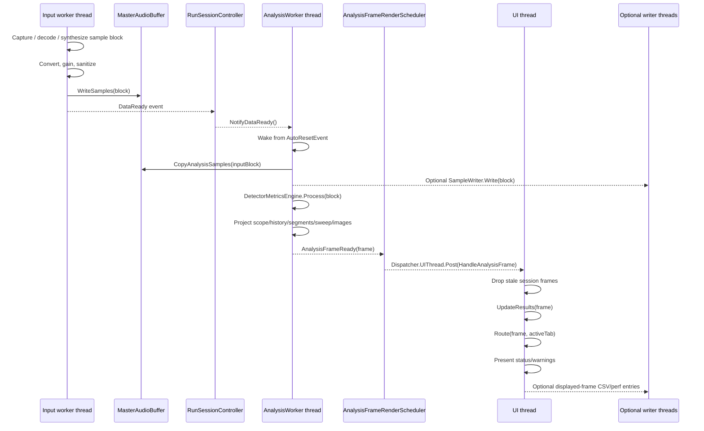

# Thread Data Flow View

이 문서는 TimeGrapherNet 런타임에서 입력, 분석, UI, 선택적 파일 출력 스레드가 데이터를 어떻게 주고받는지 요약한다. 핵심 구조는 샘플 payload를 이벤트로 직접 밀어 넣는 방식이 아니라, 입력 스레드가 `MasterAudioBuffer`에 쓰고 `DataReady`로 분석 스레드를 깨우는 Producer-Consumer + Shared Data 구조다.

## 1. Runtime thread/data-flow overview

```mermaid
flowchart LR
    subgraph UI["UI Thread / Avalonia Dispatcher"]
        StartStop["Run start / stop controls"]
        RenderScheduler["AnalysisFrameRenderScheduler<br/>latest-wins pending frame"]
        HandleFrame["HandleAnalysisFrame(frame)"]
        GraphRenderer["GraphFrameRenderer.UpdateResults"]
        FrameRouter["AnalysisFrameRouter.Route"]
        ActiveGraph["Active tab renderer<br/>heavy graph work only for selected tab"]
        Presenter["AnalysisFramePresenter<br/>status / warning UI"]
    end

    subgraph Input["Input worker execution"]
        LiveInput["Live audio callback<br/>AudioCaptureWorker / LinuxLiveAudioWorker"]
        PlaybackInput["PlaybackWorker thread"]
        SimInput["SimWorker thread"]
        Normalize["Convert, gain, sanitize samples"]
        DataReady["DataReady event<br/>signal only"]
    end

    subgraph Shared["Shared synchronized buffer"]
        MasterBuffer["MasterAudioBuffer<br/>30 s mono float ring buffer<br/>sample counters + capture timestamps"]
    end

    subgraph Analysis["AnalysisWorker thread"]
        Wake["NotifyDataReady()<br/>AutoResetEvent wake-up"]
        Copy["CopyAnalysisSamples()<br/>copy block from ring buffer"]
        RecordTap["optional SampleWriter.Write(block)"]
        PreProject["SoundPrint / Spectrogram / MultiFilter<br/>sample pre-processing"]
        Pipeline["DetectorMetricsEngine.Process(block)<br/>detector + BPH lock + metrics"]
        Projectors["Frame projectors<br/>scope, history, segments, sweep, images"]
        Frame["AnalysisFrame<br/>shared read snapshot"]
    end

    subgraph OptionalIo["Optional background writer threads"]
        WavQueue["QueuedWavStreamWriter<br/>bounded queue"]
        WavThread["WavWriter thread"]
        MeasurementQueue["MeasurementResultLogger<br/>bounded queue"]
        MeasurementThread["measurement CSV writer thread"]
        PerfQueue["AnalysisPerformanceLogger<br/>bounded queue"]
        PerfThread["performance CSV writer thread"]
    end

    StartStop --> LiveInput
    StartStop --> PlaybackInput
    StartStop --> SimInput

    LiveInput --> Normalize
    PlaybackInput --> Normalize
    SimInput --> Normalize
    Normalize -->|"raw float sample block"| MasterBuffer
    Normalize -.->|"raise event, no sample payload"| DataReady
    DataReady -.-> Wake

    Wake --> Copy
    MasterBuffer -->|"copied analysis block"| Copy
    Copy --> RecordTap
    RecordTap -.->|"recording enabled"| WavQueue
    WavQueue --> WavThread

    Copy --> PreProject
    PreProject --> Pipeline
    Pipeline --> Projectors
    Projectors --> Frame

    Frame -->|"AnalysisFrameReady(frame)"| RenderScheduler
    RenderScheduler -->|"Dispatcher.UIThread.Post"| HandleFrame
    HandleFrame --> GraphRenderer
    HandleFrame --> FrameRouter
    FrameRouter --> ActiveGraph
    HandleFrame --> Presenter
    HandleFrame -.->|"displayed-frame metrics"| MeasurementQueue
    HandleFrame -.->|"latency/perf metrics"| PerfQueue
    MeasurementQueue --> MeasurementThread
    PerfQueue --> PerfThread
```

## 2. Sequence view

## 3. Thread responsibilities and exchanged payloads

| Execution context | Owns | Sends | Receives |
|---|---|---|---|
| UI thread | Run controls, tab routing, graph rendering, status/warning presentation | Start/stop commands, UI posts, optional displayed-frame log entries | `AnalysisFrame` via dispatcher post |
| Live input callback / playback / simulation worker | Captured, decoded, or generated audio blocks | Float sample blocks into `MasterAudioBuffer`; `DataReady` signal | Pause/stop/live-adjust requests |
| `MasterAudioBuffer` | Synchronized sample history and write stamps | Copied analysis blocks | Raw float sample writes |
| `AnalysisWorker` thread | Detector, BPH sync, metrics, projectors, `AnalysisFrame` creation | `AnalysisFrameReady(frame)`, optional recording blocks | Wake-up signal and copied sample blocks |
| Optional writer threads | WAV recording, measurement CSV, performance CSV | Files on disk | Bounded queue entries |

## 4. Architectural reading

- Input to analysis is **Producer-Consumer + Shared Data**: sample blocks are stored in `MasterAudioBuffer`; `DataReady` is only a wake-up notification.
- Analysis is a **Pipeline / Dataflow**: copied blocks pass through detector, metrics, and projector stages.
- UI consumes a **Shared Read Model**: graph renderers read `AnalysisFrame` snapshots rather than recomputing raw audio analysis.
- UI scheduling applies the SAP performance tactics **Limit Event Response** and **Schedule Resources**: latest-wins frame coalescing and active-tab rendering keep the UI from accumulating stale graph work.
