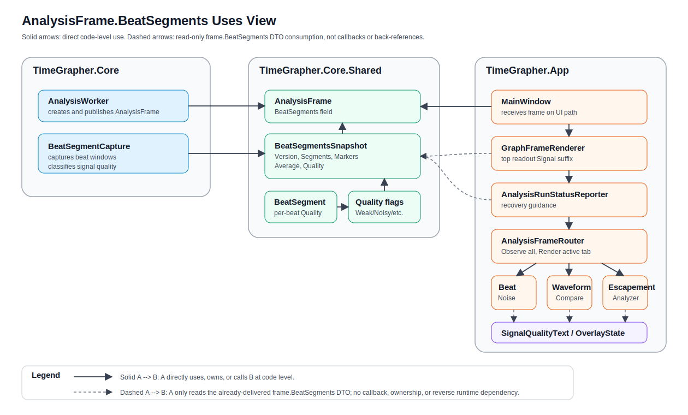
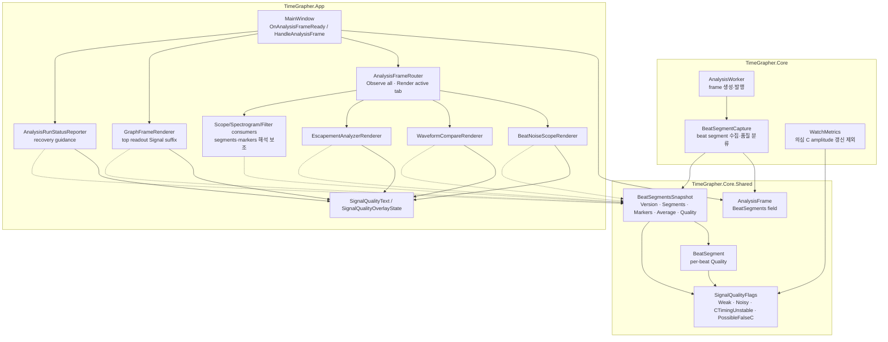
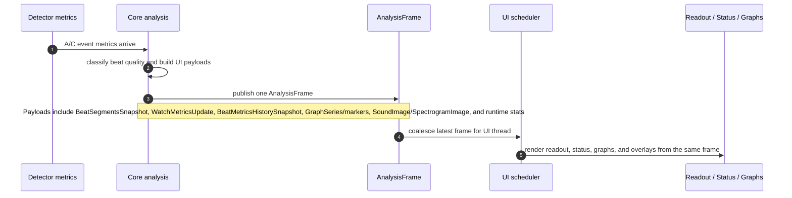

# Signal Quality 테스트 가이드

이 문서는 `feature/signal-quality-propagation` 브랜치의 stage 1, stage 2,
그리고 그래프 overlay signal-quality 변경사항을 검증하기 위한 가이드다.

## 변경 내용

앱은 이제 beat-segment 공유 DTO를 통해 signal-quality warning을 전달한다.
현재 사용하는 flag는 다음과 같다.

- `WeakSignal`: 표시 중인 beat segment에서 사용할 수 있는 C marker를 찾지 못했다.
- `NoisySignal`: 감지된 C timing이 최근 A-to-C timing과 일관되지 않는다.
- `CTimingUnstable`: A-to-C interval이 최근 median/MAD band에서 벗어났다.
- `PossibleFalseC`: C 후보가 비정상적으로 이르며 B/noise가 C로 잡혔을 가능성이 있다.
- `ClippedSignal`: clipping classification을 위해 예약된 flag다.
- `NoSignal`: no-signal classification을 위해 예약된 flag다.

Stage 1에서는 공유 quality 상태를 상단 readout과 Beat Noise에 표시했다.
Stage 2에서는 recovery guidance를 추가하고, 의심스러운 C 후보를 amplitude 갱신에서
제외하며, quality 상태를 beat-aligned analysis view까지 전달했다. 이번 graph-overlay
변경에서는 graph tab 영역 전체에 공통 warning overlay를 추가하여 사용자가 어떤
diagnostic view를 보고 있어도 같은 위치에서 경고를 볼 수 있게 했다. 중복을 피하기
위해 상단 measurement readout의 `Signal ...` suffix와 일부 graph 내부 warning label은
표시하지 않는다.

## Architecture View: `AnalysisFrame.BeatSegments` 전달 구조

이 섹션은 signal-quality 평가값이 어디에 저장되고 어떤 경로로 각 그래프에 전달되는지 보여준다. 핵심은 `Core`가 품질을 판단하고, `Core.Shared` DTO인 `BeatSegmentsSnapshot`을 `AnalysisFrame.BeatSegments`에 실어 `App`으로 전달하며, App의 renderer와 service는 같은 DTO를 읽어 표시만 담당한다는 점이다.

### Uses View

이 뷰는 compile-time/code-level 책임 분리를 설명한다. 실선 `A --> B`는 A가 B를 직접 사용·소유·호출한다는 뜻이고, 점선 `A -.-> B`는 이미 전달받은 `frame.BeatSegments` DTO를 읽는 소비 관계를 뜻한다. 점선은 callback, ownership, 역방향 runtime dependency를 의미하지 않는다.





정적 책임은 다음과 같이 나뉜다.

- `BeatSegmentCapture`는 beat window를 만들고 `ClassifyQuality()`로 `WeakSignal`, `CTimingUnstable`, `NoisySignal`, `PossibleFalseC`를 결정한다.
- 개별 beat의 품질은 `BeatSegment.Quality`에 저장된다.
- 최근 beat ring 전체의 품질은 `BeatSegmentsSnapshot.Quality`에 OR 집계되어 저장된다.
- `AnalysisFrame.BeatSegments`는 이 snapshot을 App으로 넘기는 단일 전달 슬롯이다.
- App의 readout, status, graph renderer는 같은 `BeatSegmentsSnapshot`을 읽고 `SignalQualityText`/`SignalQualityOverlayState`로 문구와 overlay만 만든다.

### Runtime Sequence View

이 뷰는 구현 메서드 호출을 모두 펼치지 않고, `AnalysisFrame` 하나가 signal-quality 정보뿐 아니라 metrics, graph payload, image payload, runtime 상태를 같은 UI update 단위로 App 표시 계층까지 전달하는 큰 흐름을 보여준다.




전달 경로에서 중요한 점은 다음과 같다.

- `Core`는 beat 품질을 판단하고 최근 beat ring의 품질을 `BeatSegmentsSnapshot.Quality`로 집계한다.
- `AnalysisFrame.BeatSegments`는 Core에서 App으로 signal-quality 상태를 넘기는 전용 DTO 슬롯이다.
- 같은 frame에는 `MetricsUpdate`, `MetricsHistory`, `ScopeSeries`/`RateSeries`, scope markers, `SoundImage`, `SpectrogramImage`, latency/deadline/runtime stats도 함께 실린다.
- App의 readout, status guidance, graph overlay는 별도 이벤트 버스나 역참조 없이 같은 `AnalysisFrame`에서 필요한 payload를 읽어 표시만 담당한다.

## 프로젝트 플랜 기반 그래프별 비정상 신호 안내 체크리스트

프로젝트 플랜은 TimeGrapher가 단순히 값을 보여주는 것이 아니라, 약한 신호, 잡음, 누락, clipping, 잘못 잡힌 이벤트처럼 측정값을 오해하게 만들 수 있는 조건을 사용자에게 알려야 한다고 요구한다. 특히 "signal too noisy", "reposition watch", "microphone gain too high", "measurement confidence low" 같은 guidance와, weak/noisy/partially missing signal에서 불안정하거나 misleading한 출력을 내지 않는 graceful degradation이 핵심이다.

아래 체크리스트는 최종 데모와 수동 QA에서 그래프별로 확인할 항목이다. `[직접 경고]`는 현재 signal-quality warning/overlay가 직접 표시되어야 하는 항목이고, `[해석 보조]`는 그래프 자체의 reference line, label, range, marker, 비교 UI로 사용자가 비정상 가능성을 판단할 수 있어야 하는 항목이다.

| 그래프 / 표시 영역 | 프로젝트 플랜에서 요구한 비정상 신호 안내 관점 | 체크리스트 |
|---|---|---|
| 공통 graph overlay / status guidance | 입력이 noisy, weak, clipped, incomplete, misleading일 수 있음을 실시간으로 알려야 한다. | [ ] graph 영역 공통 overlay가 경고를 표시한다. [ ] status guidance가 reposition, gain 조정, handling/ambient noise 감소처럼 사용자가 취할 행동을 말한다. [ ] runtime 성능 저하 경고와 acoustic signal-quality 경고를 혼동하지 않는다. |
| Sound Graph / Sound Print | raw 또는 processed watch signal을 보여주고, 작은 timing fluctuation, averaging window, threshold/reference line을 통해 stability/noise/watch problem을 이해하게 해야 한다. | [ ] 잡음이 심하거나 신호가 약한 구간에서 사용자가 clean signal처럼 오해하지 않도록 warning 또는 guidance가 연결된다. [ ] averaging/filtering을 켠 경우 원신호의 약한 성분이 숨을 수 있음을 설명할 수 있다. [ ] pause/review 중에도 warning context가 사라지지 않는다. |
| Rate/Scope | 원 신호와 분석된 timing view를 비교할 수 있어야 하며, 같은 raw signal이 Sound Print와 일관되게 해석되어야 한다. | [ ] raw/processed view가 같은 입력 구간을 기준으로 설명된다. [ ] marker가 불안정하거나 C 후보가 의심스러울 때 공통 overlay/status warning과 모순되지 않는다. |
| Trace Display | rate가 늦거나 amplitude가 270-300도 범위를 벗어나면 사용자에게 alert해야 한다. | [ ] rate late alert가 표시된다. [ ] amplitude out-of-range alert가 표시된다. [ ] smoothing 때문에 짧은 이상 구간이 완전히 숨지 않는지 설명할 수 있다. [ ] signal-quality warning이 있으면 trace 값을 확정 판정처럼 말하지 않는다. |
| Vario / Rate-Amplitude Stability | rate/amplitude의 min, max, average, sigma와 acceptable range를 구분해 장기 안정성 이상을 읽게 해야 한다. | [ ] acceptable range가 시각적으로 구분된다. [ ] min/max/average/sigma가 장기 불안정 또는 variation 증가를 드러낸다. [ ] 약신호/잡음 warning이 발생한 구간의 통계 해석에 주의가 필요함을 설명할 수 있다. |
| Multi-Position Sequence / Positions | 포지션별 rate, amplitude, beat error와 X/D summary로 자세별 불안정 또는 balance-wheel unbalance 가능성을 보여야 한다. | [ ] 각 포지션 결과가 active position과 연결된다. [ ] 포지션 간 차이가 큰 경우 신호 문제인지 실제 자세별 성능 차이인지 구분해 설명한다. [ ] weak/noisy warning이 있었던 포지션 결과를 clean 결과처럼 비교하지 않는다. |
| Beat Noise Scope | tick/tock beat noise의 shape, timing, repeatability를 summary measurement 대신 직접 검사하게 해야 한다. | [ ] [직접 경고] `WEAK SIGNAL`, `POSSIBLE FALSE C`, `C TIMING UNSTABLE` overlay가 Beat Noise graph area에 표시된다. [ ] Scope 1의 A/C marker가 의심스러운 C를 clean C처럼 보이게 하지 않는다. [ ] Scope 2 averaging이 random noise를 줄이는 목적임을 설명한다. [ ] 이전 beat strip 확대 보기에서도 warning context를 유지한다. |
| Beat Error Display / Diagnostic Trace | 숫자와 trace line이 일관되어야 하며, tick/tock line spacing 초과와 45도 이상 slope는 fault-state로 알려야 한다. | [ ] spacing acceptable range와 warning이 표시된다. [ ] trace slope가 과도할 때 fault-state indication이 있다. [ ] signal-quality warning이 있을 때 spacing/slope 판단을 확정 진단처럼 말하지 않는다. |
| Long-Term Performance Graph | rate, amplitude, beat error가 장기적으로 어떻게 변하는지 보여주고, variation range와 average로 안정성을 판단하게 해야 한다. | [ ] 장기 average와 variation range가 보인다. [ ] acceptable/reference range가 있으면 trace와 함께 읽힌다. [ ] warning이 발생한 구간이 장기 추세 해석을 오염시킬 수 있음을 설명할 수 있다. |
| Escapement Analyzer / Marker-Line Display | A/C timing marker와 ms label을 통해 fine-grained beat timing을 검사하고, onset/peak 같은 alternative reference가 더 안정적인지 비교하게 해야 한다. | [ ] [직접 경고] graph 영역 공통 overlay에 signal-quality warning이 표시된다. [ ] 불안정한 C marker를 정상 repeatability sample처럼 취급하지 않는다. [ ] marker position과 waveform feature가 어긋나 보이면 measurement confidence가 낮다는 guidance와 연결한다. |
| Time-Frequency Spectrogram | 시간-주파수 에너지 구조와 color intensity로 반복 beat pattern, 주요 acoustic component, frequency band behavior를 해석하게 해야 한다. | [ ] color scale/legend로 약한 에너지와 강한 에너지를 구분할 수 있다. [ ] 반복 구조가 흐리거나 외부 잡음 band가 강한 경우 noisy/low-confidence 상황으로 설명한다. [ ] spectrogram만으로 rate/amplitude를 확정하지 않고 다른 diagnostic view와 함께 해석한다. |
| Waveform Compare | aligned lanes에서 waveform shape, spacing, consistency를 비교하고 landmark를 식별해야 한다. | [ ] [직접 경고] graph 영역 공통 overlay에 signal-quality warning이 표시된다. [ ] `PossibleFalseC` beat는 mean-C guide에서 제외된다. [ ] lane 간 shape/spacing inconsistency가 noise 또는 weak signal 가능성과 연결된다. |
| Scope Sweep | fixed sweep window에서 beat pattern이 안정적으로 머무는지, fast/slow일 때 drift가 나타나는지 보여야 한다. | [ ] pattern drift를 fast/slow 또는 sync 불안정과 구분해 설명한다. [ ] nominal reference 값이 있으면 현재 sweep과 비교한다. [ ] signal-quality warning이 있을 때 drift를 watch fault로 단정하지 않는다. |
| Filter Scope / F0-F3 | 같은 신호를 여러 filter view로 비교해 raw representation, smoothing, landmark emphasis, T1/T2/T3 식별을 도와야 한다. | [ ] F0는 closest raw representation으로 설명된다. [ ] F1 smoothing이 background noise를 줄이지만 low-amplitude component를 덜 보이게 할 수 있음을 표시/설명한다. [ ] F2/F3가 feature를 강조해도 원신호와 다른 해석일 수 있음을 설명한다. [ ] 네 filter view가 같은 input signal/time axis를 공유한다. |

데모에서는 모든 항목을 길게 보여주기보다, `공통 graph overlay/status -> Beat Noise -> Waveform Compare -> Escapement Analyzer`를 signal-quality 직접 경고 경로로 보여주고, Trace/Beat Error/Long-Term/Vario/Scope/Filter 계열은 각 그래프의 reference line, range, marker, trend가 비정상 가능성을 어떻게 보조하는지 짧게 연결하면 된다.

## 체크리스트 테스트 환경 Matrix

아래 WAV 세트로 `프로젝트 플랜 기반 그래프별 비정상 신호 안내 체크리스트`의 직접 경고와 해석 보조 항목을 반복 검증한다. 모든 파일은 192 kHz float mono WAV이며, headless verifier에서 nominal BPH sync가 유지되는 입력이다.

| Fixture | 목적 | 주요 확인 항목 |
|---|---|---|
| `error-test-fixtures/28800BPH_clean_reference_192000Hz.wav` | clean baseline | warning이 없는 상태, reference/range/marker가 정상 신호 기준으로 보이는지 확인 |
| `error-test-fixtures/28800BPH_falseC_all_test_beats_192000Hz.wav` | false-C 전용 테스트 | 앞 1초 warm-up 이후 모든 테스트 beat에서 공통 graph overlay/status의 `PossibleFalseC`/`CTimingUnstable` 직접 경고 확인 |
| `error-test-fixtures/43200BPH_bad-signal_falseC_weak_192000Hz.wav` | high-rate false-C 보조 테스트 | 43200 BPH에서도 false-C/weak-C warning 경로가 유지되는지 확인 |
| `error-test-fixtures/28800BPH_noisy_handling_impulse_192000Hz.wav` | ambient/handling noise | noisy/low-confidence 설명, spectrogram 외부 잡음 band, rate/beat-error 변동 해석 주의 확인 |
| `error-test-fixtures/28800BPH_weak_missingC_192000Hz.wav` | weak or partially missing C | `Amplitude ---°`, weak/missing signal guidance, mean-C/marker 신뢰도 저하 확인 |
| `error-test-fixtures/28800BPH_clipping_gain_high_192000Hz.wav` | gain too high / visible hard clipping | clipped flat-top waveform, gain 조정 guidance, clipping과 runtime deadline warning 구분 확인 |
| `error-test-fixtures/28800BPH_transient_falseC_then_clean_192000Hz.wav` | false-C warning recovery | 앞 2초는 false-C 조건을 유도하고 이후 clean 기준으로 돌아와 overlay/status fade-out을 확인 |

Verifier smoke test:

```powershell
dotnet run --project src/TimeGrapher.Verify -c Release -- error-test-fixtures/28800BPH_clean_reference_192000Hz.wav error-test-fixtures/28800BPH_falseC_all_test_beats_192000Hz.wav error-test-fixtures/43200BPH_bad-signal_falseC_weak_192000Hz.wav error-test-fixtures/28800BPH_noisy_handling_impulse_192000Hz.wav error-test-fixtures/28800BPH_weak_missingC_192000Hz.wav error-test-fixtures/28800BPH_clipping_gain_high_192000Hz.wav error-test-fixtures/28800BPH_transient_falseC_then_clean_192000Hz.wav
```

기대 결과: 각 파일이 filename의 BPH(`28800` 또는 `43200`)로 `sync_status=Synced`를 출력한다. `28800BPH_weak_missingC_192000Hz.wav`는 amplitude가 `---°`로 나올 수 있으며, 이는 missing/low-confidence C 검증에 사용한다.

Benchmark smoke test:

```powershell
dotnet run --project src/TimeGrapher.App -c Release -- --analysis-benchmark --wav error-test-fixtures/28800BPH_clean_reference_192000Hz.wav
dotnet run --project src/TimeGrapher.App -c Release -- --analysis-benchmark --wav error-test-fixtures/28800BPH_noisy_handling_impulse_192000Hz.wav
dotnet run --project src/TimeGrapher.App -c Release -- --analysis-benchmark --wav error-test-fixtures/28800BPH_weak_missingC_192000Hz.wav
dotnet run --project src/TimeGrapher.App -c Release -- --analysis-benchmark --wav error-test-fixtures/28800BPH_clipping_gain_high_192000Hz.wav
dotnet run --project src/TimeGrapher.App -c Release -- --analysis-benchmark --wav error-test-fixtures/28800BPH_transient_falseC_then_clean_192000Hz.wav
```

기대 결과: `detected_bph=28800`, `max_deadline_level=0`. 이미 포함된 43200 fixture는 아래 수동 fixture 섹션의 benchmark 명령으로 확인한다.

### SNR Robustness Fixture

white-noise 내성을 보기 위해 같은 28800 BPH clean base waveform에 deterministic Gaussian white noise를 합성한 fixture를 포함한다. GUI에서 noise floor가 보이도록 SNR은 전체 파일 RMS가 아니라 beat packet active window(각 beat 시작 후 30 ms) RMS 대비 noise RMS로 계산한다. 따라서 25 dB fixture는 전체 파일 RMS 기준으로는 약 18.8 dB라 시각적으로도 noise가 보인다.

| Fixture | measured SNR | 목적 | 기대 headless 결과 |
|---|---:|---|---|
| `error-test-fixtures/28800BPH_snr25dB_white_noise_192000Hz.wav` | 25.000 dB active-window SNR | 가장 낮은 SNR smoke; GUI에서도 noise floor 상승이 보이지만 nominal beat lock 유지 확인 | `detected_bph=28800`, `sync_status=Synced`, amplitude 약 `271°` |
| `error-test-fixtures/28800BPH_snr30dB_white_noise_192000Hz.wav` | 30.000 dB active-window SNR | 중간 SNR; readout/graph가 clean 기준과 크게 어긋나지 않는지 확인 | `detected_bph=28800`, `sync_status=Synced`, amplitude 약 `271°` |
| `error-test-fixtures/28800BPH_snr35dB_white_noise_192000Hz.wav` | 35.000 dB active-window SNR | 높은 SNR; clean reference에 가까운 baseline noise tolerance 확인 | `detected_bph=28800`, `sync_status=Synced`, amplitude 약 `270°` |

SNR verifier:

```powershell
dotnet run --project src/TimeGrapher.Verify -c Release -- error-test-fixtures/28800BPH_snr25dB_white_noise_192000Hz.wav error-test-fixtures/28800BPH_snr30dB_white_noise_192000Hz.wav error-test-fixtures/28800BPH_snr35dB_white_noise_192000Hz.wav
```

실행 결과 기준:

```text
28800BPH_snr25dB_white_noise_192000Hz.wav: detected_bph=28800 sync_status=Synced results=[Error Rate   +0.0 s/d | Amplitude 271° | BEAT ERROR  0.0 ms | BPH 28800]
28800BPH_snr30dB_white_noise_192000Hz.wav: detected_bph=28800 sync_status=Synced results=[Error Rate   -0.0 s/d | Amplitude 271° | BEAT ERROR  0.0 ms | BPH 28800]
28800BPH_snr35dB_white_noise_192000Hz.wav: detected_bph=28800 sync_status=Synced results=[Error Rate   -0.0 s/d | Amplitude 270° | BEAT ERROR  0.0 ms | BPH 28800]
```

SNR benchmark:

```powershell
dotnet run --project src/TimeGrapher.App -c Release --no-build -- --analysis-benchmark --wav error-test-fixtures/28800BPH_snr25dB_white_noise_192000Hz.wav
dotnet run --project src/TimeGrapher.App -c Release --no-build -- --analysis-benchmark --wav error-test-fixtures/28800BPH_snr30dB_white_noise_192000Hz.wav
dotnet run --project src/TimeGrapher.App -c Release --no-build -- --analysis-benchmark --wav error-test-fixtures/28800BPH_snr35dB_white_noise_192000Hz.wav
```

기대 결과: 세 fixture 모두 `detected_bph=28800`, `max_deadline_level=0`이어야 한다. 실제 측정에서는 25 dB도 sync와 amplitude를 유지했고, 35 dB로 갈수록 clean reference와 더 가까운 표시가 나와야 한다.

수동 GUI 확인:

1. clean reference를 먼저 재생해 Rate/Scope, Sound Print, Beat Noise, Waveform Compare의 baseline 모양을 확인한다.
2. 35 dB, 30 dB, 25 dB 순서로 재생하면서 noise floor 상승, spectrogram background energy, waveform lane의 잔물결 증가를 비교한다.
3. 세 SNR 모두 nominal BPH와 amplitude가 유지되어야 하며, warning이 뜨더라도 측정 lock이 깨진 것으로 해석하지 않는다.
4. 25 dB에서 marker나 lane shape가 흔들리면 `noisy but still locked` 사례로 설명하고, false-C/weak-C fixture처럼 직접 bad-marker warning을 유도하는 목적과 구분한다.

### 그래프별 실험 가이드

아래 절차는 그래프 하나를 띄워놓고 `error-test-fixtures/*.wav`만 바꿔가며 반복 확인하기 위한 실험 가이드다. 각 테스트는 요청 형식에 맞춰 `1. WAV 실행`, `2. 예상결과`, `3. 실패 기준` 순서로 작성한다. 모든 fixture는 192 kHz Playback 기준이다. `28800BPH_falseC_all_test_beats_192000Hz.wav`는 detector history를 만들기 위한 앞 1초 warm-up 이후 모든 테스트 beat가 false-C 조건이 되도록 재생성했다.

#### 공통 상단 Readout / Status Bar

프로젝트 플랜 근거: summary bar는 rate, amplitude, beat error, BPH를 실시간 표시해야 하며(line 113-117), noisy/weak/clipped/incomplete 상태는 status/error feedback과 recovery guidance를 제공해야 한다(line 94-102, 246-248).

실험절차:

1. `error-test-fixtures/28800BPH_clean_reference_192000Hz.wav` 실행.
2. 예상결과: graph 영역 공통 overlay가 없고 status bar가 일반 색상으로 정상 측정 상태를 표시한다.
3. 실패 기준: clean 입력인데 warning suffix가 남거나 status bar가 빨간 warning 상태로 남는다.

1. `error-test-fixtures/28800BPH_falseC_all_test_beats_192000Hz.wav` 실행.
2. 예상결과: warm-up 이후 graph 영역 공통 overlay/status bar가 `Possible false C` 또는 `C timing unstable` 계열 warning을 표시하고, status bar가 빨간색 warning 상태로 Beat Noise 확인 또는 handling noise 감소를 안내한다.
3. 실패 기준: 테스트 구간에서 warning이 없거나 clean 측정처럼 보인다.

1. `error-test-fixtures/28800BPH_weak_missingC_192000Hz.wav` 실행.
2. 예상결과: `Signal Weak signal` 또는 amplitude `---°` 상태가 보이고 status bar가 watch reposition 또는 gain 증가를 안내한다.
3. 실패 기준: C marker가 없는 약신호인데 clean처럼 확정 측정값만 표시한다.

1. `error-test-fixtures/28800BPH_clipping_gain_high_192000Hz.wav` 실행.
2. 예상결과: `Signal Clipping` 또는 gain 조정 guidance가 표시되고 clipping warning은 runtime deadline warning과 구분된다.
3. 실패 기준: clipping fixture가 clean 신호처럼 보이거나 `Display quality was reduced...` 같은 성능 warning과 혼동된다.

#### Rate/Scope

프로젝트 플랜 근거: Rate/Scope는 timing 관계, signal level waveform, A/C marker, A-to-C interval, consecutive-A interval을 함께 보여야 한다(line 119-125, 238-240).

실험절차:

1. `error-test-fixtures/28800BPH_clean_reference_192000Hz.wav` 실행.
2. 예상결과: tic/toc rate traces가 안정적이고 Signal Level의 A/C marker와 interval 표시가 일관된다.
3. 실패 기준: clean인데 marker가 크게 흔들리거나 readout과 trace가 서로 다른 상태를 말한다.

1. `error-test-fixtures/28800BPH_falseC_all_test_beats_192000Hz.wav` 실행.
2. 예상결과: warm-up 이후 C marker가 비정상적으로 이르거나 불안정하며 상단/status warning과 모순되지 않는다.
3. 실패 기준: 의심 C marker가 clean C처럼 표시되거나 false-C warning 없이 안정 측정처럼 보인다.

1. `error-test-fixtures/28800BPH_noisy_handling_impulse_192000Hz.wav` 실행.
2. 예상결과: waveform noise floor 또는 impulse disturbance가 보이지만 nominal BPH lock은 유지된다.
3. 실패 기준: noise 상황이 Rate/Scope와 Sound Print에서 서로 다르게 해석되거나 lock이 깨진 상태를 정상 실험 결과로 둔다.

#### Trace

프로젝트 플랜 근거: Trace display는 rate deviation과 amplitude over time을 기록하고, late rate와 270-300도 범위 밖 amplitude를 alert해야 한다(line 269-281).

실험절차:

1. `error-test-fixtures/28800BPH_clean_reference_192000Hz.wav` 실행.
2. 예상결과: rate와 amplitude trace가 안정적인 baseline을 만든다.
3. 실패 기준: clean 기준에서도 trace가 과도하게 흔들리거나 acceptable range를 벗어난 것으로 보인다.

1. `error-test-fixtures/28800BPH_noisy_handling_impulse_192000Hz.wav` 실행.
2. 예상결과: rate/amplitude trace가 clean보다 흔들릴 수 있고, 이를 signal-quality 문맥과 함께 해석한다.
3. 실패 기준: noisy trace를 watch fault 확정 판정처럼 표시한다.

1. `error-test-fixtures/28800BPH_weak_missingC_192000Hz.wav` 실행.
2. 예상결과: amplitude가 `---°` 또는 불안정하게 보이며 low-confidence/weak signal 사례로 해석한다.
3. 실패 기준: C가 약하거나 없는 구간을 clean amplitude trend처럼 표시한다.

#### Beat Error

프로젝트 플랜 근거: Beat Error Display는 rate, amplitude, beat error, BPH 숫자와 trace를 함께 보여야 하며, line separation 초과와 45도 이상 slope 같은 fault를 알려야 한다(line 325-336).

실험절차:

1. `error-test-fixtures/28800BPH_clean_reference_192000Hz.wav` 실행.
2. 예상결과: `Error Rate`, `Amplitude`, `BEAT ERROR`, `BPH`, `DIFF TIC-TAC`, `DIFF PERIOD`, `AVG PERIOD`가 안정적이고 trace 방향과 일치한다.
3. 실패 기준: 숫자와 trace 방향이 맞지 않는다.

1. `error-test-fixtures/28800BPH_falseC_all_test_beats_192000Hz.wav` 실행.
2. 예상결과: false-C warning이 있는 동안 beat-error trace/숫자를 확정 fault로 보지 않고 signal-quality warning과 함께 해석한다.
3. 실패 기준: warning 중인데도 beat-error fault를 확정 진단처럼 표시한다.

1. `error-test-fixtures/28800BPH_weak_missingC_192000Hz.wav` 실행.
2. 예상결과: amplitude `---°` 가능성을 포함해 numeric panel이 low-confidence 상태와 모순되지 않는다.
3. 실패 기준: 약신호인데 clean numeric panel처럼 보인다.

#### Vario / Rate-Amplitude Stability

프로젝트 플랜 근거: Vario는 min, max, average, sigma, elapsed time, current reading을 표시하고 acceptable range와 measured values를 구분해야 한다(line 286-295).

실험절차:

1. `error-test-fixtures/28800BPH_clean_reference_192000Hz.wav` 실행.
2. 예상결과: min/max/average/sigma가 안정적인 baseline을 만들고 acceptable range와 measured values가 구분된다.
3. 실패 기준: acceptable range와 measured values를 읽을 수 없다.

1. `error-test-fixtures/28800BPH_noisy_handling_impulse_192000Hz.wav` 실행.
2. 예상결과: spread 또는 sigma가 clean보다 커질 수 있고 noisy 구간 통계로 설명된다.
3. 실패 기준: noisy 통계를 clean stability summary와 같은 신뢰도로 비교한다.

1. `error-test-fixtures/28800BPH_weak_missingC_192000Hz.wav` 실행.
2. 예상결과: weak warning 또는 amplitude 불안정 때문에 통계 해석에 주의가 필요하다고 설명할 수 있다.
3. 실패 기준: weak 구간 통계가 clean 장기 안정성 결과처럼 보인다.

#### Long-Term

프로젝트 플랜 근거: Long-Term Performance Graph는 rate, amplitude, beat error의 extended-period 변화와 average, typical variation range를 보여야 한다(line 338-346).

실험절차:

1. `error-test-fixtures/28800BPH_clean_reference_192000Hz.wav` 실행.
2. 예상결과: average와 variation range가 안정적인 baseline을 만든다.
3. 실패 기준: clean 반복 재생에서도 장기 trend가 비정상적으로 흔들린다.

1. `error-test-fixtures/28800BPH_noisy_handling_impulse_192000Hz.wav` 실행.
2. 예상결과: noisy 구간이 장기 summary를 오염시킬 수 있음을 graph trend와 함께 설명한다.
3. 실패 기준: noisy 구간이 섞였는데도 clean long-term trend처럼 해석된다.

1. `error-test-fixtures/28800BPH_transient_falseC_then_clean_192000Hz.wav` 실행.
2. 예상결과: 앞 2초 warning 구간과 이후 clean 구간이 같은 장기 summary에 섞일 수 있어 warning context가 필요하다.
3. 실패 기준: transient bad 구간이 장기 average에 섞였는데 warning context가 없다.

#### Sweep

프로젝트 플랜 근거: Scope Mode는 fixed sweep window에서 beat pattern 안정성을 보여주고 fast/slow일 때 drift를 보여야 한다(line 392-400).

실험절차:

1. `error-test-fixtures/28800BPH_clean_reference_192000Hz.wav` 실행.
2. 예상결과: beat pattern이 fixed sweep window 안에서 안정적으로 머문다.
3. 실패 기준: clean pattern이 drift나 sync 문제처럼 보인다.

1. `error-test-fixtures/28800BPH_snr35dB_white_noise_192000Hz.wav` 실행.
2. 예상결과: clean에 가까운 pattern이며 noise floor가 가장 낮다.
3. 실패 기준: clean과 구분되지 않는 수준을 넘어 lock이 깨진 것처럼 보인다.

1. `error-test-fixtures/28800BPH_snr25dB_white_noise_192000Hz.wav` 실행.
2. 예상결과: SNR 35보다 noise floor가 더 보이지만 nominal lock은 유지된다.
3. 실패 기준: SNR 차이가 전혀 보이지 않거나 drift를 watch fault로 단정한다.

#### Escapement

프로젝트 플랜 근거: Escapement Analyzer는 waveform, A/C timing markers, ms labels를 통해 fine-grained beat timing과 onset/peak alternative를 비교하게 해야 한다(line 348-358).

실험절차:

1. `error-test-fixtures/28800BPH_falseC_all_test_beats_192000Hz.wav` 실행.
2. 예상결과: warm-up 이후 graph 영역 공통 overlay가 `Possible false C` 또는 `C timing unstable`를 표시하고 C marker를 정상 repeatability sample처럼 취급하지 않는다.
3. 실패 기준: false-C 테스트 구간에서 warning이 없거나 의심 C marker를 정상 C처럼 처리한다.

1. `error-test-fixtures/28800BPH_weak_missingC_192000Hz.wav` 실행.
2. 예상결과: C marker 부재/불안정과 weak warning이 Escapement 해석에 반영된다.
3. 실패 기준: C marker가 없는데도 정상 repeatability처럼 보인다.

1. `error-test-fixtures/28800BPH_transient_falseC_then_clean_192000Hz.wav` 실행.
2. 예상결과: 앞 2초 warning 후 clean frame이 들어오면 overlay fade-out 규칙에 따라 사라진다.
3. 실패 기준: clean 구간에서도 warning이 영구적으로 남거나 즉시 사라져 fade 규칙을 확인할 수 없다.

#### Positions

프로젝트 플랜 근거: Position testing은 standard positions를 식별하고, position별 rate/amplitude/beat error 및 sequence summary를 보여야 한다(line 252-260, 296-304).

실험절차:

1. `error-test-fixtures/28800BPH_clean_reference_192000Hz.wav` 실행.
2. 예상결과: CH, CB, 6H, 9H, 3H, 12H를 수동 전환하면 active position과 기록 결과가 연결된다.
3. 실패 기준: active position과 결과가 연결되지 않는다.

1. `error-test-fixtures/28800BPH_noisy_handling_impulse_192000Hz.wav` 실행.
2. 예상결과: noisy 상태로 기록한 position은 실제 자세별 성능 차이가 아니라 signal-quality 문제일 수 있다고 설명한다.
3. 실패 기준: noisy position 결과를 clean position과 같은 신뢰도로 비교한다.

1. `error-test-fixtures/28800BPH_weak_missingC_192000Hz.wav` 실행.
2. 예상결과: weak 상태의 position 결과는 low-confidence position sample로 취급한다.
3. 실패 기준: weak position 결과가 clean summary에 그대로 섞인다.

#### Beat Noise

프로젝트 플랜 근거: Beat-Noise Scope는 Scope 1/2로 beat noise shape, timing, repeatability를 검사하고 A/C marker, selectable strips, Sigma averaging을 제공해야 한다(line 306-319).

실험절차:

1. `error-test-fixtures/28800BPH_falseC_all_test_beats_192000Hz.wav` 실행.
2. 예상결과: warm-up 이후 `POSSIBLE FALSE C` 또는 `C TIMING UNSTABLE` overlay가 반복적으로 표시되고 Scope 1 C marker가 clean C처럼 보이지 않는다.
3. 실패 기준: false-C 테스트 구간에서 overlay가 없거나 의심 C가 정상 C처럼 표시된다.

1. `error-test-fixtures/28800BPH_weak_missingC_192000Hz.wav` 실행.
2. 예상결과: `WEAK SIGNAL` 또는 C marker 부재/불안정을 확인한다.
3. 실패 기준: C가 없는데도 weak warning이 없거나 초기 빈 상태 warning과 실제 weak warning을 구분할 수 없다.

1. `error-test-fixtures/28800BPH_noisy_handling_impulse_192000Hz.wav` 실행.
2. 예상결과: Scope 2 averaging 전후로 random noise가 줄어드는 목적을 설명할 수 있다.
3. 실패 기준: averaging이 noise를 줄이는지 확인할 수 없거나 원신호와 다른 해석처럼 보인다.

#### Waveforms

프로젝트 플랜 근거: Waveform Comparison은 aligned lanes에서 shape, spacing, consistency와 timing landmarks를 비교하고 rate/beat error/BPH context를 함께 보여야 한다(line 377-387).

실험절차:

1. `error-test-fixtures/28800BPH_falseC_all_test_beats_192000Hz.wav` 실행.
2. 예상결과: warm-up 이후 graph 영역 공통 overlay에 false-C/unstable-C warning이 표시되고 `PossibleFalseC` beat는 mean-C guide에서 제외된다.
3. 실패 기준: false-C beat가 mean-C guide에 포함되거나 lane warning과 top/status warning이 다르다.

1. `error-test-fixtures/28800BPH_weak_missingC_192000Hz.wav` 실행.
2. 예상결과: lane shape/spacing inconsistency가 weak signal 가능성과 연결된다.
3. 실패 기준: weak lane을 clean lane처럼 표시한다.

1. `error-test-fixtures/28800BPH_transient_falseC_then_clean_192000Hz.wav` 실행.
2. 예상결과: 앞 2초 warning 이후 clean 구간에서 overlay가 fade-out한다.
3. 실패 기준: clean 구간에서도 lane warning이 영구적으로 남는다.

#### Filter Scope / F0-F3

프로젝트 플랜 근거: Filter Scope는 같은 신호를 F0-F3로 비교해 raw waveform, smoothing, rising-slope emphasis, feature detection을 돕고 low-signal-level component가 덜 보일 수 있음을 설명해야 한다(line 402-419).

실험절차:

1. `error-test-fixtures/28800BPH_clean_reference_192000Hz.wav` 실행.
2. 예상결과: F0-F3가 같은 input/time axis를 공유하고 F0는 closest raw representation으로 보인다.
3. 실패 기준: filter view 간 time axis가 맞지 않는다.

1. `error-test-fixtures/28800BPH_snr25dB_white_noise_192000Hz.wav` 실행.
2. 예상결과: F1 smoothing은 noise를 줄이고 F2/F3는 T1/T2/T3 feature를 강조한다.
3. 실패 기준: smoothing/emphasis를 원신호 자체로 오해하게 만든다.

1. `error-test-fixtures/28800BPH_weak_missingC_192000Hz.wav` 실행.
2. 예상결과: low-amplitude C component가 filter에 따라 덜 보일 수 있음을 확인한다.
3. 실패 기준: weak component가 filter 때문에 숨었는데 clean 신호처럼 해석된다.

#### Sound Print

프로젝트 플랜 근거: Sound Print/Sound Graph는 raw 또는 processed watch signal과 A/C event markers를 sample-level로 보여 signal tracking consistency와 sample-rate resolution을 이해하게 해야 한다(line 127-139, 229-236).

실험절차:

1. `error-test-fixtures/28800BPH_clean_reference_192000Hz.wav` 실행.
2. 예상결과: A/C marker가 안정적인 sample-level baseline을 만든다.
3. 실패 기준: clean marker tracking이 불안정하다.

1. `error-test-fixtures/28800BPH_snr25dB_white_noise_192000Hz.wav` 실행.
2. 예상결과: SNR 35보다 noise floor가 높지만 nominal lock은 유지된다.
3. 실패 기준: SNR 차이가 보이지 않거나 lock 붕괴를 정상 결과로 둔다.

1. `error-test-fixtures/28800BPH_clipping_gain_high_192000Hz.wav` 실행.
2. 예상결과: flat-top clipped waveform이 눈으로 보인다.
3. 실패 기준: clipping fixture가 flat-top처럼 보이지 않는다.

#### Spectrogram

프로젝트 플랜 근거: Spectrogram은 time-frequency energy, repeated beat patterns, important acoustic components, color intensity legend를 보여야 한다(line 363-375).

실험절차:

1. `error-test-fixtures/28800BPH_clean_reference_192000Hz.wav` 실행.
2. 예상결과: 반복 beat energy 구조가 가장 선명하게 보인다.
3. 실패 기준: clean 반복 구조가 흐리거나 color intensity를 해석할 수 없다.

1. `error-test-fixtures/28800BPH_noisy_handling_impulse_192000Hz.wav` 실행.
2. 예상결과: background energy 또는 handling/impulse noise band가 clean보다 강하게 보인다.
3. 실패 기준: noisy와 clean의 time-frequency 차이가 보이지 않는다.

1. `error-test-fixtures/28800BPH_clipping_gain_high_192000Hz.wav` 실행.
2. 예상결과: high-energy/saturation risk를 보조적으로 확인한다.
3. 실패 기준: spectrogram만으로 rate/amplitude를 확정하거나 clipping 위험을 구분할 수 없다.

## Overlay Fade 규칙

그래프가 clean하지 않은 `SignalQualityFlags` 값을 받으면 overlay는 가장 최근 warning을
불투명하게 표시한다. 이후 clean frame이 들어오면 마지막 warning을 clean update 10회 동안
그대로 유지하고, 그 다음부터 선형으로 희미해지다가 100번째 clean update에서 사라진다.

이 동작은 wall-clock 시간이 아니라 frame count 기반이다. 따라서 Playback, Live,
Simulation mode에서 같은 analysis-frame sequence가 들어오면 동일하게 동작한다.

## 자동 검증

전체 build를 실행한다.

```powershell
dotnet build TimeGrapherNet.sln -c Release
```

Core 관련 focused test를 실행한다.

```powershell
dotnet test tests/TimeGrapher.Core.Tests/TimeGrapher.Core.Tests.csproj -c Release --no-build --filter "BeatSegmentCaptureTests|WatchMetricsTests"
```

App 관련 focused test를 실행한다.

```powershell
dotnet test tests/TimeGrapher.App.Tests/TimeGrapher.App.Tests.csproj -c Release --no-build --filter "WaveformCompareLogicTests|AnalysisRunStatusReporterTests|SignalQualityTextTests"
```

이 브랜치에서 사용한 통합 focused suite를 실행한다.

```powershell
dotnet test TimeGrapherNet.sln -c Release --no-build --filter "SignalQualityTextTests|AnalysisRunStatusReporterTests|WaveformCompareLogicTests|BeatSegmentCaptureTests|WatchMetricsTests|BeatNoiseScopeRendererTests|Escapement"
```

전체 test suite를 실행한다.

```powershell
dotnet test TimeGrapherNet.sln -c Release --no-build
```

기대 결과: 모든 test가 통과하고 build warning은 0개여야 한다.

## 수동 테스트 Fixture

반복 가능한 수동 검증을 위해 목적별 playback fixture를 포함했다.

```text
error-test-fixtures/28800BPH_falseC_all_test_beats_192000Hz.wav
error-test-fixtures/43200BPH_bad-signal_falseC_weak_192000Hz.wav
```

`28800BPH_falseC_all_test_beats_192000Hz.wav`는 그래프별 실험 가이드의 기본 false-C 입력이다. detector history를 만들기 위한 앞 1초 warm-up 이후 모든 테스트 beat가 이른 C 후보를 만들도록 재생성했다.

`43200BPH_bad-signal_falseC_weak_192000Hz.wav`는 192 kHz / 43200 BPH watch-like signal이다. 43200 BPH는 현재 표준 BPH catalog의 최고값이며 beat period는 약 83.3 ms다. 이 파일은 high-rate 환경에서도 detector가 nominal beat rate를 유지하면서 signal-quality warning 경로를 확인하는 보조 입력이다.

파형 특징:

- A/B/C realistic packet을 사용한다. A cluster는 약간 낮추고, B cluster는 상대적으로 강하게, C cluster와 C anchor는 약하게 만들어 B 또는 noise peak가 C처럼 보일 수 있는 조건을 만든다.
- 192 kHz sample rate라 A-to-C marker와 C peak 주변의 미세 timing 차이를 더 촘촘한 sample 간격으로 볼 수 있다.
- 약한 C와 강한 B 때문에 일부 beat에서 `PossibleFalseC` 또는 `CTimingUnstable` warning이 발생할 수 있다.
- 낮은 band-limited noise와 드문 impulse noise를 포함하므로 clean synthetic signal이 아니라 handling/ambient-noise 위험을 흉내 내는 수동 검증용 입력이다.

Headless verifier는 nominal beat rate를 계속 감지해야 하고, GUI에서는 signal-quality warning 경로를 확인할 수 있어야 한다.

Verifier 기준 명령은 다음과 같다.

```powershell
dotnet run --project src/TimeGrapher.Verify -c Release -- error-test-fixtures/28800BPH_falseC_all_test_beats_192000Hz.wav error-test-fixtures/43200BPH_bad-signal_falseC_weak_192000Hz.wav
```

생성된 fixture의 기대 기준 결과는 다음과 같다.

```text
detected_bph=28800 또는 43200
sync_status=Synced
results include Error Rate, Amplitude, Beat Error, and matching BPH
```

추가로, 회복 동작과 clipping 시각 확인에는 다음 28800 BPH fixture를 사용한다.

```text
error-test-fixtures/28800BPH_transient_falseC_then_clean_192000Hz.wav
error-test-fixtures/28800BPH_clipping_gain_high_192000Hz.wav
```

`28800BPH_transient_falseC_then_clean_192000Hz.wav`는 앞 2초를 false-C 조건으로 두고 이후 clean reference로 전환한다. GUI에서는 warning이 먼저 나타나고 clean frame이 들어온 뒤 overlay fade 규칙에 따라 사라져야 한다. Headless verifier 기준은 `detected_bph=28800`, `sync_status=Synced`, 최종 amplitude 약 `270°`다.

`28800BPH_clipping_gain_high_192000Hz.wav`는 clean reference를 high gain으로 증폭한 뒤 hard clipping해 flat-top waveform이 Sound Print, Scope, Filter Scope에서 눈으로 보이도록 만든 입력이다. Headless verifier 기준은 `detected_bph=28800`, `sync_status=Synced`, amplitude 약 `262°`다.

## 수동 검증

### 1. Baseline Clean Signal

1. 앱을 Simulation mode에서 기본 설정 또는 clean setting으로 시작한다.
2. beat sync가 잡힐 때까지 기다린다.
3. Beat Noise, Waveform Compare, Escapement Analyzer를 연다.

기대 결과:

- 상단 measurement readout에 `Signal ...` suffix가 없어야 한다.
- graph 영역 공통 overlay가 없어야 한다.
- Beat Noise, Waveform Compare, Escapement 내부 plot label에 별도 signal-quality 문구가 없어야 한다.
- Escapement Analyzer는 정상 repeatability verdict를 보여야 한다.

### 2. Possible False C / Unstable C

Playback mode에서 `error-test-fixtures/28800BPH_falseC_all_test_beats_192000Hz.wav`를
사용한다. 또는 B/noise peak가 C로 선택되는 경우처럼, 특정 beat의 C marker가 최근
A-to-C pattern보다 비정상적으로 이르게 잡히는 synthetic capture를 사용한다.

기대 결과:

- graph 영역 공통 overlay에 `Possible false C` 또는 `C timing unstable` guidance가 표시된다.
- 상단 measurement readout에는 중복 `Signal ...` suffix가 붙지 않는다.
- Beat Noise, Waveform Compare, Escapement 내부 plot label에는 별도 signal-quality 문구가 붙지 않는다.
- Escapement Analyzer는 해당 beat를 정상 repeatability sample처럼 처리하지 않는다.
- Status guidance는 Beat Noise를 확인하고 handling noise를 줄이라고 안내한다.
- Waveform Compare mean-C guide는 possible-false-C beat를 제외한다.
- 의심스러운 C는 amplitude reading을 갱신하지 않는다.

### 3. Overlay Fade-Out

1. bad-signal fixture 또는 동등한 입력으로 warning을 발생시킨다.
2. graph를 reset하지 않고 clean Simulation 또는 Playback signal로 전환한다.
3. graph 영역 공통 overlay를 관찰한다.

기대 결과:

- 마지막 warning은 clean signal update 10회 동안 완전히 보인다.
- 10번째 clean update 이후 warning이 점진적으로 희미해진다.
- 100번째 연속 clean update에서 warning이 사라진다.
- fade 중 새 warning이 발생하면 overlay는 새 warning text로 바뀌고 다시 완전히 보인다.

### 4. Weak Signal

A는 감지되지만 beat window 안에서 C marker를 사용할 수 없는 capture를 사용한다.

기대 결과:

- Beat Noise에 `WEAK SIGNAL`이 표시된다.
- 해당 quality가 shared snapshot에 도달하면 graph 영역 공통 overlay와 status guidance에 weak-signal warning이 표시된다.
- Status guidance는 watch 위치를 다시 잡거나 input gain을 높이라고 안내한다.

### 5. Runtime Quality와 Acoustic Signal Quality 구분

Acoustic signal 문제가 아니라 rendering deadline pressure 또는 analysis lag를 별도로 발생시킨다.

기대 결과:

- `Display quality was reduced to keep measurements responsive.`는 runtime/performance warning으로 유지된다.
- 이 문구는 acoustic signal-quality warning으로 처리하지 않는다.
- Signal-quality label은 beat/signal interpretation 문제에만 사용한다.

## 확인할 파일

- `src/TimeGrapher.Core/Shared/BeatSegmentsSnapshot.cs`
- `src/TimeGrapher.Core/Analysis/BeatSegmentCapture.cs`
- `src/TimeGrapher.Core/Metrics/WatchMetrics.cs`
- `src/TimeGrapher.App/Rendering/SignalQualityText.cs`
- `src/TimeGrapher.App/Rendering/SignalQualityOverlayState.cs`
- `src/TimeGrapher.App/Rendering/BeatNoiseScopeRenderer.cs`
- `src/TimeGrapher.App/Rendering/WaveformCompareLogic.cs`
- `src/TimeGrapher.App/Rendering/WaveformCompareRenderer.cs`
- `src/TimeGrapher.App/Rendering/EscapementAnalyzerRenderer.cs`
- `src/TimeGrapher.App/Rendering/EscapementReadout.cs`
- `src/TimeGrapher.App/Services/AnalysisRunStatusReporter.cs`
